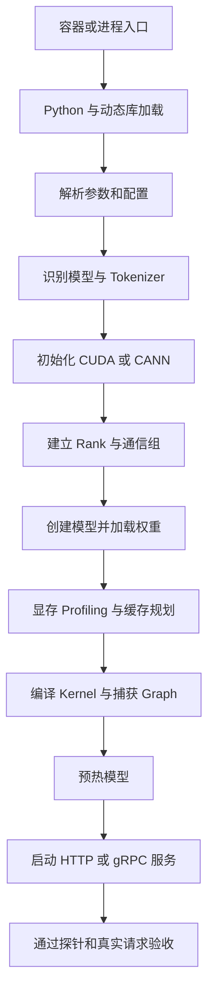

# 一个模型服务从启动命令到接口就绪经历了什么

一条启动命令看起来只有一行：

```bash
vllm serve /models/Qwen --host 0.0.0.0 --port 8000
```

但操作系统真正执行的是一条跨越容器、Python、模型制品、加速器、通信和 Web 服务的初始化链路。
理解这条链路，才能解释“权重加载完为什么还没 Ready”“端口已经监听为什么请求失败”以及
“服务到底卡在哪一层”。

本文讲通用过程。vLLM 的具体对象和源码入口见[执行 vllm serve 后发生了什么](../vllm/02-vllm-serve启动与初始化全流程.md)。

## 1. 三种容易混淆的成功

模型服务至少有三层成功状态：

| 状态 | 证据 | 还不能证明什么 |
|---|---|---|
| 进程存活 | PID 存在、容器未退出 | 模型不一定加载完成 |
| 端口监听 | TCP 可以建立连接 | 引擎不一定能够执行推理 |
| 业务就绪 | 健康接口和代表性推理成功 | 高并发、长上下文和故障恢复仍未验证 |

因此，启动完成的最终判据不是某一行 `server started`，而是：

```text
配置正确
∧ 模型完整
∧ 设备可用
∧ 引擎初始化完成
∧ API 可访问
∧ 真实请求结果正确
```

## 2. 启动全景图



有些框架会先绑定端口，再异步创建引擎；另一些框架会等模型预加载完成后才启动 API。
顺序可以变化，但这些工作不会凭空消失。

## 3. 阶段一：容器和操作系统创建进程

在 Kubernetes 中，链路从调度和容器运行时开始：

```text
Scheduler 选择节点
→ Device Plugin 分配 GPU/NPU
→ kubelet 创建 Pod Sandbox
→ 容器运行时挂载镜像、模型和设备
→ 执行 ENTRYPOINT / CMD
```

这一层失败时，应用通常还来不及输出模型日志。典型现象包括：

- `Pending`：资源、亲和性、PVC 或调度条件不满足。
- `CreateContainerError`：挂载、Secret、用户权限或容器配置错误。
- `exec format error`：镜像架构与节点架构不匹配。
- `permission denied`：入口脚本或模型目录权限错误。
- `CrashLoopBackOff`：进程启动后反复退出，需继续读取上一次容器日志。

这时首先看 Pod 状态、事件和退出码，不要直接进入 CUDA 或模型源码。

## 4. 阶段二：Python 与动态库加载

Python 解释器启动后，会导入 PyTorch、推理框架、Tokenizer、Web 框架和加速器扩展。
同时，动态链接器需要找到 CUDA、CANN、NCCL、HCCL、cuDNN 或自定义算子库。

典型失败：

```text
ModuleNotFoundError
ImportError: undefined symbol
libcudart.so: cannot open shared object file
libascendcl.so: cannot open shared object file
GLIBCXX_x.y.z not found
```

这些错误发生在“模型创建之前”。排查重点是 Python 实际路径、包版本、Wheel 架构和动态库搜索顺序。
相关命令见[Python 与 pip 运行环境诊断](../../runtime/commands/01-Python与pip运行环境诊断.md)和
[动态链接库诊断命令详解](../../runtime/commands/03-动态链接库诊断命令详解.md)。

## 5. 阶段三：参数归一化与配置校验

推理框架会把 CLI、环境变量和配置文件合并为内部配置。这个阶段决定：

- 模型和 Tokenizer 路径。
- 数据类型与量化方式。
- 最大上下文长度。
- TP、PP、DP、EP 和设备数量。
- 显存利用率与 KV Cache 策略。
- Eager、编译和 Graph 模式。
- API 地址、端口、鉴权和并发限制。

需要特别记录“最终生效值”，而不是只保存启动命令。因为环境变量、模型 `config.json` 和框架默认值
可能覆盖或补充 CLI 参数。

一个合格的启动日志应能回答：

```text
加载的是哪个模型？
使用什么 dtype 和量化？
上下文上限是多少？
使用几张卡、几个 Rank？
每张卡对应哪个本地设备？
启用了哪些编译和缓存优化？
```

## 6. 阶段四：读取模型元数据与 Tokenizer

框架通常先读取小文件，再创建大模型：

```text
config.json
generation_config.json
tokenizer.json / tokenizer.model
tokenizer_config.json
special_tokens_map.json
model.safetensors.index.json
```

这一步用来确认模型架构、层数、Hidden Size、Attention Heads、RoPE、词表和权重分片映射。
如果框架不认识架构，通常会在加载权重前失败。

常见问题包括：

- 模型目录只下载了指针文件，没有真实权重。
- Tokenizer 与权重来自不同 revision。
- `config.json` 声明的架构没有注册到当前框架。
- 量化配置存在，但镜像没有对应 Kernel。
- 自定义模型需要 `trust_remote_code`，而生产策略禁止执行远程代码。

模型目录的完整说明见[Hugging Face 模型目录与制品完整性](../fundamentals/03-Hugging-Face模型目录与制品完整性.md)。

## 7. 阶段五：初始化加速器运行时

NVIDIA 环境通常经过：

```text
Driver → CUDA Runtime → PyTorch CUDA → NCCL / Kernel Backend
```

昇腾环境通常经过：

```text
Driver / Firmware → CANN → torch-npu → HCCL / ATB / 推理框架插件
```

这一阶段会选择设备、创建 Context、初始化 Stream，并验证运行时能否执行最小操作。
“节点能运行 `nvidia-smi` 或 `npu-smi`”只能证明管理工具能看见设备，不能证明容器内 PyTorch、
运行时和推理框架组合兼容。

## 8. 阶段六：建立分布式进程和通信组

单卡也可能创建一个 `world_size=1` 的进程组；多卡则需要为每个 Rank 建立设备映射和通信通道。

```text
全局 World
├── Tensor Parallel Group
├── Pipeline Parallel Group
├── Data Parallel Group
└── Expert Parallel Group
```

框架需要完成 Rendezvous、Rank 身份确认、网卡选择、拓扑发现和集合通信初始化。
多卡服务如果卡在这里，权重可能尚未完整加载，问题也不一定来自模型。

## 9. 阶段七：创建模型并加载权重

框架先按配置创建空的参数结构，再逐分片读取权重并放到 CPU 或加速器。不同加载策略可能：

- 先进入 CPU 内存，再复制到 GPU/NPU。
- 使用内存映射减少额外复制。
- 多个 Rank 分别读取自己需要的分片。
- 先读取完整权重，再按 TP 规则切分。
- 在加载时完成量化、重排或格式转换。

日志至少要记录分片进度、加载耗时、权重占用和缺失/多余参数。只有全部分片成功且参数映射一致，
才能说明模型制品阶段通过。

## 10. 阶段八：Profiling、显存和 KV Cache

权重只是显存的一部分。框架还要估算或实际执行一次代表性输入，以获得：

- 峰值激活。
- 非 PyTorch/非框架显存。
- 编译与 Graph 工作区。
- 通信缓冲区。
- 可用于 KV Cache 的剩余显存。

随后分配 KV Cache Block，并计算理论 Token 容量。此处失败常表现为启动 OOM、可用显存不足、
KV Block 为零或最大上下文无法容纳。

## 11. 阶段九：编译、Kernel 选择与 Graph 捕获

为了减少 Python 和 Kernel Launch 开销，框架可能执行：

```text
TorchDynamo 捕获 Python 计算
→ Inductor 生成执行图
→ Triton 或预编译 Kernel 执行算子
→ 对常见形状进行 CUDA Graph / ACL Graph 捕获
```

这一段可能比权重读取更慢。日志中的 `compiling`、`capture`、`warmup` 长时间没有新输出，不一定是卡死；
需要结合 GPU 活动、CPU 编译进程、缓存目录变化和阶段基线判断。

## 12. 阶段十：API 监听与服务就绪

API Server 通常会注册：

- 健康与就绪接口。
- 模型信息接口。
- Completion、Chat 或业务解析接口。
- 指标接口。
- 流式输出和取消请求机制。

正确顺序应是：引擎能够接受请求后，Readiness 才成功。若框架先监听端口再异步加载模型，
Readiness 不能只检查 TCP 连接，必须检查引擎状态。

Kubernetes 三种探针职责不同：

- `startupProbe`：给权重、编译和预热留出冷启动窗口。
- `readinessProbe`：决定实例是否进入 Service 流量端点。
- `livenessProbe`：只在进程无法自愈时触发重启，不应把繁忙误判成死亡。

## 13. 一条日志应该怎样还原

把日志整理为阶段表：

| 阶段 | 开始 | 结束 | 耗时 | 关键资源 | 结果 |
|---|---|---|---:|---|---|
| Python 导入 | T0 | T1 | `T1-T0` | CPU 内存 | 成功/失败 |
| 设备与通信 | T1 | T2 | `T2-T1` | GPU/NPU、网络 | 成功/失败 |
| 权重加载 | T2 | T3 | `T3-T2` | 磁盘、CPU、显存 | 成功/失败 |
| 编译与捕获 | T3 | T4 | `T4-T3` | CPU、缓存、显存 | 成功/回退 |
| 缓存分配 | T4 | T5 | `T5-T4` | 显存 | 容量 |
| API Ready | T5 | T6 | `T6-T5` | 端口、路由 | 成功/失败 |

如果某一段没有开始日志或结束日志，应明确写“证据缺失”，不能自行填补。

## 14. 启动完成后的四步验收

1. **进程验收**：进程稳定存在，没有重启和异常退出。
2. **接口验收**：健康、就绪和模型身份接口返回正确。
3. **业务验收**：短请求、长请求、流式请求和代表性输入成功。
4. **资源验收**：空闲与峰值显存、冷启动时间、首请求时间和错误率符合基线。

完成这四步后，才能从“启动成功”进入容量、SLO 和生产发布验证。

## 15. 参考资料

- [Kubernetes：Liveness、Readiness 与 Startup Probes](https://kubernetes.io/docs/concepts/workloads/pods/probes/)
- [Hugging Face：加载大模型与分片权重](https://huggingface.co/docs/transformers/main/big_models)
- [PyTorch：torch.distributed](https://docs.pytorch.org/docs/stable/distributed.html)
- [PyTorch：torch.compile](https://docs.pytorch.org/docs/stable/generated/torch.compile.html)
