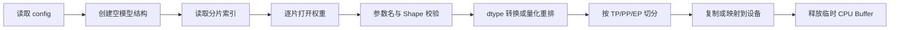

# 模型权重加载阶段原理与故障排查

“Loading model weights”并不是简单地把一个文件复制到 GPU。框架需要验证模型配置、创建参数结构、
读取分片、映射参数名、进行切分或转换，再把权重放到正确的设备和 Rank。

这一步连接了三套系统：

```text
模型制品格式
→ Linux 文件系统与存储
→ 推理框架的参数和并行布局
```

## 1. 一个可加载的模型目录

常见目录包含：

```text
config.json
generation_config.json
tokenizer.json / tokenizer.model
tokenizer_config.json
model.safetensors
```

大模型通常使用分片：

```text
model-00001-of-00008.safetensors
model-00002-of-00008.safetensors
...
model-00008-of-00008.safetensors
model.safetensors.index.json
```

索引文件中的 `weight_map` 把参数名映射到权重分片。缺少任何被引用分片，加载都不完整。

### 1.1 为什么有分片

- 避免单文件过大，便于下载、复制和对象存储管理。
- 逐片加载，控制 CPU 峰值内存。
- 失败后只需重新传输损坏分片。
- 为并行加载和分布式制品格式提供基础。

分片数量不等于 GPU 数量。8 个 Safetensors 文件不表示模型一定使用 8 张卡。

## 2. 权重加载的内部阶段



不同框架可能调整顺序。例如某些加载器只读取当前 Rank 需要的切片，另一些会先读取完整 Tensor 再切分。

## 3. 日志中应该寻找什么

权重加载正常日志通常包含：

- 识别到的模型架构和 dtype。
- 选中的加载格式。
- 分片总数与当前进度。
- 每个 Rank 的加载状态。
- 权重加载耗时。
- 权重在设备上的占用。
- 缺失参数、额外参数或 Shape 不匹配。

如果只有“开始加载”而没有“全部分片完成”，需要结合进程退出码、CPU 内存、磁盘 I/O 和设备状态继续判断。

## 4. 加载前先验证制品完整性

### 4.1 查看目录和大文件

```bash
find /models/Qwen -maxdepth 1 -type f \
  -printf '%f\t%s bytes\n' | sort
```

如果系统 `find` 不支持 `-printf`，可用：

```bash
find /models/Qwen -maxdepth 1 -type f -exec ls -lh {} \;
```

### 4.2 检查分片索引引用

```bash
jq -r '.weight_map | values[]' \
  /models/Qwen/model.safetensors.index.json | sort -u
```

输出的每个文件都必须真实存在。

### 4.3 固定校验值

```bash
find /models/Qwen -maxdepth 1 -type f -print0 \
  | sort -z \
  | xargs -0 sha256sum > model.sha256

sha256sum --check model.sha256
```

校验文件应由制品发布流程生成，并和模型版本一起保存，不能在发生故障后才用当前文件生成“基准”。

### 4.4 识别 Git LFS 指针

模型文件只有几百字节且内容以 `version https://git-lfs.github.com/spec` 开头，说明拿到的是 LFS 指针，
不是真实权重。此时应修复下载流程，而不是调大显存。

## 5. 常见失败一：文件不存在或权限错误

典型信息：

```text
FileNotFoundError
PermissionError
No such file or directory
```

从进程视角验证：

```bash
id
namei -l /models/Qwen/model-00001-of-00008.safetensors
test -r /models/Qwen/config.json && echo readable
```

`namei -l` 可以逐级检查目录执行权限。宿主机能读取不代表容器用户能读取；PVC 挂载成功也不代表
挂载的是预期目录。

## 6. 常见失败二：分片损坏或下载不完整

典型现象：

- Safetensors Header 无法解析。
- 文件大小与制品清单不一致。
- 读取到文件尾时异常。
- 只有某一节点或某一个副本失败。

处理顺序：

1. 比较文件大小和 SHA-256。
2. 比较正常节点与异常节点的同一路径。
3. 查看下载任务是否还在写入。
4. 确认服务读取的是只读、已发布完成的目录。
5. 重新同步单个损坏分片，并再次校验。

不要让下载器和推理服务同时读写同一个最终目录。推荐先写临时目录，全部校验后再原子切换版本路径。

## 7. 常见失败三：参数名或 Shape 不匹配

典型信息：

```text
Missing key(s)
Unexpected key(s)
size mismatch
Unknown architecture
```

可能原因：

- `config.json` 和权重来自不同版本。
- 基础模型与 Chat/Instruct 模型文件混用。
- 使用了错误的模型转换脚本。
- 推理框架尚未支持该架构或新字段。
- TP/PP 加载实现不支持当前模型结构。
- Adapter 被当作完整权重加载。

不能用忽略缺失参数的方式直接上线。即使进程继续运行，输出也可能错误。

## 8. 常见失败四：dtype、量化和 Kernel 不兼容

量化制品通常包含额外配置和特定布局。常见问题：

- 配置声明 AWQ/GPTQ/FP8，镜像没有对应实现。
- GPU 架构不支持所需指令或数据类型。
- NPU 权重没有完成后端要求的格式转换。
- 框架版本认识量化名称，但加载器或 Kernel 版本不匹配。
- 强制 `dtype` 与模型保存格式冲突。

先确认模型制品、加载器和执行 Kernel 是同一条受支持链路，再调推理参数。

## 9. 常见失败五：CPU 内存不足

权重最终放在 GPU/NPU，不代表加载过程不需要大量 CPU 内存。某些策略会同时持有：

```text
文件页缓存
+ CPU Tensor
+ dtype 转换前后副本
+ 当前分片
+ 多进程重复读取
```

容器被内核 OOM Kill 时可能没有 Python Traceback。检查：

```bash
kubectl get pod <pod> -o jsonpath='{.status.containerStatuses[*].lastState.terminated.reason}'
kubectl get pod <pod> -o jsonpath='{.status.containerStatuses[*].lastState.terminated.exitCode}'
```

退出码 137 需要继续结合 Pod 内存限制和节点内核日志确认，不能只看 GPU 显存。

## 10. 权重加载慢怎样分层

把耗时拆为：

```text
元数据读取
→ 存储读取
→ 解压/反序列化
→ CPU 转换
→ Host 到 Device 复制
→ 参数切分/重排
→ 多 Rank 同步
```

| 现象 | 可能瓶颈 |
|---|---|
| 磁盘吞吐低、I/O Wait 高 | 本地盘、共享盘或小文件元数据 |
| CPU 满载、磁盘不满 | 反序列化、校验、转换或解压 |
| CPU 与磁盘都低、GPU 等待 | 进程同步、锁或网络存储阻塞 |
| 单卡快、多卡慢 | 多 Rank 争抢存储或 Barrier |
| 首次慢、再次快 | Linux Page Cache 或框架缓存 |
| 每个新 Pod 都重新下载 | 模型分发和缓存挂载设计错误 |

不要用第二次启动的 Page Cache 热数据代表节点重启后的真实恢复时间。

## 11. 本地盘、共享存储和对象存储

| 方式 | 优点 | 风险 |
|---|---|---|
| 节点本地 NVMe | 吞吐高、隔离好 | 需要预分发，占用节点空间 |
| NFS/CephFS | 管理简单、多个 Pod 共享 | 启动风暴、元数据和带宽竞争 |
| 对象存储直拉 | 制品版本清晰 | 启动依赖网络，需缓存和断点续传 |
| 镜像内置权重 | 版本强绑定 | 镜像巨大、分发和更新成本高 |

生产中常用“对象存储或制品库作为源、节点本地只读缓存作为运行路径”。无论哪种方式，都要有不可变版本、
完整性校验和并发下载控制。

## 12. 多 Rank 加载的特殊问题

多卡启动需要回答：

- 每个 Rank 是独立读取，还是由一个进程广播？
- 所有 Rank 是否访问同一个挂载路径？
- 权重切分发生在读取前还是读取后？
- 某个 Rank 失败后，其他 Rank 是否只表现为通信超时？
- 多 Pod 同时扩容是否造成存储启动风暴？

真正的第一条异常可能在 Rank 5 的权重读取，而 Rank 0 最后只打印 `EngineCore died`。

## 13. 最小对照实验

1. 在同一节点、同一模型上以单卡启动，验证制品和基础运行时。
2. 保持镜像不变，将模型复制到本地 NVMe，对比共享存储。
3. 保持路径不变，对比冷 Page Cache 与热 Page Cache。
4. 校验所有分片，并对比正常节点的模型 Manifest。
5. 从 TP=1 逐级增加，观察每个 Rank 的读取量与 Barrier 时间。

每次只改变一个变量，并保存阶段耗时。

## 14. 上线验收清单

- 模型目录使用不可变版本路径和只读挂载。
- 分片索引引用全部存在。
- 文件大小与 SHA-256 通过。
- 模型配置、Tokenizer 和权重属于同一版本。
- 记录冷缓存与热缓存加载耗时。
- 容器 CPU 内存峰值和设备显存峰值有余量。
- 多副本同时启动不会压垮模型存储。
- 任意分片损坏时能明确失败，而不是带缺失参数继续服务。

## 15. 参考资料

- [Hugging Face：Instantiate a big model](https://huggingface.co/docs/transformers/main/big_models)
- [Safetensors](https://huggingface.co/docs/safetensors/index)
- [模型制品命令参考库](../../models/commands/00-模型制品命令参考库.md)
