# MinerU2.5-Pro-2605-1.2B 启动日志逐阶段分析

本文分析下面这组部署条件：

```bash
export MINERU_MODEL_SOURCE=local

mineru-api \
  --host 0.0.0.0 \
  --port 8000 \
  --enable-vlm-preload true
```

日志最终出现：

```text
vllm-async-engine init successfully
Application startup complete.
Uvicorn running on http://0.0.0.0:8000
```

先给出结论：**这次启动成功，没有致命错误；但成功启动不等于所有文档都能成功解析。**
日志中最需要处理的是 `8192 < 10125` 的多模态长度风险，其次才是视觉注意力后端回退、
编译冷启动和弃用警告。

:::info 硬件边界

这份日志明确出现 `Automatically detected platform cuda`、CUDA Graph 和 NCCL，说明它来自
**NVIDIA/CUDA 环境**，不是昇腾 910B 的 CANN/HCCL 环境。分析方法可以迁移到 NPU，
但具体后端、显存命令和告警不能直接照搬。

:::

## 1. 先理解这条启动命令

### 1.1 `MINERU_MODEL_SOURCE=local`

MinerU 支持从 Hugging Face、ModelScope 或本地目录加载模型。设置为 `local` 后，MinerU 会读取
本地配置中的模型路径，而不是在启动时依赖外网下载。

日志中的实际路径是：

```text
/root/.cache/modelscope/hub/models/OpenDataLab/MinerU2___5-Pro-2605-1___2B
```

路径中连续下划线是缓存目录对模型名称的本地化表示。只要后续能够读取 `config.json`、Tokenizer
和权重分片，它本身不是错误。生产环境还应记录目录内容摘要、模型版本和文件校验值，避免同一个路径
被原地替换后无法复现。

### 1.2 `--host 0.0.0.0`

服务监听容器或主机的全部 IPv4 网卡，其他主机可以通过网络访问。它适合容器和 Kubernetes，
但也意味着端口不能毫无保护地暴露到公网。生产环境至少要在 Service、Ingress、网关或防火墙层
增加访问控制、TLS、请求体大小限制和速率限制。

### 1.3 `--port 8000`

Uvicorn/FastAPI 监听 TCP 8000 端口。端口处于 `LISTEN` 只能证明进程接收连接，不能证明模型、
显存和文档解析链路已经可用。

### 1.4 `--enable-vlm-preload true`

它要求 MinerU 在 API 启动阶段预加载本地 VLM，而不是等第一笔 VLM 或 Hybrid 请求到来时再加载。
它带来两个直接结果：

- 启动时间变长，Kubernetes `startupProbe` 必须覆盖真实冷启动时间。
- 第一笔业务请求不再承担加载权重、编译图和申请 KV Cache 的大部分冷启动成本。

这是生产服务更可控的选择，但仍要单独做一次预热请求，因为“模型已加载”和“真实输入走过全部形状”
不是一回事。

## 2. 建立正确的日志阅读模型

这份日志至少包含两层进程：

```text
mineru-api / Uvicorn 主进程
└─ vLLM Async Engine
   └─ EngineCore 子进程
      └─ GPU Model Runner / CUDA Kernel
```

因此不要只按日志行号阅读，要同时关注：

- **组件**：`API`、`EngineCore`、`ModelRunner` 分别是谁打印的。
- **阶段**：检测环境、解析配置、加载权重、编译、分配缓存、捕获图、服务就绪。
- **时间**：阶段耗时，而不是单独某一行的时间戳。
- **资源**：CPU 内存、GPU 权重、激活、KV Cache 和非框架内存。
- **严重性**：`WARNING` 不一定导致失败，`INFO` 也可能暴露容量风险。

### 2.1 为什么日志里相差八小时

外层平台日志使用 UTC，例如：

```text
2026-08-20T02:28:30Z
```

进程内部日志使用 Asia/Shanghai，例如：

```text
08-20 10:28:30
```

两者是同一时刻，不是某个阶段卡住八小时。排障时应统一时区，并保留 Pod、节点和日志平台的时钟来源。

## 3. 一次成功启动经历了什么

这次启动可还原为下面的生命周期：

```mermaid
flowchart LR
    A[解析 MinerU 配置] --> B[检测 CUDA]
    B --> C[创建 vLLM V1 Engine]
    C --> D[初始化单卡通信环境]
    D --> E[多模态输入 Profiling]
    E --> F[读取 Safetensors 权重]
    F --> G[torch.compile 编译]
    G --> H[计算并分配 KV Cache]
    H --> I[捕获 CUDA Graph]
    I --> J[Async Engine 就绪]
    J --> K[Uvicorn 对外监听]
```



任何一段失败，日志和处理方式都不同：

- 权重读取失败先查路径、权限、文件完整性和磁盘。
- CUDA 初始化失败先查驱动、容器 GPU 映射和 PyTorch/CUDA 兼容性。
- 编译失败先查 Triton、编译器、缓存权限和算子兼容性。
- KV Cache 申请失败先查显存预算、上下文长度和其他 GPU 进程。
- Uvicorn 已监听但解析失败，则要进入请求链路，不要继续盯着启动日志。

## 4. 阶段一：平台检测与基础依赖

### 4.1 `pynvml` 弃用警告

```text
The pynvml package is deprecated. Please install nvidia-ml-py instead.
```

这表示某个依赖仍导入旧的 `pynvml` 包。它不会阻止本次启动，但属于维护风险：升级依赖后可能从警告
变成导入错误。处理时不要直接在生产容器里临时 `pip install`，应先确认谁依赖它：

```bash
python -m pip show pynvml nvidia-ml-py
python -m pip check
```

然后在镜像构建和回归测试中完成替换。

### 4.2 自动检测到 CUDA

```text
Automatically detected platform cuda
```

它至少证明当前 Python 环境选择了 CUDA 平台插件，但还不能单独证明 GPU 一定能执行模型。真正的强证据是：

1. 模型权重成功搬到 GPU。
2. torch.compile 和 CUDA Graph 成功。
3. KV Cache 成功申请。
4. 真实解析请求成功返回。

## 5. 阶段二：vLLM V1 配置快照

日志显示 MinerU 使用 **vLLM 0.10.2 的 V1 Engine**。关键配置可以整理为：

| 配置 | 日志值 | 运维含义 |
|---|---:|---|
| `dtype` | `bfloat16` | 权重与主要计算采用 BF16，需 GPU 支持 |
| `max_seq_len` | `8192` | 单次模型上下文预算上限 |
| Tensor Parallel | `1` | 单卡执行，没有张量并行通信 |
| Pipeline Parallel | `1` | 没有流水线并行 |
| Data Parallel | `1` | 当前引擎只有一个副本 |
| `quantization` | `None` | 未使用 INT8/INT4 等量化 |
| `enforce_eager` | `False` | 允许编译和 CUDA Graph 优化 |
| Prefix Caching | 开启 | 可复用相同前缀的 KV 块 |
| Chunked Prefill | 开启 | 长 Prefill 可分块调度，减少独占 |
| `trust_remote_code` | `False` | 不执行模型仓库中的自定义远程代码 |
| model/tokenizer revision | `None` | 由本地目录当前内容决定，不是不可变版本标识 |

### 5.1 `revision=None` 为什么值得关注

本地部署不一定需要远程 revision，但必须用其他方式实现不可变性。否则今天和下周同一个目录可能已经不是
同一组权重。建议为模型制品保存：

```text
模型名称与内部版本
权重文件列表、大小和 SHA-256
config.json 与 tokenizer 配置摘要
MinerU、vLLM、PyTorch、CUDA 和驱动版本
容器镜像 digest
启动参数与环境变量
```

这份清单是回滚、对比精度和复现故障的基础。

## 6. 阶段三：分布式环境为何只有一个 Rank

日志显示 TP、PP、DP 都等于 1，并出现类似：

```text
Gloo Rank 0 is connected to 0 peer ranks
```

这不是“通信没连上”，而是 `world_size=1` 时没有其他 Rank 需要连接。只有多卡部署时，才需要重点检查
Rank 映射、NCCL、网卡、PCIe/NVLink 拓扑和集合通信超时。

另一个警告是：

```text
TORCH_NCCL_AVOID_RECORD_STREAMS is deprecated
```

它说明镜像或运行环境还保留旧变量。单卡启动不受影响，但应查清变量来自 Dockerfile、Pod Env、
启动脚本还是基础镜像，并在完成版本验证后移除，避免以后误导排障。

## 7. 阶段四：最重要的多模态长度风险

日志给出本次最值得重视的警告：

```text
max_seq_len: 8192
worst-case multimodal tokens: 10125
```

含义是：引擎允许的最大序列长度只有 8192，但按当前多模态输入上限估算，最坏情况下视觉内容可能需要
10125 个 token。**小文档可以成功，复杂图片、密集版面或极端输入仍可能在运行时失败。**

这也是为什么“服务成功启动”和“所有业务输入都可用”不能画等号。

### 7.1 两条治理路线

第一条是增大模型上下文上限。MinerU 官方说明支持把推理引擎参数透传给 `mineru-api`。可在当前镜像中
先确认参数：

```bash
mineru-api --help | grep -E 'max-model-len|max-num-seqs|gpu-memory'
```

若当前 MinerU/vLLM 组合支持，可建立一个候选实验，例如：

```bash
mineru-api \
  --host 0.0.0.0 \
  --port 8000 \
  --enable-vlm-preload true \
  --max-model-len 12288
```

`12288` 只是覆盖 `10125` 的实验值，不是所有环境的标准答案。增大长度会改变 Profiling 和 KV Cache
容量，必须重新测显存、并发、超时和复杂文档正确性。

第二条是限制单请求的多模态规模，例如限制页数、图片数量、图片分辨率或处理窗口。它能控制资源，
但需要确认不会破坏业务文档的解析质量。

### 7.2 正确的验证方法

至少准备四组输入：

1. 单页纯文本 PDF。
2. 多图、多栏、表格和公式混排 PDF。
3. 高分辨率扫描件。
4. 接近业务允许最大页数和最大文件大小的文档。

只有第四组也稳定通过，才能关闭这条风险。

## 8. 阶段五：视觉注意力回退为什么不矛盾

日志先提示视觉模块因为 `vllm-flash-attn` 的已知问题回退到 XFormers，后面又显示 V1 Engine 使用
Flash Attention。两句话描述的可能是不同计算路径：

- 视觉编码器的某些注意力算子使用 XFormers。
- 语言模型主干的注意力算子仍使用 Flash Attention。

因此不能简单判断“Flash Attention 到底有没有启用”。需要比较视觉编码阶段和语言解码阶段的性能，
并观察实际 Kernel。回退通常影响性能，不一定影响正确性。

在没有回归测试前，不要为了消除一条警告随意升级 `vllm-flash-attn`、vLLM 或 PyTorch；这些包与
CUDA、驱动和预编译算子存在兼容矩阵。正确流程是复制镜像、固定版本、跑同一组文档，再比较精度和性能。

## 9. 阶段六：权重加载说明磁盘不是本次瓶颈

关键数据如下：

```text
Safetensors shard: 1/1
Loading weights took: 0.50 s
Model loading took: 0.810819 s
Model weights took: 2.1597 GiB
```

可以得到三个结论：

1. 权重分片完整，至少没有在加载阶段发现缺失。
2. 1.2B 级 BF16 模型占用约 2.16 GiB 是合理量级。
3. 权重加载不到 1 秒，在这次启动中不是主要冷启动瓶颈。

以后如果权重加载从 1 秒变成几十秒，应检查模型是否还在本地页缓存、底层是本地 SSD 还是网络存储、
容器是否每次重新下载，以及多个 Pod 是否同时读取同一共享盘。

## 10. 阶段七：Encoder Cache Profiling 在做什么

多模态模型不只需要文本 KV Cache，还需要估算图像或视频编码的中间结果。日志显示：

```text
Encoder cache budget: 8100 tokens
Profiled with one video item at the maximum feature size
```

vLLM 使用一个最坏形状做 Profiling，目的是提前计算峰值激活和缓存预算。这是一种启动期容量推演，
不代表业务真的提交了视频，也不代表每次请求都会占满该预算。

对 MinerU 来说，实际图片尺寸、每页图片数量、处理窗口和并发会决定视觉侧资源。容量测试必须使用真实
文档分布，不能只使用一页纯文本 PDF。

## 11. 阶段八：38.2 秒主要花在编译，而不是加载模型

日志记录：

```text
Dynamo bytecode transform: 6.70 s
Graph compilation: 31.50 s
torch.compile total: 38.20 s
```

权重加载只有约 0.81 秒，而编译占 38.2 秒。由此可见，本次冷启动的主要成本是
`torch.compile` 和图优化。

编译缓存目录为：

```text
/root/.cache/vllm/torch_compile_cache/e3efd92dca/rank_0_0/backbone
```

### 11.1 编译缓存能不能持久化

可以考虑，但不能把不同环境的缓存混用。缓存键至少受以下因素影响：

- 模型与配置。
- vLLM、PyTorch、Triton 版本。
- CUDA 和驱动环境。
- GPU 架构。
- 编译参数和输入形状。

Kubernetes 中如果每次 Pod 重建都丢弃缓存，冷启动会重复支付编译成本；如果粗暴共享同一个可写目录，
又可能产生并发写入和版本污染。更稳妥的做法是按镜像 digest、模型版本和 GPU 架构隔离缓存，并在升级时
主动切换新目录。

## 12. 阶段九：KV Cache 数字不能直接当作并发能力

日志显示：

```text
KV Cache available memory: 8.22 GiB
KV Cache capacity: 718112 tokens
Maximum concurrency for 8192 tokens/request: 87.66x
```

计算关系很直观：

```text
理论并发 ≈ KV Cache 总 token 容量 ÷ 每请求 token 数
         ≈ 718112 ÷ 8192
         ≈ 87.66
```

但 `87.66x` 只是 **KV Cache 维度的理论上限**，不等于服务可以稳定接收 87 个复杂文档。真实并发还受：

- 文档渲染、图片解码和 CPU 内存。
- 视觉编码器计算与 Encoder Cache。
- 请求实际上下文长度和输出长度。
- MinerU 任务管理器的并发限制。
- GPU 算力、调度排队、超时和尾延迟 SLO。
- 结果文件写入速度。

因此生产并发必须从 1 开始逐级压测，观察延迟、吞吐、失败率、排队长度和显存，而不是把 87 写进
`max_concurrent_requests`。

## 13. 阶段十：CUDA Graph 捕获了什么

日志显示捕获了 35 个尺寸，耗时约 2 秒，额外占用约 0.24 GiB。CUDA Graph 的目标是减少每轮推理
中的 CPU 调度和 Kernel Launch 开销。

它通常按若干批大小或 token 数建立捕获桶：请求形状命中某个桶时可复用已捕获的图；不匹配的形状可能
走其他桶或回退到普通执行。因此“CUDA Graph capture finished”不代表所有文档都走同一张图，也不代表
之后不会因为新形状出现额外开销。

## 14. 用日志重建这次 GPU 显存预算

日志提供了相对完整的显存数据：

| 项目 | 数值 | 说明 |
|---|---:|---|
| 可见 GPU 容量 | 22.11 GiB | 当前设备总显存口径 |
| 启动时空闲 | 21.85 GiB | 当时几乎没有其他进程占用 |
| `gpu_memory_utilization` | 0.5 | vLLM 目标使用比例 |
| 目标预算 | 约 11.06 GiB | `22.11 × 0.5` |
| 模型权重 | 2.16 GiB | BF16 权重等 |
| 峰值激活 | 0.66 GiB | Profiling 得到的峰值 |
| 非 PyTorch 内存 | 0.02 GiB | CUDA 等外部开销 |
| CUDA Graph | 0.24 GiB | 捕获图的额外占用 |
| KV Cache | 8.22 GiB | 剩余主体预算 |

这些数字来自不同统计点，GiB/byte 和 allocator 保留内存口径也可能不同，所以不能要求每项相加后与
11.06 GiB 完全一致。它们适合判断量级和趋势，不适合当作财务账本。

### 14.1 是否应该立刻把 0.5 调到 0.9

不应该。0.5 比较保守，确实留下了较多余量，但提高它会扩大 KV Cache，并增加与其他组件争抢显存的风险。
只有在 GPU 独占、真实峰值已测清、无额外模型共卡、OOM 恢复机制明确时，才逐级尝试 0.6、0.7 等候选值。

每次只改一个参数，并同时记录：

```text
启动是否成功
空闲与峰值显存
单文档与并发文档耗时
吞吐和 P95/P99
OOM、超时和解析失败率
```

## 15. 启动时间应该怎样理解

日志中有三组重要时间：

| 阶段 | 时间 | 含义 |
|---|---:|---|
| 权重加载 | 约 0.81 s | 读取并装载模型权重 |
| vLLM EngineCore 初始化 | 约 47.15 s | 包含编译、缓存和图捕获等 |
| MinerU async engine predictor | 约 87.42 s | MinerU 观察到的更完整预加载耗时 |

`87.42 s` 大于可见的 EngineCore 时间，说明 MinerU 计时还覆盖了日志片段之外的准备工作。
Kubernetes 探针必须按多次真实冷启动的 P99 设置，不能只使用 47 秒。

一个保守的起始配置可以是：

```yaml
startupProbe:
  httpGet:
    path: /health
    port: 8000
  periodSeconds: 5
  timeoutSeconds: 2
  failureThreshold: 30  # 允许约 150 秒启动

readinessProbe:
  httpGet:
    path: /health
    port: 8000
  periodSeconds: 5
  timeoutSeconds: 2
  failureThreshold: 3
```

`150 秒` 只是根据当前 87.42 秒给出的初始窗口。升级模型、镜像或 GPU 后必须重新采样。若探针过短，
Kubelet 会在编译过程中反复杀掉容器，表面上就像服务永远启动不了。

## 16. 警告分级与处理顺序

| 级别 | 现象 | 判断 | 处理 |
|---|---|---|---|
| P0 | `8192 < 10125` | 特定复杂输入可能运行失败 | 调整长度或输入上限，并做边界文档验收 |
| P1 | 视觉注意力回退 XFormers | 可能造成性能下降 | 用相同文档做后端对比，谨慎升级依赖 |
| P1 | 编译冷启动 38.2 s | 扩容和重启恢复慢 | 隔离并治理编译缓存，设置正确启动探针 |
| P2 | `pynvml` 弃用 | 当前不阻断，未来升级风险 | 在镜像构建阶段清理依赖 |
| P2 | NCCL 旧环境变量 | 当前单卡不阻断 | 找到变量来源，验证后移除 |
| INFO | Gloo 连接 0 个 Peer | 单卡正常现象 | 无需处理 |
| INFO | `TORCH_CUDA_ARCH_LIST` 未设置 | 可能编译多个目标架构 | 固定 GPU 型号后评估是否显式设置 |

P0 表示上线前必须闭环，并不是说当前进程已经崩溃。

## 17. 启动成功后的最小验收

### 17.1 健康检查

```bash
curl --fail --silent --show-error \
  http://127.0.0.1:8000/health
```

应检查 HTTP 状态码和 JSON 字段，而不只是看到 `curl` 没报错。官方说明健康接口会返回协议版本、
处理窗口、最大并发和任务统计。

### 17.2 异步任务

```bash
curl -X POST http://127.0.0.1:8000/tasks \
  -F "files=@demo.pdf" \
  -F "return_md=true"

curl http://127.0.0.1:8000/tasks/<task_id>
curl http://127.0.0.1:8000/tasks/<task_id>/result
```

异步接口应验证：提交是否立即返回、状态能否从排队进入运行和完成、失败原因是否可见、结果是否可下载。

### 17.3 同步解析

```bash
curl -X POST http://127.0.0.1:8000/file_parse \
  -F "files=@demo.pdf" \
  -F "return_md=true" \
  -F "response_format_zip=true" \
  -F "return_original_file=true" \
  --output result.zip
```

同步接口会一直等待任务完成，更容易被客户端、Ingress 或负载均衡器超时中断。长文档生产调用更适合异步任务。

### 17.4 结果正确性

HTTP 200 仍然不代表解析正确。至少检查：

- 页数是否完整，有无缺页、重复页和顺序错误。
- 标题层级和段落顺序是否符合视觉阅读顺序。
- 表格行列、合并单元格和数字是否正确。
- 行内公式、块公式和特殊符号是否丢失。
- 图片是否导出，Markdown 引用能否访问。
- 扫描件 OCR 是否出现大面积乱码。
- ZIP、Markdown、JSON 和中间产物是否能对应同一任务。

## 18. 用实验把“能启动”推进到“可上线”

建议建立下面五组测试，而不是反复使用同一份简单 PDF：

| 实验 | 输入 | 目的 |
|---|---|---|
| A：冒烟 | 1 页纯文本 | 验证完整链路和结果格式 |
| B：复杂版面 | 多栏、图片、表格、公式 | 验证 VLM 正确性和视觉后端 |
| C：边界 | 最大页数、大小和分辨率 | 验证 `8192/10125` 风险与超时 |
| D：冷暖启动 | 清缓存重启、保留缓存重启 | 拆分权重、编译、图捕获和首请求耗时 |
| E：并发阶梯 | 1、2、4、8…任务 | 找到延迟、排队、显存和失败率拐点 |

每笔结果至少记录：

```text
模型与镜像版本
GPU 型号和驱动
启动参数与环境变量
文档页数、大小、类型和图片分辨率
排队时间、处理时间、总耗时
CPU、内存、GPU 利用率和显存峰值
成功率、超时率和正确性问题
```

这样才能区分“GPU 利用率低是没有请求”“CPU 渲染成为瓶颈”“VLM 推理慢”还是“请求都在队列里”。

## 19. 生产化还要补的六个闭环

### 19.1 模型制品闭环

本地路径要只读挂载，保存文件校验值和镜像 digest，升级时使用新目录，不在原目录覆盖权重。

### 19.2 启动与探针闭环

用多次完全冷启动得到 P50/P95/P99；`startupProbe` 负责容忍加载，`readinessProbe` 负责摘除不可用实例，
不要让普通存活探针在编译期间制造重启循环。

### 19.3 任务状态闭环

官方文档说明单个 `mineru-api` 的任务状态只保存在进程内，服务重启、多进程或滚动升级会丢失状态。
默认完成/失败任务保留 24 小时。生产任务如果要求可靠交付，需要在业务层增加外部任务 ID、持久化状态、
幂等提交、结果对象存储和重试策略。

### 19.4 并发保护闭环

MinerU 有服务级最大并发设置，但它不等于 GPU 的理论 KV 并发。应按压测结果限制同时运行任务数，
其余请求排队；同时限制文件大小、页数、分辨率、处理窗口和单任务超时，防止单个异常文件拖垮实例。

### 19.5 安全闭环

`0.0.0.0:8000` 前应放置受控入口。关闭不需要的 API 文档，限制上传类型和大小，隔离输出目录，
防止文件名路径穿越，定期清理临时文件，并对敏感文档设置加密、访问审计和生命周期策略。

### 19.6 可观测性闭环

至少建立以下四类指标：

- API：请求率、HTTP 错误、上传大小和端到端延迟。
- 队列：排队任务数、排队时间、运行任务数和任务失败原因。
- 文档：页数、处理页速率、解析阶段耗时和结果大小。
- 资源：CPU、内存、磁盘、GPU 利用率、显存、功耗和 OOM。

日志必须带任务 ID，才能把 API、文档预处理、vLLM 推理和结果生成串成一条时间线。

## 20. 遇到启动失败时怎样定位

```text
进程是否进入 vLLM Engine 初始化？
├─ 否
│  ├─ 查 MinerU 配置、模型来源和本地路径
│  ├─ 查 Python 导入、依赖和文件权限
│  └─ 查容器命令、环境变量和工作目录
└─ 是
   ├─ 卡在平台初始化：查 GPU 映射、驱动、CUDA 与 PyTorch
   ├─ 卡在权重加载：查文件完整性、磁盘和 CPU 内存
   ├─ 卡在 torch.compile：查 Triton、编译缓存和算子兼容
   ├─ 卡在 KV Cache：查显存、上下文、并发预算和其他进程
   ├─ 卡在 CUDA Graph：临时对比 Eager 模式定位图兼容性
   └─ Engine 已就绪但 API 未监听：查 MinerU/Uvicorn 异常和端口冲突
```

如果 API 已监听但请求失败，应换一条排障主线：

```text
上传与参数
→ 任务排队
→ 文件渲染/解码
→ 多模态长度与显存
→ VLM 推理
→ 后处理
→ 结果写盘与下载
```

## 21. 本次日志的最终判断

| 问题 | 判断 |
|---|---|
| 模型是否成功加载 | 是，权重 1/1 分片加载完成 |
| 是否使用 GPU | 是，CUDA、CUDA Graph 和 GPU 显存均有证据 |
| 是否多卡 | 否，TP/PP/DP 均为 1 |
| 是否量化 | 否，`quantization=None` |
| API 是否就绪 | 是，Async Engine 成功且 Uvicorn 已监听 |
| 冷启动主要耗时 | torch.compile 和引擎初始化，不是权重读取 |
| 显存是否马上不足 | 当前启动没有，但要用真实并发和复杂文档验证 |
| 最优先风险 | 8192 上下文小于 10125 的最坏多模态 token 预算 |
| 能否直接宣布生产可用 | 不能，还缺正确性、边界、并发、重启和任务可靠性验收 |

读完启动日志后，下一步不应只是“没有 ERROR 就结束”，而是把日志里暴露的假设转化为测试：
用复杂文档验证多模态长度，用阶梯并发验证容量，用冷启动验证探针，用故障注入验证任务是否可恢复。

## 22. 参考资料

- [MinerU 命令行工具说明](https://github.com/opendatalab/MinerU/blob/master/docs/zh/usage/cli_tools.md)
- [MinerU Quick Usage 与 API 接口](https://github.com/opendatalab/MinerU/blob/master/docs/en/usage/quick_usage.md)
- [MinerU 模型来源与本地模型配置](https://github.com/opendatalab/MinerU/blob/master/docs/en/usage/model_source.md)
- [MinerU 推理引擎参数透传](https://github.com/opendatalab/MinerU/blob/master/docs/en/usage/advanced_cli_parameters.md)
- [vLLM Engine Arguments](https://docs.vllm.ai/en/latest/configuration/engine_args.html)

MinerU 和 vLLM 都在快速迭代。本文的日志结论以 **vLLM 0.10.2 和本次容器环境**为边界；
具体参数名称与默认值应以目标镜像内的 `mineru-api --help` 和对应版本源码为准。
