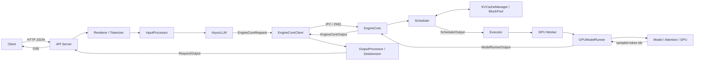

# vLLM V1 整体架构与组件职责

学习 vLLM 源码最容易犯的错误，是打开仓库后从第一个文件逐行阅读。vLLM 是一个多进程推理系统，
如果不知道一个对象属于哪个进程、接收什么输入、产生什么输出，即使看懂了函数，也很难理解整套
系统为什么这样设计。

本文先不深入某个算法，而是建立一张后续所有文章都会使用的地图。读完后，你应该能够回答：

- 一条在线请求经过哪些进程？
- API Server、AsyncLLM 与 EngineCore 有什么区别？
- Scheduler 为什么不直接执行模型？
- KV Cache 的逻辑块和显存中的真实张量分别由谁管理？
- Worker、GPUModelRunner、模型和 Attention Backend 是什么关系？
- 输出 Token 为什么还要回到 API Server 才能变成文本？

## 1. 版本基线与阅读范围

本文固定在 **vLLM v0.23.0**，源码 tag 对应提交 `0fc695fc`。vLLM 迭代很快，阅读其他版本时，
类名和目录可能变化，但下面这些边界相对稳定：

```text
输入处理 → 调度与缓存 → 模型执行 → 输出处理
```

本文讨论默认的 V1 在线推理主路径，不展开：

- V0 的 `SequenceGroup`、三队列和 `BlockSpaceManager`；
- 各种模型的具体 Transformer 层实现；
- CUDA Kernel 内部指令级优化；
- 多模态、投机解码和结构化输出的特殊分支。

这些内容都应该在主路径清楚之后再学习。

## 2. 先看整张地图

一次 OpenAI 兼容请求的主路径如下：



这张图中最重要的分界线有三条：

1. **HTTP 与推理引擎的边界**：API Server 把面向用户的协议转换成引擎对象。
2. **CPU 控制面与 GPU 执行面的边界**：Scheduler 制定本轮计划，Worker 执行计划。
3. **Token ID 与文本的边界**：GPU 产生的是 Token ID，API 侧将其增量解码成文本。

## 3. V1 为什么拆成多个进程

V1 默认使用多进程架构。不同工作负载被隔离到不同进程，可以减少 Python 控制逻辑、HTTP 处理和
GPU 执行之间的相互阻塞。

### 3.1 API Server 进程

API Server 负责：

- 接收 HTTP 请求；
- 校验 OpenAI 兼容参数；
- 应用 Chat Template；
- Tokenization 与多模态数据加载；
- 调用 AsyncLLM；
- Detokenization；
- 将结果编码为 SSE 或普通 JSON。

它不负责选择本轮运行哪些请求，也不直接调用 CUDA Kernel。

### 3.2 EngineCore 进程

EngineCore 是推理控制面，负责：

- 接收和终止请求；
- 运行调度主循环；
- 维护请求状态；
- 管理逻辑 KV Block；
- 生成每轮 `SchedulerOutput`；
- 调用 Executor 并消费执行结果。

EngineCore 通常运行一个持续工作的循环。它的 CPU 被严重争抢时，即使 GPU 还有能力，GPU 利用率
也可能出现空洞。

### 3.3 GPU Worker 进程

每块 GPU 通常对应一个 Worker 进程。Worker 负责：

- 建立 CUDA Device 和分布式通信环境；
- 加载本 Rank 应持有的模型权重；
- 探测可用于 KV Cache 的显存；
- 分配真实 KV Cache 张量；
- 执行模型前向、Attention 和采样；
- 返回生成的 Token ID 及相关元数据。

Worker 不决定全局队列公平性，它执行 EngineCore 下发的计划。

### 3.4 DP Coordinator 进程

当数据并行度大于 1 时，还可能有 DP Coordinator，负责 DP Rank 之间的负载与协同。它不是每个
单卡实验都能看到的组件，不应在初学阶段把它与普通 API 网关混为一谈。

## 4. 进程数量如何计算

设：

- API Server 数量为 `A`；
- 数据并行度为 `DP`；
- GPU 总数为 `N = DP × PP × TP`。

典型进程数量近似为：

```text
A 个 API Server
+ DP 个 EngineCore
+ N 个 GPU Worker
+ 1 个 DP Coordinator（DP > 1 时）
```

例如单机 4 卡、`TP=4`、`DP=1`，通常至少包括：

```text
1 API Server + 1 EngineCore + 4 GPU Worker = 6 个主要进程
```

因此，给 Pod 配置 4 块 GPU 并不意味着只需要 4 个 CPU 核。Tokenizer、EngineCore 忙循环、网络
响应和各 Worker 都需要 CPU 时间。

## 5. 每个核心组件负责什么

| 组件 | 所属位置 | 接收 | 产生 | 不负责 |
| --- | --- | --- | --- | --- |
| API 路由与 Serving Handler | API Server | HTTP JSON | 引擎调用、HTTP/SSE | GPU 调度 |
| Renderer / Tokenizer | API Server | messages、文本 | Prompt、Token ID | KV Block 分配 |
| `InputProcessor` | API Server | Prompt、生成参数 | `EngineCoreRequest` | 模型前向 |
| `AsyncLLM` | API Server | 引擎请求 | 每请求异步输出流 | GPU Kernel |
| `EngineCoreClient` | API Server | 请求与控制消息 | IPC 消息 | 调度决策 |
| `EngineCore` | 独立进程 | `EngineCoreRequest` | `EngineCoreOutput` | 文本协议 |
| `Scheduler` | EngineCore | 等待/运行请求状态 | `SchedulerOutput` | 权重计算 |
| `KVCacheManager` | EngineCore | 请求 Token、缓存状态 | 逻辑 Block 分配结果 | 保存真实 KV 张量 |
| `Executor` | EngineCore/执行层 | `SchedulerOutput` | `ModelRunnerOutput` | HTTP 输出 |
| `Worker` | GPU 进程 | 执行命令 | Rank 执行结果 | 全局准入控制 |
| `GPUModelRunner` | GPU 进程 | 本轮批次描述 | Token ID、Logprobs 等 | 全局请求队列 |
| `OutputProcessor` | API Server | `EngineCoreOutput` | `RequestOutput` | 模型前向 |

这张表可以用来判断源码中的责任是否合理。例如，Scheduler 可以分配逻辑 Block ID，但实际显存
Tensor 必须存在于 Worker；否则 EngineCore 进程就需要持有 GPU 上下文，进程边界会被破坏。

## 6. VllmConfig：贯穿组件的全局配置

vLLM 会把命令行参数整理成多个配置对象，再组合成 `VllmConfig`。常见子配置包括：

- `ModelConfig`：模型、Tokenizer、dtype、最大上下文等；
- `CacheConfig`：KV Cache 大小、Block Size、Prefix Cache 等；
- `SchedulerConfig`：Token Budget、最大并发、调度策略；
- `ParallelConfig`：TP、PP、DP、执行后端；
- `CompilationConfig`：编译与 CUDA Graph；
- `ObservabilityConfig`：指标与 Trace；
- `SpeculativeConfig`：投机解码。

可以把 `VllmConfig` 理解为引擎级只读上下文。不同组件从中读取自己需要的部分，而不是让所有参数
在几十层函数中逐个传递。

但这也带来一个源码阅读技巧：看到某个行为时，要同时查对应的 Config，而不能只看当前函数。

## 7. AsyncLLM 与 EngineCore 不是同一个引擎

`AsyncLLM` 面向 API Server，主要解决异步并发和流式输出问题：

```text
一个 HTTP 请求
→ 一个异步 generate() 迭代器
→ 一个请求级输出收集器
```

`EngineCore` 面向推理控制，解决的是：

```text
所有活跃请求
→ 本轮调度计划
→ 一次模型执行
→ 更新所有请求状态
```

因此二者看问题的视角不同：

- AsyncLLM 以“单个用户请求”为中心；
- EngineCore 以“整个动态 Batch 的一个 Step”为中心。

二者通过 `EngineCoreClient` 和进程间通信连接。理解这一点，才能解释为什么 HTTP 协程没有直接
执行 `scheduler.schedule()`。

## 8. Scheduler 与 Executor 的契约

V1 的核心循环可以压缩为三个动作：

```text
schedule → execute → update
```

源码中的关键逻辑也非常短：

```python
scheduler_output = scheduler.schedule()
model_output = model_executor.execute_model(scheduler_output)
engine_outputs = scheduler.update_from_output(
    scheduler_output, model_output
)
```

这里的关键不是代码，而是对象契约：

- `SchedulerOutput` 是一份执行计划，描述本轮有哪些请求、各算多少 Token、使用哪些 Block；
- `ModelRunnerOutput` 是 GPU 执行结果，包括采样 Token 等；
- `EngineCoreOutput` 是面向上层的请求增量结果。

Scheduler 不需要知道某个矩阵乘具体选择了哪个 Kernel，GPUModelRunner 也不需要知道某个请求在
API 网关中的租户等级。

## 9. KV Cache 为什么跨越控制面和执行面

“KV Cache 由谁管理”不能只回答一个类，因为它有两层含义。

### 9.1 逻辑管理

EngineCore 内的 `KVCacheManager` 和 `BlockPool` 维护：

- 哪个请求拥有或引用哪些 Block；
- 哪些完整前缀块可以复用；
- 空闲块、引用计数和淘汰次序；
- 新一轮调度能否继续分配 Block。

### 9.2 物理存储

GPU Worker 内保存：

- 真实的 KV Cache Tensor；
- Block ID 到显存槽位的映射；
- Attention 计算所需的 Block Table 和 Slot Mapping。

Scheduler 下发的是“使用哪些槽位”的计划，Worker 在对应槽位中读写真实 K/V 数据。这和操作系统
用页表管理虚拟页、物理内存保存数据的思路相似，但不要把二者完全等同。

## 10. 一句话进入框架后的组件接力

以“请用三句话解释 KV Cache”为例：

1. API Server 将 `messages` 应用 Chat Template，得到模型真正看到的文本。
2. Tokenizer 把文本转换成 Token ID。
3. InputProcessor 校验长度和参数，生成 `EngineCoreRequest`。
4. AsyncLLM 为请求建立输出通道，并通过 EngineCoreClient 发送请求。
5. EngineCore 把请求加入 Scheduler。
6. Scheduler 查找 Prefix Cache，分配 KV Block 和本轮 Token Budget。
7. Executor 把 `SchedulerOutput` 广播或分发给 Worker。
8. GPUModelRunner 整理批次，模型完成 Prefill，并采样首个 Token。
9. EngineCore 更新请求状态；未结束的请求进入下一轮 Decode。
10. OutputProcessor 增量 Detokenize，API Server 通过 SSE 返回文本。
11. 达到停止条件后，请求结束，相关活动状态和 Block 引用被释放。

后续文章会沿着这 11 步逐段展开，而不是按目录机械地介绍类。

## 11. 四种对象不要混淆

### 11.1 配置对象

描述引擎如何运行，例如 `SchedulerConfig`。它们通常在启动期形成。

### 11.2 请求对象

描述用户要生成什么，例如 `EngineCoreRequest`、Scheduler 内部的 `Request`。

### 11.3 计划对象

描述“这一轮执行什么”，核心是 `SchedulerOutput`。

### 11.4 结果对象

描述 GPU 或引擎本轮产生了什么，例如 `ModelRunnerOutput`、`EngineCoreOutput` 和 `RequestOutput`。

读源码时，每遇到一个对象都先判断属于哪一类，调用链会清晰很多。

## 12. 故障现象如何映射到组件

| 现象 | 优先观察组件 | 常见方向 |
| --- | --- | --- |
| HTTP 建连慢 | Gateway/API Server | 排队、连接池、CPU |
| Tokenization 慢 | Renderer/Tokenizer | 长 Prompt、多模态、CPU |
| Engine Queue Time 高 | Scheduler/KVCacheManager | 过载、KV 不足、长短请求干扰 |
| GPU 利用率呈空洞 | EngineCore/Worker | CPU 饥饿、同步、通信 |
| Prefill 慢 | GPUModelRunner/Model | Prompt 长度、Kernel、TP 通信 |
| TPOT 高 | Decode/Attention/KV | HBM 带宽、Batch、通信 |
| 服务返回乱码或停止异常 | OutputProcessor/Serving | Detokenize、Stop 条件、协议转换 |
| 客户端断开后 GPU 仍忙 | API/AsyncLLM/EngineCore | Cancel 未传播 |

组件地图的价值就在这里：指标不是孤立数字，而是对某段流水线的观测。

## 13. 推荐的源码阅读入口

按请求路径阅读，而不是按文件大小阅读：

1. `vllm/entrypoints/cli/serve.py`
2. `vllm/entrypoints/openai/api_server.py`
3. `vllm/v1/engine/async_llm.py`
4. `vllm/v1/engine/input_processor.py`
5. `vllm/v1/engine/core_client.py`
6. `vllm/v1/engine/core.py`
7. `vllm/v1/core/sched/scheduler.py`
8. `vllm/v1/core/kv_cache_manager.py`
9. `vllm/v1/executor/multiproc_executor.py`
10. `vllm/v1/worker/gpu_worker.py`
11. `vllm/v1/worker/gpu_model_runner.py`
12. `vllm/v1/engine/output_processor.py`

每次只追踪一个问题，例如“新请求在哪里进入 waiting 队列”，不要试图一次看懂所有可选功能。

## 14. 实验：验证进程地图

启动一个单卡服务后，记录：

```bash
vllm serve Qwen/Qwen3-0.6B
ps -ef | grep -E 'vllm|EngineCore'
nvidia-smi pmon -s um
```

需要验证：

- 哪个 PID 监听 HTTP 端口；
- 哪个 PID 持有 GPU Context；
- 单卡时是否仍有独立 EngineCore/Worker；
- 请求到来时各进程 CPU 和 GPU 活动如何变化；
- 客户端取消后活动是否及时消失。

## 15. 验收清单

- [ ] 能画出 API Server、EngineCore 和 GPU Worker 三层架构。
- [ ] 能说明 AsyncLLM 与 EngineCore 的不同视角。
- [ ] 能解释 Scheduler、Executor、Worker 的边界。
- [ ] 能区分逻辑 KV Block 管理与真实 KV Tensor。
- [ ] 能按顺序说出一次请求经过的主要对象。
- [ ] 能把 TTFT、TPOT 和取消失败映射到大致组件。

## 16. 固定版本源码

- [vLLM v0.23.0 架构说明](https://docs.vllm.ai/en/v0.23.0/design/arch_overview/)
- [vLLM v0.23.0 `serve.py`](https://github.com/vllm-project/vllm/blob/v0.23.0/vllm/entrypoints/cli/serve.py)
- [vLLM v0.23.0 `AsyncLLM`](https://github.com/vllm-project/vllm/blob/v0.23.0/vllm/v1/engine/async_llm.py)
- [vLLM v0.23.0 `EngineCore`](https://github.com/vllm-project/vllm/blob/v0.23.0/vllm/v1/engine/core.py)
- [vLLM v0.23.0 `Scheduler`](https://github.com/vllm-project/vllm/blob/v0.23.0/vllm/v1/core/sched/scheduler.py)

下一篇从静态架构转向启动时序，解释执行 `vllm serve` 后，模型权重、KV Cache 和 CUDA Graph
如何准备完成，服务又为什么必须等到这些阶段结束后才 Ready。
