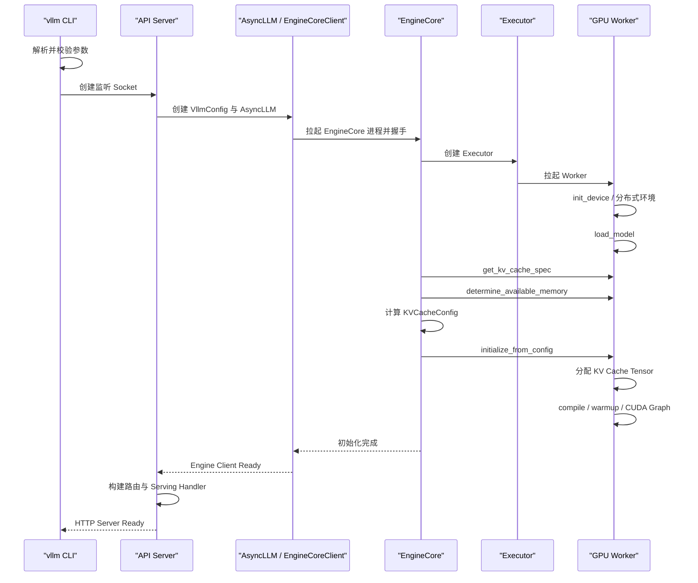

# 执行 vllm serve 后发生了什么：启动与初始化全流程

日常使用 vLLM 时，我们经常只看到一条命令：

```bash
vllm serve Qwen/Qwen3-0.6B
```

但从进程启动到端口真正能够稳定接收请求，中间需要完成参数归一化、模型加载、显存探测、KV Cache
规划、模型编译与 Warmup。理解这条路径，才能正确分析“端口监听了为什么还不能用”“权重已经加载
为什么还在等”“为什么启动阶段 OOM”等问题。

本文以 **vLLM v0.23.0** 为固定基线，主要讨论单机、V1、OpenAI 兼容服务。多 API Server、DP、
多节点 TP/PP 会增加进程与握手，但核心准备阶段相同。

## 1. 启动过程总览



可以把启动过程分成五段：

1. CLI 与配置；
2. API Server 与 Socket；
3. EngineCore、Executor、Worker 进程；
4. 模型、显存、KV Cache 与编译；
5. 应用路由和 Ready。

## 2. 第一段：CLI 参数如何进入系统

### 2.1 `vllm serve` 的入口

主入口位于：

```text
vllm/entrypoints/cli/serve.py
```

`ServeSubcommand.cmd()` 先处理模型位置参数、gRPC、Headless、数据并行负载均衡和 API Server 数量，
然后选择一种启动方式：

```text
单 API Server     → run_server()
多 API Server     → run_multi_api_server()
无前端 Headless   → run_headless()
gRPC              → serve_grpc()
```

初学时应先跟单 API Server 路径：

```text
ServeSubcommand.cmd
→ uvloop.run(run_server(args))
```

不要一开始就追 Ray、Elastic EP 和多节点分支，否则主线会被大量条件判断淹没。

### 2.2 从 Namespace 到 VllmConfig

命令行首先形成 `AsyncEngineArgs`，之后调用 `create_engine_config()` 生成 `VllmConfig`。

```text
CLI 字符串
→ argparse.Namespace
→ AsyncEngineArgs
→ VllmConfig
```

这个过程不只是复制字段，还要完成：

- 模型和 Tokenizer 配置解析；
- dtype、量化方式与最大上下文校验；
- TP、PP、DP 和执行后端选择；
- Scheduler 默认值推导；
- KV Cache、编译与可观测配置组合；
- 平台能力检查。

因此日志里的最终 `VllmConfig` 比原始命令更接近“引擎真正采用的配置”。排障时不能只看 YAML
或启动命令，还应该保存最终配置与版本。

## 3. 第二段：为什么先绑定端口

`run_server()` 先调用 `setup_server()`：

```text
run_server
→ setup_server
  → 参数校验
  → 创建 TCP / Unix Socket
  → 调整资源限制
→ run_server_worker
```

源码会在引擎初始化之前绑定 Socket，主要是避免端口分配竞态。这意味着：

> “操作系统中已经出现监听端口”不等于“模型推理服务已经 Ready”。

如果 Kubernetes 的 Startup Probe 只检查 TCP 端口，可能在模型仍加载、KV Cache 仍初始化时就认为
容器可用。更可靠的策略是让启动探针等待能够反映引擎初始化完成的健康状态，再启用 Readiness。

### 3.1 为什么初始化期间要处理中断信号

模型加载可能持续几分钟。如果 Pod 被终止，服务需要关闭 Socket、EngineCore 和 Worker，回收共享内存
与 GPU Context。启动路径中会临时设置 SIGTERM 处理逻辑，Uvicorn 正式运行后再接管信号。

这解释了一个生产现象：如果容器终止宽限期太短，模型还在加载时可能被强制杀死，留下异常退出日志
或共享资源清理警告。

## 4. 第三段：创建 AsyncLLM 与后台进程

单 API Server 的核心路径是：

```text
run_server_worker
→ build_async_engine_client
→ AsyncEngineArgs.from_cli_args
→ create_engine_config
→ AsyncLLM.from_vllm_config
```

`AsyncLLM` 初始化时创建三类关键对象：

```text
InputProcessor
OutputProcessor
EngineCoreClient
```

其中 EngineCoreClient 会拉起或连接 EngineCore 后台进程。API Server 不直接持有 Scheduler，而是通过
IPC 将请求发送给 EngineCore，再异步接收结果。

### 4.1 为什么需要启动握手

API Server 必须确认：

- EngineCore 进程成功启动；
- Worker 全部就绪；
- 模型和 KV Cache 初始化成功；
- IPC 地址和序列化协议可用；
- 引擎支持的任务类型已经确定。

任何 Worker 在模型加载时失败，都应该让初始化整体失败，而不是启动一个看似正常、实际不能推理的
HTTP 服务。

## 5. 第四段：EngineCore 初始化的顺序

EngineCore 构造函数中的主顺序非常重要：

```text
创建 ModelExecutor
→ 初始化 KV Cache
→ 创建 StructuredOutputManager
→ 创建 Scheduler
→ 建立可选 KV Connector
→ 准备 Batch Queue
→ 进入运行循环
```

为什么 Scheduler 不能最先创建？因为 Scheduler 需要知道：

- 模型每层需要什么类型的 KV Cache；
- 可用 Block 数量；
- Block Size 和哈希粒度；
- 是否存在 Hybrid KV Cache Group；
- Worker 最终采用的缓存配置。

这些信息只有在模型加载、显存探测和 KV Cache 规划之后才能确定。

## 6. 第五段：GPU Worker 初始化

### 6.1 `init_device()`

Worker 首先准备设备环境，典型工作包括：

- 绑定当前 CUDA Device；
- 检查 dtype 与设备能力；
- 初始化 PyTorch 分布式环境；
- 建立 TP、PP、DP 通信组；
- 设置随机种子；
- 记录初始显存快照；
- 创建 GPUModelRunner。

如果这一阶段失败，常见方向包括驱动/CUDA 不兼容、GPU 不可见、NCCL 初始化失败、Rank 配置错误。

### 6.2 `load_model()`

接下来 Worker 调用 GPUModelRunner 加载模型。模型不会先在某个中央进程完整加载再复制给所有 GPU；
在 TP/PP 场景中，各 Rank 应尽量只构造和加载自己需要的权重分片。

模型加载阶段的主要显存包括：

```text
模型权重
+ CUDA Context
+ 通信 Buffer
+ 框架与临时分配
```

此时通常还没有分配最终大小的 KV Cache。

如果“读取权重很慢”，优先看：

- 模型文件是否在本地；
- 文件数量与格式；
- 网络存储吞吐和元数据性能；
- CPU 解压、反序列化和 NUMA；
- 多 Rank 是否同时争抢同一存储路径。

## 7. 第六段：显存探测不是简单查看 free memory

Worker 的 `determine_available_memory()` 会运行 Profile，以估算模型执行的峰值非 KV 显存，再根据
配置计算可以留给 KV Cache 的空间。

简化关系是：

```text
KV 可用空间
≈ 初始可用显存 × gpu_memory_utilization
- 模型执行峰值非 KV 显存
```

其中“非 KV 显存”不仅有权重，还可能包括：

- Activation 峰值；
- Attention Workspace；
- NCCL Buffer；
- CUDA Graph 相关内存；
- PyTorch Allocator 保留；
- 多模态 Encoder 临时内存。

所以不能用下面的粗略想法直接规划：

```text
总显存 - 权重大小 = KV Cache
```

### 7.1 为什么启动 Profile 看起来像真实推理

为了捕获峰值内存，引擎会构造 Dummy Input 运行 Profile。日志和 GPU 监控中可能看到短暂计算，
即使还没有用户请求。这不是流量泄漏，而是容量探测和编译准备。

### 7.2 手工指定 KV Cache 内存的含义

如果显式设置固定 KV Cache 内存，vLLM 可以跳过部分自动容量推导，但仍可能运行用于编译或最大
Batch 的 Profile。手工值提高了可复现性，也把 OOM 风险转移给使用者：同一个值在不同驱动、模型
Revision 或并行配置下不一定安全。

## 8. 第七段：从字节预算到 KVCacheConfig

EngineCore 会先从所有 Worker 获取 KV Cache Spec。Spec 描述每层缓存需要的结构，例如：

- 层属于哪种 Attention/状态类型；
- Block Size；
- 每 Block 占用多少字节；
- 是否需要分组管理；
- 不同 Rank 的需求是否一致。

随后结合各 Worker 可用显存，计算 `KVCacheConfig`：

```text
KV Cache Spec
+ 每个 Worker 的可用字节数
+ 并行与模型配置
→ KV Cache Group
→ Block 数量
→ 每个 Worker 的 KVCacheConfig
```

多卡系统通常受到最紧张 Rank 的约束。某个 Rank 被其他进程占用更多显存时，可能导致所有 Rank
整体减少 Block 数量，甚至初始化失败。

## 9. 第八段：分配真实 KV Cache

配置确定后，Executor 调用各 Worker 的 `initialize_from_config()`，Worker 再让 GPUModelRunner 分配
真实 KV Cache Tensor。

注意两个世界的区别：

```text
启动阶段：确定并分配物理 KV Cache 池
运行阶段：Scheduler 把池中的逻辑 Block 分给请求
```

启动阶段决定“总共有多少房间”，运行阶段决定“当前哪些请求住在哪些房间”。

如果启动日志显示 KV Cache Token Capacity 很低，运行时即使没有 CUDA OOM，也会很快出现排队、
抢占或低并发。

## 10. 第九段：Compile、Warmup 与 CUDA Graph

KV Cache 分配后，Worker 执行 `compile_or_warm_up_model()`。根据配置，可能包含：

- 为指定 Token 数进行模型编译；
- 对常见 Batch Shape 预热；
- 捕获 CUDA Graph；
- 初始化 Attention Backend 的执行路径；
- 预分配或稳定某些 Buffer。

### 10.1 为什么权重加载完成后还要等

权重只解决“模型参数在哪里”。高性能运行还需要准备“用什么 Shape、什么执行图、什么 Buffer 执行”。
因此日志出现模型加载完成，并不代表 Ready。

### 10.2 CUDA Graph 的收益与代价

收益主要是降低 Decode 等重复小步执行的 CPU Launch 开销；代价包括：

- 启动时间增加；
- 捕获过程占用额外显存；
- 只覆盖特定 Shape；
- 某些动态功能可能回退到 Eager。

排查启动 OOM 时，`--enforce-eager` 可以作为诊断变量，但它会改变运行性能，不能把诊断配置直接
当成最终优化结论。

## 11. 第十段：构建 API 应用并对外服务

引擎初始化完成后，API Server 才会继续：

```text
查询 supported_tasks
→ build_app()
→ 注册 OpenAI 路由和中间件
→ init_app_state()
→ 创建模型 Serving Handler
→ serve_http()
```

此时 API 路由、Engine Client 和模型服务状态才完整连接起来。

### 11.1 Startup、Liveness、Readiness 要区分

| 探针 | 应回答的问题 | 不应该只检查 |
| --- | --- | --- |
| Startup | 初始化是否已经完成 | 进程存在、TCP 已监听 |
| Liveness | 进程是否卡死且需要重启 | 单次推理是否变慢 |
| Readiness | 是否应该接收新流量 | Pod 是否 Running |

大型模型初始化可能持续很久，Startup Probe 的失败阈值必须覆盖下载、权重加载、Profile 和 Graph
Capture 的最坏时间。

## 12. 启动日志应该按阶段阅读

建议给日志手工标记以下时间点：

```text
t0 容器进程启动
t1 CLI 参数解析完成
t2 Socket 绑定
t3 EngineCore 启动
t4 Worker 与分布式环境就绪
t5 模型权重加载完成
t6 显存 Profile 完成
t7 KV Cache 分配完成
t8 Compile / CUDA Graph 完成
t9 API Server Ready
```

然后计算：

```text
下载/读取时间 = t5 - t4
缓存规划时间 = t7 - t5
编译预热时间 = t8 - t7
总启动时间   = t9 - t0
```

只有这样才能确定优化镜像、存储、CPU、编译缓存还是探针。

## 13. 常见启动故障定位

### 13.1 长时间停在模型加载

重点看模型文件下载、共享存储吞吐、CPU/NUMA 和多进程并发读取。

### 13.2 模型加载成功后 OOM

重点看显存 Profile、KV Cache 分配、CUDA Graph 和其他 GPU 进程。不要仅根据“权重可以放下”判断
服务一定能启动。

### 13.3 多卡某个 Rank 卡住

重点看 Rank 日志、NCCL、网卡选择、防火墙、共享内存与拓扑。其他 Rank 可能只是等待集合通信。

### 13.4 TCP 探针成功但请求失败

Socket 可能已经绑定，而 EngineCore 尚未完成握手。检查探针语义和引擎 Ready 日志。

### 13.5 每次重启启动时间差别很大

区分模型文件冷/热缓存、编译缓存、GPU 上残留进程、网络存储抖动和镜像层拉取。

## 14. 实验：画出自己的启动瀑布图

固定模型、镜像、GPU 和参数，进行三组实验：

1. 模型文件冷缓存；
2. 模型文件热缓存；
3. `--enforce-eager` 对照。

每组记录：

```bash
date -Ins
nvidia-smi --query-compute-apps=pid,used_memory --format=csv
nvidia-smi dmon -s pucm
```

同时保留 vLLM 完整日志，回答：

- 权重读取占总启动时间多少？
- KV Cache 分配前后显存增加多少？
- CUDA Graph 阶段耗时和显存代价是多少？
- 冷热缓存差异来自下载、页缓存还是编译？

## 15. 源码阅读锚点

| 阶段 | 文件 | 关键入口 |
| --- | --- | --- |
| CLI | `vllm/entrypoints/cli/serve.py` | `ServeSubcommand.cmd` |
| Socket/API | `vllm/entrypoints/openai/api_server.py` | `setup_server`、`run_server_worker` |
| Engine Client | `vllm/v1/engine/async_llm.py` | `AsyncLLM.__init__` |
| EngineCore | `vllm/v1/engine/core.py` | `EngineCore.__init__` |
| KV 初始化 | `vllm/v1/engine/core.py` | `_initialize_kv_caches` |
| Worker | `vllm/v1/worker/gpu_worker.py` | `init_device`、`load_model` |
| 显存探测 | 同上 | `determine_available_memory` |
| KV 分配 | 同上 | `initialize_from_config` |
| 编译预热 | 同上 | `compile_or_warm_up_model` |

## 16. 验收清单

- [ ] 能说出 `vllm serve` 到 Ready 的十个阶段。
- [ ] 能解释端口监听为什么不等于服务 Ready。
- [ ] 能解释权重加载完成后为什么还需要 Profile 和 Warmup。
- [ ] 能区分 KV Cache 字节预算、KVCacheConfig 和运行时 Block 分配。
- [ ] 能定位启动 OOM 属于权重、Profile、KV Cache 还是 CUDA Graph。
- [ ] 能为 Kubernetes 设计合理的 Startup/Liveness/Readiness。

## 17. 固定版本源码

- [v0.23.0 CLI Serve](https://github.com/vllm-project/vllm/blob/v0.23.0/vllm/entrypoints/cli/serve.py)
- [v0.23.0 API Server](https://github.com/vllm-project/vllm/blob/v0.23.0/vllm/entrypoints/openai/api_server.py)
- [v0.23.0 EngineCore](https://github.com/vllm-project/vllm/blob/v0.23.0/vllm/v1/engine/core.py)
- [v0.23.0 GPU Worker](https://github.com/vllm-project/vllm/blob/v0.23.0/vllm/v1/worker/gpu_worker.py)

下一篇进入第一条真实请求：从 OpenAI JSON、Chat Template 和 Tokenizer 开始，观察“一句话”在进入
Scheduler 之前依次变成哪些数据对象。
