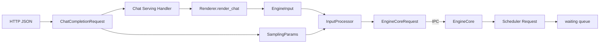

# 一句话如何变成 EngineCoreRequest：输入处理与请求对象

用户输入的是一句中文，GPU 接收的却是 Tensor。中间不是简单调用一次 Tokenizer，而是要完成协议
校验、模板渲染、参数归一化、长度检查、请求状态创建和跨进程传输。

本文继续使用 **vLLM v0.23.0**，用下面的请求贯穿整条输入路径：

```json
{
  "model": "Qwen/Qwen3-0.6B",
  "messages": [
    {"role": "system", "content": "你是一个存储系统老师。"},
    {"role": "user", "content": "请用三句话解释 KV Cache。"}
  ],
  "temperature": 0.7,
  "max_tokens": 128,
  "stream": true
}
```

我们关心的不是记住所有函数，而是回答三个问题：

1. 一句话在哪一步变成 Token ID？
2. 用户参数在哪一步变成引擎能执行的约束？
3. 请求跨进程时携带哪些数据、不携带哪些数据？

## 1. 对象变化总览



从外向内，对象越来越接近推理执行：

| 对象 | 关注点 |
| --- | --- |
| `ChatCompletionRequest` | OpenAI API 语义 |
| `EngineInput` | 模型输入语义 |
| `SamplingParams` | 生成控制语义 |
| `EngineCoreRequest` | 跨进程引擎请求 |
| `Request` | Scheduler 运行时状态 |

## 2. 第一层：HTTP JSON 变成协议对象

FastAPI/Pydantic 首先将 JSON 解析为 `ChatCompletionRequest`。这一层可以发现：

- 字段类型错误；
- 必填字段缺失；
- `messages` 结构非法；
- OpenAI 协议参数取值不合法。

这时请求仍然是“API 世界”的对象。`messages` 保留 role/content 结构，`stream` 描述响应方式，
但 Scheduler 并不理解这些概念。

路由入口位于：

```text
vllm/entrypoints/openai/chat_completion/api_router.py
```

路由把请求交给 Chat Completion Serving Handler。HTTP 层主要负责协议和生命周期，不应该在这里
编写 KV Cache 分配策略。

## 3. 第二层：Chat Template 决定模型真正看到什么

Chat 模型不是直接读取 JSON 数组。Renderer 要使用模型的 Chat Template，把消息转换为模型约定的
Prompt，例如概念上可能变成：

```text
<system>
你是一个存储系统老师。
</system>
<user>
请用三句话解释 KV Cache。
</user>
<assistant>
```

实际控制 Token 由模型模板决定，上面只是示意。

### 3.1 为什么相同 messages 可能得到不同 Token

以下变化都会改变最终输入：

- 模型或 Tokenizer Revision；
- Chat Template；
- 是否添加 Generation Prompt；
- Tool/Function 描述；
- Reasoning、结构化输出等扩展；
- BOS/EOS 等特殊 Token 处理。

因此 Prefix Cache 判断的是最终 Token 前缀是否一致，而不是两个 HTTP JSON 看起来是否相似。

### 3.2 Chat Template 故障的典型表现

- 模型回答风格异常；
- 模型继续生成用户内容而不是回答；
- Prompt Token 数突然上升；
- 不同副本缓存命中不一致；
- Stop Token 不生效。

遇到这些问题，应该先打印渲染后的 Prompt 和 Token ID，而不是立刻调 Scheduler 参数。

## 4. 第三层：Tokenization

Tokenizer 将渲染后的文本映射为 Token ID：

```text
"请用三句话解释 KV Cache。"
→ [token_1, token_2, ..., token_n]
```

GPU 模型不读取 Unicode 字符串；Embedding 层接收的是整数 ID。Tokenization 通常在 API Server
进程的 CPU 上完成，所以长 Prompt、高并发和复杂模板可能在请求到达 GPU 前就形成瓶颈。

### 4.1 Token 数比字符数更重要

容量和延迟主要受 Token 数影响：

```text
Prompt 字符数 ≠ Prompt Token 数
```

同样长度的中英文、代码、JSON、Base64 或特殊字符可能产生完全不同的 Token 数。网关若只按 HTTP
Body 大小限流，无法准确估算 Prefill 和 KV Cache 成本。

### 4.2 为什么 Tokenizer 版本必须固定

Tokenizer 文件或特殊 Token 配置变化可能导致：

- 相同文本得到不同 Token ID；
- Prefix Cache 失去共享条件；
- 上下文长度估算变化；
- Stop Token 行为变化；
- 压测结果无法复现。

生产环境应固定模型 Revision、Tokenizer Revision、镜像 Digest 和 Chat Template。

## 5. 第四层：生成参数变成 SamplingParams

HTTP 请求中的生成字段会被转换为 `SamplingParams`。典型内容包括：

- `temperature`、`top_p`、`top_k`；
- `max_tokens`、`min_tokens`；
- `stop`、`stop_token_ids`；
- `n`；
- `logprobs`；
- Presence/Frequency Penalty；
- 输出类型和结构化约束。

### 5.1 默认值来自哪里

最终值不一定只来自 API 请求，还可能综合：

```text
用户显式参数
→ Serving 层默认值
→ 模型 generation_config
→ Tokenizer 的 EOS 等信息
→ 引擎约束
```

排查“同样请求升级后输出不同”时，应比较归一化后的 `SamplingParams`，不能只比较原始 JSON。

### 5.2 `stream` 不属于模型采样算法

`stream: true` 决定 API 如何返回增量结果，不会让 Transformer 换一种数学计算。模型仍按自回归步骤
生成 Token；流式模式只是更早把每轮可用结果交给客户端。

## 6. 第五层：InputProcessor 做了什么

`InputProcessor.process_inputs()` 的核心职责是把已经渲染的输入和生成参数整理成
`EngineCoreRequest`。

可以把它概括为：

```text
参数与任务校验
→ DP Rank 校验
→ Encoder/Decoder 输入拆分
→ 输入长度与模型能力校验
→ 生成参数克隆和默认值补全
→ 多模态特征整理
→ 构造 EngineCoreRequest
```

源码中最终构造对象的代码不长：

```python
return EngineCoreRequest(
    request_id=request_id,
    prompt_token_ids=prompt_token_ids,
    sampling_params=sampling_params,
    arrival_time=arrival_time,
    priority=priority,
    trace_headers=trace_headers,
)
```

真实对象还有 Prompt Embedding、多模态、LoRA、Cache Salt 等字段。这里保留少量代码，是为了看到
边界，而不是逐行抄写整个方法。

## 7. 输入长度在哪里检查

InputProcessor 需要判断 Prompt 和输出预算是否满足模型限制。核心关系是：

```text
Prompt Tokens + 计划生成 Tokens ≤ 可用模型上下文
```

但实际还要考虑：

- Encoder-Decoder 与 Decoder-only 的差异；
- 多模态 Placeholder；
- Prompt Embedding；
- 模型和平台限制；
- `truncate_prompt_tokens` 等行为；
- 未指定 `max_tokens` 时的默认补全。

### 7.1 为什么应尽早拒绝超长请求

如果 API 入口已经知道请求必然不合法，应在进入 Scheduler 之前返回错误。这样可以避免：

- 无效请求占用内部队列；
- 运行到深层才失败；
- 错误被误判为 GPU 故障；
- 产生无法理解的高 TTFT。

网关可以做粗粒度限制，但最终 Token 级校验仍应由使用真实 Tokenizer 和模型配置的服务完成。

## 8. EngineCoreRequest 穿过进程边界

`EngineCoreRequest` 是 API 侧与 EngineCore 侧的契约。它主要携带：

- 请求 ID；
- Prompt Token ID 或 Prompt Embedding；
- Sampling/Pooling 参数；
- 到达时间与优先级；
- LoRA、多模态和结构化输出元数据；
- Trace Header；
- Cache Salt 等缓存隔离信息。

通常不需要携带：

- 原始 HTTP Connection；
- Uvicorn/FastAPI Request 对象；
- SSE Writer；
- API 网关内部对象。

EngineCore 只关心推理，不应该依赖 HTTP 框架。

## 9. AsyncLLM 为什么同时注册输入和输出状态

`AsyncLLM.add_request()` 有两项关键动作：

```text
OutputProcessor.add_request(...)
EngineCoreClient.add_request_async(...)
```

第一项在 API Server 进程中建立输出状态和请求级收集器；第二项把 `EngineCoreRequest` 发送给后台
EngineCore。

顺序很重要：如果先让引擎极速产生结果，却还没有建立输出状态，结果可能找不到对应消费者。

### 9.1 每个请求都有自己的异步输出收集器

在线服务中，多个用户请求共享同一个 EngineCore 输出流。AsyncLLM 需要按照 `request_id` 把批量结果
重新分发到每个请求自己的异步迭代器：

```text
EngineCore 批量输出
→ Output Handler
→ 按 request_id 分流
→ RequestOutputCollector
→ generate() yield
```

这就是动态 Batch 内部合并、API 层再次拆分的过程。

## 10. `n > 1` 为什么会产生子请求

当用户要求一次返回多个候选结果时，API 语义仍是一个请求，但推理引擎可能需要维护多个生成分支。
AsyncLLM 会建立父请求关系，并为子请求分配内部 ID 和独立采样状态。

这会放大：

- Decode 计算；
- KV Cache 占用；
- 输出处理量；
- 取消和完成状态管理复杂度。

因此网关成本模型不能只按外部 HTTP 请求数计费或限流。

## 11. EngineCoreRequest 如何变成 Scheduler Request

EngineCore 收到请求后，会调用类似下面的转换：

```text
EngineCoreRequest
→ Request.from_engine_core_request(...)
→ Request
→ Scheduler.add_request(...)
→ waiting queue
```

内部 `Request` 是运行时可变状态，除输入字段外，还会逐步记录：

- 已计算 Token 数；
- 已产生 Token；
- 当前状态；
- Block Hash 和 KV Block；
- Structured Output 状态；
- 抢占和完成信息。

这是 DTO 与运行时实体的区别：`EngineCoreRequest` 适合跨进程传输，Scheduler `Request` 适合持续
更新状态。

## 12. Prefix Cache 的哈希何时出现

如果启用 Prefix Cache，EngineCore 在创建内部 Request 时，可以根据完整 Token 块逐段建立哈希链。
概念上：

```text
H1 = hash(TokenBlock1, extra_keys)
H2 = hash(H1, TokenBlock2, extra_keys)
H3 = hash(H2, TokenBlock3, extra_keys)
```

这意味着缓存匹配要求前缀 Token 内容和相关额外键一致。两个问题语义相似、文字略有不同，哈希就会
不同，不能复用 KV。

`cache_salt`、LoRA、多模态内容等也可能进入隔离条件，避免不应该共享的请求错误复用缓存。

## 13. 一句话的逐层快照

建议实际调试时保存四份快照：

### 13.1 API 快照

```text
model、messages、stream、max_tokens、sampling fields
```

### 13.2 渲染快照

```text
最终 Prompt 文本、Chat Template ID/Hash
```

### 13.3 Token 快照

```text
Prompt Token 数、前若干 Token ID、EOS/BOS
```

### 13.4 引擎快照

```text
request_id、arrival_time、priority、max_tokens、cache_salt
```

不要在生产日志中直接记录完整用户 Prompt。可以记录长度、Hash、采样字段和脱敏 Trace ID。

## 14. 输入阶段的性能指标

建议至少区分：

```text
http_parse_seconds
chat_template_seconds
tokenization_seconds
input_validation_seconds
engine_enqueue_seconds
prompt_tokens
```

如果只观察总 TTFT，CPU Tokenization 变慢会被误判为 Scheduler 排队或 GPU Prefill 变慢。

## 15. 常见故障判断

### 15.1 请求立即 400/422

优先看协议校验、模型名、字段类型、Template 与输入长度，不要看 GPU。

### 15.2 Prompt 很短但 Token 数很大

检查 Template、Tool Schema、Reasoning 配置、特殊字符和 Tokenizer Revision。

### 15.3 两个副本输出行为不同

比较模型/Tokenizer Revision、Chat Template、generation_config 和归一化 SamplingParams。

### 15.4 Prefix Cache 命中突然下降

检查最终 Token 前缀是否变化，而不是只比较原始 `messages`；还要检查 Cache Salt、LoRA 和多模态
额外键。

### 15.5 CPU 满、GPU 空闲

检查 Tokenization、多模态预处理、API Server CPU 配额和 EngineCore CPU 争抢。

## 16. 实验：观察一句话的对象变化

在隔离环境中提交固定请求，记录：

1. 原始 `messages`；
2. 渲染后 Prompt；
3. Token ID 与 Token 数；
4. 最终 SamplingParams；
5. EngineCore Request ID；
6. 进入 Scheduler 的时间。

依次修改一个变量：

- 增加一个 system message；
- 修改 Chat Template；
- 修改 Tokenizer Revision；
- 将 `n` 从 1 改为 2；
- 增加 `cache_salt`；
- 增加一个 Stop String。

观察哪些对象变化、哪些指标变化、Prefix Cache 是否还能命中。

## 17. 源码阅读锚点

| 阶段 | 文件 | 关键入口 |
| --- | --- | --- |
| API 协议 | `vllm/entrypoints/openai/chat_completion/protocol.py` | `ChatCompletionRequest` |
| API 路由 | `.../chat_completion/api_router.py` | `create_chat_completion` |
| Serving | `.../chat_completion/serving.py` | `create_chat_completion` |
| 渲染 | 同上及 Renderer | `render_chat_request` |
| 异步引擎 | `vllm/v1/engine/async_llm.py` | `generate`、`add_request` |
| 输入处理 | `vllm/v1/engine/input_processor.py` | `process_inputs` |
| 跨进程对象 | `vllm/v1/engine/__init__.py` | `EngineCoreRequest` |
| 调度对象 | `vllm/v1/request.py` | `Request` |
| Core 转换 | `vllm/v1/engine/core.py` | `preprocess_add_request` |

## 18. 验收清单

- [ ] 能画出 JSON 到 Scheduler Request 的对象转换链。
- [ ] 能解释 Chat Template 为什么影响 Token 数和 Prefix Cache。
- [ ] 能区分 API 参数、SamplingParams 和运行时 Request 状态。
- [ ] 能解释 EngineCoreRequest 为什么不携带 HTTP 对象。
- [ ] 能说明 `n > 1` 如何放大推理成本。
- [ ] 能设计输入处理各阶段的延迟指标。

## 19. 固定版本源码

- [v0.23.0 Chat Completion Serving](https://github.com/vllm-project/vllm/blob/v0.23.0/vllm/entrypoints/openai/chat_completion/serving.py)
- [v0.23.0 AsyncLLM](https://github.com/vllm-project/vllm/blob/v0.23.0/vllm/v1/engine/async_llm.py)
- [v0.23.0 InputProcessor](https://github.com/vllm-project/vllm/blob/v0.23.0/vllm/v1/engine/input_processor.py)
- [v0.23.0 EngineCore Request](https://github.com/vllm-project/vllm/blob/v0.23.0/vllm/v1/engine/__init__.py)

下一篇进入 EngineCore 内部，观察请求加入 waiting 队列后，`schedule → execute → update` 如何不断
推进 Prefill 和 Decode，直到生成结束。
