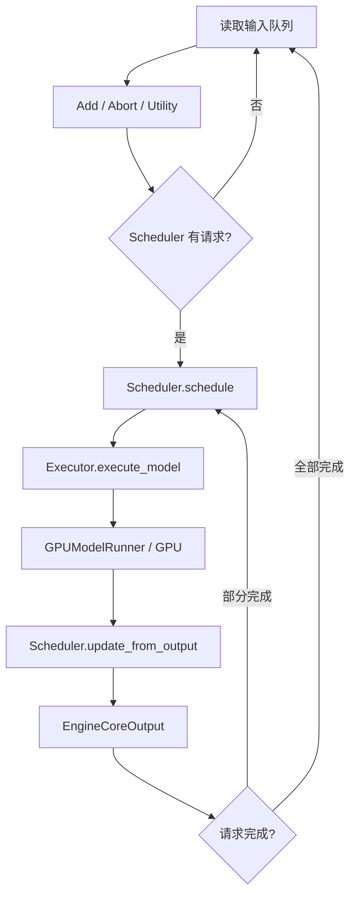
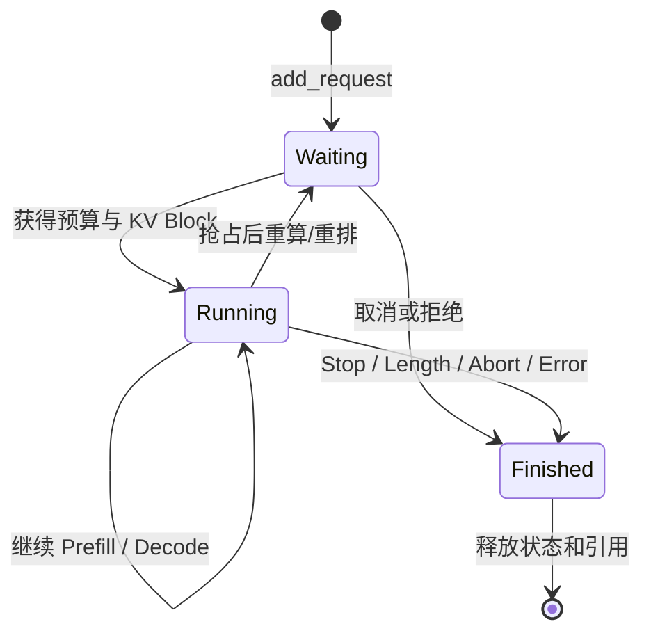

# EngineCore 主循环：Schedule、Execute、Update 与请求状态机

上一章的一句话已经变成 `EngineCoreRequest` 并穿过进程边界。接下来 EngineCore 要把它和其他请求
组合成动态 Batch，推动 Prefill 和 Decode，直到完成或取消。

V1 最核心的循环可以用三个词概括：

```text
Schedule → Execute → Update
```

本文以 **vLLM v0.23.0** 为基线，重点解释框架与状态变化。Scheduler 的每个可选分支、KV Block
内部算法和 GPUModelRunner 细节会在后续专题继续展开。

## 1. EngineCore 为什么使用持续循环

在线服务的请求随时到达，长度各不相同。如果每个 HTTP 请求单独启动一次完整模型推理，GPU 会出现
大量小 Batch 和空闲间隙。

EngineCore 将所有活跃请求放入统一控制循环：

```text
接收新请求/取消消息
→ 选择本轮可运行的请求与 Token 数
→ 执行一个模型 Step
→ 处理生成 Token 并更新状态
→ 立即开始下一轮
```

多个请求可以在不同轮次加入或离开 Batch，这就是 Continuous Batching 的控制基础。

## 2. 主循环总览



多进程 EngineCore 的 Busy Loop 概念上只有两步：

```text
处理输入队列
→ 执行 Engine Step 并发送输出
```

真正的推理推进发生在 `EngineCore.step()`。

## 3. 请求进入 Scheduler

EngineCore 先把跨进程的 `EngineCoreRequest` 转换成内部 `Request`，再调用：

```text
Scheduler.add_request(request)
```

新请求会：

- 进入 waiting 队列；
- 注册到 `request_id → Request` 映射；
- 通知可选 KV Connector；
- 记录 Queued 事件。

这里的 waiting 表示“尚未成为运行中请求”，可能是等待调度预算、KV Block、结构化输出 Grammar、
远端 KV 等条件，并不只是简单 FIFO 等 CPU 时间。

## 4. V1 不把 Prefill 和 Decode 写成两套调度器

这是理解 V1 Scheduler 的关键。

对于每个 Request，Scheduler 关心两个数量：

```text
num_computed_tokens
num_tokens_with_spec
```

可以先把第二个理解为当前请求已经拥有、需要模型计算追上的 Token 总量。每轮需要计算：

```text
num_new_tokens
= num_tokens_with_spec - num_computed_tokens
```

如果请求刚进入，差值很大，对应 Prompt Prefill；如果 Prompt 已处理完成并刚生成一个新 Token，差值
通常很小，对应 Decode。

因此 Scheduler 的统一视角是：

> 为每个请求安排本轮需要补算多少 Token。

这套抽象可以同时覆盖：

- 普通 Prefill；
- Chunked Prefill；
- Decode；
- Prefix Cache 命中后跳过部分 Prompt；
- Speculative Decode；
- 部分远端 KV 加载。

“Prefill/Decode”仍是重要的性能概念，但不必在 Scheduler 中形成两套完全分离的状态机。

## 5. `schedule()` 的输入与预算

一次调度至少受以下资源约束：

- 本轮 Token Budget；
- 最大并发请求数；
- 模型最大长度；
- 可用 KV Block；
- 长 Prefill 分块阈值；
- Encoder 计算与缓存预算；
- Structured Output 是否准备完成；
- Priority/FCFS 策略；
- 可选远端 KV 状态。

最重要的全局预算可以写成：

```text
Σ 本轮分给各请求的 num_scheduled_tokens
≤ max_num_batched_tokens（或最终推导的本轮 Token 上限）
```

### 5.1 为什么先处理 Running 请求

V1 Scheduler 通常先尝试推进 running 请求，再从 waiting 引入新请求。这有助于：

- 持续推进已有 Decode；
- 降低输出 Token 的间隔抖动；
- 避免只顾新 Prefill 而饿死活跃请求；
- 提高已分配 KV 状态的利用率。

但最终行为还会受到优先级、Chunked Prefill、异步调度和特定功能影响，不能简化为“Decode 永远绝对
优先”。

## 6. KV Block 决定计划能否落地

确定某个请求本轮需要计算的 Token 数后，Scheduler 调用 KVCacheManager 分配 Slot/Block。

```text
计划计算 N 个 Token
→ 判断已有 Block 是否足够
→ 申请新 Block
→ 成功：加入本轮 Batch
→ 失败：抢占、跳过或停止继续加入
```

这说明调度有两层判断：

1. Token Budget 允许不允许；
2. KV Cache 容量允许不允许。

只提高 `max_num_batched_tokens`，若 KV Cache 没有空间，不会自动提高吞吐。

### 6.1 Prefix Cache 在哪里改变成本

新请求进入时，KVCacheManager 可以找到最长的精确缓存前缀，使 `num_computed_tokens` 从已命中的位置
开始，而不是从 0 开始。

于是原本需要处理 4000 个 Prompt Token 的请求，可能只需处理未命中的尾部。Prefix Cache 改变的
是需要计算的 Token 数，不是跳过整个 Scheduler。

## 7. 调度结果：SchedulerOutput

`schedule()` 的产物不是最终输出，而是一份面向 Executor/Worker 的执行计划。它通常包含：

- 新加入和继续运行的请求；
- 每个请求本轮 Token 数；
- 新分配的 Block；
- Block Table 更新；
- Scheduled Encoder Input；
- Speculative Token；
- 已完成/抢占请求通知；
- KV Connector 元数据。

概念上可以表示成：

```text
Request A: 128 个 Token，Block [10, 11, 12]
Request B:   1 个 Token，Block [21, 22]
Request C:   1 个 Token，Block [30]
```

Worker 只需要根据这份计划准备批次和执行模型，不需要再次遍历全局 waiting 队列做业务决策。

## 8. `execute_model()` 做什么

EngineCore 将 `SchedulerOutput` 交给 Executor：

```text
SchedulerOutput
→ Executor
→ 一个或多个 Worker
→ GPUModelRunner
→ Model Forward / Attention / Sampling
→ ModelRunnerOutput
```

Executor 抽象屏蔽了单进程、多进程、Ray 等执行差异；Worker 抽象屏蔽硬件与 Rank；GPUModelRunner
负责把本轮计划转成 GPU 可执行批次。

本章只需要知道 `ModelRunnerOutput` 会带回：

- 请求顺序与索引；
- 采样 Token ID；
- Logprobs；
- Pooling Output；
- Speculative Decode 结果；
- KV Connector/性能等元数据。

## 9. `update_from_output()` 推进状态机

GPU 返回结果后，Scheduler 必须把批量输出重新对应到每个 Request，然后：

1. 更新本轮已经计算的 Token 数；
2. 追加采样得到的 Token；
3. 处理 Speculative Token 的接受/拒绝；
4. 检查 Stop Token、长度与其他完成条件；
5. 释放已完成请求的资源；
6. 生成面向 API Server 的 `EngineCoreOutput`；
7. 保留未完成请求，等待下一轮。

核心代码仍然很短：

```python
scheduler_output = self.scheduler.schedule()
model_output = self.model_executor.execute_model(scheduler_output)
engine_outputs = self.scheduler.update_from_output(
    scheduler_output, model_output
)
```

真正复杂的是三种对象中状态的一致性，而不是这几行调用本身。

## 10. 用三条请求模拟两个 Engine Step

假设当前有：

| 请求 | Prompt | 已计算 | 状态 |
| --- | ---: | ---: | --- |
| A | 6 Token | 0 | 新请求 |
| B | 4 Token | 4，且已有一个待计算输出 Token | Decode |
| C | 3 Token | 0 | 新请求 |

假设本轮 Token Budget 为 6。

### Step 1

一种可能的计划：

```text
B: 1 Token
A: 5 Token（Chunked Prefill）
C: 0 Token
```

执行后：

- B 产生下一个 Token，若未停止，下轮继续 Decode；
- A 还剩 1 个 Prompt Token 未计算；
- C 仍在 waiting。

### Step 2

一种可能的计划：

```text
B: 1 Token
A: 1 Token（完成剩余 Prefill，并可能得到首 Token）
C: 3 Token（开始 Prefill）
```

这个例子说明 Continuous Batching 不是“把三个请求绑死成同一个静态 Batch”，而是每轮重新选择
活跃成员和 Token 数。

## 11. 请求状态应该怎么理解

不必一开始背完所有枚举，可以先掌握业务状态：



实际源码还包含等待 Structured Output、远端 KV、流式输入等状态。阅读时要区分：

- 等待“被选择”；
- 等待“外部依赖准备”；
- 已运行但被抢占；
- 已完成但异步清理尚未结束。

## 12. 抢占在 V1 中意味着什么

当运行请求需要新 KV Block，但没有足够空间时，Scheduler 可能抢占低优先级或队尾请求，释放其
活动 Block，之后再通过重算恢复进度。

V1 的默认思路不应直接套用旧 V0 的 GPU/CPU Swap 三队列流程。判断抢占影响时重点看：

```text
被抢占次数
× 需要重算的 Token 数
× Prefill 单 Token 成本
```

频繁抢占会同时恶化 TTFT、TPOT 和吞吐，表面上却不一定出现 CUDA OOM。

## 13. 停止条件在哪里处理

需要区分 Token 级与文本级停止：

### 13.1 EngineCore/Scheduler 可判断

- EOS Token；
- Stop Token ID；
- 最大输出长度；
- 最大模型长度；
- 取消或内部错误。

### 13.2 OutputProcessor 可能判断

- Stop String；
- 增量 Detokenization 后的文本条件；
- API 输出拼接相关条件。

如果 OutputProcessor 根据 Stop String 判断请求应该结束，还需要向 EngineCore 发送 Abort，停止后续
GPU 计算。否则客户端虽然不再显示文本，后台请求仍可能继续占用资源。

## 14. 客户端取消如何进入主循环

客户端断开后，取消链路应是：

```text
HTTP disconnect
→ Serving Handler / AsyncLLM.abort
→ EngineCoreClient.abort_requests
→ EngineCore abort queue
→ Scheduler.finish_requests
→ 释放请求活动状态与 KV 引用
```

EngineCore 会在模型执行返回后再次处理执行期间到达的 Abort，以避免已取消请求的输出继续进入正常
状态更新。

取消不是 HTTP 层的附属功能，而是容量治理功能。长输出请求取消传播失效会形成隐形 GPU 负载。

## 15. 同步 Step 与 Batch Queue

普通主线按下面方式运行：

```text
Schedule → 等 Execute 完成 → Update → 下一轮
```

当启用允许多个在途 Batch 的能力时，EngineCore 可以使用 Batch Queue，让调度和执行产生重叠，
减少 Pipeline Bubble 或 CPU/GPU 间隙：

```text
Schedule Batch N+1
同时等待 Batch N 的结果
→ 按顺序 Update
```

这提高了并行性，也使取消、KV Block 延迟释放和错误处理更复杂。初学源码应先看 `step()`，理解后
再看 `step_with_batch_queue()`。

## 16. EngineCore CPU 为什么很重要

每个 GPU Step 之间都需要 CPU 完成调度、对象更新和进程通信。如果 EngineCore CPU 被限流：

```text
GPU 完成上一轮
→ 等 CPU 产生下一轮计划
→ GPU 出现空洞
```

典型现象：

- GPU 利用率周期性下降；
- TTFT 和 TPOT 都抖动；
- 模型 Kernel 本身耗时正常；
- 提高 GPU 数量反而扩大控制面压力。

应同时观察 EngineCore CPU、Cgroup Throttling、上下文切换和每 Step 调度耗时。

## 17. 指标如何映射到主循环

| 指标 | 所属阶段 | 说明 |
| --- | --- | --- |
| Waiting Requests | 调度前 | 需求超过当前服务能力或被依赖阻塞 |
| Running Requests | Scheduler | 当前活动请求数 |
| Scheduled Tokens/Step | Schedule | 本轮工作量 |
| KV Cache Usage | Allocate | 缓存池压力 |
| Prefix Cache Hit | 新请求接纳 | 跳过的 Prompt 计算 |
| Preemption Count | Allocate | KV 压力与重算 |
| Scheduler Time | Schedule/Update | CPU 控制面成本 |
| Model Execute Time | Execute | GPU/通信执行成本 |
| Step Interval | 整体 | CPU 与 GPU 是否形成空洞 |

只看 GPU Utilization 无法区分调度不足、KV 压力、通信和 Kernel 问题。

## 18. 四种常见瓶颈

### 18.1 Waiting 高、KV 使用低

可能是 Token Budget、最大并发、优先级、远端依赖或准入限制，不一定是显存不足。

### 18.2 KV 使用高、抢占增加

并发和上下文组合超过缓存容量，需要降低并发/长度、增加缓存容量或改善流量治理。

### 18.3 GPU 空洞、Scheduler Time 高

检查 EngineCore CPU、Python 对象处理、进程通信和每 Step 请求规模。

### 18.4 Execute Time 高

进一步下钻 GPUModelRunner、Attention Backend、TP/PP 通信和 GPU 降频，而不是继续调整 waiting 队列。

## 19. 实验：手工还原调度时间线

构造三类流量：

- 短 Prompt + 短输出；
- 长 Prompt + 短输出；
- 短 Prompt + 长输出。

开启可用的调度日志/指标，按 Step 记录：

```text
Step ID
Running / Waiting Request
每请求 Scheduled Tokens
KV Block 增量
是否 Prefix Hit
是否 Preempt
Execute Time
生成 Token
完成 Request
```

然后回答：

- 长 Prompt 如何被分块？
- 新请求何时加入运行集合？
- Decode 是否被长 Prefill 干扰？
- KV 接近满时先出现什么指标？
- 客户端取消后多少个 Step 才消失？

## 20. 源码阅读锚点

| 阶段 | 文件 | 关键入口 |
| --- | --- | --- |
| Busy Loop | `vllm/v1/engine/core.py` | `run_busy_loop` |
| Engine Step | 同上 | `step` |
| 请求加入 | `vllm/v1/core/sched/scheduler.py` | `add_request` |
| 调度 | 同上 | `schedule` |
| KV 分配 | `vllm/v1/core/kv_cache_manager.py` | `allocate_slots` |
| 模型执行 | `vllm/v1/executor/*` | `execute_model` |
| 状态更新 | `vllm/v1/core/sched/scheduler.py` | `update_from_output` |
| 请求状态 | `vllm/v1/request.py` | `Request`、`RequestStatus` |

## 21. 验收清单

- [ ] 能解释 EngineCore Busy Loop 的职责。
- [ ] 能用统一 Token 差值解释 Prefill 和 Decode。
- [ ] 能区分 Token Budget 与 KV Block 容量。
- [ ] 能说明 `SchedulerOutput` 和 `ModelRunnerOutput` 的契约。
- [ ] 能画出 waiting、running、finished 的简化状态机。
- [ ] 能解释取消和抢占如何影响资源释放。
- [ ] 能把 GPU 空洞与 EngineCore CPU 联系起来。

## 22. 固定版本源码

- [v0.23.0 EngineCore](https://github.com/vllm-project/vllm/blob/v0.23.0/vllm/v1/engine/core.py)
- [v0.23.0 Scheduler](https://github.com/vllm-project/vllm/blob/v0.23.0/vllm/v1/core/sched/scheduler.py)
- [v0.23.0 KVCacheManager](https://github.com/vllm-project/vllm/blob/v0.23.0/vllm/v1/core/kv_cache_manager.py)
- [v0.23.0 Request](https://github.com/vllm-project/vllm/blob/v0.23.0/vllm/v1/request.py)

下一阶段将沿 SchedulerOutput 继续进入 GPU：先拆解 KVCacheManager 与 BlockPool，再追踪 Executor、
Worker、GPUModelRunner 如何准备 InputBatch、调用模型、执行 Attention 并采样 Token。
