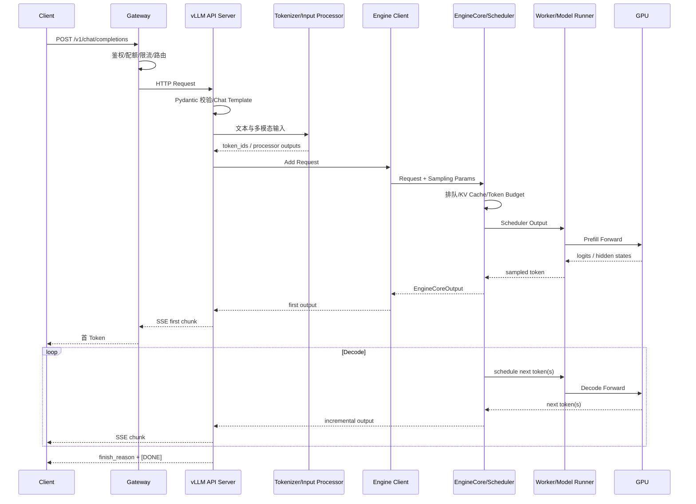

# 推理请求从 HTTP 到首个 Token 的完整生命周期

一次大模型请求看起来只是：

```bash
curl http://llm.example.com/v1/chat/completions
```

但在首 token 返回前，请求已经经过协议解析、Chat Template、Tokenization、排队、
KV Cache 分配、Prefill、采样和跨进程通信。

本文以 vLLM V1 的工程结构为主，重点解释稳定的请求阶段，不把内部类名当成永远不变的
API。

## 1. 完整路径

### 1.1 原有时序图



### 1.2 请求往返路径图

下面将同一过程拆成“请求下行”和“Token 返回”两条主线，并把 KV Cache、TP 与 NCCL 放在支撑位置。节点中直接给出当前阶段发生的动作，也可以点击阶段查看补充说明。原有时序图继续保留，用于对照精确的交互顺序。

<iframe
  className="architecture-map-frame"
  src="/diagrams/vllm-request-map.html"
  title="vLLM 请求从 API 到 GPU Kernel 和 SSE 返回的交互式架构图"
  loading="lazy"
></iframe>

从用户视角，关键时间点是：

```text
t0  客户端开始请求
t1  Gateway 接收完整请求
t2  vLLM API Server 接收请求
t3  Tokenization 完成
t4  请求进入 Scheduler
t5  开始 Prefill
t6  产生首 token
t7  客户端收到首个 SSE Chunk
t8  最后 token 产生
t9  客户端收到结束标记
```

## 2. 第一段：客户端与 HTTP

一个流式请求示例：

```json
{
  "model": "llama-70b",
  "messages": [
    {
      "role": "system",
      "content": "You are a helpful assistant."
    },
    {
      "role": "user",
      "content": "解释 RDMA 的数据路径"
    }
  ],
  "max_tokens": 512,
  "temperature": 0.7,
  "stream": true
}
```

在进入模型前，平台必须限制：

- HTTP Body 大小。
- 消息数量。
- 输入 token 上限。
- `max_tokens` 上限。
- `n`、`best_of` 等会放大计算的参数。
- 多模态对象数量和尺寸。
- 工具、JSON Schema 和 Guided Decoding 复杂度。

只限制请求 QPS 不足以保护 LLM。一个 100 token 请求和一个 100K token 请求的成本完全
不同。

## 3. 第二段：Gateway

Gateway 负责平台级策略：

```text
TLS 终止
→ 身份认证
→ 租户配额
→ 模型别名解析
→ 请求大小与 Token 预算检查
→ 负载感知路由
→ 超时和取消传播
→ 访问日志与 Trace Context
```

### 3.1 为什么不能只做轮询

两个 vLLM Pod 即使 GPU 型号相同，也可能有完全不同的状态：

| Pod | Running | Waiting | KV Cache | Prefix 命中 | 适合接收请求 |
| --- | ---: | ---: | ---: | ---: | --- |
| A | 32 | 20 | 95% | 高 | 不适合长请求 |
| B | 8 | 0 | 40% | 低 | 有容量 |

普通 Round Robin 看不到请求 token 成本、队列和 KV Cache。

### 3.2 必须传播的标识

建议入口生成：

```text
trace_id
request_id
tenant_class
model_alias
resolved_model_revision
workload_class
release_channel
```

`request_id` 放日志和 Trace，不放 Prometheus Label。

## 4. 第三段：OpenAI 兼容 API Server

vLLM API Server 通常负责：

- 路由 `/v1/chat/completions` 等 API。
- 解析和校验请求。
- 应用 Chat Template。
- 处理 Sampling 参数。
- 调用 Tokenizer 或输入处理器。
- 将请求交给 Engine Client。
- 将增量输出编码成 SSE。

### 4.1 Chat Template

`messages` 不能直接输入模型。它们会被模板渲染成模型训练时使用的格式，例如：

```text
<|system|>
You are a helpful assistant.
<|user|>
解释 RDMA 的数据路径
<|assistant|>
```

模板错误可能导致：

- 模型不遵循角色。
- 输出提前结束。
- 工具调用格式错误。
- 同一请求在不同后端输出差异巨大。

因此模型 Revision 应与 Tokenizer、Chat Template、Generation Config 一起版本化。

### 4.2 Sampling 默认值

部分模型仓库带 `generation_config.json`，可能覆盖采样默认值。生产环境应明确：

- 默认值来自平台还是模型仓库。
- 发布新模型时哪些参数变化。
- 请求参数、平台上限和模型默认值如何合并。

### 4.3 Tokenization

Tokenizer 把文本转成 Token ID：

```text
"GPU 网络" → [token_1, token_2, token_3, ...]
```

它通常运行在 CPU，可能成为瓶颈：

- 超长 Prompt。
- 大量并发请求。
- Python Tokenizer 性能不足。
- Chat Template 和 JSON Schema 处理复杂。
- 多模态预处理消耗 CPU。

如果 GPU 利用率低但请求在入口堆积，应检查 Tokenization 和前处理，而不是立即增加 GPU。

## 5. 第四段：Engine Client 与进程边界

生产架构通常把 HTTP Frontend 与 EngineCore 解耦：

```text
API Server Process
  └─ Engine Client
       ⇅ IPC / ZMQ
EngineCore Process
  ├─ Scheduler
  ├─ KVCacheManager
  └─ ModelExecutor
```

解耦的好处：

- Frontend 可以异步处理连接和流式输出。
- 核心调度循环减少被 HTTP 工作阻塞。
- Data Parallel 可以有多个 Engine Core Rank。
- Engine 崩溃和 Frontend 错误更容易区分。

需要监控：

- API Server Event Loop 延迟。
- IPC 队列和序列化时间。
- EngineCore 是否存活。
- Frontend 请求数与 Engine 请求数是否一致。

## 6. 第五段：请求进入 Scheduler

Scheduler 接收的不是原始字符串，而是已经处理的请求：

```text
request_id
prompt_token_ids
sampling_params
max_output_tokens
priority
arrival_time
LoRA / multimodal / structured-output metadata
```

核心工作：

1. 把新请求放入等待结构。
2. 查找可复用 Prefix Cache Block。
3. 根据 Token Budget 和 Sequence Budget 选择本轮请求。
4. 为新 token 分配 KV Cache Block。
5. 生成 Scheduler Output 交给 ModelExecutor。
6. 根据执行结果更新请求状态。

V1 的核心思想是按“本轮为每个请求调度多少 token”分配统一 Token Budget，而不是把
Prefill 和 Decode 固化为完全不同的调度器。

## 7. 第六段：KV Cache 分配

自回归生成时，每层 Attention 都需要保存历史 token 的 Key 和 Value。

如果没有 KV Cache，每生成一个新 token 都要重新计算所有历史 token。

vLLM 将 KV Cache 划分为 Block：

```text
Request A logical tokens
  [0..15] [16..31] [32..47]
      ↓       ↓        ↓
Physical KV Blocks
    #41     #08      #77
```

逻辑 token 可以映射到不连续的物理 Block，类似操作系统分页。这就是 PagedAttention
名称的来源之一。

调度请求前需要判断：

- 已命中多少 Prefix Cache。
- 新 token 需要多少 Block。
- 当前空闲 Block 是否足够。
- 是否需要抢占请求。
- 请求的最大长度是否超过容量或配置上限。

KV Cache 不足可能表现为排队或抢占，并不一定触发 CUDA OOM。

## 8. 第七段：Prefill

Prefill 一次处理 Prompt 中尚未缓存的多个 token：

```text
Prompt Tokens
→ Embedding
→ 多层 Transformer Forward
→ 为每层生成 K/V
→ 写入 KV Cache
→ 得到最后位置 logits
```

特点：

- 并行处理多个 token。
- 矩阵乘法规模较大。
- 通常更偏计算密集。
- 输入越长，TTFT 越容易上升。
- TP 下包含多次 Collective Communication。

如果 Prefix Cache 命中一部分 Prompt，只需计算未命中的后缀。

### 8.1 首 token 何时产生 {/* #首-token-何时产生 */}

Prefill 得到最后位置的 logits 后，Sampler 根据：

```text
temperature
top_p
top_k
repetition penalty
guided decoding mask
```

选出第一个输出 token。

注意：

```text
Engine 产生首 token
≠ API Server 发出首 SSE Chunk
≠ 客户端收到首字节
```

三者之间还可能有 IPC、序列化、代理 Buffer 和网络延迟。

## 9. 第八段：SSE 首 Token

流式响应通常使用 Server-Sent Events：

```text
data: {"choices":[{"delta":{"content":"R"}}]}

data: {"choices":[{"delta":{"content":"DMA"}}]}

data: [DONE]
```

代理必须：

- 禁止把流式 Chunk 长时间缓冲。
- 设置长于正常生成时间的上游超时。
- 及时 Flush。
- 在客户端断开时把取消信号传到后端。
- 限制单连接最长时间和输出量。

如果 Engine TTFT 正常，但客户端 TTFT 很慢，重点检查：

- Nginx/Envoy Buffer。
- Gateway 到 Client 的网络。
- TLS 和连接复用。
- API Server Event Loop。
- SSE 序列化与 Flush。

## 10. 第九段：Decode 循环

产生首 token 后进入 Decode：

```text
上一 token
→ 读取历史 KV Cache
→ 单步 Transformer Forward
→ 生成下一 token
→ 将新 K/V 追加到 Cache
→ 采样
→ 流式返回
```

每次只为每个 Sequence 生成少量 token，但要读取大量模型权重和历史 KV Cache。

特点：

- 单步计算规模较小。
- 反复读取权重和 KV。
- 通常更偏显存带宽和调度效率。
- 多个请求一起 Decode 才能形成有效 Batch。
- TP/PP/EP 通信延迟对每一步都可能产生影响。

TPOT/ITL 主要反映 Decode 阶段体验。

## 11. 第十段：完成、取消和异常

请求可能因为以下原因结束：

```text
EOS token
达到 max_tokens
命中 stop token/string
工具调用或结构化输出结束
客户端取消
服务端超时
后端错误
实例退出
```

完成后需要：

1. 生成 `finish_reason`。
2. 发送最后 SSE Chunk 和结束标记。
3. 释放请求持有的 KV Block。
4. 更新 Prefix Cache 可复用状态。
5. 记录 usage、延迟和结果。
6. 结束 Trace Span。

客户端取消必须传播到 Engine，否则 GPU 仍会为没人接收的请求生成 token。

## 12. 延迟分解

端到端 TTFT：

```text
TTFT_client =
  gateway_wait
  + request_parse
  + chat_template
  + tokenize
  + engine_ipc
  + scheduler_queue
  + prefill
  + first_sample
  + response_encode
  + proxy_flush
  + network_to_client
```

vLLM 内部 TTFT 与 Gateway/客户端 TTFT 的起点和终点可能不同，必须在指标文档中写清。

端到端完成时间：

```text
E2E =
  TTFT
  + decode_duration
  + final_flush
```

近似：

```text
decode_duration ≈ output_tokens × average_ITL
```

## 13. Trace 设计

建议 Span：

```text
llm.request
  ├─ gateway.auth
  ├─ gateway.admission
  ├─ gateway.route
  ├─ api.validate
  ├─ api.chat_template
  ├─ api.tokenize
  ├─ engine.queue
  ├─ engine.prefill
  ├─ engine.first_sample
  ├─ engine.decode
  └─ api.stream
```

低基数属性：

```text
llm.model_family
llm.model_revision
llm.stream
llm.workload_class
llm.finish_reason
server.pod.uid
server.gpu.pool
```

敏感或高基数字段不进入指标：

- Prompt 原文。
- 完整输出。
- 用户 ID。
- Request ID Label。

## 14. 指标与阶段映射

| 阶段 | 指标 |
| --- | --- |
| Gateway | 请求率、拒绝率、active、upstream time |
| Tokenization | Tokenize duration、输入 token |
| Queue | `request_queue_time_seconds`、waiting |
| Prefill | `request_prefill_time_seconds`、prompt tokens |
| 首 token | `time_to_first_token_seconds` |
| Decode | `request_decode_time_seconds`、ITL/TPOT |
| KV Cache | usage、prefix hits、preemption |
| 完成 | request success、finish reason、stream completed |

生产指标名称随版本可能变化，应以运行实例 `/metrics` 和官方 Production Metrics 为准。

## 15. 五类常见问题

### 15.1 Gateway 快，vLLM Queue 慢

症状：入口无等待，`request_queue_time` 上升。

检查：容量、Token Budget、KV Cache、长请求干扰和实例路由。

### 15.2 Queue 正常，Prefill 慢

检查：输入长度、Prefix Cache、GPU 时钟、TP 通信、Kernel 和量化实现。

### 15.3 Engine TTFT 正常，客户端 TTFT 慢

检查：API Server、SSE Buffer、Gateway Flush 和客户端网络。

### 15.4 首 Token 正常，TPOT 变差

检查：Decode Batch、GPU 带宽、NCCL、抢占和同时运行的长 Prefill。

### 15.5 客户端断开但 GPU 仍繁忙

检查：取消传播、反向代理是否感知断连、Engine 是否 abort request。

## 16. 实验

### 16.1 实验 1：对齐时间点 {/* #实验-1对齐时间点 */}

同时记录：

- Client curl timing。
- Gateway access log。
- vLLM 请求指标。
- Trace Span。

确认 `t0～t9` 能在一条请求上对齐。

### 16.2 实验 2：代理缓冲 {/* #实验-2代理缓冲 */}

故意启用和关闭代理 Buffer，比较：

- Engine TTFT。
- Gateway 首字节时间。
- Client TTFT。

### 16.3 实验 3：取消传播 {/* #实验-3取消传播 */}

1. 发起长输出流式请求。
2. 收到若干 token 后关闭客户端。
3. 观察 Running Request 和 GPU 工作是否快速下降。

### 16.4 实验 4：CPU 前处理瓶颈 {/* #实验-4cpu-前处理瓶颈 */}

增加长 Prompt 并限制 API Server CPU，观察 Tokenize 时间与 GPU 空闲。

## 17. 验收清单

- [ ] 能画出 Gateway 到 GPU 再回到客户端的路径。
- [ ] 能区分 Gateway、API Server、EngineCore 和 Worker。
- [ ] 能解释 Chat Template 与 Tokenization。
- [ ] 能解释 Scheduler 和 KV Cache 在 Prefill 前做什么。
- [ ] 能区分 Engine 首 token、SSE 首 Chunk 和客户端首字节。
- [ ] 能分解 TTFT 和 E2E。
- [ ] 能验证客户端取消是否传播到 Engine。
- [ ] 能用 Trace 判断延迟发生在哪一段。

## 18. 官方资料

- [vLLM OpenAI-Compatible Server](https://docs.vllm.ai/en/stable/serving/openai_compatible_server.html)
- [vLLM V1 Engine Core API](https://docs.vllm.ai/en/stable/api/vllm/v1/engine/core/)
- [vLLM Production Metrics](https://docs.vllm.ai/en/stable/usage/metrics/)

下一篇将进入 GPU 内部，建立 Prefill、Decode、KV Cache、TTFT 和 TPOT 的资源模型。
