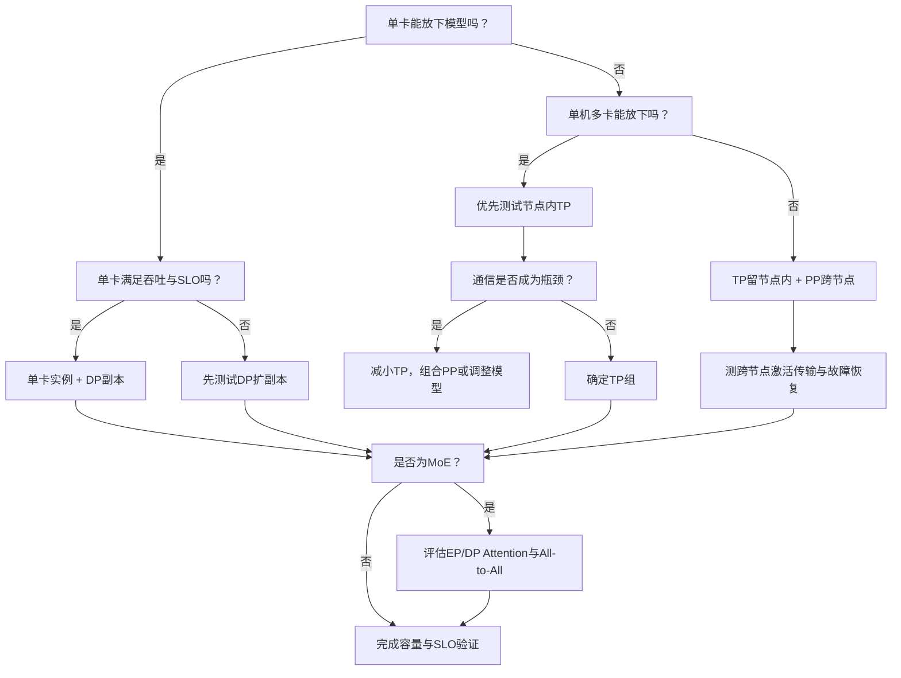

# TP、PP、DP、EP 与 MoE 推理并行策略

多 GPU 推理的核心不是“把 GPU 数量写大”，而是决定三件事：

1. 模型权重如何分布。
2. 请求如何分布。
3. 每生成一个 token 要发生哪些通信。

常见策略：

```text
TP：切层内张量
PP：切模型层
DP：复制模型、切请求
EP：切 MoE Expert
```

它们可以组合，但组合后 GPU 数、显存、网络和故障域必须重新计算。

## 1. 先建立单卡基线

优先判断：

```text
模型是否能在单卡放下？
单卡是否满足 TTFT/TPOT？
单卡在目标并发下吞吐是多少？
```

如果单卡已经满足容量和 SLO，增加模型并行可能只会引入通信和故障复杂度。

多卡的主要原因：

- 权重单卡放不下。
- KV Cache 需要更多空间。
- 单卡算力或带宽不足。
- 需要更高吞吐或更多副本。
- MoE Expert 总权重过大。

## 2. Tensor Parallel

TP 在同一 Transformer 层内部切分矩阵。

简化示意：

```text
Linear Weight W
┌───────────────┐
│ shard 0       │ → GPU 0
├───────────────┤
│ shard 1       │ → GPU 1
├───────────────┤
│ shard 2       │ → GPU 2
├───────────────┤
│ shard 3       │ → GPU 3
└───────────────┘
```

每张 GPU 计算局部结果，再通过 Collective Communication 合并。

### 2.1 TP 的通信

不同层和实现会使用：

- All-Reduce。
- All-Gather。
- Reduce-Scatter。

这些通信发生在很多 Transformer 层、很多 Decode Step 中，因此低延迟和高带宽非常重要。

### 2.2 TP 的显存

Dense 模型权重近似：

```text
weight_per_gpu ≈ total_weight / TP
```

还要加：

- 部分不切分参数。
- KV Cache。
- 激活和临时 Buffer。
- NCCL Buffer。
- CUDA Graph。

KV Cache 是否按 TP 等比例下降，取决于 KV Head、GQA/MQA 和实现的切分方式。

### 2.3 TP 的优点

- 单卡放不下的模型可以在多卡运行。
- 每层计算由多卡承担。
- 单机 NVLink/NVSwitch 环境通常较合适。

### 2.4 TP 的代价

- 每个请求占用整个 TP Group。
- 每个 Decode Step 反复通信。
- TP 越大，单卡计算越小，通信占比可能越高。
- 任意 Rank 失败会影响整个实例。

### 2.5 命令示例

```bash
vllm serve /models/llama \
  --tensor-parallel-size 4
```

参数以当前 `vllm serve --help` 为准。

## 3. Pipeline Parallel

PP 按层切分模型：

```text
GPU 0: Layer 0  - 19
GPU 1: Layer 20 - 39
GPU 2: Layer 40 - 59
GPU 3: Layer 60 - 79
```

激活从一个 Stage 传到下一个 Stage。

### 3.1 PP 的通信

主要是相邻 Stage 之间的点对点激活传输，不需要每层都做全组 All-Reduce。

### 3.2 PP 的 Bubble

单个 Microbatch：

```text
时间 →
Stage 0: [work][idle][idle][idle]
Stage 1: [idle][work][idle][idle]
Stage 2: [idle][idle][work][idle]
Stage 3: [idle][idle][idle][work]
```

多个 Microbatch 可以填充流水线，但在线 Decode 的请求形态、动态 Batch 和单步依赖会让
流水线利用率比理想离线场景复杂。

### 3.3 PP 的优点

- 模型可以跨节点按层放置。
- 某些没有 NVLink 的不均衡 GPU 环境更实用。
- 通信模式与 TP 不同。

### 3.4 PP 的代价

- Pipeline Bubble。
- Stage 负载不均。
- 首尾 Stage 可能有额外工作。
- 单请求需要经过全部 Stage。
- 任意 Stage 故障导致整个实例失败。

### 3.5 TP + PP

8 GPU：

```bash
vllm serve /models/llama \
  --tensor-parallel-size 4 \
  --pipeline-parallel-size 2
```

常见 GPU 总数：

```text
model_parallel_gpus = TP × PP
```

## 4. Data Parallel

DP 复制模型，每个 Replica/Rank 处理不同请求批次：

```text
Request Group A → Replica 0 → GPU 0
Request Group B → Replica 1 → GPU 1
Request Group C → Replica 2 → GPU 2
Request Group D → Replica 3 → GPU 3
```

### 4.1 DP 的显存

每个 DP Replica 都有一份模型：

```text
total_cluster_weight_memory ≈
  model_weight × DP
```

如果每个 Replica 内部还使用 TP：

```text
per_gpu_weight ≈ model_weight / TP
total_gpus = DP × TP
```

PP 组合时：

```text
total_gpus = DP × TP × PP
```

### 4.2 DP 的优点

- 独立请求可以并行处理。
- 吞吐较容易横向扩展。
- 一个 Replica 故障可由其他 Replica 承接。
- 每个 Replica 有独立 Continuous Batch。

### 4.3 DP 的代价

- 模型权重重复。
- 每个 Replica KV Cache 独立。
- Prefix Cache 不能天然跨 Replica 共享。
- 负载均衡质量决定实际利用率。
- MoE DP/EP 组合可能需要额外协调。

### 4.4 vLLM 内部与外部负载均衡

当前 vLLM Data Parallel 支持不同部署方式：

- 一个入口，由内部机制分配到 DP Rank。
- 每个 Rank 独立暴露，由外部 Gateway 负载均衡。
- Node-local 或混合模式。

选择时比较：

| 方式 | 优点 | 代价 |
| --- | --- | --- |
| 内部 LB | 部署简单、单入口 | 路由策略与平台 Gateway 解耦较弱 |
| 外部 LB | 可结合租户、队列、Prefix、故障域 | 需要状态采集和可靠路由 |

### 4.5 命令示例

```bash
vllm serve /models/llama \
  --data-parallel-size 4
```

DP=4、TP=2：

```bash
vllm serve /models/llama \
  --data-parallel-size 4 \
  --tensor-parallel-size 2
```

总共通常需要 8 GPU。

## 5. Expert Parallel

MoE 模型每层有多个 Expert，但每个 token 只路由到少量 Expert：

```text
Token
→ Router
→ Top-K Experts
→ Expert Output
→ Combine
```

EP 把 Expert 分布到不同 GPU：

```text
GPU 0: Expert 0, 4
GPU 1: Expert 1, 5
GPU 2: Expert 2, 6
GPU 3: Expert 3, 7
```

### 5.1 EP 的通信

Token 要被发送到 Expert 所在 Rank，计算后再返回：

```text
Token Dispatch  → All-to-All 类通信
Expert Compute
Token Combine   → All-to-All 类通信
```

EP 对网络带宽、延迟、拓扑和负载均衡非常敏感。

### 5.2 当前 vLLM 的 EP 关系

在当前官方部署说明中，启用 Expert Parallel 后，EP Group 常按以下关系形成：

```text
EP size = TP size × DP size
```

Attention 层和 Expert 层可以采用不同的并行方式。该能力仍在快速演进，命令、后端和
默认值必须以目标版本为准。

### 5.3 Expert 负载不均

真实请求可能偏向少数热门 Expert：

```text
GPU 0 Expert Queue 很长
GPU 1/2/3 相对空闲
```

结果：

- All-to-All 等待最慢 Rank。
- 整体 TPOT 上升。
- 平均 GPU 利用率无法反映热点。

需要监控每 Expert/Rank：

- Token 数。
- 执行时间。
- Dispatch/Combine 通信。
- GPU 利用率。
- 队列和负载均衡度。

### 5.4 EPLB 与冗余 Expert

Expert Parallel Load Balancing 可根据热点重新放置或增加冗余 Expert，但会消耗额外
显存。不能在 KV Cache 已经紧张时盲目增加冗余。

### 5.5 命令示例

```bash
vllm serve /models/moe \
  --data-parallel-size 8 \
  --tensor-parallel-size 1 \
  --enable-expert-parallel
```

EP 和 All-to-All Backend 属于版本敏感配置，生产前必须验证。

## 6. 四种策略对比

| 维度 | TP | PP | DP | EP |
| --- | --- | --- | --- | --- |
| 切分对象 | 层内张量 | 模型层 | 请求/Batch | MoE Expert |
| 权重是否复制 | 组内切分 | 组内切分 | Replica 间复制 | Expert 切分，其他层视组合而定 |
| 主要通信 | Collective | Stage P2P | 通常请求独立；MoE 例外 | All-to-All 类 |
| 解决单卡放不下 | 是 | 是 | 否 | MoE Expert 是 |
| 横向吞吐 | 有限 | 有限 | 强 | 依模型和路由 |
| 网络要求 | 很高 | 中到高 | 外部请求网络 | 很高 |
| 单 Rank 故障 | 整组失败 | 整组失败 | 其他 Replica 可用 | EP 组失败 |
| 典型场景 | 单机 NVLink | 跨节点/不均衡切层 | 多副本在线服务 | 大型 MoE |

## 7. 拓扑映射

常见原则：

```text
TP 尽量放在同一 NVLink/NVSwitch 域
PP 可以跨节点，但要测 Stage 间链路
DP Replica 分散到不同故障域
EP 优先使用高带宽、低拥塞互联
```

### 7.1 单机 8 卡

若 8 卡全互联：

```text
方案 A: TP=8
方案 B: TP=4, DP=2
方案 C: TP=4, PP=2
```

如何选：

- 模型权重必须 8 卡切分：A。
- 4 卡可放下，希望吞吐更高：B。
- TP=8 通信效率差或需要按层切分：测试 C。

### 7.2 两机各 8 卡

常见起点：

```text
TP=8, PP=2
```

TP 留在单节点高速互联域，PP 跨节点。

也可以测试 TP=16，但每层 Collective 跨机，网络压力很大。

### 7.3 DP 故障域

如果两个 Replica 都在同一节点：

```text
节点故障 → 两个 Replica 同时消失
```

应使用 Pod Anti-Affinity、Topology Spread 和节点池，让可替代 Replica 跨节点/机架/区域
分布，同时考虑模型数据位置和冷启动成本。

## 8. 选型决策树



## 9. 性能模型

### 9.1 TP {/* #tp */}

```text
step_time ≈
  local_compute(TP)
  + collective_latency(TP, topology)
```

TP 增大时，计算下降但通信未必同比下降。

### 9.2 PP {/* #pp */}

```text
latency ≈
  Σ stage_compute
  + Σ activation_transfer
  + bubble
```

### 9.3 DP {/* #dp */}

理想吞吐：

```text
throughput ≈ single_replica_throughput × DP
```

实际受：

- 负载不均。
- Prefix Cache 分散。
- Gateway。
- 共享存储/网络。
- GPU 频率和硬件差异。

### 9.4 EP {/* #ep */}

```text
step_time ≈
  attention
  + token_dispatch
  + slowest_expert_compute
  + token_combine
```

最热 Expert 和最慢网络 Rank 往往决定尾延迟。

## 10. 监控

### 10.1 每个实例/DP Rank {/* #每个实例dp-rank */}

- waiting/running。
- TTFT/TPOT。
- KV Cache。
- Prefix Cache。
- Prompt/Generation tokens/s。

### 10.2 每个 GPU/TP/PP Rank {/* #每个-gputppp-rank */}

- SM/Tensor/Memory Utilization。
- 显存。
- 功耗、时钟、温度。
- PCIe/NVLink 带宽和错误。
- NCCL Collective Duration。

### 10.3 EP {/* #ep-1 */}

- Tokens per Expert。
- Expert Busy Time。
- Dispatch/Combine Bytes。
- All-to-All Duration。
- Load Balance Skew。

不要只看所有 GPU 的平均利用率。一个慢 Rank 会让其他 Rank 在 Collective 中等待。

## 11. 故障模式

### 11.1 TP 单 Rank 变慢 {/* #tp-单-rank-变慢 */}

症状：

- 整组 TPOT 变慢。
- 其他 GPU 利用率下降或等待。
- Collective 时间上升。

检查：

- GPU 时钟/温度/Xid。
- PCIe/NVLink 降链。
- NUMA/NIC 拓扑。
- NCCL 日志。

### 11.2 PP Stage 不均 {/* #pp-stage-不均 */}

症状：某 Stage 长期忙，其他 Stage 空闲。

处理：重新切层、检查不同层计算量、量化和设备差异。

### 11.3 DP 路由倾斜 {/* #dp-路由倾斜 */}

症状：单 Replica waiting/KV 很高，其他 Replica 空闲。

处理：检查粘性路由、Prefix Cache 策略、连接复用和 Endpoint 权重。

### 11.4 EP 热点 {/* #ep-热点 */}

症状：少数 Expert Rank 满载，All-to-All 尾延迟高。

处理：检查输入分布、Expert Token 计数、EPLB 和冗余 Expert 显存。

## 12. 压测矩阵

固定 8 GPU：

| Case | TP | PP | DP | 目的 |
| --- | ---: | ---: | ---: | --- |
| A | 8 | 1 | 1 | 最大节点内模型切分 |
| B | 4 | 1 | 2 | 两个 4 卡 Replica |
| C | 2 | 1 | 4 | 更高 DP |
| D | 4 | 2 | 1 | 比较 PP |

每组记录：

- 是否能加载。
- 每卡权重/KV/总显存。
- TTFT/TPOT/E2E。
- Prompt/Generation tokens/s。
- Collective/P2P 时间。
- GPU 间负载差。
- 单 Rank/节点故障影响。
- 冷启动和恢复时间。

MoE 另外比较：

```text
TP only
DP + TP
DP + EP
DP + EP + EPLB
```

## 13. Kubernetes 部署约束

一个模型并行实例的 Rank 必须作为一个整体调度：

- Gang Scheduling。
- GPU/NIC 拓扑。
- 同机或跨机放置。
- HostNetwork/RDMA Device。
- 模型文件一致。
- 镜像和依赖一致。

需要记录：

```text
instance_id
rank
tp_group
pp_stage
dp_rank
ep_rank
node
gpu_uuid
nic
```

任何请求应能追踪到完整 Rank 拓扑。

## 14. 验收清单

- [ ] 能解释 TP、PP、DP、EP 分别切什么。
- [ ] 能计算常见组合的 GPU 数。
- [ ] 能说明各策略的主要通信。
- [ ] 能解释 DP 为什么不能解决单副本放不下。
- [ ] 能解释 EP 的 Token Dispatch 和 All-to-All。
- [ ] 能把 TP 映射到 NVLink 域，把 DP 映射到故障域。
- [ ] 能设计并行策略压测矩阵。
- [ ] 能根据 Rank 指标定位慢卡、路由倾斜和 Expert 热点。

## 15. 官方资料

- [vLLM Parallelism and Scaling](https://docs.vllm.ai/en/stable/serving/parallelism_scaling/)
- [vLLM Data Parallel Deployment](https://docs.vllm.ai/en/stable/serving/data_parallel_deployment/)
- [vLLM Expert Parallel Deployment](https://docs.vllm.ai/en/latest/serving/expert_parallel_deployment/)

下一篇进入模型实例之前的控制层：怎样让 Gateway 根据请求 token 成本、队列、KV Cache
和 SLO 做准入、路由、限流与过载保护。
