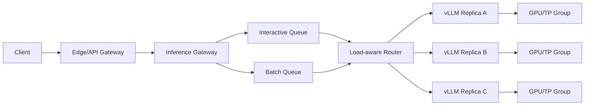

# 推理网关、准入控制与过载保护

普通 API Gateway 常按 QPS、连接数和 HTTP 状态码管理流量。

LLM 请求成本还取决于：

```text
输入 Token
输出 Token 上限
当前 Prefix Cache 命中
模型大小
TP/PP/EP 策略
结构化输出和工具调用
多模态输入
```

如果只限制 QPS：

```text
100 个 input=32, output=32 的请求
```

和：

```text
100 个 input=32K, output=4K 的请求
```

会被视为相同负载，但 GPU 时间、KV Cache 和连接占用完全不同。

---

## 1. 网关在推理架构中的位置



职责建议分层：

| 层 | 职责 |
| --- | --- |
| Edge Gateway | TLS、WAF、认证、基础 HTTP 限制 |
| Inference Gateway | 模型解析、Token 估算、配额、准入、队列和推理路由 |
| Model Server | Continuous Batching、KV Cache、GPU 执行 |
| Autoscaler | 根据队列、运行请求和容量扩缩 |

可以部署成一个组件，但逻辑职责仍要区分。

---

## 2. 请求成本模型

准入前不可能精确知道输出长度，但可以估算上界和期望成本。

### 2.1 基础字段

```text
input_tokens
requested_max_output_tokens
model
service_tier
stream
multimodal_units
structured_output_complexity
```

### 2.2 简化成本

```text
prefill_cost =
  uncached_input_tokens × model_prefill_cost_per_token

decode_cost =
  expected_output_tokens × model_decode_cost_per_token

kv_reservation =
  (input_tokens + reserved_output_tokens)
  × kv_bytes_per_token
```

总成本可以归一化为 Token Unit：

```text
request_cost_units =
  α × uncached_input_tokens
  + β × reserved_output_tokens
  + γ × multimodal_units
```

其中 α、β、γ 必须通过基准测试标定。

### 2.3 为什么不总按 `max_tokens` 全额预留

如果所有请求都按最大输出完全预留：

- 容量利用率可能很低。
- 用户设置大上限但实际短输出会浪费配额。

如果完全不预留：

- 运行中请求增长后 KV Cache 可能耗尽。
- 大量请求同时进入导致抢占。

折中方式：

```text
hard limit      = 请求允许的最大输出
admission reserve = P95 实际输出或分层保证值
runtime growth  = 每个 Step 继续申请，超过水位时降级/停止
```

高优先级请求可以获得更高保证，Batch 流量使用更保守策略。

---

## 3. 准入控制

准入控制回答：

> 这个请求现在进入系统后，能否在承诺 SLO 内完成，同时不破坏已有请求？

### 3.1 前置校验

- 模型存在且租户有权限。
- 输入和多模态尺寸合法。
- `input + max_output` 不超过模型上下文。
- 参数不会放大超过平台上限。
- 请求 deadline 足够完成最低服务。

### 3.2 容量校验

```text
inflight_cost + request_reserve <= tenant_capacity
global_inflight_cost + request_reserve <= pool_capacity
queue_wait_estimate <= request_deadline - service_time_estimate
```

### 3.3 Token Bucket

租户可以有两类 Bucket：

```text
request bucket
token/cost bucket
```

伪代码：

```python
def admit(req, tenant, pool):
    cost = estimate_cost(req)

    if not tenant.request_bucket.try_take(1):
        return reject(429, "tenant_request_rate")

    if not tenant.cost_bucket.try_take(cost):
        return reject(429, "tenant_token_budget")

    if pool.queue_cost + cost > pool.max_queue_cost:
        tenant.refund(cost)
        return reject(503, "pool_overloaded")

    return enqueue(req, cost)
```

需要处理：

- 请求取消后的配额返还。
- 实际输出少于预留的结算。
- 重试不能重复扣费。
- 幂等键。
- 多网关实例间的原子配额。

---

## 4. 为什么队列必须有界

无界队列不会增加实际容量，只会把错误变成长时间等待。

使用 Little 定律：

```text
L = λW
```

- `L`：系统平均请求数。
- `λ`：平均到达率。
- `W`：平均停留时间。

如果服务能力为 10 req/s，流量长期为 12 req/s：

```text
每秒净增加 2 个请求
1 分钟后增加 120 个
5 分钟后增加 600 个
```

扩容无法及时完成时，TTFT 会不断上升，最终所有请求都超时。

### 4.1 队列边界

不能只按请求数：

```text
max_queue_requests
max_queue_input_tokens
max_queue_reserved_tokens
max_queue_cost_units
max_queue_wait
```

任一达到上限都应拒绝或降级。

### 4.2 Deadline-aware

如果：

```text
estimated_queue_wait + estimated_service_time > client_deadline
```

请求即使入队也大概率超时，应尽早失败。

早拒绝的好处：

- 客户端可以选择其他模型或区域。
- 不浪费 Queue/KV/连接资源。
- 不让无望请求阻塞后续请求。

---

## 5. 队列隔离

建议至少区分：

```text
interactive-high
interactive-standard
batch
```

隔离方式：

- 不同逻辑队列。
- 不同实例池。
- 不同模型 Alias。
- 不同最大 Context/Output。
- 不同 Token Bucket。
- 不同 SLO。

### 加权公平

简单 Weighted Fair Queuing 思路：

```text
high     weight 8
standard weight 4
batch    weight 1
```

但每个 Queue 仍需硬上限，防止高优先级无限占用。

### 防止饥饿

- 最大排队时间。
- Aging：等待越久有效优先级越高。
- 为低优先级保留少量服务份额。
- Batch 在低峰使用独立容量。

---

## 6. 负载感知路由

Round Robin 只适合成本相近、实例状态相近的请求。

LLM Router 可考虑：

```text
waiting requests
running requests
queued token cost
KV Cache usage
estimated completion time
Prefix Cache locality
model revision
GPU topology
recent error/TTFT
release channel
```

### 6.1 一个示例分数

```text
score(endpoint, request) =
  w1 × normalized_queue_cost
  + w2 × normalized_kv_usage
  + w3 × predicted_wait
  + w4 × recent_error_penalty
  + w5 × topology_penalty
  - w6 × prefix_cache_affinity
```

选择分数最低的健康 Endpoint。

权重不是拍脑袋配置，应使用压测和生产 Trace 标定。

### 6.2 Prefix Cache 与负载的冲突

把相同 Prefix 请求路由到同一实例：

- 提高缓存命中。
- 降低 Prefill 成本。

但可能：

- 单实例热点。
- KV Cache 水位过高。
- 故障时大量缓存同时失效。

策略：

```text
如果目标实例预测等待 < 阈值：
  优先 Prefix Locality
否则：
  选择更空闲实例
```

### 6.3 状态新鲜度

路由使用的 Endpoint 状态必须有时间戳：

```text
now - sample_time <= 2 × update_interval
```

状态过期时应降权或从候选集中移除，不能用旧的 KV/Queue 数据继续路由。

---

## 7. 超时设计

LLM 流式请求需要多个超时：

```text
connect_timeout
request_header_timeout
request_body_timeout
queue_timeout
time_to_first_token_timeout
inter_token_timeout
max_stream_duration
idle_timeout
```

### 7.1 TTFT Timeout

首 token 前可以：

- 取消后端请求。
- 在满足幂等和预算条件时换实例。
- 回退到小模型。

### 7.2 Inter-token Timeout

首 token 后，如果长时间没有新 Chunk：

- 不能假装流还健康。
- 需要终止连接并记录 `stream_interrupted`。
- 通常不能透明切到另一个实例继续生成相同内容。

### 7.3 超时层级

应满足：

```text
client_deadline
> edge_gateway_timeout
> inference_gateway_timeout
> backend_deadline
```

并预留错误返回和清理时间。否则下游仍计算时，上游已经断开。

---

## 8. 取消传播

取消路径：

```text
Client disconnect
→ Edge Gateway detects close
→ Inference Gateway cancels upstream
→ API Server aborts request
→ Engine removes waiting/running request
→ KV Block released
```

必须验证：

- Waiting 请求立即出队。
- Running 请求在安全边界停止。
- KV Cache 回收。
- Token 配额结算。
- Trace 标记为 client_cancelled。
- 不把客户端取消全部算成服务错误。

如果 TTFT 过慢导致客户端取消，仍可能是服务 SLO bad event。

---

## 9. 重试

LLM 重试成本高，且可能产生重复输出。

### 9.1 可以考虑重试

- 请求尚未发送到后端。
- 连接建立失败。
- 首字节前后端明确拒绝。
- 请求有幂等键。
- 剩余 Deadline 足够。
- 重试预算未耗尽。

### 9.2 不应透明重试

- 已向客户端发出首 token。
- 工具调用可能已产生外部副作用。
- 后端是否执行不明确。
- 请求输出具有随机性且业务要求一致。
- 系统整体过载。

### 9.3 Retry Budget

```text
retry_rate <= original_request_rate × retry_budget_ratio
```

例如最大 5%。服务过载时应减少重试，而不是让重试风暴加倍流量。

使用指数退避和抖动，但流式在线请求通常更适合快速失败或明确回退。

---

## 10. Load Shedding

过载时按成本和优先级丢弃工作：

```text
先拒绝新的 Batch 请求
→ 限制低优先级长 Context
→ 降低最大输出
→ 禁止高成本功能
→ 回退小模型/量化模型
→ 保护核心交互流量
```

### HTTP 状态

| 状态 | 含义示例 |
| --- | --- |
| 429 | 租户配额、速率或请求级限制 |
| 503 | 服务池当前容量不足或不可用 |
| 504 | 上游在期限内没有完成 |

响应建议包含：

```json
{
  "error": {
    "type": "capacity_rejected",
    "reason": "queue_cost_limit",
    "retryable": true,
    "retry_after_ms": 1500
  }
}
```

不要泄露内部节点、Pod 或模型文件路径。

---

## 11. 降级阶梯

预先定义：

| Level | 触发 | 动作 |
| --- | --- | --- |
| L0 | 正常 | 完整服务 |
| L1 | Queue/TTFT 接近 SLO | 限制 Batch，启动预热容量 |
| L2 | Fast Burn | 限制长上下文和大输出 |
| L3 | 容量严重不足 | 回退小模型或备用区域 |
| L4 | 核心池故障 | 仅保留关键租户和健康模型 |

降级要满足：

- 客户端知道实际模型或能力发生变化。
- 不在不同模型间无提示切换语义。
- 有恢复阈值和冷却，避免振荡。
- 每次降级进入审计和指标。

---

## 12. 自动扩缩容

### 12.1 为什么 GPU 利用率不够

GPU 利用率高可能是正常满载；利用率低也可能是：

- Tokenization 堵塞。
- TP Rank 等待。
- 路由倾斜。
- 请求太少但 TTFT 已很好。

更适合的信号：

- waiting requests。
- queued token/cost units。
- request queue time。
- TTFT Burn Rate。
- running requests。
- KV Cache usage。
- Prompt/Generation token rate。

### 12.2 需要考虑冷启动延迟

```text
scale_reaction_time =
  metrics_delay
  + autoscaler_poll
  + scheduling
  + image_pull
  + volume/model_load
  + H2D
  + warmup
  + readiness
```

如果完整冷启动 8 分钟，而队列 30 秒后就超过 SLO，HPA 无法拯救当前突发。

需要：

- 最小预热副本。
- 预测扩容。
- 节点模型缓存。
- 已准备 GPU 节点。
- 有界队列和 Load Shedding。

### 12.3 KEDA/KServe 思路

KServe 可通过 KEDA 使用 Prometheus/OpenTelemetry 的 LLM 指标扩缩容。

示意查询：

```promql
sum(vllm:num_requests_waiting)
/
clamp_min(count(vllm:num_requests_waiting), 1)
```

不要把示例阈值直接用于生产。需要用单副本饱和测试确定：

```text
target_waiting_per_replica
target_running_per_replica
max_kv_watermark
scale_up_step
scale_down_stabilization
```

### 12.4 Scale Down

缩容流程：

```text
停止接收新请求
→ Endpoint 标记 draining
→ 等待已有 SSE 完成
→ 达到最大 Drain Deadline
→ 取消剩余请求并记录
→ 终止实例
```

直接删除 Pod 会中断长流式请求。

---

## 13. 过载曲线

压测应找出四个区间：

```text
低负载区：延迟稳定，GPU 未充分利用
高效区：吞吐提高，SLO 满足
排队区：吞吐增长放缓，TTFT 快速上升
崩溃区：超时、重试、抢占和错误互相放大
```

理想准入上限位于“高效区末端”，不是崩溃点。

需要画：

```text
x = offered load / token arrival rate
y1 = accepted throughput
y2 = TTFT P99
y3 = TPOT P99
y4 = rejection rate
y5 = KV usage
y6 = queue length
```

---

## 14. SLO 与过载保护

关键 SLO：

- 请求完成率。
- TTFT 达标率。
- TPOT 达标率。
- 流式完整率。

过载保护结果分类：

```text
quota_rejected
capacity_rejected
deadline_rejected
backend_unavailable
stream_interrupted
success
```

平台容量不足拒绝正常流量通常是 SLO bad event；不能因为返回了“设计中的 503”就把它从
分母删除。

Load Shedding 的价值是：

- 保护已接受请求。
- 防止整个系统雪崩。
- 限制影响范围。

它不等于把容量错误从可靠性指标中隐藏。

---

## 15. 监控

### Gateway

```text
admission_total{result,reason,tier,model}
queue_requests{queue,model}
queue_cost_units{queue,model}
queue_wait_seconds
route_decisions_total{reason}
backend_state_age_seconds
retry_total{reason}
client_cancellation_total
stream_active
stream_interrupted_total
```

### Model Server

```text
running
waiting
request_queue_time
TTFT
TPOT/ITL
KV Cache
preemption
prefix cache
prompt/generation tokens
```

### Autoscaler

```text
desired_replicas
ready_replicas
pending_replicas
scale_up_duration
model_load_duration
drain_duration
```

---

## 16. 故障场景

### 路由状态过期

旧状态显示 A 空闲，实际 A 已过载，大量请求继续进入。

措施：

- 状态 TTL。
- 被动错误反馈。
- Circuit Breaker。
- 小比例探测恢复。

### 单实例队列倾斜

检查：

- Prefix 粘性。
- HTTP/2 长连接。
- Endpoint 权重。
- Router Hash。
- Metrics 聚合延迟。

### 扩容成功但 TTFT 没恢复

检查：

- 新 Pod 是否真正 Ready。
- 模型是否完成 Warmup。
- Gateway 是否发现新 Endpoint。
- 流量是否仍粘在旧实例。
- 新实例 Prefix Cache 冷。
- GPU/模型 Revision 是否一致。

### 503 后重试风暴

检查：

- 客户端 SDK 默认重试。
- Gateway 与 Sidecar 重试叠加。
- Retry Budget。
- `Retry-After`。
- 是否在整体过载时仍重试。

---

## 17. 实验

### 实验 1：QPS 与 Token 限流对比

构造相同 QPS、不同 Prompt/Output 的请求，证明 QPS 限流无法反映成本。

### 实验 2：有界与无界队列

逐步提高到达率，比较：

- 完成率。
- TTFT。
- 超时。
- 内存和连接数。
- 恢复时间。

### 实验 3：Round Robin 与负载感知

人为让一个 Replica KV/Queue 达到高水位，比较路由结果。

### 实验 4：取消传播

客户端中断后检查 Gateway、vLLM Running 和 KV Cache 回收。

### 实验 5：冷启动与突发

测量完整扩容链路，证明 Autoscaler 能否在 SLO Deadline 内增加有效容量。

### 实验 6：重试风暴

让部分后端返回 503，对比无预算重试与 5% Retry Budget。

---

## 18. 上线检查清单

- [ ] 同时限制请求数和 Token/Cost。
- [ ] 输入、输出、多模态和高成本参数有上限。
- [ ] Queue 按请求、Token、成本和等待时间设有界限。
- [ ] 高低优先级流量隔离且不会永久饥饿。
- [ ] 路由考虑 Queue、KV、Prefix 和状态新鲜度。
- [ ] TTFT、ITL、Stream Duration 超时分开。
- [ ] Client Cancel 能传播到 Engine。
- [ ] 首 Token 后不会透明重试。
- [ ] 有 Retry Budget、退避和幂等。
- [ ] 定义 429/503/504 和 `result_reason`。
- [ ] 有预先设计的降级阶梯。
- [ ] 扩缩容指标不是只看 GPU 利用率。
- [ ] Scale Down 会 Drain SSE。
- [ ] 通过过载曲线确定准入点。
- [ ] 容量拒绝仍计入正确的 SLO。

## 19. 官方资料

- [vLLM Data Parallel Deployment](https://docs.vllm.ai/en/stable/serving/data_parallel_deployment/)
- [vLLM Production Metrics](https://docs.vllm.ai/en/stable/usage/metrics/)
- [KServe：使用 LLM 指标自动扩缩容](https://kserve.github.io/website/docs/model-serving/generative-inference/autoscaling)
- [KServe Generative Inference](https://kserve.github.io/website/docs/model-serving/generative-inference/overview)

完成本篇后，应该能够解释“请求为什么被这个实例接收、过载时为什么拒绝、扩容为什么
来不及，以及怎样在保护已有请求的同时保持 SLO”。
