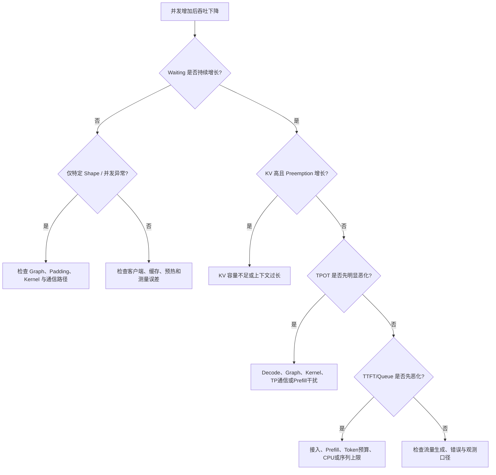

# 从 vLLM 服务日志定位吞吐断崖与并发拐点

压测大模型服务时，经常会看到一条不平滑的容量曲线：并发从 16 增加到 64，吞吐持续上升；到 84 并发时吞吐突然下降；96 并发反而恢复；128 并发又出现吞吐下降和尾延迟恶化。

这类现象不能只用“GPU 已经满了”解释。非单调变化通常意味着执行路径、批次 Shape、KV Cache、请求波次、Prefill/Decode 干扰、CPU 调度或多卡通信中至少有一项发生了离散变化。

vLLM 服务日志和 Prometheus 指标能够完成第一轮定位，但它们通常只能把问题收敛到某一层。可靠的结论需要遵循：

```text
客户端结果确认现象
→ 服务指标建立时间关系
→ 提出可证伪的根因假设
→ 单变量实验缩小范围
→ 必要时使用 GPU/NPU Timeline 坐实
```

本文不假设某个固定版本的 vLLM、模型或硬件。指标名称、CUDA Graph 模式和日志格式会随版本变化，实际使用前应以当前镜像中的 `/metrics`、`vllm serve --help` 和官方版本文档为准。

## 1. 一个典型的异常容量曲线

下面是一组经过归一化的示例数据，用来说明问题形态，不代表某个模型的真实性能：

| 并发 | 请求数 | 输出吞吐 | TTFT P99 | TPOT P99 | 现象 |
| ---: | ---: | ---: | ---: | ---: | --- |
| 64 | 256 | 1.00 | 1.0× | 1.0× | 基线 |
| 84 | 336 | 0.71 | 2.8× | 2.1× | 吞吐断崖下降 |
| 96 | 384 | 1.12 | 1.3× | 1.2× | 吞吐恢复 |
| 128 | 512 | 0.79 | 4.9× | 2.4× | Waiting 持续增长 |

这里至少有两个问题：

1. 为什么 84 比 64 更慢，却又在 96 恢复？
2. 为什么 128 的吞吐和延迟同时恶化？

第二个问题可能是常规饱和，第一问题则说明“并发越高，吞吐越高，直到平台”的简单模型不够用了。

## 2. 先明确日志能证明什么

常见 vLLM 日志可能包含类似内容：

```text
Avg prompt throughput: 8421.7 tokens/s,
Avg generation throughput: 1638.2 tokens/s,
Running: 84 reqs,
Waiting: 84 reqs,
KV cache usage: 91.6%,
Prefix cache hit rate: 0.0%
```

不同版本可能使用 `Pending`、`Waiting`、`GPU KV cache usage` 等不同字段。优先使用 `/metrics` 的原始时间序列，日志更适合快速查看和故障现场留证。

### 2.1 Running

`Running` 表示已经进入 Engine 调度集合的请求数量。它不等于：

- 当前一次 Forward 真正执行的序列数；
- 当前 Step 的 Token 数；
- CUDA Graph 的 Batch Size；
- GPU 上同时并行运行的 Kernel 数量。

一个 Running 请求在不同 Step 可能执行 Prefill、Chunked Prefill 或 Decode，也可能因调度预算不足没有在该 Step 获得 Token。

### 2.2 Waiting

`Waiting` 表示仍在等待进入或重新进入运行集合的请求。它持续增长通常说明到达速度大于处理速度，但不能单独区分：

- Prefill 接入能力不足；
- `max_num_seqs` 已满；
- `max_num_batched_tokens` 成为限制；
- KV Block 不足；
- 请求被抢占后等待重算；
- GPU 执行、CPU 调度或通信过慢。

### 2.3 KV Cache Usage

KV Cache 使用率表示已分配 KV Block 占总 KV Block 的比例。它主要反映仍存活请求的上下文驻留量，不是 Prefill/Decode 阶段指示器。

下面三种情况都可能出现高水位：

```text
大量长 Prompt 刚完成 Prefill
长输出请求持续 Decode 并保留全部历史 KV
Prefix Cache 保留了可复用 Block
```

水位下降可能来自请求完成、取消、抢占、缓存驱逐或 Block 释放。因此：

> “KV 水位接近 100%”可以支持容量压力假设，但“水位高就是 Prefill、水位低就是 Decode”并不成立。

### 2.4 Prompt 与 Generation Throughput

- Prompt tokens/s：服务实际处理输入 Token 的速度，主要反映 Prefill 工作；
- Generation tokens/s：实际生成 Token 的速度，主要反映 Decode 产出。

二者是观测窗口内的速率，不是单次 Kernel 吞吐。窗口中请求到达、完成、Prefix Cache 命中和重算都会改变结果。

### 2.5 Preemption

`num_preemptions_total` 的增速是判断 KV 压力的重要证据。只有 KV 水位高而没有抢占，可能只是缓存接近满载；KV 高、Waiting 增长、抢占持续发生，才更像 KV 容量不足导致重算放大。

## 3. 客户端与服务端必须对齐

服务端日志不能代替客户端结果。至少保留：

```text
请求开始和结束时间
成功、超时与失败数
真实输入/输出 Token 数
TTFT、TPOT、ITL、E2E P50/P95/P99
请求吞吐与输出 Token 吞吐
每个请求的 ID 或可关联标识
```

其中：

```text
TPOT = (E2E - TTFT) / (输出 Token 数 - 1)
```

TPOT 是每请求聚合值，ITL 是相邻流式输出之间的间隔。启用 Speculative Decoding 后，一次流式输出可能携带多个 Token，TPOT 与 ITL 不一定相等。

### 3.1 先排除压测工具制造的波次

假设每档并发都设置：

```text
num_requests = concurrency × 2
```

那么压测天然只有两波请求：第一波同时开始，第一波释放槽位后第二波进入。图上出现两个 KV 峰值和两组 Prefill/Decode，并不一定是 vLLM 的内部周期，而可能只是负载生成方式造成的同步波次。

应同时执行两种测试：

| 模式 | 目的 |
| --- | --- |
| Closed-loop 固定并发 | 测量在途请求数变化下的吞吐和延迟 |
| Open-loop 固定到达率 | 测量服务率不足时 Waiting 和尾延迟如何增长 |

不同并发档位还要保持总请求数、输入/输出 Token 分布、Prefix 命中率和测试时长可比。不能让 64 并发跑 2 分钟、128 并发跑 5 分钟，再直接比较平均吞吐。

## 4. 建立最小观测面

### 4.1 保存原始指标

```bash
curl -s http://127.0.0.1:8000/metrics > vllm-metrics.txt
```

确认当前版本实际暴露的指标：

```bash
grep -E '^# HELP vllm:|^vllm:' vllm-metrics.txt | head -n 80
```

重点指标通常包括：

```text
vllm:num_requests_running
vllm:num_requests_waiting
vllm:kv_cache_usage_perc
vllm:num_preemptions_total
vllm:prompt_tokens_total
vllm:generation_tokens_total
vllm:request_queue_time_seconds
vllm:time_to_first_token_seconds
vllm:time_per_output_token_seconds
vllm:e2e_request_latency_seconds
```

指标会随版本演进，不能假定旧版的 `gpu_cache_usage_perc` 与新版的 `kv_cache_usage_perc` 同时存在。

### 4.2 PromQL 示例

Prompt 和 Decode 吞吐：

```promql
sum(rate(vllm:prompt_tokens_total[1m]))
```

```promql
sum(rate(vllm:generation_tokens_total[1m]))
```

Running、Waiting 和 KV：

```promql
sum(vllm:num_requests_running)
```

```promql
sum(vllm:num_requests_waiting)
```

```promql
max(vllm:kv_cache_usage_perc)
```

抢占速率：

```promql
sum(rate(vllm:num_preemptions_total[1m]))
```

直方图的 P99 查询需要与当前指标标签匹配，例如：

```promql
histogram_quantile(
  0.99,
  sum by (le) (rate(vllm:time_to_first_token_seconds_bucket[5m]))
)
```

不要只截一张面板图，应导出原始数据、查询语句、时间范围、采样间隔和时区。

### 4.3 同时采集设备与主机指标

| 层次 | 最小指标 |
| --- | --- |
| GPU/NPU | Compute Util、显存/HBM、带宽、功耗、频率、温度、错误 |
| 多卡通信 | NCCL/HCCL 时间、慢 Rank、链路错误、PCIe/NVLink/HCCS |
| CPU | 每核利用率、Throttle、上下文切换、EngineCore 所在核 |
| 内存 | RSS、Pinned Memory、NUMA Remote、Swap |
| 网络 | 请求带宽、重传、连接数、Gateway 延迟 |

GPU Util 平均值可能掩盖“短时间满载 + 长时间空洞”。需要与 Running/Waiting 同一时间轴观察。

## 5. 五种可从日志建立的症状模型

### 5.1 健康工作区

```text
Running 随负载上升但不长期顶格
Waiting 接近 0 或能快速回落
KV 水位有余量且无持续抢占
Prompt/Generation tok/s 稳定
TTFT/TPOT P99 满足目标
```

这说明系统仍有可控余量，但不能据此认定已经达到最高吞吐点。

### 5.2 接入饱和或序列预算受限

```text
Waiting 单调增长
Running 长期固定在某个上限
KV 仍有明显余量
TPOT 相对稳定，TTFT/E2E 先恶化
```

优先检查：

- `max_num_seqs`；
- 到达率是否已经超过服务率；
- Token 预算是否让新请求长期得不到 Prefill；
- CPU Scheduler 是否能及时构造下一批。

### 5.3 KV 压力与抢占

```text
KV 长期接近上限
Preemption rate 持续大于 0
Waiting 和 Prompt token 计算量增加
TTFT、TPOT 和吞吐一起恶化
```

此时 Prompt 吞吐上升不一定是好事，它可能包含被抢占请求的重算。应比较“实际 Prefill 计算 Token”与“业务新输入 Token”。

### 5.4 Prefill/Decode 干扰

```text
长 Prompt 突发时 Prompt tok/s 上升
同时已有请求的 TPOT/ITL 出现尖峰
突发结束后 TPOT 恢复
没有明显抢占
```

这通常说明混合批次或过大的 Prefill Chunk 占用了较长设备时间。需要扫描 `max_num_batched_tokens`、Chunked Prefill 策略和流量隔离方案，而不是只增加 KV。

### 5.5 执行路径或 CPU 空洞

```text
只有部分并发/Shape 的 TPOT 突然恶化
KV 和 Waiting 无法完整解释变化
GPU 平均利用率下降或呈锯齿
相邻并发档位性能不单调
```

可能原因包括：

- CUDA Graph / ACLGraph 调度到不同执行路径；
- Batch 被 Pad 到不同捕获桶，增加无效计算；
- 超过最大捕获范围后回退到非 Graph 路径；
- 量化 Kernel、Attention Backend 或 GEMM 算法选择发生变化；
- CPU 输入准备、采样或同步产生空洞；
- TP/HCCL/NCCL 某个 Shape 触发慢路径。

这一类不能仅靠服务日志定根因，需要控制实验或 Timeline。

## 6. 为什么吞吐会在 84 下降、96 又恢复

非单调曲线优先检查下面六类原因。

### 6.1 压测波次和请求分布不同

如果每档压测重新随机采样 Prompt，84 并发可能恰好分到更长输入或输出。即使平均长度相同，联合分布和长尾也可能不同。

必须固定：

- 数据集 Revision 和随机种子；
- 每条请求的输入、输出上限和采样参数；
- 请求到达模型；
- Prefix Cache 冷热状态；
- 预热次数和正式统计窗口；
- 成功请求数，不能忽略超时和失败。

### 6.2 Graph 捕获桶与 Padding

现代 vLLM 会根据 Batch 描述和捕获配置选择 CUDA Graph。对于捕获范围内但不完全匹配的大小，可能 Pad 到邻近的捕获大小；超过最大捕获范围或不满足后端条件时，可能使用其他 Graph 模式或非 Graph 路径。

因此不能只凭“84 不是整齐数字”断言它没有计算图：

```text
实际请求并发 84
≠ 当前 Engine Step 的 num_tokens 84
≠ CUDA Graph Dispatcher 使用的 Shape 84
```

需要记录：

- vLLM 版本与 V0/V1 Engine；
- `compilation_config` 和 `cudagraph_mode`；
- `cudagraph_capture_sizes`；
- Runtime 实际 Batch Descriptor、Pad 后大小和执行模式；
- Attention Backend 是否支持目标 Graph 模式。

### 6.3 Scheduler 波形

Continuous Batching 不代表每个时间窗口都均匀。当大量相同长度请求同时到达时，请求可能同步进入 Prefill、同步转入 Decode、再同步完成，形成明显波峰。

96 并发看起来更平滑，可能只是请求完成时刻更分散，并不一定代表 96 是天然更优的硬件 Shape。

### 6.4 Kernel Shape 离散变化

GEMM、Attention 和量化 Kernel 对 M/N/K、Token 数和 Batch 的效率不是线性的。某个 Shape 可能：

- Tensor Core Tile 利用率更好；
- 选择了不同 Kernel；
- Padding 比例更低；
- Workspace 或融合条件不同；
- 触发了重新编译或 Autotune。

只有 GPU 连续忙、CPU 没有明显空洞时，才值得深入 Kernel 级分析。

### 6.5 KV Block 边界与抢占

Paged KV Cache 按 Block 分配。请求实际占用会向 Block 边界取整，不能只用平均 Token 数连续计算。某个并发档可能刚好跨过可用 Block 边界，引发抢占；更高并发档如果请求长度或完成时刻不同，表面结果可能暂时恢复。

### 6.6 多卡同步慢路径

TP 服务的每个 Step 受最慢 Rank 限制。一个 Rank 的降频、NUMA 远端访问、链路重传或 Collective 抖动，都可能让某个并发档下降。聚合 GPU Util 会掩盖 Rank 差异，应查看逐卡时间线。

## 7. 用控制实验验证 Graph 假设

Graph 假设的正确验证方式不是“关掉以后更慢，所以原来就是 Graph 问题”。关闭 Graph 会改变 CPU Launch、显存和执行路径，只能作为对照证据之一。

### 7.1 实验矩阵

| 组别 | Graph 配置 | Shape | 目的 |
| --- | --- | --- | --- |
| A | 当前生产配置 | 固定异常 Shape | 复现 |
| B | 当前生产配置 | 相邻正常 Shape | 对比 |
| C | `cudagraph_mode=NONE` | 固定异常 Shape | 判断异常是否依赖 Graph 路径 |
| D | 补充/调整捕获大小 | 固定异常 Shape | 验证覆盖或 Padding 假设 |

新版本 vLLM 的示例配置：

```bash
vllm serve <MODEL_PATH> \
  --compilation-config '{"cudagraph_mode":"NONE"}'
```

是否支持该参数及具体模式必须以当前版本为准。旧版本可能使用 `--enforce-eager`；vLLM-Ascend 使用 NPU/ACLGraph 执行栈，不能把 CUDA Graph 结论原样套用。

### 7.2 判定逻辑

```text
异常只在 Graph 模式出现
→ 证明“依赖 Graph 路径”
→ 尚未证明是 Graph 本身缺陷

异常随特定 Pad/Capture Shape 稳定复现
→ 继续查 Dispatcher、Kernel、地址、Stream 和通信

Graph 和非 Graph 都异常
→ 优先回到 Scheduler、KV、CPU、Kernel 或通信
```

要区分“Graph 暴露问题的条件”和“真正根因”。例如 Graph Replay 可能只是让融合通信路径生效，实际根因是某个自定义 Collective 对动态 Shape 处理错误。

## 8. Prefill 与 Decode 不是两个完全分开的时间段

请求内部确实经历 Prefill 和 Decode，但 Continuous Batching 下，不同请求可以处在不同阶段：

```text
Step 1：请求 A Decode + 请求 B Chunked Prefill
Step 2：请求 A Decode + 请求 B Decode + 请求 C Prefill
Step 3：请求 B Decode + 请求 C Decode
```

它们共享：

- GPU/NPU 计算单元；
- HBM 带宽；
- KV Cache；
- Scheduler Token 预算；
- TP/EP 集合通信；
- CPU 输入准备与采样路径。

### 8.1 Prefill 偏计算，Decode 偏带宽只是起点

通常：

- Prefill Token 多、矩阵较大，更容易提高计算密度；
- Decode 每请求每步 Token 少，需要反复读取权重和历史 KV，更容易受 HBM 带宽、Launch 和通信影响。

但量化、MoE、MLA、Speculative Decoding、Attention Backend、Batch 大小和硬件都会改变瓶颈。不能仅凭“Prefill 应该比 Decode 快”判断异常，因为总时间还取决于输入和输出 Token 数。

### 8.2 判断干扰需要时间对齐

在同一时间轴上观察：

```text
Prompt tok/s 上升
Generation tok/s 是否下降
TPOT/ITL 是否同步出现尖峰
每 Step Prefill/Decode Token 构成
HBM 带宽和 Kernel 时间是否变化
```

如果 Prompt 突发与 TPOT 尖峰稳定对齐，调整 Chunked Prefill 后尖峰显著下降，才有较强证据说明存在阶段干扰。

## 9. 正确估算 KV Cache，而不是手算一个“最大并发”

### 9.1 标准 MHA/GQA 的基础公式

对普通 Transformer，忽略对齐、Block、元数据和并行实现时，全模型每 Token 的理论 KV 字节数近似为：

```text
KV bytes/token
= 2 × num_layers × num_kv_heads × head_dim × kv_dtype_bytes
```

其中 `2` 代表 Key 和 Value。

这个公式不能直接当作“每张卡实际占用”：

- TP 可能对 KV Head 分片，也可能因 Head 数不足发生复制；
- PP 只在当前 Rank 保存其负责层的 KV；
- Block 分配存在向上取整；
- Prefix Cache、Sliding Window 和混合 Attention 会改变占用；
- KV dtype 可能与权重 dtype 不同；
- 元数据、Padding 和 Workspace 没有包含在基础公式中。

### 9.2 MLA 和混合模型不能套用普通公式

采用 MLA、Mamba 或混合 Attention 的模型，其 KV 表示和 Cache Group 可能不同。用 `num_kv_heads × head_dim` 计算 DeepSeek MLA 类模型，可能得到错误结论。

优先使用当前 vLLM 启动时输出的实际容量：

```text
GPU KV cache size: 488,000 tokens
Maximum concurrency for 9,216 tokens per request: 52.95x
```

这仍然只是 KV 约束下的理论并发，不是生产安全并发。

### 9.3 权重显存也不能只做参数量除卡数

下面的计算只能用于粗略下界：

```text
weight_bytes ≈ parameter_count × bytes_per_weight / TP
```

实际还受以下因素影响：

- Embedding、LM Head、Expert 是否均匀分片；
- 量化 Scale、Zero Point 和元数据；
- 未量化层和多模态组件；
- CUDA/ACL Graph Pool；
- Activation、Workspace、NCCL/HCCL Buffer；
- PyTorch/CANN Allocator 保留和碎片；
- 非框架显存。

应以启动 Profiling、每 Rank 实际显存和 vLLM 计算出的 KV Block 数为准。

### 9.4 从 KV 理论并发到生产安全并发

理论值可以写成：

```text
kv_limited_concurrency
≈ 可用 KV Token 容量
  / 每请求活跃 KV Token 的高分位值
```

生产容量还要继续取最小值：

```text
safe_concurrency
= min(
    KV 限制,
    满足 TTFT SLO 的限制,
    满足 TPOT SLO 的限制,
    Scheduler/CPU 限制,
    TP/EP 通信限制,
    N-1 故障余量限制
  )
```

所以“KV 理论最多 53 路，实验吞吐最佳约 64 路”不是相互验证。前者可能按每请求最大上下文计算，后者的请求可能没有同时达到最大长度；两者统计口径不同。

## 10. 一套可复用的排查流程

### 10.1 第一步：固定实验变量

记录并锁定：

```text
模型与 Tokenizer Revision
vLLM/torch/CUDA 或 vLLM-Ascend/CANN 版本
硬件、驱动、固件与并行策略
启动参数和环境变量
数据集、随机种子、输入/输出 Token 联合分布
请求到达模型与 Prefix Cache 状态
功耗、频率、温度和其他租户
```

任何一项变化都可能让相邻并发档不可比。

### 10.2 第二步：重新画容量曲线

不要只测 64、96、128 三个点。围绕异常点加密：

```text
64 → 72 → 80 → 84 → 88 → 96 → 104 → 112 → 128
```

每档至少重复三次，随机化执行顺序，避免温度、缓存和后台任务随时间造成假趋势。

### 10.3 第三步：按时间对齐四组曲线

```text
客户端：TTFT / TPOT / E2E / success / tok/s
Scheduler：Running / Waiting / scheduled tokens
Cache：KV usage / prefix hit / preemption
设备：Compute / HBM / Power / Graph / Collective
```

统一时间源和时区。采样周期不同的指标要保留原始值，不要先用不同窗口平滑后再比较。

### 10.4 第四步：按症状选择分支



### 10.5 第五步：一次只改变一个变量

推荐顺序：

1. 固定请求 Shape，排除数据分布；
2. 冷/热 Prefix Cache 分开；
3. 扫描 `max_num_seqs`；
4. 扫描 `max_num_batched_tokens`；
5. 调整 Chunked Prefill；
6. 对照 Graph 与非 Graph；
7. 单卡或缩小 TP，排除通信；
8. 仍无法解释时采集 Timeline。

如果一次同时修改 `max_num_seqs`、KV 配置、Graph Capture Size 和 TP，结果即使变好也无法归因。

## 11. 什么时候服务日志已经足够

下面情况通常不需要立即采集重型 Profiler：

| 证据 | 可形成的结论 |
| --- | --- |
| Waiting 持续增长，输入速率稳定高于完成速率 | 服务已经过载 |
| KV 高、抢占持续增长、降低上下文后恢复 | KV 压力与重算是主要原因 |
| 长 Prefill 注入与 TPOT 尖峰严格对齐，减小 Chunk 后恢复 | Prefill/Decode 干扰成立 |
| Prefix 命中变化能解释 Prompt tok/s 和 TTFT 变化 | 缓存冷热导致对比失真 |
| 压测客户端 CPU 满、服务 Waiting 为零 | 压测端而非服务端受限 |

日志不足以确认的情况：

- 某个并发数字出现孤立断崖；
- 怀疑 Graph 捕获、Padding 或 Kernel 选择；
- GPU Util 低但 Running/Waiting 都高；
- TP 多卡结果异常而单卡正常；
- TPOT 变差但 KV 和 Queue 无明显变化；
- 怀疑 HBM、PCIe、NVLink、NCCL/HCCL 或慢 Rank。

此时进入 Nsight Systems、PyTorch Profiler、msprof 或厂商 Timeline。先看 CPU-GPU/NPU 空洞和通信，再决定是否需要 Kernel 级分析。

## 12. 三个案例的正确结论写法

### 12.1 案例 A：Waiting 增长但 TPOT 稳定

不充分结论：

```text
GPU 算力不够。
```

更准确的结论：

```text
在固定到达率下，Waiting 从 0 持续增长到 46，TTFT P99 从 0.8 秒升至
4.2 秒，而 TPOT P99 仅增加 6%，KV P95 为 61%，无抢占。
现有证据说明瓶颈位于请求接入、Prefill 或调度预算，而不是 KV 容量；
下一步检查每 Step Scheduled Token、max_num_seqs、max_num_batched_tokens
和 EngineCore CPU。
```

### 12.2 案例 B：KV 满且吞吐下降

```text
KV P95 达到 98%，Preemption 从 0 上升到 3.6 次/秒，实际 Prompt 计算 Token
比业务新输入 Token 高 41%。降低最大上下文并减少并发后，抢占归零，输出吞吐恢复。
证据支持 KV 不足导致抢占和重算放大。
```

### 12.3 案例 C：只有一个并发档异常

```text
84 并发在三次重复实验中均出现 TPOT P99 阶跃，而 80、88 和 96 正常；
KV、Waiting 和请求长度分布无法解释差异。Graph 日志显示异常档被 Pad 到不同捕获桶，
关闭 Graph 后阶跃消失但整体 TPOT 上升。当前只证明问题依赖 Graph/Shape 路径；
仍需 Timeline 比较 Replay、Padding、Kernel 和 Collective 后才能确定根因。
```

这种写法把事实、推断和下一步分开，避免把相关性写成根因。

## 13. 压测结果模板

### 13.1 环境信息

| 项目 | 值 |
| --- | --- |
| 模型 Revision |  |
| vLLM / vLLM-Ascend |  |
| torch / CUDA / CANN |  |
| GPU/NPU 与数量 |  |
| TP / PP / DP / EP |  |
| Attention Backend |  |
| Graph 模式与捕获大小 |  |
| KV dtype / Block / Capacity |  |
| 启动参数与镜像 Digest |  |

### 13.2 结果信息

| 并发/RPS | 输入P50/P99 | 输出P50/P99 | TTFT P99 | TPOT P99 | 输出tok/s | Waiting P95 | KV P95 | 抢占/s | 结论 |
| ---: | ---: | ---: | ---: | ---: | ---: | ---: | ---: | ---: | --- |
|  |  |  |  |  |  |  |  |  |  |

### 13.3 结论结构

```text
现象：什么指标在什么负载下发生变化
证据：哪些时间序列同步变化
排除：哪些常见原因与数据不符
假设：当前最可能在哪一层
实验：改变哪个单一变量验证
结果：假设被支持还是被否定
边界：结论适用于哪些版本、模型和硬件
```

## 14. 常见误区

| 误区 | 正确理解 |
| --- | --- |
| KV 高峰就是 Prefill | KV 表示已分配 Block，不直接表示阶段 |
| Decode 总时间应该小于 Prefill | 取决于输入/输出长度、Batch、模型和硬件 |
| 84 不是整齐数字，所以没有 Graph | Runtime Shape 与请求并发不是一个概念，还可能 Padding |
| Waiting 增长一定是 KV 满 | 也可能是序列、Token、CPU、GPU或通信限制 |
| GPU Util 低说明没有压力 | 有 Waiting 时的执行空洞同样会导致低 Util 和高延迟 |
| KV 理论并发就是最大生产并发 | 生产上限由 TTFT、TPOT、计算、通信和故障余量共同决定 |
| 单次吞吐峰值就是最佳配置 | 应选择重复实验中满足 SLO 的稳定安全区 |
| 关闭 Graph 后恢复就证明 Graph 有 Bug | 只证明问题依赖执行路径，根因可能在 Kernel、通信或输入 |

## 15. 课后练习

### 15.1 题目

1. 为什么 KV Cache Usage 接近 100% 不能直接判断当前处于 Prefill？
2. Running 请求数与 CUDA Graph Batch Size 为什么不是同一概念？
3. `num_requests = concurrency × 2` 为什么容易在时间序列中产生两个波峰？
4. Waiting 增长、KV 只有 60%、TPOT 稳定时应优先检查哪一层？
5. 什么证据组合能够支持“KV 不足导致重算”的结论？
6. 为什么吞吐在 84 并发下降、96 并发恢复时，不能直接判断 84 没有捕获计算图？
7. 怎样区分 Prefill/Decode 干扰和 KV 抢占？
8. 普通 GQA 模型的 KV 理论公式为什么不能直接用于 MLA 模型？
9. 关闭 CUDA Graph 后异常消失，能够得出什么结论，不能得出什么结论？
10. 为什么选择容量时要看 Goodput 和尾延迟，而不只看输出 Token/s？

### 15.2 参考答案

1. KV 水位表示已经分配的 KV Block。Prefill 完成后的 Decode 仍需保留全部历史 KV，Prefix Cache 也可能保留 Block；阶段切换不会自动清空 KV。
2. Running 是 Scheduler 中存活的请求集合；一次 Engine Step 只会按 Token/序列预算选择其中一部分，并形成可能包含 Prefill、Decode 和 Padding 的运行 Shape。Graph Dispatcher 使用的是运行描述，而不是外部请求并发数字。
3. 第一批请求占满并发槽，只有它们完成后第二批才能进入，因此负载天然分成两波。KV、Running 和吞吐的双峰可能来自压测模型，而不是服务内部周期。
4. 优先检查接入服务率、`max_num_seqs`、`max_num_batched_tokens`、Prefill 和 EngineCore CPU。KV 尚有余量且 TPOT 稳定，不支持 KV 或 Decode 是首要瓶颈。
5. KV 长期高水位、抢占速率持续增加、Waiting 增长、实际 Prefill 计算量高于业务新输入量，并且降低上下文或并发后这些现象同时消失。
6. 请求并发不等于当前 Step Shape；vLLM 可能将运行 Shape Pad 到捕获桶，也可能按 Batch 组成选择不同 Graph 模式。必须读取捕获配置和实际 Runtime 路径。
7. Prefill/Decode 干扰通常表现为 Prompt 突发与 TPOT 尖峰同步，但没有持续抢占；KV 抢占还会出现高 KV、Preemption 增长和重算放大。
8. MLA 保存的是压缩后的潜变量和位置相关状态，其 Cache 结构不等于标准的 K/V Head 张量；混合模型还可能存在多个 Cache Group，因此普通 GQA 公式会失真。
9. 可以说明异常依赖 Graph 相关执行路径；不能直接证明 Graph 实现本身有 Bug。真正根因还可能是 Padding、Kernel、地址稳定性、Stream 或融合通信路径。
10. 输出 Token/s 可能在请求大量排队、TTFT/TPOT 尾延迟失守时仍然很高。Goodput 只统计满足 SLO 的有效请求，更接近用户实际获得的服务能力。

## 16. 总结

只用 vLLM 服务日志，通常可以完成以下判断：

```text
是否过载
→ Waiting 是否持续增长

是否存在 KV 压力
→ KV、Preemption 与重算是否同时增长

TTFT 还是 TPOT 先失守
→ 瓶颈更偏接入/Prefill，还是Decode/执行

异常是否只出现在离散 Shape
→ 是否需要检查 Graph、Kernel 或通信路径
```

但日志中的时间相关性不是根因本身。遇到吞吐断崖时，应先排除压测波次和数据分布，再用控制变量验证 Scheduler、KV、Graph、CPU 和通信假设，最后才进入 Timeline 或 Kernel Profiler。

生产容量也不应取“吞吐最高的那个点”，而应取重复实验中同时满足 TTFT、TPOT、错误率、KV 余量、故障余量和成本目标的稳定区间。

## 17. 相关内容

- [vLLM 性能分析总论](./14-vLLM性能分析总论-TTFT-TPOT-吞吐与GPU利用率.md)
- [Scheduler、Batch、KV Cache 与抢占性能实验](./18-Scheduler-Batch-KVCache与抢占性能实验.md)
- [GPUModelRunner、CUDA Graph 与 Kernel 空洞分析](./19-GPUModelRunner-CUDAGraph与Kernel空洞分析.md)
- [TP 慢 Rank、NVLink 与 NCCL 推理故障排查](./20-TP慢Rank-NVLink与NCCL推理故障排查.md)
- [按真实 Token 分布完成单副本容量规划](./21-按真实Token分布完成单副本容量规划.md)
- [vLLM 生产故障排查 Runbook](./23-vLLM生产故障排查Runbook.md)
- [CUDA Graph、TP 与通信融合稳定性分析](./26-CUDA-Graph-TP与通信融合稳定性分析.md)

## 18. 参考资料

- [vLLM：Metrics](https://docs.vllm.ai/en/latest/design/metrics/)
- [vLLM：Benchmark CLI](https://docs.vllm.ai/en/latest/benchmarking/cli/)
- [vLLM：CUDA Graphs](https://docs.vllm.ai/en/latest/design/cuda_graphs/)
- [vLLM：KV Cache Configuration](https://docs.vllm.ai/en/latest/api/vllm/config/cache/)
- [vLLM：torch.compile integration](https://docs.vllm.ai/en/latest/design/torch_compile/)
