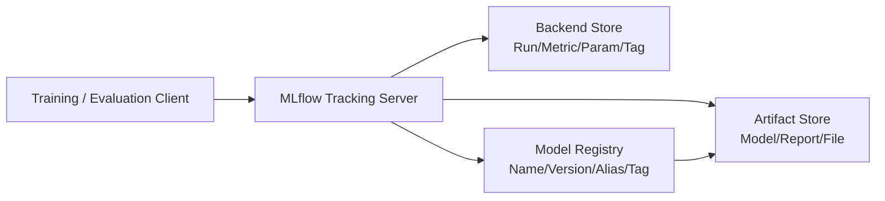

# MLflow 实验追踪、模型注册与制品血缘

MLflow 可以记录实验和注册模型，但“安装了 MLflow”并不自动获得可复现性。

如果只记录：

```text
learning_rate=1e-5
accuracy=0.82
model.pkl
```

仍然无法回答：

- 使用哪一个 Git Commit？
- 训练数据是哪次快照，过滤规则是什么？
- Tokenizer、Chat Template 和 LoRA 是哪个版本？
- 训练镜像、CUDA、框架和依赖是什么？
- 模型文件是否被覆盖？
- 哪份评测报告批准了它？
- 生产 Pod 实际加载的是否就是这个文件？

本篇把 MLflow 当作血缘系统的一部分，而不是只看 UI 曲线。

## 1. 四个核心组件



| 组件 | 保存内容 | 典型后端 |
| --- | --- | --- |
| SDK/Client | 发起记录、查询、注册操作 | Python/REST 等 |
| Tracking Server | REST API、访问控制和 UI | 服务 |
| Backend Store | Experiment、Run、参数、指标、Tag、元数据 | PostgreSQL/MySQL 等 |
| Artifact Store | 模型权重、图、数据清单、报告、环境文件 | S3/Ceph RGW/NFS 等 |
| Model Registry | Registered Model、Model Version、Alias、Tag | 通常依赖数据库后端 |

元数据与大文件不要混淆：

```text
Backend Store 中保存 artifact URI 和元数据
Artifact Store 中保存真实大文件
```

## 2. Run 是一次执行，不是一个模型版本

一个 Run 可以表示：

- 一次训练。
- 一次模型格式转换。
- 一次量化。
- 一次评测。
- 一次压测。

Run 包含：

```text
run_id
experiment_id
start/end/status
params
metrics
tags
artifacts
```

一个训练 Run 也可能产生多个 Checkpoint；一个 Model Version 也可能来自转换后的新 Run。
因此不要默认：

```text
Run ID == Model Version == Deployment Revision
```

要显式记录它们之间的关系。

## 3. 参数、指标、Tag 与 Artifact

| 类型 | 示例 | 特点 |
| --- | --- | --- |
| Param | batch size、dtype、base model | 一次 Run 内通常是稳定配置 |
| Metric | loss、accuracy、TTFT、tokens/s | 可随 Step/时间变化 |
| Tag | git commit、owner、dataset ID、purpose | 用于分类和检索 |
| Artifact | 权重、评测报告、配置、图、Manifest | 文件/目录 |

不要把所有东西都压成 Tag：

- Tag 适合短文本和索引。
- 大 JSON/YAML 存 Artifact，再用 Tag 保存摘要/URI。
- 关键坐标既可放 Tag 便于检索，也应进入不可变 Manifest。

## 4. 最小血缘清单

```yaml
schema_version: "1.0"
run:
  id: ...
  experiment: chat-70b-finetune
source:
  repository: ssh://git.example.com/ai/chat-model.git
  commit: 4f0c...
  dirty: false
data:
  training_snapshot: s3://datasets/chat/train/2026-08-01/manifest.json
  training_manifest_sha256: ...
  evaluation_snapshot: s3://datasets/chat/eval/v7/manifest.json
  evaluation_manifest_sha256: ...
model:
  base_model: org/base-70b
  base_revision: 8a3e...
  tokenizer_revision: 8a3e...
  chat_template_sha256: ...
  adapter_sha256: ...
environment:
  image_digest: registry.example.com/train@sha256:...
  python: 3.12.4
  framework: pytorch
  framework_version: ...
  cuda: ...
  driver: ...
training:
  config_sha256: ...
  seed: 20260807
artifacts:
  model_uri: ...
  artifact_sha256: ...
evaluation:
  report_uri: ...
  report_sha256: ...
```

对 LLM 还需要：

- System Prompt。
- Chat Template。
- Tokenizer 和 Special Tokens。
- 量化方法与校准数据。
- LoRA/Adapter 列表与合并顺序。
- 推理引擎、镜像与启动参数。
- RAG 的 Embedding 模型、索引和语料快照。

## 5. 记录一个 Run

以下示例突出“坐标”，模型训练细节省略：

```python
from __future__ import annotations

from pathlib import Path
import hashlib
import json
import mlflow

def sha256_file(path: Path) -> str:
    digest = hashlib.sha256()
    with path.open("rb") as stream:
        for chunk in iter(lambda: stream.read(1024 * 1024), b""):
            digest.update(chunk)
    return digest.hexdigest()

mlflow.set_tracking_uri("https://mlflow.example.com")
mlflow.set_experiment("chat-70b-finetune")

lineage = {
    "schema_version": "1.0",
    "source_commit": "4f0c...",
    "dataset_snapshot": "s3://datasets/chat/train/2026-08-01/",
    "dataset_manifest_sha256": "...",
    "image_digest": "registry.example.com/train@sha256:...",
    "base_model_revision": "8a3e...",
    "tokenizer_revision": "8a3e...",
}

with mlflow.start_run(run_name="lora-rank64") as run:
    mlflow.log_params({
        "learning_rate": 1e-5,
        "lora_rank": 64,
        "seed": 20260807,
        "dtype": "bfloat16",
    })
    mlflow.set_tags({
        "source.commit": lineage["source_commit"],
        "data.snapshot": lineage["dataset_snapshot"],
        "container.image_digest": lineage["image_digest"],
        "purpose": "candidate",
    })

    # 训练过程中按 Step 记录。
    mlflow.log_metric("train.loss", 1.83, step=100)
    mlflow.log_metric("eval.accuracy", 0.82, step=100)

    manifest_path = Path("lineage.json")
    manifest_path.write_text(
        json.dumps(lineage, ensure_ascii=False, indent=2),
        encoding="utf-8",
    )
    mlflow.log_artifact(str(manifest_path), artifact_path="lineage")
```

真实项目应由训练框架输出临时文件；不要在并行 Rank 上重复写同一 Artifact。

## 6. 为什么需要显式摘要

URI 不是内容身份：

```text
s3://models/chat-70b/model.safetensors
```

如果对象可覆盖，今天和明天的 URI 相同但内容不同。

至少保存：

- 文件/分片 SHA-256。
- Manifest SHA-256。
- 总大小与分片数。
- 对象存储 Version ID（若支持）。
- 上传完成标记。

大模型分片清单：

```json
{
  "format": "safetensors",
  "files": [
    {
      "path": "model-00001-of-00008.safetensors",
      "size": 9999999999,
      "sha256": "..."
    }
  ],
  "total_size": 79999999992,
  "tokenizer_sha256": "...",
  "config_sha256": "..."
}
```

模型下载完成后重新校验，不只信上传方。

## 7. Artifact Store 的两种访问模式

### 7.1 客户端直连 {/* #客户端直连 */}

```text
Client → Tracking Server（元数据）
Client → Object Store（Artifact）
```

客户端需要对象存储凭据。

### 7.2 Tracking Server 代理 {/* #tracking-server-代理 */}

```text
Client → Tracking Server → Object Store
```

客户端不直接拥有存储凭据，但所有能访问 Tracking Server Artifact 接口的用户可能共享服务器身份权限。

选择时评估：

- 身份边界。
- 大文件带宽。
- 上传超时。
- 多租户隔离。
- 服务端代理容量。
- 审计。

无论哪种模式，都要配置 TLS、最小权限、版本化、生命周期和备份。

## 8. Artifact 上传不是事务

可能出现：

```text
部分分片上传成功
→ 进程失败
→ Run 标记失败
→ 存储中留下孤儿文件
```

建议发布协议：

```text
上传到临时/内容寻址路径
→ 校验全部分片
→ 生成 Manifest
→ 写 completion marker
→ 注册 Model Version
```

消费者只读取有完整 Manifest 和完成标记的版本。
定期清理失败 Run 的孤儿 Artifact，但先保留排障窗口。

## 9. Model Registry

概念：

```text
Registered Model: chat-70b
├── Version 41
├── Version 42
└── Version 43
```

每个 Model Version 应关联：

- 来源 Run/Logged Model。
- Artifact。
- 创建时间与创建者。
- Tag。
- 描述。
- Alias。

注册示例：

```python
import mlflow

result = mlflow.register_model(
    model_uri="runs:/<run-id>/model",
    name="chat-70b",
)
print(result.version)
```

具体模型保存/记录 API 随 Flavor 和 MLflow 版本不同，执行前以当前官方文档与锁定版本为准。

## 10. Alias、Tag 与具体版本

```text
Alias: candidate  → Version 43
Alias: champion   → Version 42
Tag: validation_status=approved
```

Alias 是可变指针：

```python
from mlflow import MlflowClient

client = MlflowClient()
client.set_registered_model_alias("chat-70b", "candidate", "43")

version = client.get_model_version_by_alias("chat-70b", "candidate")
print(version.version)
```

适合：

- 人类表达候选/稳定版本。
- Pipeline 的晋级状态。
- 查找当前基线。

不适合直接作为生产不可变坐标。安全发布：

```text
读取 candidate Alias
→ 解析到 Version 43
→ 验证评测 Tag 与 Artifact 摘要
→ 在部署 PR 固定 Version 43 + Digest
```

如果 Pod 启动时每次读取 `@champion`，Alias 变更可能让同一 Deployment Revision 的不同 Pod 加载不同版本。

## 11. 模型签名与输入样例

模型制品除权重外应包含：

- 输入/输出 Schema。
- dtype/shape。
- 必填/可选字段。
- 示例输入。
- 兼容性版本。

对 LLM 服务，接口契约还包括：

```text
OpenAI-compatible API 版本
messages 角色规则
Chat Template
最大上下文
Tokenizer
工具调用格式
结构化输出约束
流式事件格式
```

Smoke Test 必须用这些固定样例验证部署，而不是只检查模型文件能打开。

## 12. Nested Run

一个超参搜索：

```text
Parent Run：搜索任务
├── Child Run：lr=1e-5
├── Child Run：lr=2e-5
└── Child Run：lr=5e-6
```

Python：

```python
with mlflow.start_run(run_name="search") as parent:
    for lr in (1e-5, 2e-5, 5e-6):
        with mlflow.start_run(run_name=f"lr-{lr}", nested=True):
            mlflow.log_param("learning_rate", lr)
            # train/evaluate/log
```

不要把不同候选的指标都写入一个 Run，导致参数与制品无法一一对应。

## 13. Metric 记录原则

需要同时记录：

```text
值
Step
时间
单位
聚合方式
数据集版本
样本数
```

例如 `latency=0.5` 没有意义。应表达：

```text
metric: serve.ttft_p95_seconds
value: 0.5
workload: eval-load-v3
hardware: H100-SXM-80GB
input_tokens_p50: 512
output_tokens_p50: 128
concurrency: 32
sample_count: 10000
```

复杂上下文写入评测报告 Artifact，关键维度作为 Tag/Param 便于检索。

## 14. 数据血缘

“数据版本 v7”仍不够。数据 Manifest 至少记录：

```yaml
snapshot_id: eval-v7
created_at: ...
source_uris:
  - s3://datasets/raw/...
transforms:
  repository: ...
  commit: ...
  config_sha256: ...
schema_version: ...
row_count: ...
splits:
  train: ...
  validation: ...
  test: ...
files:
  - uri: ...
    size: ...
    sha256: ...
privacy:
  classification: restricted
  approval_id: ...
```

不能把真实生产 Prompt 直接上传到 Artifact Store；先完成隐私、授权、脱敏和保留策略。

## 15. 环境可复现

记录 `requirements.txt` 仍可能不够：

- 系统库。
- CUDA/Driver。
- NCCL。
- GPU 型号和拓扑。
- 编译 Flag。
- 环境变量。
- 镜像基础层。

生产坐标应固定容器 Digest：

```text
registry.example.com/serve@sha256:...
```

Tag 如 `serve:latest` 或 `serve:2026-08-07` 仍可被覆盖。

不要记录环境变量的值；记录允许列表中的变量名/非敏感值，并对 Secret 做排除。

## 16. 从生产反查血缘

生产 Pod 应暴露：

```text
deployment_revision
model_registry_name
model_registry_version
model_artifact_sha256
tokenizer_revision
image_digest
engine_config_sha256
source_commit
```

位置：

- Pod Label/Annotation（非敏感、短值）。
- `/version` 管理端点。
- 启动日志。
- Prometheus Info Metric。

查询路径：

```text
告警中的 Pod UID/Revision
→ 部署 Git Commit
→ Model Registry Version
→ 来源 Run
→ Artifact Manifest
→ 代码/Data/环境
→ Evaluation Report
→ 审批与发布记录
```

现场验证 Model Artifact 摘要，避免“Registry 说是 42，磁盘实际是旧缓存”。

## 17. 安全与多租户

- Tracking Server 需要认证、授权和 TLS。
- Experiment/Registered Model/Artifact 按团队隔离。
- 数据库凭据与对象存储凭据独立。
- 不允许客户端随意指定任意 `artifact_location` 逃逸到其他 Bucket/Prefix。
- 对 Pickle 等可执行反序列化格式视为不可信代码。
- 模型下载和加载运行在受限环境。
- Artifact 做恶意文件、依赖和供应链扫描。
- 删除与保留遵循审计和合规。

## 18. 高可用与备份

要备份：

```text
Backend Store 数据库
Artifact Store 对象与版本
Registry/Alias/Tag
服务配置和密钥引用
恢复 Runbook
```

只备份数据库不备份 Artifact，恢复后会得到大量指向不存在文件的 URI。
只备份 Artifact 不备份数据库，则丢失 Run、Registry 与血缘。

定期演练：

- 恢复数据库。
- 恢复一个模型制品。
- 校验 Manifest。
- 重新加载并通过固定 Smoke Test。

## 19. 常见反模式

| 反模式 | 后果 |
| --- | --- |
| 只记录最终 accuracy | 无法复现或解释 |
| Artifact 使用可覆盖路径 | 同 URI 内容漂移 |
| 生产直接读取可变 Alias | 同 Revision 加载不同模型 |
| 把大量模型放数据库 | 性能、备份和成本问题 |
| 只保存模型权重 | Tokenizer/Template/环境不一致 |
| Run 成功就自动晋级 | 未经质量/安全/性能门禁 |
| 记录 Secret/真实 Prompt | 数据泄漏 |
| 只备份 Backend Store | Artifact 丢失无法恢复 |
| 把失败上传当完整模型注册 | 消费者读取半成品 |

## 20. 实验任务

1. 部署一个测试 Tracking Server、数据库和 S3 兼容 Artifact Store。
2. 记录两个训练 Run，固定代码/Data/镜像坐标。
3. 上传带分片摘要的 Artifact Manifest。
4. 注册两个 Model Version。
5. 设置 `candidate` 与 `champion` Alias。
6. 将 Alias 解析为具体版本，生成部署清单。
7. 修改 Alias，验证旧部署清单仍固定原版本。
8. 删除/破坏一个 Artifact，验证完整性检查能阻止加载。
9. 从测试 Pod 的 `/version` 反查来源 Run 与评测报告。
10. 完成一次 Backend + Artifact 恢复演练。

## 21. 验收清单

- [ ] 能区分 Run、Artifact、Logged Model、Model Version 和部署 Revision。
- [ ] Backend Store 与 Artifact Store 职责分离。
- [ ] 每个 Run 记录代码、数据、模型、环境和配置坐标。
- [ ] 大模型使用分片 Manifest 和内容摘要。
- [ ] 上传完成后才允许注册。
- [ ] Alias 用于晋级语义，部署固定具体 Version/Digest。
- [ ] Tokenizer、Template、Adapter 和评测报告进入血缘。
- [ ] 生产 Pod 暴露可反查版本坐标。
- [ ] Tracking/Artifact Store 有最小权限和 TLS。
- [ ] 不记录 Secret 和未经治理的真实 Prompt。
- [ ] 数据库和 Artifact 同时备份并验证恢复。

## 22. 参考资料

- [MLflow Tracking](https://mlflow.org/docs/latest/tracking/)
- [MLflow Architecture Overview](https://mlflow.org/docs/latest/self-hosting/architecture/overview/)
- [MLflow Artifact Stores](https://mlflow.org/docs/latest/self-hosting/architecture/artifact-store/)
- [MLflow Model Registry Workflows](https://mlflow.org/docs/latest/ml/model-registry/workflow/)
- [MLflow Models](https://mlflow.org/docs/latest/ml/model/)
