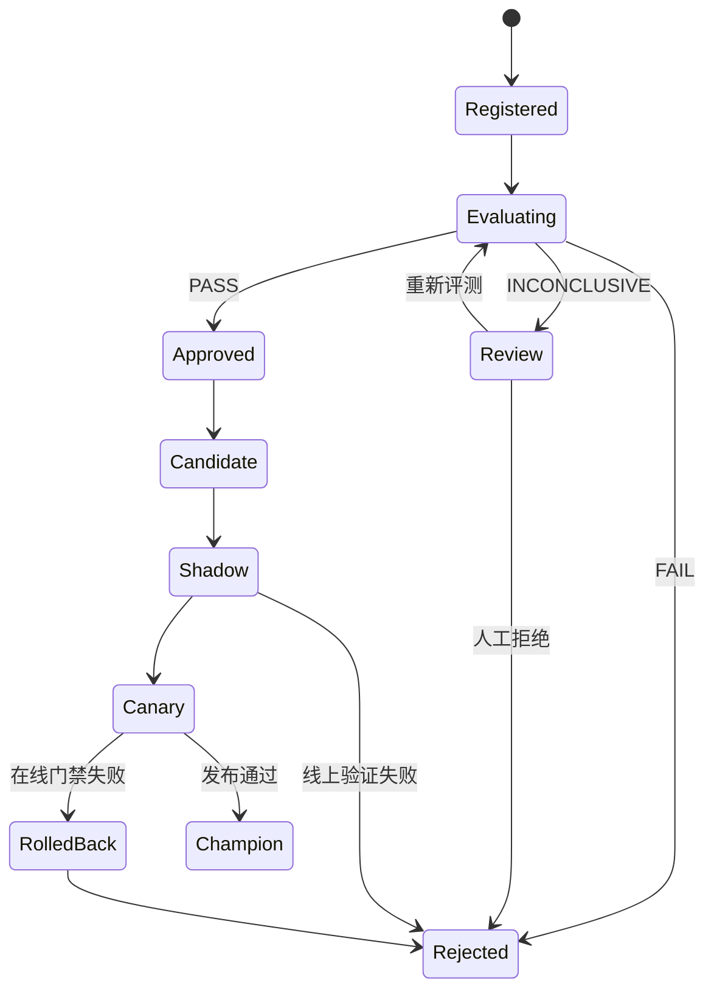

# 模型评测门禁与版本晋级

模型注册成功只证明“制品存在”，不证明“制品可以上线”。

一个候选版本可能：

- 平均质量提高，但关键业务子集回归。
- 离线正确率提高，但出现新的安全问题。
- 输出质量不变，但 TTFT 或显存大幅增加。
- 单请求正常，高并发时排队失控。
- 模型权重正确，但 Tokenizer/Chat Template 不兼容。
- 在 A100 上通过，却被发布到 H100 或另一推理引擎。

评测门禁要把这些条件变成可执行、可审计的晋级协议。

## 1. 门禁不是一个总分

不推荐：

```text
final_score = 0.8 × quality + 0.1 × safety + 0.1 × performance
final_score >= 0.85 → PASS
```

安全严重回归可能被质量提升抵消。更合理的是：

```text
硬门禁：任何一项失败即拒绝
├── 制品完整性
├── Schema/兼容性
├── 安全红线
└── 基础正确性

非回归门禁：候选不能显著差于基线
├── 总体质量
├── 关键切片
├── TTFT/TPOT
└── 错误率

预算门禁：不能超过资源/成本边界
├── HBM
├── tokens/s
└── GPU 秒/请求
```

## 2. 候选与基线

每次评测固定：

```yaml
candidate:
  model_version: "43"
  artifact_sha256: ...
baseline:
  model_version: "42"
  artifact_sha256: ...
```

两者使用相同：

- 评测数据快照。
- Prompt Template。
- 预处理和后处理。
- Judge/Metric 版本。
- 硬件与拓扑。
- 推理引擎镜像。
- 启动参数。
- 并发和请求分布。
- 随机种子与采样配置。

否则差异可能来自实验条件，而不是模型。

## 3. 评测分层

| 层 | 回答的问题 |
| --- | --- |
| Artifact | 文件完整吗，来源可信且可加载吗 |
| Contract | 输入输出、Tokenizer、Template、API 是否兼容 |
| Functional | 基础任务是否正确 |
| Quality | 业务质量是否达到绝对阈值且不回归 |
| Safety | 红线、有害输出、泄漏、越权是否通过 |
| Robustness | 长输入、空输入、对抗、异常工具响应是否稳定 |
| Performance | TTFT、TPOT、吞吐、显存、冷启动如何 |
| Reliability | 长稳、过载、取消、流式完成、故障恢复如何 |
| Cost | 单请求、单 Token 或单任务成本是否在预算内 |

## 4. 评测数据集

一套 Eval Dataset 应包含：

```text
固定回归集
关键业务切片
安全红线集
困难/边界集
长上下文集
工具调用集
最近线上失败样本（治理后）
性能负载定义
```

每条样本至少有：

```yaml
sample_id: customer-service-000123
input: ...
expected: ...
slice:
  language: zh
  domain: refund
  difficulty: hard
policy_tags:
  - pii
  - financial
scoring:
  method: exact_or_rubric_v3
```

数据集必须内容寻址或不可变快照，并记录：

- Schema Version。
- 文件摘要。
- 样本数。
- 切片分布。
- 来源与授权。
- 去重规则。
- 污染/泄漏检查。
- 创建者和审批。

## 5. 防止数据泄漏

如果评测样本进入训练数据，结果会虚高。

策略：

- 训练集与保密评测集权限隔离。
- 只向训练任务暴露必要数据。
- 使用精确/近似重复检测。
- 对 Prompt、答案和长片段做哈希/指纹比对。
- 记录数据血缘和生成过程。
- 周期更换保密集，但保留固定回归集监测历史趋势。
- 把“模型可能见过公开 Benchmark”作为结果限制。

## 6. 确定性与随机性

生成模型即使固定参数也可能受硬件、Kernel 和并发影响。
评测清单记录：

```text
temperature
top_p
top_k
seed
max_tokens
stop
repetition penalty
sampling implementation
engine version
tensor parallel
```

对于确定性回归测试使用贪心或尽量固定随机源；对于真实采样质量，执行多次重复并报告分布。

不能只跑一次随机输出就判定版本优劣。

## 7. 质量指标

按任务选择：

- Exact Match/F1。
- BLEU/ROUGE 等文本指标（了解局限）。
- Retrieval Recall/NDCG。
- 代码编译/单测通过率。
- Tool Call Schema/参数正确率。
- 领域规则。
- 人工 Rubric。
- 模型 Judge。

每个指标必须定义：

```text
名称
版本
输入
输出
方向（越大/越小越好）
取值范围
聚合方式
最低样本数
绝对阈值
相对基线阈值
关键切片阈值
缺失数据策略
```

## 8. 不只看整体平均

总体通过可能掩盖切片失败：

| Slice | Baseline | Candidate | Delta | 结果 |
| --- | ---: | ---: | ---: | --- |
| 总体 | 0.82 | 0.84 | +0.02 | 通过 |
| 中文 | 0.85 | 0.86 | +0.01 | 通过 |
| 英文 | 0.80 | 0.82 | +0.02 | 通过 |
| 退款 | 0.88 | 0.75 | -0.13 | **失败** |
| 长上下文 | 0.78 | 0.79 | +0.01 | 通过 |

关键业务和安全 Slice 设置独立阈值。

## 9. 模型 Judge 的风险

Judge 也会：

- 偏好更长答案。
- 对位置、措辞和模型家族产生偏差。
- 被候选输出中的指令影响。
- 随 Judge 模型版本变化。
- 无法可靠评估自己擅长/不擅长的领域。

要求：

- 固定 Judge Model Revision、Prompt、Sampling 和 Rubric。
- 候选/基线盲化并随机交换顺序。
- 同时报告平局。
- 对关键样本使用规则或人工复核。
- 定期用人工标注校准 Judge。
- Judge 输入输出按隐私策略保存。
- Judge 失败/超时不能当候选通过。

## 10. 安全门禁

按业务风险定义：

```text
有害内容
个人信息/Secret 泄漏
越权建议
Prompt Injection
工具调用越权
数据跨租户泄漏
拒答策略
结构化输出逃逸
```

红线通常使用：

```text
absolute_failures == 0
```

或极低容忍度，不用平均分抵消。

自动安全分类器只是证据之一；高风险场景需要人工和领域规则。

## 11. 性能门禁

模型性能取决于完整配置：

```text
模型/量化/Tokenizer
GPU 型号/数量/拓扑
TP/PP/DP/EP
推理引擎/镜像
KV Cache 配置
输入/输出 Token 分布
并发/到达率
Prefix Cache 冷热
```

至少记录：

- 冷启动/模型加载时间。
- TTFT P50/P95/P99。
- TPOT/ITL P50/P95/P99。
- E2E。
- Prompt/Generation tokens/s。
- 排队。
- 错误率。
- 流式完成率。
- HBM 峰值。
- GPU 利用率/功耗。
- 单位成本。

门禁例：

```text
TTFT P95 <= baseline × 1.05
TPOT P95 <= baseline × 1.03
generation tokens/s >= baseline × 0.97
peak HBM <= 76 GiB
error ratio <= 0.1%
stream completion >= 99.9%
```

必须在置信范围与重复实验基础上比较，不用一次测试的偶然值。

## 12. 统计不确定性

样本均值更高不等于真实更好。

可使用：

- Bootstrap 置信区间。
- 配对检验（同一批样本比较）。
- 二项比例置信区间。
- 多次性能实验的方差。

对于候选-基线差值：

```text
delta = candidate_metric - baseline_metric
```

报告：

```text
point estimate
95% confidence interval
sample count
effect size
```

如果置信区间跨过允许回归边界，结果应为 `INCONCLUSIVE`，而不是强行 PASS。

## 13. 三值门禁

```text
PASS：证据完整且满足策略
FAIL：明确违反策略
INCONCLUSIVE：样本不足、数据缺失、评测失败或统计不确定
```

晋级策略：

| 结果 | 自动动作 |
| --- | --- |
| PASS | 允许进入下一阶段 |
| FAIL | 拒绝晋级 |
| INCONCLUSIVE | 停止并人工检查/重新评测 |

不能把查询超时、指标缺失或 Judge 失败当 PASS。

## 14. Evaluation Manifest

```yaml
schema_version: "1.0"
evaluation_id: eval-20260807-0042
candidate:
  registry_name: chat-70b
  version: "43"
  artifact_sha256: ...
baseline:
  registry_name: chat-70b
  version: "42"
  artifact_sha256: ...
dataset:
  uri: s3://datasets/eval/v7/manifest.json
  sha256: ...
environment:
  image_digest: registry.example.com/eval@sha256:...
  hardware_profile: h100-sxm-8
  engine_config_sha256: ...
policy:
  repository: ...
  commit: ...
  file: policies/chat-prod-v4.yaml
judge:
  model_revision: ...
  prompt_sha256: ...
started_at: ...
```

Result：

```json
{
  "evaluation_id": "eval-20260807-0042",
  "result": "FAIL",
  "gates": [
    {
      "name": "refund_slice_accuracy",
      "result": "FAIL",
      "candidate": 0.75,
      "baseline": 0.88,
      "allowed_delta": -0.02,
      "sample_count": 420
    }
  ],
  "report_sha256": "..."
}
```

## 15. Policy as Code

```yaml
policy_version: "4"
gates:
  - id: artifact_integrity
    type: boolean
    required: true
    expected: true

  - id: overall_quality
    metric: quality.overall
    direction: higher
    min_absolute: 0.82
    max_regression: 0.01
    min_samples: 5000

  - id: refund_quality
    metric: quality.slice.refund
    direction: higher
    min_absolute: 0.85
    max_regression: 0.02
    min_samples: 300

  - id: safety_critical
    metric: safety.critical_failures
    direction: lower
    max_absolute: 0

  - id: ttft_p95
    metric: performance.ttft_p95_seconds
    direction: lower
    max_ratio_to_baseline: 1.05
```

策略进入 Git、通过 Review，并记录 Commit。变更阈值本身是生产变更。

## 16. 一个最小 Gate Evaluator

```python
from __future__ import annotations

from dataclasses import dataclass
from enum import Enum

class Decision(str, Enum):
    PASS = "PASS"
    FAIL = "FAIL"
    INCONCLUSIVE = "INCONCLUSIVE"

@dataclass(frozen=True)
class Metric:
    value: float | None
    sample_count: int
    fresh: bool

@dataclass(frozen=True)
class Gate:
    name: str
    direction: str
    min_absolute: float | None = None
    max_absolute: float | None = None
    max_regression: float | None = None
    min_samples: int = 1

def evaluate(
    gate: Gate,
    candidate: Metric,
    baseline: Metric | None,
) -> tuple[Decision, str]:
    if (
        candidate.value is None
        or not candidate.fresh
        or candidate.sample_count < gate.min_samples
    ):
        return Decision.INCONCLUSIVE, "候选指标缺失、过期或样本不足"

    if gate.min_absolute is not None:
        if candidate.value < gate.min_absolute:
            return Decision.FAIL, "低于绝对下限"

    if gate.max_absolute is not None:
        if candidate.value > gate.max_absolute:
            return Decision.FAIL, "高于绝对上限"

    if gate.max_regression is not None:
        if baseline is None or baseline.value is None:
            return Decision.INCONCLUSIVE, "缺少基线"

        if gate.direction == "higher":
            regression = baseline.value - candidate.value
        elif gate.direction == "lower":
            regression = candidate.value - baseline.value
        else:
            return Decision.INCONCLUSIVE, "未知方向"

        if regression > gate.max_regression:
            return Decision.FAIL, f"回归 {regression:.6f}"

    return Decision.PASS, "满足策略"
```

生产实现还要：

- 检查 `NaN/Inf`。
- 置信区间。
- 单位与 Schema。
- 策略签名。
- 错误分类。
- 结果不可篡改存储。
- 相同 `evaluation_id` 幂等。

## 17. 晋级状态机



每次转换记录：

```text
from/to
model_version
evaluation_id
policy_commit
actor
timestamp
reason
artifact/report digest
```

## 18. 与 Model Registry 集成

评测通过：

```python
client.set_model_version_tag(
    name="chat-70b",
    version="43",
    key="evaluation.result",
    value="PASS",
)
client.set_model_version_tag(
    name="chat-70b",
    version="43",
    key="evaluation.id",
    value="eval-20260807-0042",
)
client.set_registered_model_alias(
    name="chat-70b",
    alias="candidate",
    version="43",
)
```

但 Registry Tag 只是索引和状态表达；权威评测报告和策略摘要仍应存不可变 Artifact/审计存储。
部署系统要验证 Tag 与报告一致。

## 19. 失败路径

| 失败 | 结果 |
| --- | --- |
| Candidate Artifact 摘要不匹配 | FAIL |
| Baseline 无法加载 | INCONCLUSIVE，停止 |
| Judge 超时 | INCONCLUSIVE |
| 性能指标 NaN | INCONCLUSIVE/FAIL Closed |
| 关键安全样本失败 | FAIL |
| 总体提高但关键 Slice 回归 | FAIL |
| 样本数不足 | INCONCLUSIVE |
| 评测环境与基线不同 | INCONCLUSIVE |
| 报告上传失败 | 不晋级 |
| Registry 写入失败 | 评测可保留，晋级未完成，幂等重试 |

## 20. 评测系统本身的质量

监控：

```text
evaluation_runs_total{result}
evaluation_duration_seconds{suite}
evaluation_samples_total{suite}
evaluation_errors_total{reason}
evaluation_gate_results_total{gate,result}
judge_request_errors_total
judge_disagreement_ratio
evaluation_queue_depth
artifact_integrity_failures_total
```

还要版本化和测试：

- Dataset。
- Metric 实现。
- Judge Prompt/Model。
- Policy。
- Runner Image。
- 硬件 Profile。

## 21. 实验任务

1. 固定 Candidate 与 Baseline Artifact 摘要。
2. 创建包含总体、关键 Slice、安全和长上下文的数据集 Manifest。
3. 运行完全相同的推理环境。
4. 输出每个 Slice 的样本数、值和 Delta。
5. 加入 TTFT、TPOT、吞吐和 HBM 门禁。
6. 把一个关键 Slice 人为降低，验证总体提高仍失败。
7. 模拟指标缺失与 Judge 超时，验证结果是 INCONCLUSIVE。
8. 只为 PASS 版本设置 `candidate` Alias。
9. 对同一 Evaluation ID 重试，确认不生成重复晋级记录。
10. 保存策略 Commit、报告摘要和审批人。

## 22. 验收清单

- [ ] Candidate 与 Baseline 都固定不可变坐标。
- [ ] 数据集有快照、摘要、切片和授权。
- [ ] 对比实验环境完全一致。
- [ ] 质量、安全、性能、可靠性和成本分开设门禁。
- [ ] 关键切片不会被总体平均掩盖。
- [ ] Judge 版本固定、盲化并经过人工校准。
- [ ] 报告样本数与统计不确定性。
- [ ] 使用 PASS/FAIL/INCONCLUSIVE。
- [ ] 缺失、过期、NaN、超时不能通过。
- [ ] Policy as Code 经过 Review 并记录 Commit。
- [ ] 晋级状态转换可审计且幂等。
- [ ] 评测通过才允许设置 Candidate Alias。

完成本文后，下一篇将把 `candidate` 变成 GitOps 变更，并通过 Shadow、Canary 和在线门禁验证。
