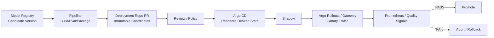
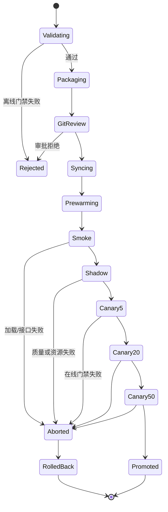

# Pipeline、GitOps、Canary、Shadow 与回滚

模型版本通过离线门禁后，还没有证明它能在生产栈中正常工作。

发布链路还包含：

```text
模型下载与校验
→ 推理引擎加载
→ GPU/NIC/存储拓扑
→ Readiness
→ 网关与流式协议
→ 真实请求分布
→ 在线 SLO 与质量
```

本篇把 Argo Workflows、Argo CD、Argo Rollouts 等能力放入一个明确的发布协议。
工具可以替换，但状态、证据和安全边界不能省略。

## 1. CI、Pipeline、GitOps 与 Rollout 的分工



| 系统 | 负责 | 不应负责 |
| --- | --- | --- |
| CI | 测试代码、构建/签名镜像、生成制品 | 长期持有生产集群管理员凭据 |
| Workflow/Pipeline | 编排有向无环任务、重试、Artifact 传递 | 作为唯一审计来源 |
| Model Registry | 模型版本、Alias、Tag、血缘引用 | 直接修改生产 Deployment |
| Git | 生产期望状态、Review、变更历史 | 保存数百 GB 权重 |
| Argo CD | 将 Git 期望协调到集群 | 决定模型质量 |
| Argo Rollouts/Router | 流量渐进、在线分析、中止 | 替代离线评测 |

## 2. 生产变更清单

Git 仓库保存：

```yaml
release:
  id: chat-70b-20260807-0043
  model:
    registry_name: chat-70b
    registry_version: "43"
    artifact_uri: s3://model-artifacts/chat-70b/sha256/...
    artifact_sha256: ...
    tokenizer_revision: ...
    chat_template_sha256: ...
  runtime:
    image: registry.example.com/vllm@sha256:...
    engine_config_sha256: ...
    tensor_parallel: 8
    dtype: bfloat16
  evaluation:
    id: eval-20260807-0042
    result: PASS
    policy_commit: ...
    report_sha256: ...
```

不保存：

- 模型权重本身。
- Secret 值。
- 可变镜像 Tag。
- 只写 `candidate`/`latest` 的可变引用。

## 3. 发布状态机



每个状态明确：

- 进入条件。
- 超时。
- 成功证据。
- 失败分类。
- 是否可重试。
- 回滚动作。
- 审计记录。

## 4. Pipeline DAG

```text
resolve-candidate
  → verify-lineage
  → verify-artifact
  → build-and-sign-runtime
  → offline-evaluation
  → performance-gate
  → register-evaluation-result
  → render-deployment
  → open-gitops-pr
  → wait-for-approval
  → observe-argocd-sync
  → smoke
  → shadow
  → canary-analysis
  → promote-or-abort
```

可并行：

```text
quality evaluation ─┐
safety evaluation ──┼→ aggregate gate
performance test ───┤
security scan ──────┘
```

任何一个必需分支缺失都不能聚合为 PASS。

## 5. Argo Workflows DAG 骨架

```yaml
apiVersion: argoproj.io/v1alpha1
kind: Workflow
metadata:
  generateName: model-release-
spec:
  serviceAccountName: model-release-workflow
  entrypoint: release
  arguments:
    parameters:
      - name: model-name
      - name: model-version
  templates:
    - name: release
      dag:
        tasks:
          - name: resolve
            template: resolve-candidate

          - name: integrity
            dependencies: [resolve]
            template: verify-artifact

          - name: quality
            dependencies: [integrity]
            template: evaluate-quality

          - name: safety
            dependencies: [integrity]
            template: evaluate-safety

          - name: performance
            dependencies: [integrity]
            template: evaluate-performance

          - name: aggregate
            dependencies: [quality, safety, performance]
            template: aggregate-gates

          - name: render
            dependencies: [aggregate]
            template: render-gitops-change

    - name: verify-artifact
      retryStrategy:
        limit: "2"
        retryPolicy: OnError
        backoff:
          duration: "10s"
          factor: "2"
          maxDuration: "1m"
      container:
        image: registry.example.com/release-tools@sha256:...
        command: ["/app/release"]
        args:
          - verify-artifact
          - "--model={{workflow.parameters.model-name}}"
          - "--version={{workflow.parameters.model-version}}"
```

这是结构示例。真实模板还应固定：

- Artifact 参数/输出。
- 资源 Requests/Limits。
- Node/GPU 约束。
- Active Deadline。
- Pod/Workflow GC。
- Secret 引用。
- 安全上下文。
- 幂等 ID。

Argo Workflows DAG 默认 Fail Fast；是否允许其他分支继续收集证据要明确配置。

## 6. Step 幂等

Workflow 可能因为节点失败、控制器重启或人工重试再次执行。

幂等键：

```text
release_id + step_name + input_digest
```

例：

| Step | 幂等策略 |
| --- | --- |
| Artifact 校验 | 只读，可重复 |
| 评测 | 固定 Evaluation ID，已有完整结果则复用 |
| Model 注册 | 查询是否已存在相同 Artifact Digest |
| 创建 PR | 搜索同 Release ID 的开放/已合并 PR |
| Canary | 根据当前 Rollout 状态协调，不重复创建 |
| Promote Alias | 比较当前指向，无变化不写 |

不能用随机名称逃避重复问题。

## 7. 重试边界

可重试：

- 临时网络错误。
- 429、502、503、504。
- Worker 节点丢失。
- Artifact Store 短时不可用。

不可自动重试：

- Artifact 摘要不匹配。
- 评测门禁 FAIL。
- RBAC 拒绝。
- Schema 错误。
- 安全扫描发现高危。
- 未知结果的非幂等外部写。

重试必须有 deadline 和退避；多层 SDK、Task、Workflow 同时重试会形成乘法放大，应只保留清晰的一层主重试策略。

## 8. Artifact 在步骤间传递

小数据：

- 参数。
- Result。
- ConfigMap（非敏感、小尺寸）。

大数据：

- 对象存储 URI。
- OCI Artifact。
- MLflow Artifact。

步骤间传递：

```text
URI + SHA-256 + Size + Media Type + Schema Version
```

不要反复在 Pipeline 节点之间复制整份大模型。GPU 节点下载应结合：

- Node 本地缓存。
- 并行 Range GET。
- 完整性校验。
- 预热与磁盘水位。

## 9. GitOps 为什么不让 CI 直接 Apply

CI 直接操作生产：

```text
CI → kubectl apply → production
```

问题：

- CI 持有长期生产凭据。
- 实际状态与 Git 可能漂移。
- 审批、回滚和审计割裂。
- 多个 Pipeline 竞争。

GitOps：

```text
Pipeline 生成 PR
→ Review/Policy
→ Merge
→ Argo CD 拉取并协调
```

CI 不需要直接访问生产 API Server。

## 10. Argo CD 同步策略

```yaml
apiVersion: argoproj.io/v1alpha1
kind: Application
metadata:
  name: chat-70b-prod
  namespace: argocd
spec:
  project: ai-serving
  source:
    repoURL: ssh://git.example.com/ops/ai-serving.git
    targetRevision: main
    path: environments/prod/chat-70b
  destination:
    server: https://kubernetes.default.svc
    namespace: ai-serving
  syncPolicy:
    automated:
      enabled: true
      prune: false
      selfHeal: true
    syncOptions:
      - CreateNamespace=false
```

安全点：

- `prune` 默认谨慎，关键资源可要求确认。
- `allowEmpty` 不随意打开。
- AppProject 限制 Source Repo、目标 Cluster/Namespace 和资源类型。
- Argo CD Repository Credential 与运行时 Secret 分离。
- Sync 成功只表示 Kubernetes 对象协调完成，不表示模型 Ready/质量通过。
- 自动同步启用时，回滚应通过恢复 Git 期望版本并配合 Rollout 中止，而不是只在集群手改。

## 11. Prewarm 与 Readiness

模型服务的 Pod Ready 前可能经历：

```text
调度到 GPU 节点
→ 挂载/下载模型
→ 校验
→ 初始化 CUDA/NCCL
→ 加载权重到 HBM
→ 建立 KV Cache
→ CUDA Graph/Warmup
→ 启动 API
→ Smoke Request
→ Readiness
```

Probe 分工：

- Startup：允许长加载，但有最终上限。
- Readiness：是否可以接收真实流量。
- Liveness：进程是否不可恢复卡死，不能把“正在加载”误杀。

Prewarm 验证：

- Artifact Digest。
- HBM 余量。
- 模型/Tokenizer/Template 版本。
- 最小推理请求。
- 流式完整结束。
- 必要的 TP/NCCL 通信。

## 12. Smoke Test

至少覆盖：

```text
/health 或管理端点
非流式最小请求
流式 SSE 请求直到结束
长一点的 Prompt
结构化输出/工具调用（若支持）
取消请求
版本端点
```

验证：

- HTTP 状态。
- Schema。
- 首 Token。
- 完成信号。
- Token 数量。
- 超时。
- 版本坐标。

HTTP 200 但流中途失败不能算通过。

## 13. Shadow

Shadow 将生产请求副本送到候选，但候选响应不返回给用户：

```text
Client
  → Stable（响应用户）
  └→ Shadow Candidate（只比较）
```

适合验证：

- 真实输入分布。
- 模型质量差异。
- 资源与性能。
- 未见过的边界输入。

### Shadow 安全边界

- 用户数据是否允许复制？
- 是否需要脱敏/采样？
- Candidate 会不会调用外部工具、发送消息或产生写操作？
- 请求量是否使 GPU 成本翻倍？
- Shadow 结果保留多久？
- 如何关联 Stable 与 Candidate，而不保存敏感 Payload？

工具调用、支付、发信等有副作用请求必须禁用或使用模拟环境。

### Shadow 不是 Canary

| | Shadow | Canary |
| --- | --- | --- |
| 用户看到候选响应 | 否 | 是 |
| 验证真实质量 | 可离线对比 | 通过用户影响与在线指标 |
| 风险 | 隐私、成本、副作用 | 用户影响 |
| 流量 | 复制 | 分流 |

## 14. Canary 流量

推荐：

```text
0% 预热
→ 1%/5%
→ 20%
→ 50%
→ 100%
```

具体步长由流量和风险决定。

低流量服务的 1% 可能没有统计意义；需要：

- 最小请求数。
- 最大等待时间。
- 合成流量。
- 更高初始比例但更短窗口。
- 人工批准。

## 15. 副本比例不等于精确流量比例

只使用 Kubernetes ReplicaSet 数量：

```text
1 个 Canary Pod / 5 个总 Pod ≈ 20%
```

实际请求可能因连接复用、SSE 长连接、负载均衡和实例性能偏斜而不同。
精确分流需要 Gateway/Ingress/Service Mesh 支持权重。

Argo Rollouts 的 Traffic Routing 可与支持的网络提供者集成，Stable ReplicaSet 保持可承接流量，
失败时快速回切。

## 16. LLM 流量路由特殊性

- SSE 长请求开始后不能在中途切换版本。
- Session/Conversation 可能需要一致性哈希。
- Prefix Cache 命中会让版本间性能不同。
- Prompt 长度分布必须在版本间近似一致。
- TP/PP 实例容量不同，不能只按 Pod 数均分。
- Canary 冷缓存会造成暂时 TTFT 回归，应区分 Warmup 与持续回归。
- Token 配额和排队策略要对版本分别观测。

按：

```text
实际请求数
Prompt Tokens
Generation Tokens
并发
```

验证真实分流，而不是只看配置 Weight。

## 17. Argo Rollouts 骨架

```yaml
apiVersion: argoproj.io/v1alpha1
kind: Rollout
metadata:
  name: chat-70b
spec:
  replicas: 8
  revisionHistoryLimit: 3
  selector:
    matchLabels:
      app: chat-70b
  strategy:
    canary:
      stableService: chat-70b-stable
      canaryService: chat-70b-canary
      steps:
        - setWeight: 5
        - pause:
            duration: 10m
        - analysis:
            templates:
              - templateName: chat-70b-online-gate
        - setWeight: 20
        - pause:
            duration: 20m
        - analysis:
            templates:
              - templateName: chat-70b-online-gate
        - setWeight: 50
        - pause:
            duration: 30m
        - analysis:
            templates:
              - templateName: chat-70b-online-gate
  template:
    metadata:
      labels:
        app: chat-70b
        model-revision: "43"
    spec:
      containers:
        - name: server
          image: registry.example.com/vllm@sha256:...
```

若未配置实际 Traffic Router，`setWeight` 可能主要通过副本比例近似实现；按当前 Argo Rollouts
和所用网关文档配置精确路由。

## 18. 在线 AnalysisTemplate

```yaml
apiVersion: argoproj.io/v1alpha1
kind: AnalysisTemplate
metadata:
  name: chat-70b-online-gate
spec:
  args:
    - name: revision
  metrics:
    - name: availability
      interval: 1m
      count: 10
      successCondition: result[0] >= 0.999
      failureLimit: 2
      provider:
        prometheus:
          address: http://prometheus.monitoring.svc:9090
          query: |
            sum(rate(llm_requests_total{
              model_revision="{{args.revision}}",
              outcome="success"
            }[5m]))
            /
            sum(rate(llm_requests_total{
              model_revision="{{args.revision}}"
            }[5m]))
```

真实模板需处理：

- 空 Vector。
- 分母为 0。
- `NaN`/`Inf`。
- 低流量。
- 指标标签基数。
- 数据新鲜度。
- Prometheus 查询失败。
- Analysis `Inconclusive`。

建议用录制规则预计算复杂表达式，并让 Analysis 查询稳定、低成本的指标。

## 19. 在线门禁

按版本区分：

### 用户结果

- 可用性。
- 流式完成率。
- 错误率。
- TTFT/TPOT/E2E。
- 拒绝/降级比例。

### 服务状态

- waiting/running。
- KV Cache。
- Preemption。
- Request Abort。
- 实例 Ready Capacity。

### 资源

- HBM。
- GPU 利用率、功耗、Xid。
- CPU/内存。
- NIC 丢包/重传。
- Storage 读取/加载时间。

### 质量

- 业务规则。
- 抽样 Judge。
- 用户反馈。
- 工具调用成功率。

在线质量通常到达较慢，不能只靠短窗口错误率证明模型质量。

## 20. 发布与 SLO

Canary 期间同时判断：

```text
候选相对稳定版本是否回归
服务整体是否消耗过多 Error Budget
```

候选 5% 流量即使错误率很高，整体 SLO 可能暂时没有明显变化；因此必须有 Per-Revision 指标。
反过来，平台整体故障时 Candidate 与 Stable 都异常，不应把责任错误归因于候选。

参考：

- [LLM 服务 SLI、SLO 与 SLA](../../sre/reliability/01-LLM服务SLI-SLO-SLA工程化.md)
- [Error Budget 与多窗口燃烧率告警](../../sre/reliability/02-Error-Budget与多窗口燃烧率告警.md)

## 21. 回滚不是只换模型 URI

发布单元：

```text
模型权重
Tokenizer
Chat Template
LoRA/Adapter
推理引擎镜像
启动参数
路由配置
资源规格
环境变量/Feature Flag
```

这些应作为一个 Release Bundle 回滚。

若只回模型：

- 新 Tokenizer 可能与旧权重不兼容。
- 新引擎参数可能仍造成 OOM。
- 新 Template 可能继续破坏输出。
- 新路由可能仍把流量送到错误实例。

## 22. 快速回滚与缓存兼容

保留：

- 旧 Stable ReplicaSet。
- 旧模型 Node Cache（在磁盘预算内）。
- 旧配置和镜像。
- 旧路由。

但需注意：

- KV/Prefix Cache 通常不能跨模型版本复用。
- Tokenizer/Template 变化后缓存键必须隔离。
- 新旧模型并存需要双倍或更多 GPU/磁盘容量。
- Model Artifact 删除策略不能早于回滚窗口。

Argo Rollouts 的 Rollback Window 可以为近几个 Revision 跳过正常渐进步骤进行快速回退；仍需结合
业务兼容性和 GitOps 期望状态设计。

## 23. 中止与回滚流程

```text
在线门禁失败
→ 停止继续提升
→ Candidate Weight 降为 0
→ Stable 承接流量
→ 等待在途 SSE 排空或到 Deadline
→ 验证整体 SLO 恢复
→ 恢复 Git 中稳定 Release Bundle
→ 保留 Candidate 证据
→ Registry 标记 Rejected/RolledBack
→ 生成事件与 RCA
```

回滚本身也可能失败：

- Stable 容量不足。
- 旧 Artifact 已被清理。
- 旧镜像不可拉取。
- 路由控制面异常。
- 数据/Schema 已做不兼容变更。

必须定期演练，不只保留一条 `rollback` 命令。

## 24. 数据库与外部 Schema

模型服务若依赖 Feature Store、Vector DB、Tool API 或数据库：

- 新旧版本并存时 API/Schema 要向后兼容。
- 先扩展 Schema，再发布读写新格式，最后清理旧格式。
- 不可逆数据迁移不能依靠应用回滚恢复。
- Candidate Tool 调用先使用无副作用/沙箱。
- RAG Index 版本与模型版本一起固定。

## 25. GitOps 漂移与 Break-Glass

紧急手工修改集群可能被 `selfHeal` 覆盖。

Break-Glass 流程：

```text
声明事件和负责人
→ 暂停特定应用自动同步（按权限）
→ 执行最小紧急动作
→ 同步修改 Git 期望状态
→ 恢复自动同步
→ 审计和复盘
```

不要长期依赖集群手改。

## 26. 安全与供应链

- Workflow 使用最小 ServiceAccount。
- 每个 Task 只得到需要的 Secret。
- 镜像固定 Digest 并签名/验证。
- 模型 Manifest 和评测报告有摘要。
- Git Commit、PR、审批和发布记录关联。
- CI 不持有长期生产 Token。
- Artifact 下载使用 TLS 和最小权限。
- 第三方模型视为不可信制品，扫描配置、代码和依赖。
- 不执行模型仓库中的任意远程代码，除非已评审并隔离。

## 27. 发布系统可观测性

```text
model_release_total{result}
model_release_duration_seconds{stage}
model_release_current_stage
model_release_gate_total{gate,result}
model_release_rollback_total{reason}
model_release_time_to_rollback_seconds
model_release_shadow_requests_total
model_release_canary_requests_total{revision}
argocd_sync_status
rollout_phase
analysis_run_phase
```

仪表板同时显示：

- Release ID。
- Stable/Candidate Version。
- 当前 Weight。
- 阶段和剩余时间。
- Per-Revision SLI。
- 评测报告与 Git PR。
- 手动暂停/批准状态。

## 28. 故障注入

至少演练：

```text
Artifact 摘要错误
模型下载超时
GPU HBM 不足
Readiness 永不成功
Smoke 流式中断
Shadow Candidate 产生副作用（应被阻断）
Canary 错误率回归
Prometheus 返回空/NaN
Argo CD 同步失败
路由 Weight 配置与实际不一致
Stable 容量不足
回滚时旧 Artifact 不可用
Pipeline 在创建 PR 后崩溃并重试
```

## 29. 一次完整实验

1. 将 Model Version 43 标为 Candidate。
2. Pipeline 验证血缘、Artifact 和离线门禁。
3. 生成固定 Version/Digest 的 GitOps PR。
4. Review 后合并，由 Argo CD 同步。
5. Candidate 完成模型加载、校验、Warmup 和 Smoke。
6. 复制 5% 请求做 Shadow，禁用外部副作用。
7. 对比 Stable/Candidate 质量、TTFT、TPOT、HBM。
8. 进入 5% Canary。
9. 注入 Candidate 5xx 或 TTFT 回归。
10. Analysis 失败，Rollout 中止。
11. Weight 回 0，验证 Stable SLO 恢复。
12. Git 恢复 Stable Release Bundle。
13. Registry 标记 Candidate Rejected，并关联 Incident。
14. 重跑同一 Pipeline，验证不会创建重复 PR/Model Version。

## 30. 验收清单

- [ ] CI、Pipeline、Registry、GitOps 和 Rollout 职责分开。
- [ ] Release Bundle 固定模型、Tokenizer、Template、镜像和参数。
- [ ] DAG 每个 Step 幂等且有清晰重试边界。
- [ ] 大制品通过 URI+Digest 传递，不反复复制。
- [ ] CI 不直接持有生产集群管理员权限。
- [ ] Argo CD AppProject 和 Sync 策略符合最小权限。
- [ ] 模型 Ready 包含加载、校验、Warmup 和真实 Smoke。
- [ ] Shadow 控制隐私、成本和副作用。
- [ ] Canary 按真实请求/Token 验证 Weight。
- [ ] 在线指标按 Model Revision 区分。
- [ ] Analysis 正确处理空值、NaN、低流量和查询失败。
- [ ] 回滚整个 Release Bundle，不只回模型 URI。
- [ ] Stable 有容量且旧 Artifact 在回滚窗口内可用。
- [ ] Git、Registry、评测、Rollout 和 Incident 可相互追溯。
- [ ] 已通过自动中止和回滚演练。

## 31. 参考资料

- [Argo Workflows DAG](https://argo-workflows.readthedocs.io/en/latest/walk-through/dag/)
- [Argo Workflows Fields](https://argo-workflows.readthedocs.io/en/latest/fields/)
- [Argo CD Automated Sync](https://argo-cd.readthedocs.io/en/stable/user-guide/auto_sync/)
- [Argo CD Sync Options](https://argo-cd.readthedocs.io/en/stable/user-guide/sync-options/)
- [Argo Rollouts Analysis](https://argo-rollouts.readthedocs.io/en/stable/features/analysis/)
- [Argo Rollouts Traffic Management](https://argo-rollouts.readthedocs.io/en/latest/features/traffic-management/)
- [Argo Rollouts Rollback Window](https://argo-rollouts.readthedocs.io/en/stable/features/rollback/)
- [KServe](https://kserve.github.io/website/)

仓库已有工具基础介绍：

- [Argo CD](../../cloud-native/kubernetes/operations/application-delivery/08-ArgoCD.md)
- [Argo Rollout](../../cloud-native/kubernetes/operations/application-delivery/09-Argo-Rollout.md)

本文重点是把它们放进模型发布协议，并补齐 LLM 流量、证据、门禁和回滚边界。

