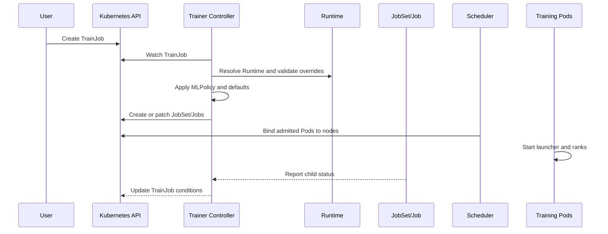

# TrainJob、TrainingRuntime、MLPolicy、JobSet 与协调路径

## 1. TrainJob 只描述本次训练的差异

`TrainJob` 是训练使用者提交的工作负载对象。它通常表达：

- 引用哪个 Runtime；
- 使用什么镜像、训练代码和参数；
- 需要多少训练节点；
- 每个节点需要多少 CPU、内存和 GPU/NPU；
- 数据集、模型和 Checkpoint 从哪里读写；
- 是否覆盖 Runtime 允许修改的字段。

TrainJob 不应复制 ServiceAccount、共享内存、网络端口、Sidecar、调度器集成等全部平台细节。否则 Runtime 失去统一升级和治理价值。

## 2. Runtime 是可复用的执行契约

Trainer V2 有两种作用域：

- `TrainingRuntime`：Namespace 内可用；
- `ClusterTrainingRuntime`：整个集群可引用，适合平台提供标准模板。

Runtime 中的关键内容可理解为四部分：

```text
Runtime
├─ MLPolicy：Torch、MPI 等框架语义
├─ Pod/JobSet 模板：容器、端口、Volume、探针和安全上下文
├─ 可覆盖字段：允许TrainJob改变的参数
└─ 默认值：镜像、启动器、资源和初始化方式
```

它不仅是 YAML 模板，更是平台与训练用户之间的接口。Runtime 升级可能改变镜像、启动器和环境变量，所以应使用清晰版本名，并避免原地修改已被大量任务依赖的语义。

## 3. MLPolicy 把框架语义注入模板

普通 Kubernetes Job 不知道 `RANK`、`WORLD_SIZE`、Master 地址或 MPI Host。`MLPolicy` 负责把分布式训练语义映射到 Pod 和进程。

### 3.1 Torch Policy

Torch 场景通常需要确定：

- 节点数与每节点进程数；
- Master 节点地址和端口；
- Node Rank、World Size；
- `torchrun` 或等价 Elastic Launcher 的参数；
- GPU/NPU 可见设备与每进程设备绑定。

最终仍是训练框架调用 `torch.distributed.init_process_group()`，Trainer 只负责生成一致的启动环境。

### 3.2 MPI Policy

MPI 场景通常区分 Launcher 和 Worker。Launcher 生成 Host 信息并执行 `mpirun`，Worker 提供 SSH 或 MPI Runtime 所需的进程环境。实际实现随 Runtime 和 MPI Operator/集成方式变化，应检查生成对象而不是假设固定拓扑。

## 4. 一次 Reconcile 的完整路径



控制器遵循期望状态模型：读取 TrainJob 和 Runtime，计算应存在的子资源，再创建或修正它们。它不会在一次调用中“执行完整训练”；Controller 重启后仍会通过下一次 Reconcile 恢复工作。

因此技术设计要满足：

- **幂等**：同一状态重复协调不能不断创建新对象；
- **OwnerReference**：子资源可追溯到 TrainJob；
- **Condition**：状态变化可被控制器、CLI 和监控系统消费；
- **Generation**：区分用户新 Spec 与控制器已观察版本；
- **最终状态**：成功、失败和取消能从子资源稳定汇总。

## 5. JobSet 为什么重要

单个 Kubernetes Job 更适合一组同构 Pod。分布式训练常包含 Launcher、Worker、Coordinator 等多个角色，而且需要整体成功、失败传播和组间依赖。JobSet 用多个 `ReplicatedJob` 表达这种结构。

```text
TrainJob
└─ JobSet
   ├─ replicatedJob: launcher × 1
   │  └─ Job → Pod
   └─ replicatedJob: worker × N
      └─ Job → Pods
```

诊断时必须沿 Owner 链逐级查看，不能只执行一次 `kubectl get pods`：

```bash
kubectl get trainjob -A
kubectl describe trainjob <name> -n <namespace>
kubectl get jobset,job,pod -n <namespace> --show-labels
kubectl get events -n <namespace> --sort-by=.metadata.creationTimestamp
```

## 6. 模板合并与安全边界

如果任意 TrainJob 都能覆盖 Runtime 中全部 PodTemplate 字段，用户可能绕过镜像来源、ServiceAccount、HostPath、特权容器和节点隔离策略。生产模板至少应限制：

- 可覆盖的镜像、命令、参数和资源范围；
- 禁止 Privileged、HostNetwork、HostPID 和任意 HostPath；
- 固定或受控的 ServiceAccount；
- 镜像签名、Registry 白名单和不可变 Digest；
- Namespace ResourceQuota、LimitRange 与 GPU 配额；
- Secret 只能以必要权限挂载。

Runtime 负责给出正确默认值，准入策略负责阻止越界，两者不能互相替代。

## 7. 状态为什么可能不一致

TrainJob 显示“已创建”不代表 Pod 已开始训练。状态传播存在层级和时间差：

```text
TrainJob Condition
← JobSet Condition
← Job Complete/Failed
← Pod Phase / Container State
← 训练进程退出码
```

某一 Rank 先退出后，其他 Rank 可能仍阻塞在 Collective；Job 可能在等待重试；Trainer Condition 也可能稍后才更新。排障结论应包含对象时间戳、退出码和第一个异常 Rank，而不是只截取最终的 Failed。

## 8. 验证方法

提交最小任务后，至少验证：

1. `runtimeRef` 解析到预期 Runtime；
2. 生成的 JobSet 角色、副本数正确；
3. 每个 Pod 的命令、环境变量、Volume 和资源与预期一致；
4. Rank、World Size、Master 地址能够互相发现；
5. 任意一个 Worker 异常退出时，失败能传播到 TrainJob；
6. 删除 TrainJob 后，子资源按预期回收。

参考：[TrainingRuntime](https://trainer.kubeflow.org/en/latest/operator-guides/runtime.html)、[Kubeflow Trainer API](https://trainer.kubeflow.org/en/latest/reference/trainer/)。
