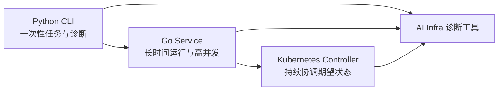

# 自动化工程学习路线

自动化工程不是把一组 Shell 命令复制进脚本，也不是看到告警后自动重启。
一个能进入生产环境的工具，至少要处理：

```text
输入与配置
→ 身份认证与权限
→ API 语义
→ 超时、取消和重试
→ 并发与限速
→ 幂等与状态
→ 结构化输出
→ 测试与故障注入
→ 指标、日志与审计
```

本模块把技术分成三层：



## 1. 先分清脚本、工具和控制器

| 形态 | 触发方式 | 状态 | 典型用途 | 主要风险 |
| --- | --- | --- | --- | --- |
| Shell/Python 脚本 | 人工或 Cron | 通常无状态 | 固定命令编排、一次性采集 | 错误处理弱、输入不可控 |
| Python CLI | 人工、CI、Runbook | 单次执行，可保存结果 | 巡检、证据采集、批量查询 | API 限流、输出不稳定 |
| Go 服务 | 常驻进程 | 内存或外部状态 | 网关、采集器、并发任务 | Goroutine 泄漏、超时失控 |
| Kubernetes Controller | 事件驱动并持续 Reconcile | API 对象保存期望和状态 | Operator、自愈、平台控制面 | 重复执行、缓存过期、写放大 |

选择标准不是语言偏好：

- 一次性只读诊断优先用 Python CLI。
- 长时间运行、高并发、需要严格取消传播的服务可用 Go。
- 当需求是“持续把实际状态协调为期望状态”时才写 Controller。
- 能用 Kubernetes 原生对象、Job 或策略完成的事情，不必创建新 Operator。

## 2. 学习顺序

| 顺序 | 文章 | 完成后能做什么 |
| --- | --- | --- |
| 01 | [Python CLI 与可测试命令行工程](./01-Python-CLI与可测试命令行工程.md) | 写出配置可控、退出码稳定、可测试、默认只读的 CLI |
| 02 | [Python 调用 Kubernetes 与 Prometheus API](./02-Python调用Kubernetes与Prometheus-API.md) | 正确处理分页、List/Watch、RBAC、PromQL 和证据关联 |
| 03 | [Go Context、并发与可靠 HTTP 客户端](./03-Go-Context并发与可靠HTTP客户端.md) | 构建有界并发、可取消、能优雅退出的常驻程序 |
| 04 | [client-go Informer、Workqueue 与 Controller](./04-client-go-Informer-Workqueue与Controller.md) | 理解 List/Watch、本地缓存、队列和幂等 Reconcile |
| 05 | [AI Infra 诊断工具综合项目](./05-AI-Infra诊断工具综合项目.md) | 把 Kubernetes、GPU、网络、存储和 Prometheus 证据生成可审计报告 |

## 3. Python 学到什么程度

重点不是语法，而是工程边界：

- `argparse` 子命令、参数校验和帮助文本。
- `dataclass` 表达不可变配置和结果。
- 依赖注入，避免业务逻辑直接创建 API Client。
- `stdout` 输出结果，`stderr` 输出诊断信息。
- 稳定退出码和机器可读 JSON Schema。
- 请求超时、有限重试、指数退避和抖动。
- 有界线程池，而不是为每个对象创建线程。
- `unittest.mock` 或测试替身验证失败路径。
- 日志脱敏、临时文件权限和证据包校验和。

Python 很适合控制面 I/O 工具，但不应依靠全局解释器状态、无界线程或无限重试支撑生产稳定性。

## 4. Go 学到什么程度

需要能解释并验证：

- `context.Context` 如何传播 deadline 和 cancellation。
- 每个 Goroutine 由谁创建、由谁停止、何时退出。
- Channel 由发送方关闭，接收方如何处理关闭。
- Worker Pool 如何限制并发和内存。
- HTTP Transport 的连接池、Idle Connection 和超时。
- `signal.NotifyContext` 如何实现优雅退出。
- 如何使用 `go test -race`、`pprof` 和指标发现泄漏。
- 错误如何包装、分类并决定是否重试。

“启动很多 Goroutine 很快”不是能力；能证明它们在超时、取消和异常下都会退出才是。

## 5. Controller 的核心心智模型

Controller 不是事件回调脚本。事件只代表“某个对象可能需要重新计算”，最终状态才是事实。

```text
API Server
  → List/Watch
  → Reflector
  → DeltaFIFO
  → Informer / Indexer Cache
  → Event Handler 只入队 key
  → Rate-Limited Workqueue
  → Reconcile(key)
  → 读取缓存并计算差异
  → 必要时写 API
  → 成功 Forget / 失败限速重试
```

合格的 Reconcile 应：

- 幂等。
- 可以重复运行。
- 不依赖事件顺序。
- 能处理对象已删除。
- 能处理缓存稍旧。
- 只在实际有差异时写入。
- 对冲突、限流和临时错误采用有界重试。
- 把业务状态写入 `status`，而不是靠日志猜测。

## 6. 与现有文章的关系

仓库已有 Kubernetes 基础文章：

- [client-go 示例](../cloud-native/kubernetes/extensions/development/04-client-go示例.md)
- [client-go 中的 Informer 源码分析](../cloud-native/kubernetes/extensions/development/05-client-go-informer源码分析.md)
- [Toil 量化与安全自动修复](../sre/reliability/04-Toil量化与安全自动修复.md)

本模块不替代它们：

- 旧文用于了解 client-go 基础调用和 Informer 内部组件。
- 本模块补齐生产 Controller 的队列、幂等、取消、测试、限流和故障恢复。
- 自动修复文章负责“是否允许执行动作”；综合项目默认只读，负责“如何可靠采集证据”。

## 7. 推荐实验环境

```text
本地 Python 虚拟环境
本地 Go Toolchain
kind 或 minikube 测试集群
Prometheus 或 kube-prometheus-stack
一个隔离 namespace
可选：NVIDIA GPU Operator / DCGM Exporter
```

不要先在生产集群授予写权限。学习顺序：

```text
本地假数据
→ 单元测试
→ 测试 namespace 只读
→ 故障注入
→ Shadow / Dry Run
→ 经审批的有限写操作
```

## 8. 模块综合验收

- [ ] CLI 配置优先级明确，帮助、退出码和 JSON 输出稳定。
- [ ] 所有外部请求都有超时和取消。
- [ ] 能处理 Kubernetes 分页、Watch 断开和 `410 Gone`。
- [ ] 能检查 Prometheus 样本新鲜度并区分空结果与查询失败。
- [ ] 并发量有上限，重试有次数、退避和抖动。
- [ ] 能说明每个 Goroutine 的退出条件。
- [ ] Controller 事件处理器只入队 key。
- [ ] Reconcile 幂等，并正确调用 `Done`、`Forget` 或限速重排。
- [ ] 采集器只使用最小只读 RBAC。
- [ ] 测试覆盖超时、429、409、重复事件、对象删除和部分数据源失败。
- [ ] 证据包有时间、版本、来源、错误和 SHA-256 校验和。
- [ ] 有指标证明工具自身没有成为 API Server 或 Prometheus 的压力源。

## 9. 官方资料

- [Python argparse](https://docs.python.org/3/library/argparse.html)
- [Kubernetes API Concepts](https://kubernetes.io/docs/reference/using-api/api-concepts/)
- [Kubernetes Python Client](https://github.com/kubernetes-client/python)
- [Prometheus HTTP API](https://prometheus.io/docs/prometheus/latest/querying/api/)
- [Go Concurrency Patterns: Context](https://go.dev/blog/context)
- [Go Concurrency Patterns: Pipelines and cancellation](https://go.dev/blog/pipelines)
- [client-go](https://github.com/kubernetes/client-go)
- [Kubernetes sample-controller](https://github.com/kubernetes/sample-controller)

