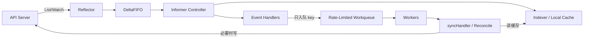

# client-go Informer、Workqueue 与 Controller

Kubernetes Controller 的本质是一个持续执行的控制循环：

```text
观察期望状态和实际状态
→ 计算差异
→ 执行最小动作
→ 再观察
```

它不能假设事件只到一次、严格有序，也不能假设读取的一定是 API Server 最新值。
本篇把 client-go 的数据路径与一个可靠 Controller 的执行语义串起来。

## 1. 为什么不直接轮询 API Server

错误模式：

```go
for {
    pods, _ := client.CoreV1().Pods("").List(...)
    reconcileAll(pods)
    time.Sleep(time.Second)
}
```

问题：

- 集群越大，API Server、etcd 和网络负担越重。
- 大量无变化对象重复反序列化。
- 轮询间隔短造成压力，间隔长造成响应慢。
- 多副本控制器会成倍放大。

Informer 使用 List 建立快照，再用 Watch 接收变化，并维护本地缓存。

## 2. 数据路径



### Reflector

- 初始 List。
- 保存 ResourceVersion。
- 从该版本 Watch。
- Watch 中断后恢复。
- ResourceVersion 过旧时重新 List。

### DeltaFIFO

- 以对象 Key 聚合 Added、Updated、Deleted、Sync 等 Delta。
- 连接 Reflector 与本地缓存处理。
- 不等同于业务 Workqueue。

### Indexer

- 保存本地对象缓存。
- 支持 namespace/name 和自定义 Index。
- Lister 从它读取，而不是每次访问 API Server。

### Event Handler

- 接收 Add/Update/Delete 通知。
- 只计算并入队业务 Key。
- 不执行慢 I/O 和复杂业务。

### Workqueue

- 去重同一 Key。
- Worker 并发消费。
- 失败时限速重排。
- 成功后清除失败历史。

## 3. Event 不是事实

事件的含义是：

```text
“这个 Key 可能需要重新协调”
```

不是：

```text
“请严格执行一次 Add/Update/Delete 动作”
```

原因：

- Watch 会断开和重新 List。
- Resync 可再次投递对象。
- 多次更新可能在队列中合并为一个 Key。
- 删除事件可能只拿到 Tombstone。
- Controller 崩溃后会重新观察最终状态。

Reconcile 必须读取当前状态再决定做什么。

## 4. Event Handler 只入队 Key

```go
func enqueueObject(queue workqueue.RateLimitingInterface, obj any) {
    key, err := cache.MetaNamespaceKeyFunc(obj)
    if err != nil {
        runtime.HandleError(err)
        return
    }
    queue.Add(key)
}
```

Update 过滤：

```go
UpdateFunc: func(oldObj, newObj any) {
    oldMeta := oldObj.(metav1.Object)
    newMeta := newObj.(metav1.Object)
    if oldMeta.GetResourceVersion() == newMeta.GetResourceVersion() {
        return
    }
    enqueueObject(queue, newObj)
},
```

生产中应根据业务依赖判断哪些字段变化需要入队，避免 Status 更新触发无意义循环。

Delete Tombstone：

```go
func deleteObject(queue workqueue.RateLimitingInterface, obj any) {
    key, err := cache.DeletionHandlingMetaNamespaceKeyFunc(obj)
    if err != nil {
        runtime.HandleError(err)
        return
    }
    queue.Add(key)
}
```

## 5. 为什么队列存 Key 而不是对象

对象在排队期间可能已经更新或删除。
如果把旧对象放入业务队列，Worker 会根据陈旧快照执行动作。

存：

```text
namespace/name
```

Worker 出队后从 Lister 获取当前缓存对象。若需跨资源关联，可使用：

- OwnerReference。
- Label/Annotation。
- 自定义 Index。
- 明确的 Spec 引用。

不要扫描整个缓存寻找关联对象。

## 6. Controller 骨架

下面使用经典 `RateLimitingInterface` 表达核心语义。client-go 不同版本可能提供类型化队列 API；
项目应让 `client-go`、`apimachinery`、`api` 使用同一 Kubernetes Minor 兼容版本，并以该版本文档为准。

```go
type Controller struct {
    podLister corelisters.PodLister
    podSynced cache.InformerSynced
    queue     workqueue.RateLimitingInterface
}

func NewController(
    podInformer coreinformers.PodInformer,
) *Controller {
    c := &Controller{
        podLister: podInformer.Lister(),
        podSynced: podInformer.Informer().HasSynced,
        queue: workqueue.NewNamedRateLimitingQueue(
            workqueue.DefaultControllerRateLimiter(),
            "ai-diag-pods",
        ),
    }

    podInformer.Informer().AddEventHandler(
        cache.ResourceEventHandlerFuncs{
            AddFunc: func(obj any) {
                enqueueObject(c.queue, obj)
            },
            UpdateFunc: func(oldObj, newObj any) {
                enqueueObject(c.queue, newObj)
            },
            DeleteFunc: func(obj any) {
                deleteObject(c.queue, obj)
            },
        },
    )
    return c
}
```

启动：

```go
func (c *Controller) Run(ctx context.Context, workers int) error {
    defer runtime.HandleCrash()
    defer c.queue.ShutDown()

    if ok := cache.WaitForCacheSync(ctx.Done(), c.podSynced); !ok {
        return fmt.Errorf("failed to sync informer cache")
    }

    var wg sync.WaitGroup
    wg.Add(workers)
    for i := 0; i < workers; i++ {
        go func() {
            defer wg.Done()
            wait.UntilWithContext(ctx, c.runWorker, time.Second)
        }()
    }

    <-ctx.Done()
    c.queue.ShutDown()
    wg.Wait()
    return nil
}
```

没有 Cache Sync 就开始工作，会把“缓存还没加载到对象”误判为“对象不存在”。

## 7. Worker 的 `Get/Done/Forget/AddRateLimited`

```go
const maxRetries = 8

func (c *Controller) runWorker(ctx context.Context) {
    for c.processNextItem(ctx) {
    }
}

func (c *Controller) processNextItem(ctx context.Context) bool {
    item, shutdown := c.queue.Get()
    if shutdown {
        return false
    }
    defer c.queue.Done(item)

    key, ok := item.(string)
    if !ok {
        c.queue.Forget(item)
        runtime.HandleError(fmt.Errorf("unexpected queue item: %#v", item))
        return true
    }

    err := c.sync(ctx, key)
    if err == nil {
        c.queue.Forget(item)
        return true
    }

    if permanent(err) {
        c.queue.Forget(item)
        runtime.HandleError(fmt.Errorf("permanent error for %s: %w", key, err))
        return true
    }

    if c.queue.NumRequeues(item) < maxRetries {
        c.queue.AddRateLimited(item)
        return true
    }

    c.queue.Forget(item)
    runtime.HandleError(fmt.Errorf(
        "giving up %s after %d retries: %w",
        key,
        maxRetries,
        err,
    ))
    return true
}
```

四个动作：

| 动作 | 语义 |
| --- | --- |
| `Get` | 取出工作项 |
| `Done` | 当前处理结束，必须对每个 Get 调用 |
| `Forget` | 清除该项的限速/失败历史 |
| `AddRateLimited` | 按 RateLimiter 延迟重新入队 |

成功不 `Forget` 会保留失败次数；失败立即 `Add` 会形成热循环。

## 8. 幂等 Reconcile

```go
func (c *Controller) sync(ctx context.Context, key string) error {
    namespace, name, err := cache.SplitMetaNamespaceKey(key)
    if err != nil {
        return permanentError{err}
    }

    pod, err := c.podLister.Pods(namespace).Get(name)
    if apierrors.IsNotFound(err) {
        // 对象已删除：若有外部资源，在这里按记录清理。
        return nil
    }
    if err != nil {
        return err
    }

    // Informer Cache 中的对象归缓存所有，不可原地修改。
    current := pod.DeepCopy()
    desired := calculateDesired(current)

    if alreadyDesired(current, desired) {
        return nil
    }

    return c.apply(ctx, current, desired)
}
```

幂等意味着重复运行得到相同结果：

```text
Reconcile(Reconcile(state)) = Reconcile(state)
```

实践：

- 先计算 Desired。
- 比较 Current 与 Desired。
- 无差异不写 API。
- 外部 API 使用幂等键或可查询的外部 ID。
- 创建前先查是否已经存在。
- 部分成功后再次运行能从现状继续。

## 9. 不要修改 Informer Cache 对象

Lister 返回的对象是共享缓存的一部分：

```go
pod, _ := lister.Pods(ns).Get(name)
pod.Labels["x"] = "y" // 错误
```

必须：

```go
copy := pod.DeepCopy()
copy.Labels["x"] = "y"
```

共享对象原地修改会产生数据竞争、缓存污染和难以复现的错误。

## 10. 缓存旧与 Read-After-Write

写 API 成功后，Informer Cache 需要经过 Watch 才能看到新状态：

```text
Update API 成功
→ etcd 持久化
→ Watch 事件
→ Reflector/DeltaFIFO
→ Indexer 更新
```

因此下一次立即从 Lister 读取，可能仍是旧对象。

策略：

- Reconcile 幂等，等待下一事件。
- 关键 Read-After-Write 可直接从 API Server Get，但不要普遍这样做。
- 写入 Status/Annotation 记录已处理版本。
- 使用 `observedGeneration` 表示 Controller 已处理哪个 Spec Generation。
- 不用固定 Sleep 等缓存追上。

## 11. 写放大与自触发循环

错误：

```go
obj.Status.LastCheckedAt = metav1.Now()
UpdateStatus(obj)
```

每次 Reconcile 都改变时间戳：

```text
Status 写入 → Watch 事件 → 入队 → Status 写入 → ...
```

修复：

- 只在语义状态变化时写。
- 比较 Condition 的 Status/Reason/Message/ObservedGeneration。
- `lastTransitionTime` 只在状态转换时更新。
- 对周期检查使用明确 `AddAfter`，不是靠无意义写入制造事件。

## 12. Conflict 与 Patch

`Update` 使用 ResourceVersion 做乐观并发；发生 409 时：

```text
重新读取最新对象
→ 重新计算期望
→ 再提交
```

不要对旧对象无限 Update。

选择：

| 方法 | 适用 |
| --- | --- |
| Update | Controller 拥有整个 Spec/Status 子资源 |
| Merge/JSON Patch | 修改少数字段 |
| Server-Side Apply | 声明式字段所有权 |
| Status Update/Patch | 只写 Status |

明确 Field Manager 和字段所有权，避免多个 Controller 相互覆盖。

## 13. OwnerReference 与垃圾回收

父对象创建子资源时设置 OwnerReference：

```text
CustomResource
  └── Deployment
      └── ReplicaSet
          └── Pod
```

注意：

- Owner UID 必须正确。
- 跨 namespace OwnerReference 无效。
- 集群范围与 namespace 范围存在约束。
- ControllerRef 通常只有一个 Controller Owner。
- 不要把外部系统资源误认为 Kubernetes GC 能清理。

外部资源需保存稳定外部 ID，并设计幂等删除和失败恢复。

## 14. Finalizer

删除带 Finalizer 的对象：

```text
用户请求删除
→ deletionTimestamp 被设置
→ Controller 清理外部资源
→ 清理成功后移除 Finalizer
→ 对象真正删除
```

Reconcile 分支：

```go
if obj.DeletionTimestamp != nil {
    if containsFinalizer(obj) {
        if err := cleanupExternal(ctx, obj); err != nil {
            return err
        }
        return removeFinalizer(ctx, obj)
    }
    return nil
}
```

清理必须幂等。永久失败的 Finalizer 会让对象永远 Terminating，因此要有：

- 状态与告警。
- 人工 Break-Glass 流程。
- 外部资源不存在时视为清理成功。
- 超时和有限重试，而非热循环。

## 15. 依赖对象如何入队

假设 `ModelService` 引用 ConfigMap：

```text
ConfigMap 更新
→ 找到所有引用它的 ModelService
→ 将这些 ModelService Key 入队
```

不要每次扫描所有对象。为引用字段建立 Index：

```go
indexer.AddIndexers(cache.Indexers{
    "configMapName": func(obj any) ([]string, error) {
        service := obj.(*examplev1.ModelService)
        if service.Spec.ConfigMapName == "" {
            return nil, nil
        }
        return []string{
            service.Namespace + "/" + service.Spec.ConfigMapName,
        }, nil
    },
})
```

## 16. Resync 与周期任务

Informer Resync 不是重新向 API Server List 全部对象的简单同义词，它会让已知对象再次进入处理路径。
不要把非常短的 Resync 当 Cron。

需要周期协调时：

- 成功后 `queue.AddAfter(key, interval)`。
- 使用专门 Scheduler/CronJob。
- 由外部状态变化事件触发。

周期必须加入抖动，避免所有对象同一时刻重排。

## 17. Leader Election

多个 Controller 副本提供可用性时，如果只能有一个活跃写者，使用 Kubernetes Lease 选主。

```text
Leader：
  启动 Informer/Worker 或启用写循环

Follower：
  等待获得 Lease
```

注意：

- Leader Election 不替代幂等。
- 切主时旧 Leader 可能短时间仍在退出。
- Lease Duration、Renew Deadline、Retry Period 要满足网络与 API 延迟。
- 失去领导权时应立即取消 Worker Context。
- 选主指标和切换日志必须可观测。

有些 Controller 即使多副本同时 Reconcile 也可依靠乐观并发安全运行，但需明确证明。

## 18. Rate Limiter 与全局限速

Workqueue RateLimiter 通常解决单 Key 重试退避；还需考虑：

- 全局并发 Worker 数。
- Kubernetes Client QPS/Burst。
- 外部 API 每租户/每目标限速。
- 故障时大量 Key 同时失败的抖动。

队列深度持续增长意味着处理能力不足或错误重试风暴，不能只增加 Worker。

## 19. Controller 指标

```text
controller_reconcile_total{result}
controller_reconcile_duration_seconds
controller_reconcile_errors_total{reason}
controller_queue_depth
controller_queue_adds_total
controller_queue_latency_seconds
controller_work_duration_seconds
controller_retries_total
controller_api_writes_total{verb,resource}
controller_cache_sync_seconds
controller_leader
```

业务 Status 还应表达：

```yaml
status:
  observedGeneration: 12
  conditions:
    - type: Ready
      status: "False"
      reason: ArtifactUnavailable
      message: "model artifact checksum mismatch"
```

Condition 供用户和自动化消费；日志用于调试，不能互相替代。

## 20. 测试层次

### 纯函数单测

- Desired 计算。
- 差异比较。
- Condition 转换。
- Key/Index 生成。
- 错误分类。

### Fake Client

适合验证客户端动作，但注意：

- Fake 不完整模拟 API Server Defaulting/Validation。
- 不完整模拟 ResourceVersion、Watch、Admission 和冲突。
- 不能只靠 Fake 证明生产语义。

### Informer/Queue 测试

- Add/Update/Delete/Tombstone。
- 同 Key 多次入队。
- Cache Sync 前不启动 Worker。
- 临时错误重试后 Forget。
- 永久错误不重试。
- Shutdown 能退出。

### API Server 集成测试

使用真实测试 API Server/测试集群验证：

- CRD Schema。
- Status 子资源。
- Finalizer。
- Conflict。
- Admission。
- RBAC。
- Leader Election。

## 21. 故障注入

至少测试：

```text
Watch 断开
API 429 / 500
409 Conflict
同一事件重复
Delete Tombstone
缓存比 API Server 旧
外部系统成功但 Status 写失败
Controller 在动作中途崩溃
Finalizer 清理超时
Leader 切换
```

重启后应从 API 对象和外部真实状态恢复，不依赖进程内“执行到第几步”变量。

## 22. 与现有文章的配合

建议顺序：

1. [client-go 示例](../cloud-native/kubernetes/extensions/development/04-client-go示例.md)
2. [Informer 源码分析](../cloud-native/kubernetes/extensions/development/05-client-go-informer源码分析.md)
3. 本文的队列、Reconcile、缓存一致性与测试。
4. Kubernetes 官方 `sample-controller`。

旧示例中的一次性 Update 与持续 Controller 的语义不同，不能直接把 Update 代码放进 Event Handler。

## 23. 实验任务

1. 用 Informer 观察测试 namespace 的 Pod。
2. Event Handler 只把 `namespace/name` 入队。
3. 启动前等待 Cache Sync。
4. 实现 2 个 Worker 和最大 5 次限速重试。
5. 对对象重复更新相同值，验证不会产生 API 写入。
6. 注入 409，验证重新读取并计算。
7. 删除对象，处理 Tombstone。
8. 加入一个引用 Index，避免全缓存扫描。
9. 两副本启用 Leader Election，终止 Leader 并观察切换。
10. 检查队列深度、延迟、Reconcile 时长和错误指标。

## 24. 验收清单

- [ ] 能画出 Reflector→DeltaFIFO→Indexer→Handler→Workqueue 路径。
- [ ] 理解 Event 只是重新协调提示。
- [ ] Handler 只入队 Key，不做慢操作。
- [ ] Worker 启动前等待 Cache Sync。
- [ ] 每个 `Get` 都有 `Done`。
- [ ] 成功/永久失败调用 `Forget`，临时失败限速重排。
- [ ] Reconcile 幂等，不修改 Cache 对象。
- [ ] 能处理缓存旧、409、删除和重复事件。
- [ ] 只在语义变化时写 Status，避免自触发循环。
- [ ] OwnerReference、Finalizer 和 observedGeneration 语义正确。
- [ ] 队列、客户端和外部 API 都有限速。
- [ ] 测试不仅使用 Fake Client，还验证真实 API 语义。

## 25. 参考资料

- [client-go](https://github.com/kubernetes/client-go)
- [Kubernetes sample-controller](https://github.com/kubernetes/sample-controller)
- [Kubernetes API Concepts](https://kubernetes.io/docs/reference/using-api/api-concepts/)
- [Kubernetes Controllers](https://kubernetes.io/docs/concepts/architecture/controller/)
- [Kubernetes Finalizers](https://kubernetes.io/docs/concepts/overview/working-with-objects/finalizers/)
- [Kubernetes Leases](https://kubernetes.io/docs/concepts/architecture/leases/)

