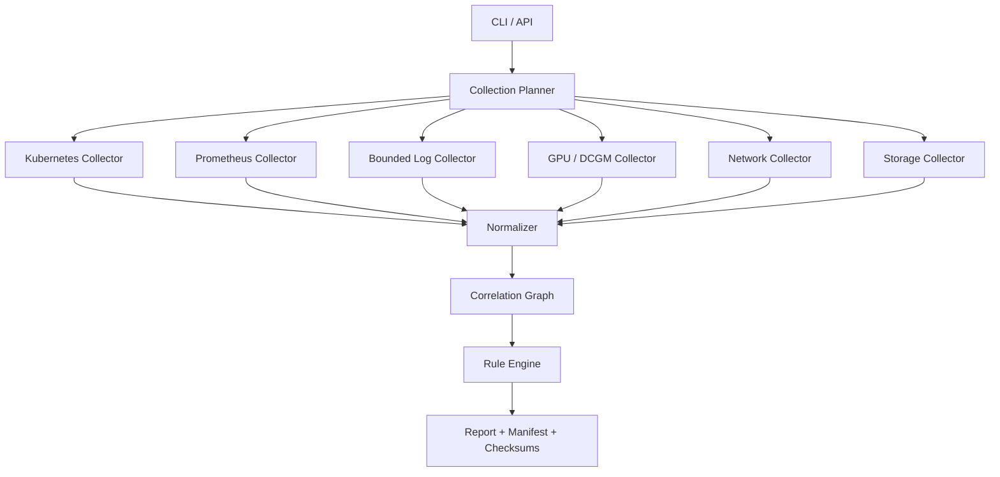

# AI Infra 诊断工具综合项目

本项目把前四篇的 CLI、API、并发和 Controller 思想落到一个实际问题：

```text
当 LLM 服务变慢、Pod 启动失败或 GPU 异常时，
能否用一条只读命令收集完整、带时间与来源的证据，
而不是让值班人员手工执行 30 条命令？
```

目标命令：

```bash
ai-diag collect incident \
  --namespace ai-serving \
  --pod model-7d9f-abcde \
  --since 30m \
  --output-dir ./evidence
```

本项目默认不重启 Pod、不 Cordon 节点、不修改流量。

## 1. 用户故事与非目标

### 1.1 用户故事 {/* #用户故事 */}

- 输入 Pod，自动找到 ReplicaSet、Deployment、Service、EndpointSlice、Node、PVC 和 GPU。
- 输入 Model Revision，找到全部实例和节点。
- 查询事件、容器退出状态、Probe、资源申请、拓扑、指标和有限日志。
- 对齐发布时间、告警时间、Pod 重建时间和指标异常窗口。
- 给出事实、假设和下一步验证，不伪装成确定根因。
- 输出可分享、可脱敏、可校验的证据包。

### 1.2 非目标 {/* #非目标 */}

- 不替代 Prometheus、日志平台或 Trace Backend。
- 不扫描整个集群的所有日志。
- 不把所有异常都映射成一个“健康分”。
- 不直接自动修复。
- 不保证单次采集就能找出所有根因。

## 2. 架构



分层：

| 层 | 作用 |
| --- | --- |
| Planner | 根据入口对象确定目标、时间范围、成本和权限 |
| Collector | 访问单一数据源，保留原始错误和元数据 |
| Normalizer | 转成统一 Evidence Schema |
| Correlator | 通过 UID、Owner、时间和版本建立关系 |
| Rule Engine | 生成 Finding 与待验证假设 |
| Renderer | 输出 JSON、Markdown 和文件清单 |

## 3. 目录结构

```text
ai-diag/
├── src/ai_diag/
│   ├── cli.py
│   ├── config.py
│   ├── planner.py
│   ├── models.py
│   ├── graph.py
│   ├── rules.py
│   ├── redaction.py
│   ├── manifest.py
│   ├── renderers/
│   │   ├── json.py
│   │   └── markdown.py
│   └── collectors/
│       ├── base.py
│       ├── kubernetes.py
│       ├── prometheus.py
│       ├── pod_logs.py
│       ├── dcgm.py
│       ├── network.py
│       └── storage.py
├── schemas/
│   └── evidence-v1.json
├── rules/
│   ├── pod.yaml
│   ├── gpu.yaml
│   ├── network.yaml
│   └── storage.yaml
└── tests/
```

## 4. Evidence 数据模型

每条证据必须回答：

```text
谁采集的？
从哪里采集？
采集哪个目标？
观察时间和样本时间是什么？
原始版本坐标是什么？
是否完整？
是否经过转换/脱敏？
```

```python
from __future__ import annotations

from dataclasses import dataclass, field
from enum import Enum
from typing import Any

class SourceStatus(str, Enum):
    OK = "ok"
    PARTIAL = "partial"
    ERROR = "error"
    DENIED = "denied"
    UNSUPPORTED = "unsupported"

@dataclass(frozen=True)
class ObjectRef:
    cluster: str
    kind: str
    namespace: str | None
    name: str
    uid: str | None

@dataclass(frozen=True)
class Evidence:
    evidence_id: str
    source: str
    source_version: str | None
    target: ObjectRef
    observed_at: str
    sample_time: str | None
    status: SourceStatus
    payload: dict[str, Any]
    errors: tuple[dict[str, str], ...] = ()
    redactions: tuple[str, ...] = ()
```

不要让 `payload` 成为永久无 Schema 的垃圾桶。稳定证据类型应定义独立模型，例如：

```text
PodStateEvidence
KubernetesEventEvidence
MetricSeriesEvidence
GPUHealthEvidence
NetworkCounterEvidence
StorageMountEvidence
```

## 5. 入口解析与关系图

从 Pod 开始：

```text
Pod UID
├── ownerReferences → ReplicaSet UID
│   └── ownerReferences → Deployment UID
├── spec.nodeName → Node UID
├── volumes[].persistentVolumeClaim → PVC UID → PV/StorageClass
├── labels → Model Revision / App
├── Service Selector → Service
│   └── EndpointSlice targetRef.uid → Pod UID
└── GPU allocation/runtime metadata → GPU UUID
```

关系边要记录“如何得到”：

```json
{
  "from": "pod/u-1",
  "to": "node/n-7",
  "relation": "scheduled_on",
  "evidence": "pod.spec.nodeName",
  "confidence": "direct"
}
```

区分：

- `direct`：API 明确引用。
- `label_match`：Selector/Label 匹配。
- `time_correlation`：仅时间相关。
- `heuristic`：启发式推断。

时间相关不能被写成确定因果。

## 6. 采集计划与成本预算

Planner 输出：

```yaml
target:
  pod_uid: ...
time_window:
  start: 2026-08-07T07:30:00Z
  end: 2026-08-07T08:00:00Z
limits:
  total_deadline_seconds: 30
  max_api_requests: 100
  max_prometheus_series: 5000
  max_log_bytes_per_container: 2097152
  max_workers: 8
collectors:
  - kubernetes
  - prometheus
  - dcgm
  - pod_logs
```

Planner 在执行前检查：

- 入口对象是否存在，UID 是否一致。
- 需要哪些 RBAC。
- 时间范围是否超过上限。
- 目标数量是否过大。
- 数据源是否配置。
- 是否可能读取敏感信息。

## 7. Kubernetes Collector

采集：

```text
Pod Spec/Status/Conditions
ContainerState/LastState/RestartCount
Owner Chain
Deployment/StatefulSet Status
Events（按 involvedObject.uid）
Service/EndpointSlice
Node Conditions/Allocatable/Labels/Taints
PVC/PV/StorageClass
ResourceQuota/LimitRange（必要时）
最近相关 Job/Rollout（按版本标签）
```

注意：

- 保存 UID、ResourceVersion、Generation、ObservedGeneration。
- Event 有保留期限，不是完整审计记录。
- Pod 日志是独立权限 `pods/log`。
- Secret、ConfigMap 内容默认不采集；只记录引用名称与 ResourceVersion。
- Node 全量对象可能含大量 Annotation，要白名单保留。

## 8. Prometheus Collector

查询模板按领域组织。

### 8.1 服务 {/* #服务 */}

```text
请求率
错误率
流式完成率
TTFT / TPOT / E2E
waiting / running
KV Cache 使用与抢占
```

### 8.2 GPU {/* #gpu */}

```text
利用率
HBM 使用
功耗/温度/时钟
Xid/ECC
PCIe/NVLink 吞吐（能力取决于 Exporter）
```

### 8.3 网络 {/* #网络 */}

```text
NIC bytes/packets
drop/error
retransmit
RDMA/PFC/ECN（若有）
```

### 8.4 存储 {/* #存储 */}

```text
文件系统空间/Inode
读写吞吐与延迟
NFS retrans/timeout
Ceph client latency/health（若有）
CSI 操作延迟
```

每个模板包含：

```yaml
id: llm_ttft_p95_by_revision
type: range
unit: seconds
required_labels: [namespace, model_revision]
max_range: 2h
min_step: 15s
expected_result: matrix
freshness: 60s
promql: |
  histogram_quantile(
    0.95,
    sum by (le, model_revision) (
      rate(llm_time_to_first_token_seconds_bucket{
        namespace="{{ namespace }}",
        model_revision="{{ model_revision }}"
      }[5m])
    )
  )
```

真实指标名称必须以部署版本的 exporter/vLLM 文档为准，模板需要版本化测试。

## 9. 日志采集边界

默认：

```text
仅目标 Pod
仅已知容器
限定 since
限定 tail/byte
不采集 previous，除非容器确实重启
不采集环境变量
```

日志可能包含：

- Prompt/Response。
- Authorization Header。
- 对象存储签名 URL。
- 用户标识。
- 模型路径和内部域名。

脱敏分两层：

1. 采集前限制来源和范围。
2. 落盘前按规则脱敏。

报告要列出应用了哪些脱敏规则，不能假装原始数据未改变。

## 10. GPU Collector

入口：

- Pod 资源申请：`nvidia.com/gpu` 等。
- Device Plugin/Runtime 提供的设备映射。
- DCGM Exporter 指标标签。
- Node 上只读 DaemonSet Agent（可选）。

统一主键尽量使用 GPU UUID，而不是节点内 Index：

```text
Index 0 会随可见设备、MIG 和容器映射改变
GPU UUID 更稳定
MIG 还需记录 GI/CI 或实例 UUID
```

采集器要声明能力：

```json
{
  "collector": "gpu",
  "capabilities": {
    "dcgm_metrics": true,
    "xid_logs": false,
    "nvlink_counters": false,
    "mig_mapping": true
  }
}
```

缺少能力是 `unsupported`，不是自动推断为“正常”。

## 11. 网络 Collector

网络问题需要分层：

```text
应用连接
→ Pod Namespace
→ veth/CNI
→ Host TCP/IP
→ qdisc/NIC Ring
→ Physical NIC
→ Switch/RDMA Fabric
```

中央 CLI 通过 Kubernetes/Prometheus 获取宏观证据；节点级 `ss`、`ethtool`、`rdma`、eBPF 等需要受控 Agent。

Agent 设计：

- 只开放固定诊断动作，不接受任意 Shell。
- 输入使用结构化参数和白名单。
- 使用 Host PID/Network 等权限时进行独立威胁建模。
- 输出大小、执行时间和并发受限。
- 每次请求带身份、目标、原因和审计 ID。
- 默认不抓 Payload。

## 12. 存储 Collector

从 Pod Volume 追到：

```text
Pod Volume
→ PVC
→ PV
→ StorageClass
→ CSI Driver
→ NodeStage/NodePublish
→ Mount
→ NFS/Ceph/Local NVMe
```

证据：

- Pending/Bound。
- AccessMode、容量、VolumeMode。
- CSI Event 和 Kubelet 挂载错误。
- MountOptions。
- Node 上的挂载点与文件系统使用。
- NFS Client/RPC 指标。
- Ceph Health、Client 延迟和相关 Pool/FS（按权限）。
- 模型文件大小、Manifest 与校验和，不默认读取模型内容。

不要把“PVC Bound”当“应用 I/O 正常”。

## 13. 时间线

所有时间统一转 UTC，保留原始时区：

```text
T-30m 发布开始
T-26m 新 Pod Scheduled
T-25m PVC Mount 完成
T-22m 模型加载开始
T-15m Readiness 成功
T-10m Canary 20%
T-08m TTFT Fast Burn
T-07m GPU HBM 接近上限
T-05m waiting 增长
```

时间线来源要明确：

```text
Kubernetes metadata timestamp
Event timestamp
Prometheus sample timestamp
Log timestamp
采集器 observed_at
```

若节点时钟漂移，标记证据不确定性。

## 14. Rule Engine

Finding 不是 Root Cause：

```python
@dataclass(frozen=True)
class Finding:
    code: str
    severity: str
    summary: str
    evidence_ids: tuple[str, ...]
    hypothesis: str
    next_checks: tuple[str, ...]
    confidence: str
```

规则示例：

```yaml
id: POD_FAILED_MOUNT
when:
  all:
    - pod.ready == false
    - events.reason contains "FailedMount"
emit:
  severity: high
  summary: "Pod 未就绪且出现挂载失败事件"
  hypothesis: "存储挂载阻止容器启动"
  confidence: medium
  next_checks:
    - "检查 CSI Node 日志和 VolumeAttachment"
    - "确认后端 NFS/Ceph 可达性"
```

规则必须：

- 版本化。
- 有单元测试。
- 明确所需证据。
- 缺少证据时返回 `unknown`，不是 `false`。
- 不把相关性写成因果。
- 可在报告中解释为什么触发。

## 15. 三值逻辑

诊断与门禁都不应只有 true/false：

```text
TRUE：有证据支持
FALSE：有证据反驳
UNKNOWN：证据缺失、过期或采集失败
```

例如：

```text
gpu_xid_absent = UNKNOWN
```

当工具没有权限读取内核日志时，不能写成：

```text
gpu_xid_absent = TRUE
```

## 16. 报告结构

```text
report.md
report.json
manifest.json
checksums.sha256
raw/
  kubernetes/
  prometheus/
  logs/
normalized/
  evidence.jsonl
```

Markdown 摘要：

```text
1. 目标与时间范围
2. 数据源完整性
3. 用户影响
4. 关键时间线
5. 资源关系图
6. Findings
7. 待验证假设
8. 下一步安全检查
9. 采集限制与脱敏
```

原始文件不能不加选择地打包。只保存白名单字段，并限制文件权限和保留期限。

## 17. Manifest 与完整性

```json
{
  "schema_version": "1.0",
  "tool_version": "0.4.0",
  "git_commit": "4f0c...",
  "run_id": "01J...",
  "started_at": "...",
  "finished_at": "...",
  "target": {},
  "limits": {},
  "collectors": [],
  "redaction_profile": "prod-v2",
  "files": [
    {
      "path": "report.json",
      "size": 10240,
      "sha256": "..."
    }
  ]
}
```

SHA-256 证明文件自生成后是否改变，不证明数据源说的就是真实根因。

## 18. 安全模型

### 18.1 身份与权限 {/* #身份与权限 */}

- 中央 Collector 使用 namespace 只读 Role。
- Node Agent 使用独立 ServiceAccount。
- Prometheus 使用只读、短期 Token。
- 对象存储上传使用最小路径权限。

### 18.2 输入 {/* #输入 */}

- namespace/name/UID 做格式和存在性校验。
- 不接受任意文件路径。
- 不接受任意 Shell、PromQL 或日志查询。
- 时间范围、对象数、字节数和并发都有上限。

### 18.3 输出 {/* #输出 */}

- Secret/Data/Token/Header/Prompt 默认禁止。
- 路径防穿越。
- 临时目录最小权限。
- 上传加密。
- 自动到期。
- 下载和分享有审计。

## 19. 工具自身的可观测性

```text
ai_diag_runs_total{result}
ai_diag_run_duration_seconds
ai_diag_collector_duration_seconds{collector}
ai_diag_collector_errors_total{collector,reason}
ai_diag_evidence_items{type}
ai_diag_evidence_bytes{type}
ai_diag_redactions_total{rule}
ai_diag_api_requests_total{service,status}
ai_diag_api_retries_total{service}
ai_diag_partial_runs_total
```

还要监控：

- Kubernetes API 429。
- Prometheus Query Duration。
- Node Agent 队列。
- 上传失败。
- 证据保留清理失败。

## 20. 插件边界

如果支持扩展 Collector，插件接口只接受：

```text
只读 Target
时间范围
预算
受限客户端
输出 Evidence
```

不要给插件：

- 集群管理员凭据。
- 任意 Shell。
- 全局文件系统写权限。
- 无界网络访问。

插件需要版本、能力、Schema 和超时。一个插件失败不应导致整个进程崩溃。

## 21. 从诊断到修复的边界

诊断输出可以生成“修复计划候选”：

```yaml
proposed_action: reduce_canary_weight
target_revision: "43"
evidence:
  - finding/TTFT_REGRESSION
preconditions:
  - stable_capacity_sufficient
  - metrics_fresh
requires_approval: true
```

但执行器必须是独立身份、独立命令和独立审计系统。继续阅读：

- [Toil 量化与安全自动修复](../sre/reliability/04-Toil量化与安全自动修复.md)

## 22. 开发里程碑

### 22.1 M1：离线假数据 {/* #m1离线假数据 */}

- CLI、Schema、Renderer。
- 从 Fixture 生成报告。
- 规则单测。

### 22.2 M2：Kubernetes 只读 {/* #m2kubernetes-只读 */}

- Pod/Owner/Node/Service/Endpoint/PVC/Event。
- 最小 RBAC。
- 部分失败。

### 22.3 M3：Prometheus {/* #m3prometheus */}

- 固定模板。
- 样本新鲜度。
- 范围与基数限制。

### 22.4 M4：GPU/网络/存储 {/* #m4gpu网络存储 */}

- DCGM 与基础 Node 指标。
- 能力声明。
- 不部署特权 Agent 也能正常降级。

### 22.5 M5：安全证据包 {/* #m5安全证据包 */}

- 脱敏。
- Manifest/Checksum。
- 保留和上传。

### 22.6 M6：Shadow 生产验证 {/* #m6shadow-生产验证 */}

- 与人工 Runbook 对比。
- 统计覆盖率、误报和采集成本。
- 不执行修复。

## 23. 测试矩阵

| 层 | 测试 |
| --- | --- |
| Model | Schema、序列化、版本兼容 |
| Planner | 预算、权限、目标展开 |
| Collector | 超时、403、404、429、5xx、空结果 |
| Correlator | UID、Owner、Selector、时间关联 |
| Rule | True/False/Unknown、解释和所需证据 |
| Renderer | JSON Schema、Markdown、脱敏 |
| Manifest | 路径、大小、SHA-256 |
| Integration | kind + Prometheus + Fixture |
| Failure Injection | Watch 断开、指标过期、日志过大、Agent 不可达 |
| Security | 路径穿越、PromQL/命令注入、Secret 泄漏 |

## 24. 最终演练

注入场景：

```text
新模型版本发布
→ 模型从 NFS 加载变慢
→ Readiness 延迟
→ Canary 实例少
→ waiting 和 TTFT 上升
→ GPU 利用率反而不高
```

工具应输出：

- 发布与 Pod 时间线。
- PVC/挂载和模型加载证据。
- Endpoint 中可服务实例数。
- waiting/TTFT。
- GPU/HBM。
- “存储加载与容量不足相关”的中等置信假设。
- 下一步检查 NFS Client/Server 延迟和模型缓存。

不应直接输出：

```text
根因就是 NFS，自动重启服务。
```

## 25. 项目验收

- [ ] 一条命令可从 Pod 展开主要资源关系。
- [ ] 所有关系有来源与置信类型。
- [ ] 每个 Collector 有超时、并发、字节和请求上限。
- [ ] API 403、429、超时会形成结构化部分失败。
- [ ] 指标检查时间、类型、新鲜度、NaN/Inf 和空结果。
- [ ] GPU 以 UUID/实例标识关联，不只用 Index。
- [ ] Node Agent 不接受任意 Shell。
- [ ] Rule 使用 True/False/Unknown。
- [ ] Finding 引用 Evidence，并给出下一步验证。
- [ ] 原始数据经过白名单和脱敏。
- [ ] Manifest 固定工具版本、规则版本、Schema 和文件摘要。
- [ ] 全部操作默认只读。
- [ ] 在 Shadow 中证明采集成本和报告价值。

完成这个项目后，你掌握的不只是 Python/Go 语法，而是把
Kubernetes、GPU、网络、存储、监控和 SRE 方法转成可靠工程工具的完整过程。
