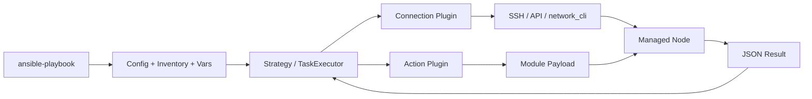

# Ansible 架构、安装与安全实验环境

## 1. 控制端与目标端

Ansible 通常采用无常驻 Agent 的 Push 模式。控制节点安装 `ansible-core`，解析 Playbook 并建立连接；Linux 目标节点一般只需要 SSH 和受支持的 Python。无 Agent 不等于无依赖：Python 解释器、sudo、Shell、文件传输子系统和目标端模块都参与执行。



| 组件 | 职责 | 常见误解 |
| --- | --- | --- |
| Inventory | 定义主机、组及连接变量 | 只是 IP 清单 |
| Playbook | 定义 Play、Task、Handler 和执行策略 | YAML 顺序脚本 |
| Action Plugin | 在控制端准备参数、传输和部分逻辑 | 所有逻辑都在远端 |
| Connection Plugin | SSH、local、network_cli、httpapi 等连接 | 只能 SSH |
| Module | 实现状态检查和变更，返回结构化结果 | 任意 Shell 包装 |
| Strategy | 决定主机和任务怎样推进 | 所有主机永远锁步 |
| Callback | 展示或保存事件结果 | 只是终端颜色 |

## 2. 一次 Task 经历什么

以 `ansible.builtin.file` 创建目录为例：

1. 解析当前配置、Inventory 和变量。
2. 计算 Host Pattern 与 `--limit` 的目标交集。
3. 为目标主机解析 `ansible_connection`、用户、端口和 Python。
4. Action Plugin 规范化模块参数。
5. 连接插件建立 SSH，必要时复用连接。
6. 将模块包装和参数传到远端临时目录。
7. 以连接用户或 Become 用户运行模块。
8. 模块读取实际状态，只在有差异时变更。
9. 模块把 `changed`、`failed`、`msg` 等 JSON 返回控制端。
10. 执行器据此决定是否通知 Handler、停止主机或继续下一任务。

`raw` 是例外：它可以在没有 Python 的目标上直接执行命令，常用于引导安装 Python，不应成为日常模块替代品。

## 3. `ansible-core` 与 `ansible` 包

| 包 | 包含内容 | 适用场景 |
| --- | --- | --- |
| `ansible-core` | 执行引擎、CLI、内置插件与 `ansible.builtin` | 精确控制依赖的工程和执行环境 |
| `ansible` | `ansible-core` 加一组社区 Collection | 学习、通用环境和希望预装常用内容的场景 |

生产项目要固定 Python、`ansible-core` 和 Collection 版本。只锁 `ansible` 顶层包，仍可能在升级时引入大量模块行为变化。

## 4. 建立虚拟环境

```bash
python3 -m venv .venv
source .venv/bin/activate
python -m pip install --upgrade pip
python -m pip install 'ansible-core==<经过验证的版本>' ansible-lint
ansible --version
ansible-config dump --only-changed
```

提交依赖声明，不提交虚拟环境：

```text
ansible-project/
├── ansible.cfg
├── inventories/
│   ├── lab/
│   └── production/
├── playbooks/
├── roles/
├── collections/
│   └── requirements.yml
├── molecule/
└── README.md
```

## 5. 最小安全 `ansible.cfg`

```ini
[defaults]
inventory = inventories/lab/hosts.yml
host_key_checking = True
interpreter_python = auto_silent
retry_files_enabled = False
forks = 10
timeout = 15
log_path = .artifacts/ansible.log

[ssh_connection]
pipelining = True
ssh_args = -o ControlMaster=auto -o ControlPersist=60s
```

配置搜索会受到 `ANSIBLE_CONFIG`、当前目录、用户目录和系统目录影响。含宽松权限的当前目录配置可能被忽略。每次执行证据应保存：

```bash
ansible --version
ansible-config dump --only-changed
```

## 6. 目标端自动化身份

推荐建立普通用户，例如 `ansible-runner`：

```text
SSH 公钥认证
→ known_hosts 校验服务器身份
→ 禁止共享个人私钥
→ sudoers 只授权必要命令或受控 root 执行
→ 每次执行能关联到发起人和作业 ID
```

`become: true` 表示启用提权，不等于已经安全配置密码，也不等于所有任务都应该 root 执行。能以普通用户读取的信息不要提权。

## 7. 最小 Inventory 与连通性测试

```yaml
all:
  children:
    lab:
      hosts:
        lab01:
          ansible_host: 192.0.2.11
        lab02:
          ansible_host: 192.0.2.12
      vars:
        ansible_user: ansible-runner
```

先证明解析结果，再连接：

```bash
ansible-inventory --graph
ansible-inventory --host lab01
ansible lab --list-hosts
ansible lab -m ansible.builtin.ping
```

`ansible.builtin.ping` 不是 ICMP Ping。它验证 Ansible 能登录、找到 Python、执行模块并解析返回值。网络可达性仍应使用网络诊断工具独立验证。

## 8. 实验故障矩阵

主动制造并识别：

| 故障 | 预期证据 |
| --- | --- |
| 错误主机名 | Inventory 或 DNS 解析失败 |
| SSH 端口关闭 | Connection timeout/refused |
| Host Key 改变 | SSH 身份校验失败 |
| 私钥权限错误 | SSH 客户端拒绝密钥 |
| Python 不存在 | Interpreter/module 执行失败 |
| sudo 不允许 | Become 阶段失败 |
| `/tmp` 不可写或 noexec | 临时模块执行失败 |

从 `-vvv` 开始检查，SSH 细节再使用 `-vvvv`。调试输出可能包含主机、路径和参数，不能无筛选地上传公共工单。

## 9. 验收清单

- [ ] 控制端版本由虚拟环境或 Execution Environment 固定。
- [ ] Collection 有版本和校验来源。
- [ ] `ansible --version` 显示预期配置文件。
- [ ] Host Key 检查没有被全局关闭。
- [ ] 自动化使用独立身份和最小 sudo。
- [ ] 能解释 `ping` 成功证明了什么、没有证明什么。
- [ ] 实验 Inventory 与生产 Inventory 物理隔离。

## 10. 官方资料

- [安装 Ansible](https://docs.ansible.com/ansible/latest/installation_guide/index.html)
- [Ansible 架构](https://docs.ansible.com/ansible/latest/dev_guide/overview_architecture.html)
- [连接方法与细节](https://docs.ansible.com/ansible/latest/inventory_guide/connection_details.html)
