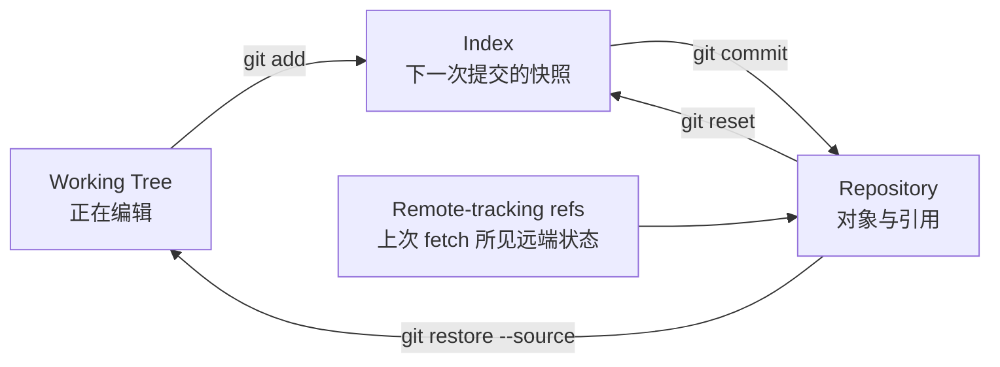

# Git 从零到精通学习路线

Git 不只是保存代码的工具。对自动化工程而言，Git 还是期望状态、变更审查、制品版本和审计证据的来源。真正掌握 Git，需要能够回答：某次提交保存了什么、分支为什么能移动、冲突怎样产生、历史改写影响谁，以及误操作后还能从哪里恢复。

```text
工作区修改
→ 暂存下一棵目录树
→ 创建提交对象
→ 移动本地分支引用
→ 与远端引用协商对象
→ Code Review 与自动测试
→ 合并、标记版本并触发交付
```

## 1. 学习顺序

| 阶段 | 文章 | 完成后的能力 |
| --- | --- | --- |
| 1 | [安装、配置与仓库边界](./01-安装配置与仓库边界.md) | 建立身份、换行符、默认分支和仓库作用域正确的实验环境 |
| 2 | [对象模型、引用、HEAD 与索引](./02-对象模型引用HEAD与索引.md) | 从 Blob、Tree、Commit 和 Ref 解释 Git 的真实状态 |
| 3 | [工作区、暂存区、提交与忽略规则](./03-工作区暂存区提交与忽略规则.md) | 精确选择提交内容并审查暂存前后的差异 |
| 4 | [分支、Merge、Rebase 与冲突](./04-分支Merge-Rebase与冲突.md) | 选择正确的集成方式并安全解决冲突 |
| 5 | [Remote、Fetch、Pull 与 Push](./05-Remote-Fetch-Pull与Push.md) | 理解远端跟踪引用和拉取、推送的实际动作 |
| 6 | [Restore、Reset、Revert 与 Reflog](./06-Restore-Reset-Revert与Reflog.md) | 按是否共享、是否提交选择正确恢复手段 |
| 7 | [协作工作流、Code Review 与发布](./07-协作工作流CodeReview与发布.md) | 设计受保护分支、评审、版本和发布流程 |
| 8 | [Tag、Stash、Worktree、Submodule 与 LFS](./08-Tag-Stash-Worktree-Submodule与LFS.md) | 处理版本标记、并行工作区和外部依赖 |
| 9 | [签名、凭据、Hook 与供应链安全](./09-签名凭据Hook与供应链安全.md) | 控制身份、凭据、自动检查和不可信仓库风险 |
| 10 | [Bisect、Reflog、Fsck 与故障排查](./10-Bisect-Reflog-Fsck与故障排查.md) | 定位引入故障的提交并恢复丢失引用 |
| 11 | [大型仓库性能与维护](./11-大型仓库性能与维护.md) | 处理浅克隆、部分克隆、稀疏检出和仓库维护 |
| 12 | [Git 驱动自动化交付综合项目](./12-Git驱动自动化交付综合项目.md) | 将提交、评审、测试、制品和部署证据串成闭环 |

## 2. 三种状态不要混淆



`git status` 展示工作区和索引相对 `HEAD` 的差异，不代表远端当前状态。只有成功执行 `git fetch` 后，`origin/main` 才代表本次获取到的远端 `main`。

## 3. 学习纪律

- 每个破坏性实验都在临时仓库中完成。
- 执行命令前先运行 `git status --short --branch`。
- 先区分修改是否提交、是否推送、是否被他人基于它继续开发。
- 不把 `git reset --hard`、`git clean -fd` 当成通用清理命令。
- 不在共享分支上随意 Rebase 或强制推送。
- 自动化使用固定身份、最小凭据和受保护分支。

## 4. 推荐实验环境

```bash
git --version
mkdir git-lab
cd git-lab
git init --initial-branch=main
git config user.name "Lab User"
git config user.email "lab@example.invalid"
```

实验身份仅写在仓库本地配置中，避免污染真实全局身份。远端实验可以再创建一个 Bare 仓库，不需要使用线上仓库。

## 5. 掌握标准

- [ ] 能画出工作区、索引、`HEAD`、本地分支和远端跟踪引用。
- [ ] 能用 `git cat-file` 解释 Blob、Tree、Commit 和 Tag。
- [ ] 能区分 Fast-forward、Merge Commit、Rebase 和 Cherry-pick。
- [ ] 能说明 `git pull` 为什么不是一个原子概念。
- [ ] 能根据共享边界选择 Restore、Reset、Revert 或 Reflog。
- [ ] 能在冲突中验证 Base、Ours、Theirs，而不是盲目选择一侧。
- [ ] 能配置受保护分支、必需检查、评审和签名策略。
- [ ] 能用 Bisect 将回归定位为某个提交。
- [ ] 能为自动化仓库建立发布标签、制品关联和回滚证据。

## 6. 官方资料

- [Git Reference](https://git-scm.com/docs)
- [Pro Git](https://git-scm.com/book/en/v2)
- [Git Security](https://git-scm.com/security)
