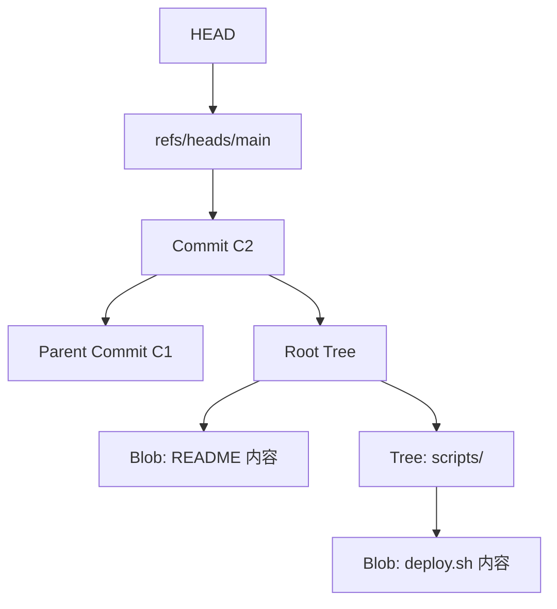

# Git 对象模型、引用、HEAD 与索引

Git 的核心不是“文件差异数据库”，而是内容寻址的对象库加上一组可移动引用。理解对象模型后，分支、标签、Rebase、Reset 和 Reflog 会变成同一套机制的不同操作。

## 1. 四类核心对象

| 对象 | 保存内容 | 不保存什么 |
| --- | --- | --- |
| Blob | 文件内容 | 文件名和目录路径 |
| Tree | 名称、模式以及 Blob/子 Tree 引用 | 提交说明和作者 |
| Commit | 根 Tree、父 Commit、作者、提交者和说明 | 分支名称 |
| Annotated Tag | 被标记对象、标签者、说明和可选签名 | 分支移动规则 |



分支只是指向 Commit 的引用。提交对象本身不知道自己属于哪个分支。

## 2. 亲手查看对象

```bash
git rev-parse HEAD
git cat-file -t HEAD
git cat-file -p HEAD
git ls-tree -r HEAD
```

查看某个文件在 `HEAD` 中的 Blob：

```bash
git rev-parse HEAD:README.md
git cat-file -p HEAD:README.md
```

对象 ID 由对象类型、长度和内容共同计算。Commit 还包含父提交、Tree、作者、提交者和时间等元数据，所以即使文件内容相同，元数据或父链不同也会形成不同的 Commit ID。

## 3. 引用与 HEAD

常见引用：

```text
refs/heads/main              本地分支
refs/remotes/origin/main     远端跟踪引用
refs/tags/v1.0.0             标签
```

查看解析结果：

```bash
git symbolic-ref HEAD
git show-ref --heads --tags
git for-each-ref --format='%(refname) %(objectname:short)'
```

正常情况下，`HEAD` 符号引用当前分支；处于 Detached HEAD 时，`HEAD` 直接指向某个 Commit。Detached HEAD 可以检查和构建旧版本，但新提交若没有创建分支引用，之后可能只能通过 Reflog 找回。

## 4. Index 不是临时文件夹

Index，也称暂存区，保存“下一次提交准备生成的目录树”。它包含路径、文件模式、对象 ID 和冲突阶段等信息：

```bash
git ls-files --stage
git diff --cached
```

`git add` 会把当前内容写成 Blob，并更新 Index 对应路径；`git commit` 根据 Index 构造 Tree 和 Commit。工作区中尚未暂存的内容不会进入该提交。

冲突期间，Index 可以同时保存：

```text
stage 1：共同祖先 Base
stage 2：当前一侧 Ours
stage 3：合入一侧 Theirs
```

可用下面的命令检查，而不是只看冲突标记：

```bash
git ls-files -u
git show :1:path/to/file
git show :2:path/to/file
git show :3:path/to/file
```

在 Rebase 等操作中，Ours/Theirs 的语境容易与直觉不同，应按正在执行的操作和实际内容验证。

## 5. 可达性与回收

Git 从分支、标签、远端跟踪引用和其他引用出发遍历可达对象。移动或删除分支后，对象不会立即消失；Reflog 和维护宽限期通常仍提供恢复窗口，但不能把它当永久备份。

```bash
git reflog --date=iso
git fsck --unreachable
```

远端仓库、工作区未提交文件和被过期策略清理的不可达对象不受本地 Git 恢复承诺保护，因此仍然需要备份和远端保护策略。

## 6. 一次提交的真实过程

```text
git add
→ 内容写入 Blob
→ Index 指向 Blob

git commit
→ Index 写成 Tree
→ 创建包含 Tree 和 Parent 的 Commit
→ 当前分支引用移动到新 Commit
→ HEAD 仍指向当前分支
```

## 7. 实验

```bash
mkdir object-lab && cd object-lab
git init --initial-branch=main
git config user.name "Lab User"
git config user.email "lab@example.invalid"
printf 'v1\n' > app.conf
git add app.conf
git commit -m "config: add v1"

git cat-file -p HEAD
git ls-tree HEAD
git ls-files --stage
```

尝试修改 `app.conf` 后分别比较 `git diff`、`git diff --cached` 和 `git diff HEAD`，确认三者回答的问题不同。
