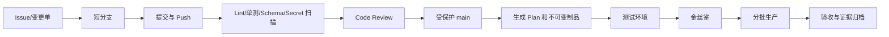

# Git 驱动自动化交付综合项目

本项目不把“Push 后运行脚本”当作完成，而是建立从需求、源码、测试、审批、制品到部署结果的可追溯链路。示例管理 Linux 基线策略，执行器可以替换为 Ansible、Python 或其他平台。

## 1. 目标和非目标

目标：

- 主分支始终可发布。
- 所有变更经过自动检查和 Review。
- 发布使用不可变 Commit 与 Tag。
- 执行前计算目标和差异。
- 先测试环境，再金丝雀，最后分批生产。
- 任一结果都能关联源码、执行人和验收证据。

非目标：

- 不在 CI 中保存生产长期密钥。
- 不允许任意分支直接触发生产写操作。
- 不用移动 Tag 覆盖已经发布的版本。

## 2. 仓库结构

```text
host-baseline/
├── README.md
├── CODEOWNERS
├── CHANGELOG.md
├── .gitattributes
├── .gitignore
├── schemas/
│   └── policy.schema.json
├── inventory/
│   ├── test/
│   └── production/
├── policies/
├── automation/
├── tests/
├── scripts/
│   ├── validate.sh
│   └── render-plan.sh
└── pipeline/
```

Inventory 中不保存密码和私钥。环境差异使用明确目录和 Schema，不依赖隐蔽的分支差异。

## 3. 变更流程



## 4. 本地提交门禁

```bash
git switch -c feat/ssh-baseline
./scripts/validate.sh
git diff --check
git add --patch
git diff --cached
git commit -m "baseline: harden ssh policy"
```

本地检查用于快速反馈；服务端 CI 必须重复执行可信检查，不能信任贡献者声称的结果。

## 5. CI 阶段

推荐顺序：

```text
仓库结构和 Schema
→ 格式与静态检查
→ 单元测试
→ Secret 与依赖扫描
→ 渲染目标和差异
→ 临时环境集成测试
→ 生成带摘要的候选制品
```

合并请求展示：

- 目标主机组和数量。
- 新增、修改、删除的策略。
- 权限和端口变化。
- 无法验证的外部依赖。
- 回滚或补偿方案。

## 6. 发布

合并后由受信流水线创建版本：

```bash
git fetch --tags origin
git tag -a v1.3.0 -m "baseline v1.3.0" <verified-commit>
git push origin refs/tags/v1.3.0
```

发布记录：

```json
{
  "commit": "<full-commit-id>",
  "tag": "v1.3.0",
  "artifact_digest": "sha256:<digest>",
  "pipeline_id": "<id>",
  "policy_schema": "1",
  "approved_change": "<ticket>"
}
```

## 7. 部署门禁

```text
测试环境全部通过
→ 1 台非关键生产节点
→ 验证 SSH 新连接、现有会话、sudo 和监控
→ 小批次节点
→ 观察窗口
→ 剩余节点
```

停止条件示例：连接失败率、验证失败、未预期差异、批次超时或监控异常。流水线必须在超出阈值时停止，而不是继续扩大影响。

## 8. 回退

Git 层面优先 Revert 已共享提交，生成新的候选版本：

```bash
git switch -c revert/ssh-baseline origin/main
git revert <bad-commit>
```

运行时回退可能还需要恢复配置备份、服务状态和外部系统。Git Revert 只恢复仓库期望状态，不能自动撤销所有副作用。

## 9. 验收证据

- Commit、Tag 和制品 Digest 一致。
- CI 检查与审批可查询。
- 生产目标快照和批次清晰。
- 每台节点记录 Before、Action、After。
- 失败节点没有被成功率平均值掩盖。
- 回退版本经过同样测试。
- 发布结束后工作区和远端引用状态明确。

完成该项目后，Git 才真正成为自动化变更控制面，而不只是脚本存放目录。
