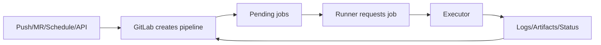

# GitLab CI 架构、Pipeline、Job 与 Runner

## 1. 主路径

## 2. 对象

- Pipeline：一次事件形成的任务图。
- Job：最小调度和状态单元。
- Runner：领取 Job 的执行服务。
- Executor：Shell、Docker、Kubernetes 等实际环境。
- Artifact：Job 输出的受管理文件。

## 3. Runner Scope

Instance、Group、Project Runner 的可见范围不同。生产 Runner 只绑定受信项目/Tag，不运行外部 Fork 代码。

## 4. Job 状态

区分 Created、Pending、Running、Success、Failed、Canceled、Skipped、Manual 等。Pending 很久通常是 Tag/Runner/配额，不一定是脚本慢。

## 5. Pipeline 来源

Push、Merge Request、Tag、Schedule、Parent/Child 和 API Pipeline 的变量与权限不同，规则必须按 `CI_PIPELINE_SOURCE` 等受支持上下文显式设计。

## 6. 部署边界

托管 GitLab 与自建 GitLab 的控制面运维责任不同；Runner 都需要独立容量、安全和升级治理。
