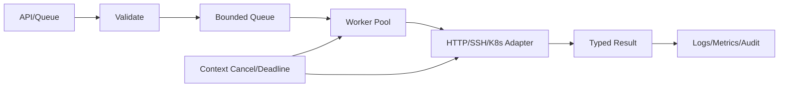

# Go 自动化从零到精通学习路线

Go 适合构建长时间运行、并发量较高、需要单文件制品和明确取消传播的自动化服务。它不是 Python CLI 的必然升级：只有任务需要常驻控制面、严格资源上限或高吞吐时，Go 的工程成本才值得。

## 1. 学习顺序

| 阶段 | 文章 | 能力 |
| --- | --- | --- |
| 1 | [工具链、Module、项目与依赖](./01-工具链Module项目与依赖.md) | 建立可复现项目和版本边界 |
| 2 | [类型、接口、错误与包边界](./02-类型接口错误与包边界.md) | 用小接口和错误链建立领域模型 |
| 3 | [Goroutine、Channel 与内存模型](./03-Goroutine-Channel与内存模型.md) | 正确同步并证明任务退出 |
| 4 | [Context、并发与可靠 HTTP 客户端](./04-Context并发与可靠HTTP客户端.md) | 实现取消、Deadline、连接池与重试 |
| 5 | [配置、CLI、文件与子进程](./05-配置CLI文件与子进程.md) | 构建稳定入口并安全调用系统程序 |
| 6 | [任务队列、限流、幂等与恢复](./06-任务队列限流幂等与恢复.md) | 处理背压、重复任务和未知状态 |
| 7 | [REST、gRPC、SSH 与系统集成](./07-REST-gRPC-SSH与系统集成.md) | 设计有契约和权限边界的适配器 |
| 8 | [client-go Informer、Workqueue 与 Controller](./08-client-go-Informer-Workqueue与Controller.md) | 构建幂等 Kubernetes 控制循环 |
| 9 | [日志、指标、测试、Race 与 Fuzz](./09-日志指标测试Race与Fuzz.md) | 验证并发、协议和失败路径 |
| 10 | [性能、构建、发布与供应链](./10-性能构建发布与供应链.md) | 使用 pprof 并交付可验证制品 |
| 11 | [自动化 Agent 综合项目](./11-自动化Agent综合项目.md) | 完成任务领取、执行、取消和审计闭环 |

## 2. 一条任务主路径

## 3. 掌握标准

- [ ] `go.mod`、Toolchain、依赖和构建参数可追踪。
- [ ] 接口由使用方定义，包导入方向单向。
- [ ] 每个 Goroutine 都有所有者、退出条件和 Wait。
- [ ] Channel 的关闭者唯一且可证明。
- [ ] 所有外部调用接受 Context 并有 Timeout。
- [ ] 队列、并发、连接池、结果和重试均有上限。
- [ ] `go test -race`、Fuzz、集成测试覆盖关键路径。
- [ ] 二进制包含版本信息并关联源码、SBOM 和签名。

## 4. 官方资料

- [Go Documentation](https://go.dev/doc/)
- [Go Memory Model](https://go.dev/ref/mem)
- [Go Modules Reference](https://go.dev/ref/mod)
