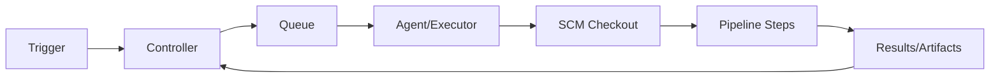

# Jenkins 架构、部署与执行路径

## 1. 组件

| 组件 | 职责 |
| --- | --- |
| Controller | 配置、调度、Pipeline 状态、Web/API、凭据代理 |
| Queue | 等待资源、Label、并发和锁条件的任务 |
| Agent | 实际执行构建的节点/Pod/容器 |
| Executor | Agent 可并发执行的槽位 |
| Plugin | 扩展 SCM、Pipeline、认证、Agent 等 |

Controller 应将 Executor 设为 0 或不承担普通构建，避免不可信代码访问控制面数据。

## 2. 一次执行

## 3. 部署

Controller 使用支持的 Java、持久化 `JENKINS_HOME`、TLS/反向代理、外部身份和备份。Kubernetes 重建 Pod 只提供进程重调度，不等于 Controller 状态的真正高可用。

## 4. 容量

Queue 反映需求，Executor 反映执行容量。增加 Executor 前先看 CPU/内存、外部 API、制品仓库和许可证，避免把瓶颈转移。

## 5. 配置即代码

Jenkins Configuration as Code、Job DSL/Pipeline 和插件清单进入 Git。敏感值用凭据引用，不写配置仓库。

## 6. 实验

先建立独立测试 Controller，禁止匿名写入，创建一个无生产凭据的临时 Agent，验证 Controller 重启后 Pipeline 状态和 Agent 重连行为。
