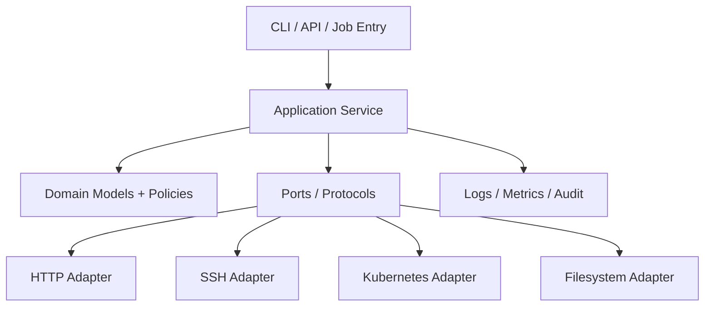

# Python 自动化从零到精通学习路线

Python 自动化不是把 Shell 命令换成 `subprocess.run()`。它的价值在于用稳定的数据模型、API 契约、异常分类、并发控制和测试能力，把一次性脚本升级为可维护工具。

```text
CLI / 配置 / 环境
→ 类型化领域模型
→ 文件、HTTP、SSH、Kubernetes 等适配器
→ 超时、限流、重试和并发
→ 结果聚合与错误分类
→ JSON、日志、指标和证据包
```

## 1. 学习顺序

| 阶段 | 文章 | 完成后的能力 |
| --- | --- | --- |
| 1 | [解释器、虚拟环境、项目与依赖](./01-解释器虚拟环境项目与依赖.md) | 建立隔离、可安装、依赖可追踪的项目 |
| 2 | [类型、数据模型、函数、类与模块](./02-类型数据模型函数类与模块.md) | 用明确模型表达配置、任务和结果 |
| 3 | [异常、上下文管理与资源生命周期](./03-异常上下文管理与资源生命周期.md) | 正确分类错误并保证连接、文件和临时资源释放 |
| 4 | [文件、配置、JSON、YAML 与 Secret](./04-文件配置JSON-YAML与Secret.md) | 安全处理路径、编码、Schema、原子文件和配置优先级 |
| 5 | [Python CLI 与可测试命令行工程](./05-Python-CLI与可测试命令行工程.md) | 构建稳定参数、退出码、结构化输出和 Dry Run |
| 6 | [HTTP API 客户端与可靠调用](./06-HTTP-API客户端与可靠调用.md) | 处理认证、分页、超时、重试、限流和幂等 |
| 7 | [线程、进程、asyncio 与有界并发](./07-线程进程asyncio与有界并发.md) | 按负载选择并发模型并实现取消和背压 |
| 8 | [SSH、SFTP、WinRM 与远程执行](./08-SSH-SFTP-WinRM与远程执行.md) | 将连接、命令、传输和结果建模为安全接口 |
| 9 | [Python 调用 Kubernetes 与 Prometheus API](./09-Python调用Kubernetes与Prometheus-API.md) | 处理分页、List/Watch、RBAC、PromQL 和证据关联 |
| 10 | [日志、指标、追踪与审计证据](./10-日志指标追踪与审计证据.md) | 观测自动化工具自身并关联一次任务的全部证据 |
| 11 | [pytest、Mock、契约测试与故障注入](./11-pytest-Mock契约测试与故障注入.md) | 验证正常、失败、超时、重试和部分成功路径 |
| 12 | [插件、任务、执行器与工作流内核](./12-插件任务执行器与工作流内核.md) | 设计可扩展但边界受控的自动化框架 |
| 13 | [性能、打包、发布与供应链安全](./13-性能打包发布与供应链安全.md) | 分析瓶颈并交付固定版本、可验证的制品 |
| 14 | [多数据源巡检工具综合项目](./14-多数据源巡检工具综合项目.md) | 完成从配置到证据包、测试和生产运行的项目 |

## 2. Python 在自动化体系中的位置

| 场景 | Python 适合度 | 更合适的替代方案 |
| --- | --- | --- |
| API 聚合、诊断 CLI、报表 | 高 | — |
| 中等规模 I/O 并发 | 高 | 高吞吐常驻服务可考虑 Go |
| 多主机配置状态收敛 | 中 | 优先 Ansible |
| 基础设施资源生命周期 | 中 | 优先 Terraform/OpenTofu |
| 持续协调 Kubernetes 对象 | 中 | Controller/Operator |
| 简单命令胶水 | 中 | Shell 更直接 |
| 复杂分布式工作流 | 低 | Temporal、Argo Workflows 等 |

语言不是架构。Python 工具必须尊重目标系统的 API、事务和权限边界。

## 3. 项目分层



入口只解析输入和映射退出码；领域层不直接读取环境变量或创建客户端；适配器负责具体 I/O。这样测试可以替换边界，而不是启动真实集群。

## 4. 推荐实验环境

```bash
python3 --version
python3 -m venv .venv
. .venv/bin/activate
python -m pip install --upgrade pip
```

Windows PowerShell 激活路径不同，但项目仍应通过 `python -m ...` 绑定到当前解释器。生产版本和依赖版本写入制品元数据，不依赖“机器上碰巧安装的 Python”。

## 5. 掌握标准

- [ ] 能解释当前 Python、pip 和虚拟环境来自哪里。
- [ ] 项目可安装，导入不触发网络或系统副作用。
- [ ] 配置、任务、结果和错误都有明确类型。
- [ ] 所有外部调用都有连接与总超时。
- [ ] 重试只覆盖可重试且满足幂等条件的操作。
- [ ] 并发数、队列和结果内存都有上限。
- [ ] stdout、stderr、JSON Schema 和退出码稳定。
- [ ] Secret 不进入日志、异常、进程参数和证据包。
- [ ] 测试覆盖超时、429、连接断开、部分成功和取消。
- [ ] 发布制品能关联源码 Commit、依赖和测试结果。

## 6. 官方资料

- [Python Documentation](https://docs.python.org/3/)
- [Python Packaging User Guide](https://packaging.python.org/)
- [Python Developer Guide](https://devguide.python.org/)
