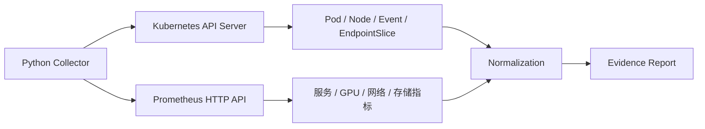

# Python 调用 Kubernetes 与 Prometheus API

把 `kubectl` 与 `curl` 放进 `subprocess` 可以快速验证想法，但生产工具需要直接理解 API：

- HTTP 状态码和错误体。
- Kubernetes 对象 UID、ResourceVersion、分页和 Watch。
- API Priority and Fairness、429 和客户端限流。
- Prometheus 返回的 Vector/Matrix/Scalar/String。
- 指标样本的新鲜度、空结果、`NaN` 和 `Inf`。

本篇构建一个只读采集器，把 Kubernetes 对象与 Prometheus 指标关联起来。

## 1. 控制面与数据面



Kubernetes API 表示资源期望和状态；Prometheus 表示一段时间内的观测。
两者的时间和标识不同，必须显式关联。

## 2. Kubernetes 认证

### 2.1 集群内 {/* #集群内 */}

```python
from kubernetes import client, config

def build_incluster_client() -> client.ApiClient:
    config.load_incluster_config()
    return client.ApiClient()
```

使用 Pod 的 ServiceAccount Token、集群 CA 和 API 地址。推荐：

- 独立 ServiceAccount。
- 最小 RBAC。
- 短期 Bound Token。
- 不把 Token 写入日志或证据包。

### 2.2 集群外 {/* #集群外 */}

```python
def build_kubeconfig_client(
    context: str | None = None,
) -> client.ApiClient:
    config.load_kube_config(context=context)
    return client.ApiClient()
```

不要默认遍历用户 kubeconfig 中的全部 Context。要求显式指定生产 Context，并在输出中记录实际
API Host 和 Context 名称。

## 3. 只读 RBAC

namespace 范围：

```yaml
apiVersion: rbac.authorization.k8s.io/v1
kind: Role
metadata:
  name: ai-diag-reader
  namespace: ai-serving
rules:
  - apiGroups: [""]
    resources: ["pods", "pods/log", "events", "services", "persistentvolumeclaims"]
    verbs: ["get", "list", "watch"]
  - apiGroups: ["apps"]
    resources: ["deployments", "replicasets", "statefulsets"]
    verbs: ["get", "list", "watch"]
  - apiGroups: ["discovery.k8s.io"]
    resources: ["endpointslices"]
    verbs: ["get", "list", "watch"]
```

Node、PersistentVolume 等集群范围资源需要单独 ClusterRole。不要因为采集器需要看 Node，就授予
`cluster-admin`。

用 SelfSubjectAccessReview 或启动前探测列出缺少的权限，让“无权限”和“对象不存在”保持不同。

## 4. Get、List 与 Watch

| 操作 | 用途 | 注意 |
| --- | --- | --- |
| Get | 已知 namespace/name 的单对象 | 名称可能指向重建后的新 UID |
| List | 当前集合快照 | 大集合要分页 |
| Watch | 从某 ResourceVersion 观察变化 | 连接会断，需要恢复或重新 List |

对象关联优先使用：

```text
metadata.uid
ownerReferences.uid
involvedObject.uid
Pod UID
Node UID
GPU UUID
PVC UID
model revision
```

名称是展示字段，不是永远稳定的主键。

## 5. List 分页

```python
from kubernetes import client

def list_all_pods(
    api: client.CoreV1Api,
    namespace: str,
    label_selector: str | None,
    page_size: int = 200,
):
    continue_token = None
    while True:
        response = api.list_namespaced_pod(
            namespace=namespace,
            label_selector=label_selector,
            limit=page_size,
            _continue=continue_token,
            _request_timeout=(3, 15),
        )
        yield from response.items
        continue_token = response.metadata._continue
        if not continue_token:
            break
```

要点：

- `_continue` 是不透明 Token，不能解析或修改。
- 后续页必须保持相同查询参数。
- 限制单页大小减少内存峰值。
- 如果只需要一个 namespace/label，服务端过滤，避免拉全量再过滤。
- 为整个分页过程设置总 deadline，而不只是单页超时。

## 6. Field/Label Selector

```python
api.list_namespaced_pod(
    namespace="ai-serving",
    label_selector="app=vllm,model-revision=42",
    field_selector="status.phase!=Succeeded,status.phase!=Failed",
)
```

Selector 能减少 API Server、网络和客户端负担，但支持哪些 Field 取决于资源类型。
不要假设所有字段都可服务器端筛选。

## 7. 正确理解 ResourceVersion

`metadata.resourceVersion`：

- 是 API Server 并发控制和 Watch 的版本坐标。
- 不应当作数字排序或时间戳。
- 不等于对象 Generation。

`metadata.generation` 通常表示期望 Spec 的代际；Controller 可把已处理代际写入：

```text
status.observedGeneration
```

更新对象时，旧 `resourceVersion` 可能触发 `409 Conflict`。正确做法是重新读取、重新计算差异，
而不是无限重试同一个旧对象。

## 8. List/Watch 循环

Python SDK 的 `watch.Watch()` 可用于学习和低规模工具：

```python
from kubernetes import watch
from kubernetes.client.exceptions import ApiException

def watch_pods(api, namespace: str, stop, initial_rv: str | None = None):
    resource_version = initial_rv

    while not stop.is_set():
        watcher = watch.Watch()
        try:
            for event in watcher.stream(
                api.list_namespaced_pod,
                namespace=namespace,
                resource_version=resource_version,
                timeout_seconds=60,
            ):
                obj = event["object"]
                resource_version = obj.metadata.resource_version
                yield event
                if stop.is_set():
                    watcher.stop()
                    return
        except ApiException as exc:
            if exc.status == 410:
                # 历史版本已不可用：重新 List，重建本地状态，再从新 RV Watch。
                snapshot = api.list_namespaced_pod(namespace=namespace)
                resource_version = snapshot.metadata.resource_version
                yield {"type": "RELIST", "object": snapshot}
                continue
            raise
```

生产语义：

```text
List 当前一致快照
→ 保存 List 返回的 ResourceVersion
→ 从该版本 Watch
→ 处理 Added/Modified/Deleted/Bookmark
→ Watch 超时或断开后从最近版本恢复
→ 410 Gone 时重新 List 并重建状态
```

不能：

- 假设 Watch 永不关闭。
- 忽略 Deleted。
- 只保存对象而不保存 ResourceVersion。
- 410 后继续用旧版本死循环。
- 将 Watch 事件当成完整审计日志。

长时间运行的 Go Controller 通常用 Informer/Reflector 处理这套机制；Python 更适合有限范围采集器。

## 9. API 异常分类

| 状态 | 含义 | 处理 |
| ---: | --- | --- |
| 400/422 | 参数或对象校验错误 | 不重试，修复请求 |
| 401 | 身份无效/过期 | 刷新身份或失败 |
| 403 | RBAC 拒绝 | 明确报告缺失权限 |
| 404 | 对象不存在 | 作为领域状态处理 |
| 409 | 并发冲突 | 重新 Get 并计算 |
| 410 | Watch 版本过旧 | 重新 List |
| 429 | 服务端限流 | 尊重退避，降低并发 |
| 5xx | 临时服务端错误 | 有界重试 |

记录错误时保留：

```text
operation
resource
namespace/name/uid
http_status
reason
retry_count
duration
request_id（若有）
```

不要记录 Authorization Header。

## 10. Prometheus HTTP API

稳定 API 位于：

```text
/api/v1
```

即时查询：

```text
GET /api/v1/query?query=<promql>&time=<rfc3339-or-unix>
```

范围查询：

```text
GET /api/v1/query_range?query=<promql>&start=...&end=...&step=...
```

返回外壳：

```json
{
  "status": "success",
  "data": {
    "resultType": "vector",
    "result": [
      {
        "metric": {"pod": "model-0"},
        "value": [1723017600.0, "1"]
      }
    ]
  }
}
```

HTTP 200 仍需检查 `status`、`errorType`、`error` 和 `warnings`。

## 11. 一个可靠的 Prometheus 客户端

```python
from dataclasses import dataclass
import math
import requests

class PrometheusError(RuntimeError):
    pass

@dataclass(frozen=True)
class Sample:
    labels: dict[str, str]
    timestamp: float
    value: float

class PrometheusClient:
    def __init__(self, base_url: str, session=None):
        self.base_url = base_url.rstrip("/")
        self.session = session or requests.Session()

    def instant_query(
        self,
        expression: str,
        at: float | None,
        timeout: tuple[float, float] = (2.0, 10.0),
    ) -> list[Sample]:
        params = {"query": expression}
        if at is not None:
            params["time"] = str(at)

        response = self.session.get(
            f"{self.base_url}/api/v1/query",
            params=params,
            timeout=timeout,
        )
        response.raise_for_status()
        payload = response.json()

        if payload.get("status") != "success":
            raise PrometheusError(
                f"{payload.get('errorType')}: {payload.get('error')}"
            )

        data = payload["data"]
        if data["resultType"] != "vector":
            raise PrometheusError(
                f"期望 vector，实际为 {data['resultType']}"
            )

        samples = []
        for item in data["result"]:
            ts, raw_value = item["value"]
            value = float(raw_value)
            samples.append(Sample(
                labels=item["metric"],
                timestamp=float(ts),
                value=value,
            ))
        return samples
```

生产还需：

- TLS 验证和短期身份。
- 客户端总 deadline。
- 连接池上限。
- 429/5xx 的有限重试。
- 响应体大小限制。
- 查询允许列表或复杂度限制。
- 记录 `warnings`。

## 12. 结果类型

| `resultType` | 结构 | 常见场景 |
| --- | --- | --- |
| `vector` | 每个 Series 一个时间点 | 即时查询 |
| `matrix` | 每个 Series 一组时间点 | 范围查询 |
| `scalar` | 单一时间与数值 | 标量表达式 |
| `string` | 单一时间与字符串 | 少见 |

Prometheus 数值以字符串返回。转换后需要处理：

```python
if not math.isfinite(value):
    # NaN/Inf 不可直接作为“通过”
    ...
```

空 `result` 也不等于 0。它可能表示：

- 标签写错。
- Target 未采集。
- 时间范围无样本。
- Service Discovery 失败。
- 指标名称版本变化。

## 13. 样本新鲜度

即时查询可能返回 Lookback 窗口内最后一个样本。诊断工具应显式检查：

```python
def ensure_fresh(sample: Sample, now: float, max_age: float) -> None:
    age = now - sample.timestamp
    if age < 0:
        raise ValueError("样本时间位于未来，检查时钟")
    if age > max_age:
        raise ValueError(f"样本已过期: age={age:.1f}s")
```

同时记录：

```text
query_time
sample_time
age
scrape_interval
evaluation_window
```

## 14. 范围查询的 Step 与样本量

粗略样本数：

```text
series_count × (end - start) / step
```

例如 20,000 个 Series、1 小时、15 秒 Step：

```text
20,000 × 240 = 4,800,000 samples
```

诊断 CLI 不应随意查询全标签、长时间范围和 1 秒 Step。应：

- 服务端聚合。
- 限定 namespace/model/pod。
- 先查基数。
- 设置最大时间范围和最小 Step。
- 对录制规则与原始指标分层使用。

## 15. Kubernetes 与指标关联

一个 Pod 到 GPU 指标的关联：

```text
Deployment UID
→ ReplicaSet owner UID
→ Pod UID
→ spec.nodeName / Node UID
→ Pod resource allocation
→ device plugin / runtime 暴露的 GPU UUID
→ DCGM 指标中的 gpu/UUID、Hostname、Pod 标签
```

不能只靠 `pod` 名称跨天 Join，因为 Pod 会重建。报告至少保存：

```yaml
pod:
  namespace: ai-serving
  name: model-0
  uid: ...
  resource_version: ...
  creation_timestamp: ...
node:
  name: gpu-node-17
  uid: ...
model_revision: "42"
observed_at: ...
```

## 16. 查询模板与标签注入

不要把用户输入直接拼进 PromQL：

```python
f'rate(http_requests_total{{pod="{user_input}"}}[5m])'
```

攻击或错误输入可能改变表达式。至少对 label value 做 PromQL 字符串转义，并尽量只允许：

- 固定查询模板。
- 经校验的 namespace/name。
- 明确最大范围。

生产平台可把 PromQL 模板放在版本库，用 ID 调用：

```text
query_id = "llm_ttft_p95_by_revision"
parameters = {"namespace": "...", "revision": "..."}
```

## 17. 有界并发

```python
from concurrent.futures import ThreadPoolExecutor, as_completed

def collect_pods(pods, collect_one, max_workers: int = 8):
    results = []
    errors = []
    with ThreadPoolExecutor(max_workers=max_workers) as pool:
        futures = {pool.submit(collect_one, pod): pod for pod in pods}
        for future in as_completed(futures):
            pod = futures[future]
            try:
                results.append(future.result())
            except Exception as exc:
                errors.append({
                    "pod_uid": pod.metadata.uid,
                    "error": type(exc).__name__,
                })
    return results, errors
```

还要限制：

- 待处理对象总数。
- 每 Host 并发连接。
- QPS/Burst。
- 每项结果大小。
- 整体 deadline。

## 18. 部分失败策略

证据采集不能因为一个指标不存在就丢掉全部结果：

```json
{
  "partial": true,
  "sources": {
    "kubernetes": {"status": "ok"},
    "prometheus": {
      "status": "error",
      "error_type": "timeout"
    },
    "pod_logs": {
      "status": "denied",
      "required_permission": "get pods/log"
    }
  }
}
```

但评测门禁与自动修复不能把 `partial` 当通过。不同调用场景使用不同失败策略：

| 场景 | 部分失败 |
| --- | --- |
| 人工诊断 | 保留已有证据并明显标记 |
| 发布门禁 | Fail Closed 或进入人工审查 |
| 仪表板 | 展示数据缺口 |
| 自动修复 | 禁止动作 |

## 19. 实验任务

1. 使用只读 ServiceAccount 列出指定 namespace 的 Pod。
2. 用 `limit=50` 和 `_continue` 完成分页。
3. 启动 Watch，主动断网后验证恢复。
4. 使用过期 ResourceVersion 模拟/观察重新 List 逻辑。
5. 查询 `up` 的即时 Vector，检查样本新鲜度。
6. 查询 30 分钟 Matrix，计算预计与实际样本数。
7. 模拟空结果、`NaN`、429、403 和超时。
8. 用 Pod UID、Node UID 和 Model Revision 生成关联报告。

## 20. 验收清单

- [ ] 集群内外认证路径明确。
- [ ] RBAC 仅包含必需资源和 Verb。
- [ ] List 使用服务端 Selector 和分页。
- [ ] Watch 能处理断开、超时、删除和 410。
- [ ] 不把 ResourceVersion 当数字或时间戳。
- [ ] 409 会重新读取和计算，不盲重放旧对象。
- [ ] Prometheus 同时检查 HTTP 状态与响应 `status`。
- [ ] 区分空结果、0、NaN、Inf 和查询失败。
- [ ] 检查样本新鲜度。
- [ ] 范围查询限制时间、Step 和 Series 基数。
- [ ] 并发、QPS、响应大小和总 deadline 有上限。
- [ ] 报告保存稳定 UID、版本坐标和部分失败。

## 21. 参考资料

- [Kubernetes API Concepts](https://kubernetes.io/docs/reference/using-api/api-concepts/)
- [Kubernetes Python Client](https://github.com/kubernetes-client/python)
- [Kubernetes RBAC](https://kubernetes.io/docs/reference/access-authn-authz/rbac/)
- [Prometheus HTTP API](https://prometheus.io/docs/prometheus/latest/querying/api/)
- [PromQL Basics](https://prometheus.io/docs/prometheus/latest/querying/basics/)
