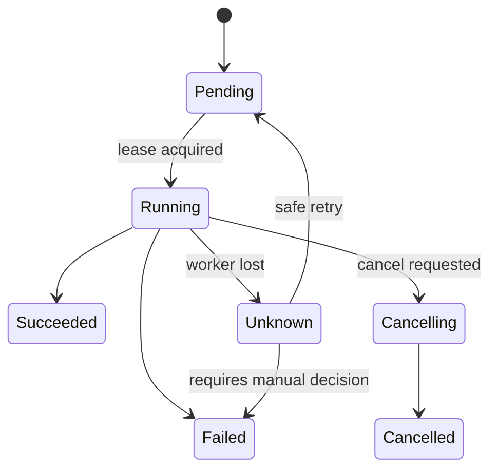

# Python 插件、任务、执行器与工作流内核

当自动化工具需要新增很多检查器和动作时，最容易走向“动态导入任意 Python 文件”。插件化的重点不是加载代码，而是稳定协议、能力限制、版本兼容和不可信代码边界。

## 1. 核心对象

```python
from dataclasses import dataclass
from enum import StrEnum
from typing import Protocol

class TaskState(StrEnum):
    PENDING = "pending"
    RUNNING = "running"
    SUCCEEDED = "succeeded"
    FAILED = "failed"
    CANCELLED = "cancelled"
    UNKNOWN = "unknown"

@dataclass(frozen=True)
class Task:
    task_id: str
    plugin: str
    target: str
    parameters: dict[str, object]
    deadline_seconds: float

class Plugin(Protocol):
    name: str
    api_version: str

    def validate(self, task: Task) -> None: ...
    def execute(self, task: Task) -> TaskResult: ...
```

参数仍需按每个插件的 Schema 校验，`dict[str, object]` 不是放弃类型约束的理由。

## 2. 执行状态机



Worker 丢失后不能直接假设任务失败，因为远端副作用可能已经完成。需要幂等键、查询确认或人工处理未知状态。

## 3. 插件发现

Python Packaging Entry Points 可以让已安装 Distribution 声明插件。加载前检查：

- 插件名称和 API 版本。
- 包版本、来源和签名/Hash。
- 允许列表。
- 依赖冲突。
- 声明的能力和权限。

插件与主程序运行在同一解释器时拥有同等进程权限，Entry Point 不是安全沙箱。不可信插件必须进程或容器隔离。

## 4. 能力模型

```text
read_inventory
read_metrics
read_logs
execute_remote_readonly
write_configuration
restart_service
modify_cluster
```

任务模板声明需要哪些能力，执行身份只获得对应最小权限。只读和写操作使用不同队列、Worker 和审批规则。

## 5. 执行器职责

执行器负责：

- 校验任务和插件版本。
- 获取租约并维护心跳。
- 应用 Deadline、并发和速率限制。
- 注入客户端、日志和追踪上下文。
- 收集结果、证据和错误分类。
- 响应取消。
- 写入最终状态。

插件负责具体领域动作，不应绕过执行器自行创建无限线程、读取任意 Secret 或改写任务状态。

## 6. 重试和幂等

```text
任务级重试
≠ HTTP 客户端级重试
≠ 队列投递重试
```

统一计算总预算。写操作需要业务幂等键和结果查询；读操作也要考虑昂贵查询、配额和快照一致性。

## 7. 版本兼容

分别管理：

- Task Schema 版本。
- Plugin API 版本。
- 插件包版本。
- 结果 Schema 版本。
- 执行环境版本。

升级时允许新旧 Worker 并存，并明确哪些任务可以被哪个版本领取。不能只依靠 Python Import 成功判断兼容。

## 8. 为什么不继续自制

当需求扩展到以下范围时，应评估成熟工作流平台：

- 持久化 DAG 和跨日执行。
- 分布式 Worker、重放和补偿。
- 多租户、队列优先级和配额。
- 人工审批、定时任务和可视化。
- 跨语言任务和长期兼容。

Python 任务内核适合作为理解原理和轻量内部工具，不应无边界复制 Temporal、Argo Workflows 或 AWX。

## 9. 验收

- [ ] 插件接口和结果 Schema 有版本。
- [ ] 未知插件默认拒绝。
- [ ] 插件权限按能力授予。
- [ ] Worker 丢失后区分失败与未知。
- [ ] 重试总预算不会层层放大。
- [ ] 不可信插件不能与控制面同进程运行。
- [ ] 审计记录能关联任务、插件、制品和执行环境。
