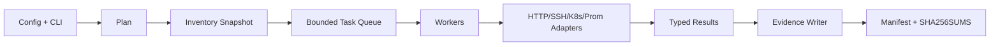

# Python 多数据源巡检工具综合项目

本项目实现 `fleet-audit`：读取资产清单，对目标执行只读系统与服务检查，关联 Kubernetes 和 Prometheus 证据，输出版本化 JSON Lines 与审计 Manifest。重点是 Python 工程结构，不是重复各技术栈的排障知识。

## 1. 安全边界

第一版只读：

- 不重启服务。
- 不修改配置。
- 不驱逐 Pod。
- 不运行任意用户命令。
- 不接受任意文件写入路径。
- 不把 Secret 和完整远端输出写入证据包。

只读仍可能压垮 API 或泄露数据，因此同样需要权限、限流和审计。

## 2. 用户接口

```bash
fleet-audit plan --config audit.json
fleet-audit run --config audit.json --output evidence/
fleet-audit verify-evidence evidence/<run-id>/
```

`plan` 输出目标数量、检查器、权限需求、预计请求量和不能验证的依赖。`run` 只有显式提供输出目录才写证据。

## 3. 项目结构

```text
fleet-audit/
├── pyproject.toml
├── src/fleet_audit/
│   ├── cli.py
│   ├── config.py
│   ├── models.py
│   ├── errors.py
│   ├── service.py
│   ├── executor.py
│   ├── evidence.py
│   └── adapters/
│       ├── inventory.py
│       ├── http.py
│       ├── ssh.py
│       ├── kubernetes.py
│       └── prometheus.py
└── tests/
    ├── unit/
    ├── contract/
    └── integration/
```

## 4. 数据模型

```python
@dataclass(frozen=True)
class AuditRequest:
    run_id: str
    target_selector: dict[str, str]
    checks: tuple[str, ...]
    deadline_seconds: float
    concurrency: int

@dataclass(frozen=True)
class AuditResult:
    target_id: str
    check: str
    state: str
    observed_at: str
    source: str
    source_version: str | None
    evidence: dict[str, object]
    error_type: str | None = None
```

所有时间使用带时区 UTC，结果包含来源和新鲜度，不能把查询时间当观测数据时间。

## 5. 执行链



Inventory 先生成快照，避免执行期间目标集合无声变化。每个 Adapter 都有独立 Timeout、错误映射和配额。

## 6. 并发与失败

默认策略：

```text
全局并发上限
+ 每数据源连接池上限
+ 每目标最多一个高成本检查
+ 总 Deadline
```

结果分为：

- `ok`：检查成功且条件满足。
- `degraded`：数据完整但超过告警阈值。
- `failed`：检查完成并确认失败。
- `unknown`：超时、权限、数据过期或依赖不可用，无法判断目标健康。

不能把 Unknown 当 Healthy。

## 7. 证据写入

采用 JSON Lines 流式写出，避免全部结果驻留内存。先写临时文件，Flush、Fsync 后原子 Rename。最后生成 Manifest 和 Hash；若任何关键文件不完整，Manifest 标记 `partial`。

证据字段采用允许列表，远端 stderr 仅保留受控摘要。生产地址和用户名按组织策略脱敏。

## 8. 测试

单元测试：

- 配置和选择器校验。
- 阈值边界。
- 错误与退出码映射。
- 证据 Schema 和脱敏。

契约测试：

- HTTP 分页、429 和 Schema 漂移。
- SSH 连接与远端非零分类。
- Kubernetes 分页、RBAC 和 `410 Gone`。
- Prometheus 空结果、过期样本和部分响应。

故障注入：

- 一半目标超时。
- Inventory 中途变化。
- 磁盘满。
- SIGTERM。
- 下游持续 429。
- 证据文件 Hash 不匹配。

## 9. 生产部署

```text
Git 受保护分支
→ 构建 Wheel/镜像
→ 单测与契约测试
→ SBOM/扫描/签名
→ 测试环境只读身份
→ 小规模目标
→ 全量只读巡检
```

调度平台传入短期凭据，运行容器使用非 root、只读文件系统和专用证据卷。资源限制和最长执行时间与目标规模匹配。

## 10. 与 AI Infra 项目的衔接

完成 Python 工程后，继续学习 [AI Infra 诊断工具综合项目](../05-AI-Infra诊断工具综合项目.md)，把 GPU、网络、存储和 Kubernetes 专项证据加入同一运行记录。

## 11. 毕业验收

- [ ] `plan` 能证明目标和预计请求量。
- [ ] 并发、连接池、分页和结果内存都有上限。
- [ ] 所有数据源有超时和稳定错误分类。
- [ ] Unknown 与 Failed/Healthy 明确区分。
- [ ] 证据包可校验且不包含 Secret。
- [ ] 中断后没有后台请求继续运行。
- [ ] 测试覆盖部分失败、磁盘满和限流。
- [ ] 制品可关联 Commit、依赖、SBOM 和测试。
