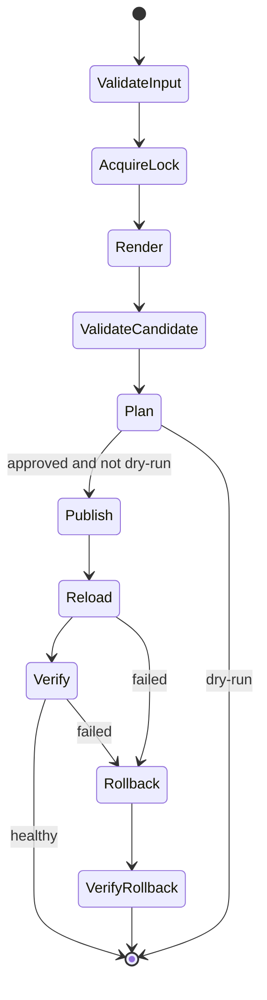

# Shell 安全配置发布综合项目

本项目发布单机服务配置，重点不是模板内容，而是安全变更协议。多主机批量发布应迁移到 Ansible 或工作流平台，但单机执行单元仍需要相同的验证和回退能力。

## 1. 需求

```text
输入：环境、源模板、目标文件、服务名称、Dry Run
前置：目标在允许目录、服务存在、只运行一个实例
计划：渲染候选文件、验证语法、展示脱敏差异
执行：备份旧文件、原子切换、Reload
验收：配置生效、进程健康、端口和业务探针正常
失败：恢复备份、再次验证、记录部分失败
输出：稳定退出码和审计摘要
```

## 2. 状态机



## 3. 项目结构

```text
safe-config-deploy/
├── README.md
├── scripts/
│   └── deploy-config.sh
├── lib/
│   ├── logging.sh
│   ├── validation.sh
│   └── filesystem.sh
├── templates/
├── tests/
│   ├── unit/
│   └── integration/
└── test-bin/
```

库文件不执行主流程；入口脚本最后调用 `main "$@"`。

## 4. 入口骨架

```bash
#!/usr/bin/env bash
set -Eeuo pipefail

readonly RC_USAGE=2
readonly RC_VALIDATION=4
readonly RC_PUBLISH=5
readonly RC_ROLLBACK=6

dry_run=false
tmpfile=''
backup=''
published=false

cleanup() {
  local rc=$?
  if [[ -n $tmpfile && -e $tmpfile ]]; then
    rm -f -- "$tmpfile"
  fi
  exit "$rc"
}
trap cleanup EXIT

main() {
  parse_args "$@"
  validate_inputs
  acquire_lock
  render_candidate
  validate_candidate
  show_plan
  [[ $dry_run == true ]] && return 0
  publish_candidate
  reload_service
  verify_service || rollback
  write_audit_record
}

main "$@"
```

这是结构示例，每个函数仍要实现明确错误分类和路径验证。

## 5. 互斥与候选文件

```bash
exec 9>/run/lock/app-config-deploy.lock
flock -n 9 || {
  printf 'deployment already running\n' >&2
  exit 7
}

target=/etc/app/app.conf
target_dir=$(dirname -- "$target")
tmpfile=$(mktemp --tmpdir="$target_dir" '.app.conf.XXXXXX')
chmod 0640 "$tmpfile"
```

候选文件位于目标文件系统，才能使用 Rename 切换。目标目录、Owner、Group、Mode 和 SELinux Label 必须按实际服务补齐验证。

## 6. 验证与计划

```bash
render_config >"$tmpfile"
app --check-config "$tmpfile"

if cmp -s -- "$target" "$tmpfile"; then
  printf 'no change\n' >&2
  exit 0
fi

diff -u --label current --label candidate "$target" "$tmpfile" || diff_rc=$?
```

`diff` 返回 `1` 通常表示存在差异，不等同执行错误；大于 `1` 才是诊断失败。显示 Diff 前要对 Secret 字段脱敏。

## 7. 发布和验收

```bash
backup=/var/lib/app-config/backups/app.conf.$(date -u +%Y%m%dT%H%M%SZ)
install -D -m 0600 -- "$target" "$backup"

chown root:app "$tmpfile"
chmod 0640 "$tmpfile"
mv -f -- "$tmpfile" "$target"
tmpfile=''
published=true

systemctl reload app
systemctl is-active --quiet app
curl --fail --silent --show-error --max-time 5 \
  http://127.0.0.1:8080/healthz >/dev/null
```

Reload 成功只说明管理命令接受请求，不能替代进程、端口和业务验证。

## 8. 回退

```bash
rollback() {
  if [[ $published == true && -r $backup ]]; then
    install -m 0640 -o root -g app -- "$backup" "$target"
    app --check-config "$target" || return "$RC_ROLLBACK"
    systemctl reload app || return "$RC_ROLLBACK"
    systemctl is-active --quiet app || return "$RC_ROLLBACK"
  fi
  return "$RC_PUBLISH"
}
```

回退也可能失败，所以要区分“原变更失败但回退成功”和“回退失败、服务状态未知”。后者必须触发人工响应。

## 9. 审计记录

记录但不包含 Secret：

```text
脚本 Git Commit
执行用户与主机
目标文件和服务
候选配置摘要
旧配置摘要与备份位置
开始/结束时间
Dry Run/Apply
Reload 和健康检查结果
最终状态与退出码
```

## 10. 毕业验收

- [ ] 连续执行两次，第二次无变化。
- [ ] 候选配置失败时正式文件不变。
- [ ] 两个实例并发时只有一个获得锁。
- [ ] Reload 失败能够恢复并重新验证。
- [ ] TERM 不会留下半文件和孤儿进程。
- [ ] Diff、日志和审计中没有 Secret。
- [ ] ShellCheck、shfmt、Bats 和隔离集成测试通过。
- [ ] 明确说明何时应改用 Ansible。
