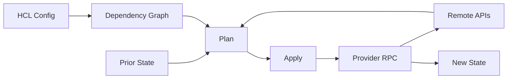

# Terraform/OpenTofu 从零到精通学习路线

Terraform 和 OpenTofu 用声明式配置描述资源期望状态，通过 Provider 读取真实状态、计算差异并调用外部 API。精通的核心不是会写 Resource，而是能安全管理 State、升级 Provider、重构地址、处理漂移和并发变更。

## 1. 学习顺序

| 阶段 | 文章 | 能力 |
| --- | --- | --- |
| 1 | [IaC 定位、架构与工具边界](./01-IaC定位架构与工具边界.md) | 区分 IaC、配置管理和 GitOps |
| 2 | [安装、CLI、Provider 与 Init](./02-安装CLI-Provider与Init.md) | 建立锁定版本和可信 Provider 环境 |
| 3 | [HCL、类型、变量、Local 与 Output](./03-HCL类型变量Local与Output.md) | 编写可验证、接口明确的配置 |
| 4 | [Resource、Data、依赖图与生命周期](./04-Resource-Data依赖图与生命周期.md) | 解释资源地址、图执行和替换传播 |
| 5 | [Plan、Apply、Refresh 与 Destroy](./05-Plan-Apply-Refresh与Destroy.md) | 建立审查、保存 Plan 和销毁门禁 |
| 6 | [State、Backend、锁与恢复](./06-State-Backend锁与恢复.md) | 治理共享 State、并发、备份和恢复 |
| 7 | [Module、环境、版本与复用](./07-Module环境版本与复用.md) | 设计小接口 Module 和环境边界 |
| 8 | [Import、Moved、重构与漂移](./08-Import-Moved重构与漂移.md) | 安全接管资源并迁移地址 |
| 9 | [测试、CI、Policy 与安全](./09-测试CI-Policy与安全.md) | 建立自动检查、权限和变更门禁 |
| 10 | [性能、升级与故障排查](./10-性能升级与故障排查.md) | 定位锁、Provider、API 和图瓶颈 |
| 11 | [Terraform、Ansible 与 Kubernetes 综合项目](./11-Terraform-Ansible-Kubernetes综合项目.md) | 串联资源创建、配置和应用交付 |

## 2. 核心路径

## 3. 工具选择

团队选择 Terraform 或 OpenTofu 后，应固定 CLI、Provider、Module、Backend 和流水线版本。两者存在共同历史但会独立演进，不应假设任意版本可无风险交替操作同一 State。

示例默认使用 `terraform`，OpenTofu 对应命令通常为 `tofu`；具体参数以所选版本官方文档为准。

## 4. 掌握标准

- [ ] 能从资源地址解释 State 与远端对象映射。
- [ ] Provider 和 Module 版本锁定且来源可信。
- [ ] Plan 与 Apply 使用同一源码、变量和锁文件。
- [ ] State 远程存储、访问最小化、加密、锁和备份明确。
- [ ] `sensitive` 不被误解为 State 加密。
- [ ] 重构使用 Moved/Import 等受控机制，不靠手工改 State。
- [ ] 漂移、部分 Apply、锁遗留和 Provider 升级都有 Runbook。
- [ ] 高风险 Replace/Destroy 经过审批和业务验收。

## 5. 官方资料

- [Terraform Documentation](https://developer.hashicorp.com/terraform/docs)
- [OpenTofu Documentation](https://opentofu.org/docs/)
