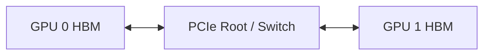
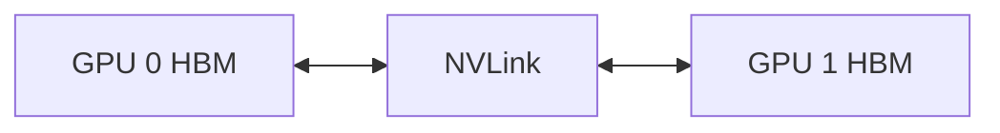
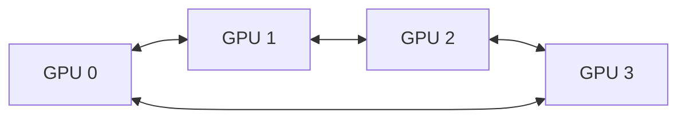
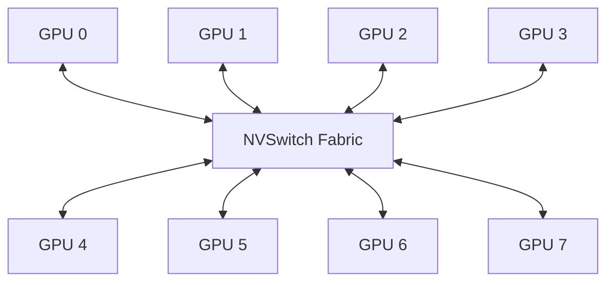

# NVLink 与 NVSwitch 原理：多 GPU 如何交换显存数据

当模型放不进一块 GPU，或者训练需要多卡并行时，GPU 之间必须交换：

- Tensor
- 梯度
- 激活
- KV Cache 或中间结果
- 集合通信数据

如果 GPU 之间的通信速度跟不上计算，增加更多 GPU 反而可能让任务更慢。

← [CPU 与 GPU 之间的数据搬运](./02b-CPU与GPU之间的数据搬运.md)

## 1. 学习目标

完成本文后，你应该能够：

- 区分 PCIe P2P、NVLink 和 NVSwitch
- 解释 GPU HBM 到另一块 GPU HBM 的数据路径
- 读懂 `nvidia-smi topo -m`
- 判断两块 GPU 是否支持 P2P
- 理解 Fabric Manager 在 NVSwitch 系统中的作用
- 使用 CUDA Samples 和 `nccl-tests` 建立机内通信基线
- 识别 NVLink 降级、P2P 不可用和拓扑选择错误
- 说明为什么 Tensor Parallel 调度需要理解 NVLink 域

## 2. 从两块 GPU 开始

假设服务器中有两块 GPU：



最基础的 GPU 间通信可以通过 PCIe。

如果硬件和软件支持 Peer-to-Peer：

```text
GPU 0 HBM
→ PCIe P2P
→ GPU 1 HBM
```

如果 P2P 不可用，某些通信可能退化为：

```text
GPU 0 HBM
→ CPU 系统内存
→ GPU 1 HBM
```

多一次 staging 会增加延迟并占用 CPU 内存和 PCIe 带宽。

## 3. PCIe P2P

Peer-to-Peer 允许一个 PCIe 设备直接访问另一个设备的地址空间。

它受到以下条件影响：

- GPU 型号和驱动支持
- 两块 GPU 的 PCIe 拓扑
- Root Complex
- PCIe Switch
- IOMMU
- ACS
- 虚拟化和直通方式

PCIe P2P 不等于 NVLink。没有 NVLink 的 GPU 也可能支持 PCIe P2P。

## 4. NVLink 解决什么问题

NVLink 是面向 GPU 等设备的高速互联技术。它为支持的设备提供比普通 PCIe 路径更适合 GPU 间通信的互联。

简化路径：



NVLink 的价值不只是“带宽更高”，还包括：

- 降低 GPU 间通信成本
- 让多 GPU 应用更高效地交换 Tensor
- 为 NCCL Collective 提供机内高速路径
- 减少对 CPU 内存和 PCIe Root 的依赖

### NVLink 不会自动把多块 GPU 变成一块 GPU

每块 GPU 通常仍有：

- 独立 HBM
- 独立 CUDA Device ID
- 独立 CUDA Context
- 独立故障状态

应用或通信库仍然需要明确管理数据和计算。

## 5. Link、带宽与拓扑

一块 GPU 可能拥有多条 NVLink。具体：

- Link 数量
- 单 Link 带宽
- 双向/单向口径
- GPU 之间连接方式
- 是否通过 NVSwitch

都会随 GPU 和系统架构变化。

因此不要把某一代产品的数字写成 NVLink 永久固定值。查询当前平台：

```bash
nvidia-smi -q
nvidia-smi nvlink --status
nvidia-smi topo -m
```

## 6. 点对点 NVLink 拓扑

部分系统中，GPU 之间以特定拓扑直接连接。

例如简化 Ring：



此时：

- 相邻 GPU 可能有直接 NVLink
- 非相邻 GPU 可能需要其他路径
- 不同 GPU 组合的带宽和延迟可能不同

调度一个 2 卡任务时，“任选两块空闲 GPU”不一定性能相同。

## 7. NVSwitch

当 GPU 数量增加，仅靠大量点对点连接会变复杂。NVSwitch 提供交换结构，让多块 GPU 通过交换网络互联。



NVSwitch 的主要作用：

- 建立高带宽多 GPU Fabric
- 减少 GPU 对选择带来的不均匀性
- 为 Collective 提供更好的互联基础
- 在支持的平台上提供 NVLink SHARP 等能力

### NVSwitch 不是以太网交换机

它不转发普通 IP Packet，也不是 Kubernetes CNI 网络。它服务于 NVLink Fabric。

## 8. Fabric Manager

在需要 Fabric Manager 的 NVSwitch 系统中，它负责或参与：

- 初始化 NVSwitch Fabric
- 配置路由和端口映射
- 协调 GPU 与 NVSwitch
- 监控 NVLink/NVSwitch 错误
- 暴露 Fabric 状态

查看：

```bash
systemctl status nvidia-fabricmanager
journalctl -u nvidia-fabricmanager
nvidia-smi -q
```

不同代际系统的初始化机制可能变化，不能假设所有 NVSwitch 服务器都使用完全相同的 Fabric Manager 行为。

Fabric 未正确初始化时可能出现：

- CUDA 应用无法启动
- P2P 能力不可用
- NCCL 初始化失败
- GPU Fabric 状态异常

## 9. 读懂 `nvidia-smi topo -m`

```bash
nvidia-smi topo -m
```

常见矩阵符号可能包括：

| 符号 | 常见含义 |
| --- | --- |
| `X` | 当前设备自身 |
| `NV#` | 通过若干 NVLink 连接 |
| `PIX` | 最多经过一个 PCIe Bridge |
| `PXB` | 经过多个 PCIe Bridge |
| `PHB` | 经过 PCIe Host Bridge |
| `NODE` | 跨 PCIe Host Bridge，但在同 NUMA Node |
| `SYS` | 跨 NUMA/CPU 互联 |

准确含义以当前 `nvidia-smi topo -h` 为准。

同时查看 CPU 和 NIC 亲和：

```bash
nvidia-smi topo -m
nvidia-smi topo -p2p r
nvidia-smi topo -p2p w
```

不同驱动版本支持的 `-p2p` 选项可能不同。

## 10. CUDA P2P

应用可以查询两块 GPU 是否支持 Peer Access：

```cpp
int can_access = 0;
cudaDeviceCanAccessPeer(&can_access, device0, device1);
```

启用：

```cpp
cudaSetDevice(device0);
cudaDeviceEnablePeerAccess(device1, 0);
```

支持 P2P 不代表一定走 NVLink。实际路径还要结合拓扑和硬件。

## 11. CUDA Samples 验证

### 11.1 p2pBandwidthLatencyTest

```bash
./p2pBandwidthLatencyTest
```

它可以展示：

- P2P 是否可用
- 单向/双向带宽
- P2P Enabled/Disabled 对比
- GPU 对之间差异

记录：

| GPU Pair | Topology | P2P | Bandwidth | Latency |
| --- | --- | --- | --- | --- |
| 0 ↔ 1 | NVLink | Yes |  |  |
| 0 ↔ 4 | PHB/SYS |  |  |  |

### 11.2 simpleP2P

```bash
./simpleP2P
```

用于验证基础 Peer Access 和数据正确性。

这些结果是 CUDA P2P 基线，不等于 NCCL Collective 性能。

## 12. NCCL 如何使用拓扑

NCCL 是拓扑感知的 Collective 通信库。它会考虑：

- GPU 间 NVLink
- PCIe 路径
- CPU/NUMA
- NIC/HCA
- 网络插件
- Collective 类型

开启调试：

```bash
export NCCL_DEBUG=INFO
export NCCL_DEBUG_SUBSYS=INIT,GRAPH
```

运行任务后检查日志中的：

- GPU 拓扑
- Channel
- Ring/Tree
- P2P Transport
- NVLink/PCIe
- NET/IB 或 NET/Socket

不要在生产配置中永久保留大量 Debug 日志。

### NVLS

在支持的 NVSwitch 平台和 NCCL 版本中，NVLink SHARP/NVLS 可以让部分 Collective 利用交换 Fabric 的能力。

是否启用、支持哪些 Collective、当前默认行为，应查目标 NCCL 和系统文档，不能仅凭环境变量名称判断已经生效。

## 13. `nccl-tests` 机内基线

单机 8 卡示例：

```bash
./build/all_reduce_perf -b 8 -e 8G -f 2 -g 8
```

重点观察：

- `algbw`
- `busbw`
- 不同消息大小
- In-place/Out-of-place
- 是否出现 Correctness Error

再对比：

```bash
export NCCL_P2P_DISABLE=1
```

该变量只适合受控诊断。关闭 P2P 后如果性能显著下降，说明高速 P2P 路径对当前任务重要。

不要把诊断变量永久写入系统配置。

## 14. Tensor Parallel 为什么依赖 NVLink

Tensor Parallel 会在单层计算中频繁交换中间结果。通信位于请求关键路径：

```text
计算一部分
→ GPU 间 Collective
→ 继续计算
→ 再次 Collective
```

因此：

- 通信频率高
- 小延迟很重要
- 带宽不足会直接拉长 Token 时间
- 跨慢速拓扑的 TP 可能不如较小并行度

Data Parallel 的通信模式和频率不同，不能用 TP 的互联需求直接套用。

## 15. NVLink 与显存容量

NVLink 让 GPU 之间更快通信，但通常不会自动聚合为一个透明的统一大显存。

如果两块 GPU 各有 80 GiB：

- 应用可以将模型切分到两块 GPU
- 通信通过 NVLink 加速
- 但每个进程和每个 Tensor 的放置仍需框架管理

“8 × 80 GiB = 一块 640 GiB GPU”是错误理解。

## 16. 常见故障

### `topo -m` 没有 NVLink

检查：

- GPU 型号是否支持
- 服务器是否真的安装 NVLink/NVSwitch
- GPU 是否处于预期槽位
- 驱动版本
- Fabric Manager
- 虚拟机或容器是否暴露完整拓扑

### CUDA P2P 不可用

检查：

- PCIe Root 与 ACS
- IOMMU
- GPU 组合和驱动支持
- 虚拟化直通
- MIG 等运行模式

### NCCL 没有走预期路径

采集：

```bash
nvidia-smi topo -m
NCCL_DEBUG=INFO NCCL_DEBUG_SUBSYS=INIT,GRAPH <command>
```

不要一开始就随机设置大量 NCCL 环境变量。先确认硬件拓扑和日志。

### NVLink Error 增长

需要结合：

- DCGM NVLink 指标
- `nvidia-smi -q`
- Xid
- Fabric Manager 日志
- NCCL Error
- 服务器硬件日志

持续错误应升级给硬件和平台团队，不要通过重复重启掩盖。

### 一组 GPU 很快，另一组很慢

可能是：

- GPU 对不在同一 NVLink 域
- 跨 CPU Socket
- PCIe Link 降速
- P2P 不可用
- GPU/NIC 距离不同

## 17. Kubernetes 为什么需要理解 NVLink

Kubernetes 原生扩展资源通常只表达：

```yaml
resources:
  limits:
    nvidia.com/gpu: 4
```

这只说明需要 4 块 GPU，不一定表达：

- 哪 4 块 GPU
- 是否属于同一 NVLink 域
- 是否靠近同一 NIC
- 是否满足 Tensor Parallel 拓扑

生产方案可能结合：

- GPU Feature Discovery 标签
- 节点池
- 整机 8 卡分配
- Gang Scheduling
- 自定义调度插件
- DRA 和设备属性
- 应用自身的 Rank/GPU 映射

对于单节点 8 卡 TP，最简单可靠的策略常常是独占整台经过验证的 8 卡节点，而不是在同一节点混合多个拓扑敏感任务。

## 18. 它与其他模块的关系

### 上游

- 模型和 Batch 已经进入各 GPU HBM
- PyTorch、vLLM 或训练框架产生跨 GPU 通信

### 本层

- CUDA P2P 提供 GPU 间访问能力
- NVLink/NVSwitch 提供机内高速互联
- NCCL 根据拓扑组织 Collective

### 下游

- 跨节点时通信继续进入 NIC、IB/RoCE
- 调度器应选择正确 GPU 组合和节点
- DCGM/NCCL 提供观测证据

## 19. 常见误区

### 有 NVLink 就不需要 NCCL

NVLink 是硬件互联，NCCL 是 Collective 通信库，层次不同。

### NVSwitch 是普通网络交换机

NVSwitch 服务 NVLink Fabric，不承载普通 TCP/IP。

### 多卡显存会自动合并

应用和框架仍需管理分片与通信。

### `nvidia-smi topo` 显示 NVLink 就一定性能正常

还要做 P2P 和 NCCL 基线，并观察 Error。

### 卡越多越快

扩展收益取决于计算通信比、消息大小和并行策略。

## 20. 本篇总结

```text
单 GPU：HBM 内部访问
两 GPU：PCIe P2P 或 NVLink
多 GPU：点对点 NVLink 或 NVSwitch Fabric
应用通信：CUDA P2P / NCCL
调度目标：把强通信任务放进合适的高速互联域
```

后续进入跨节点通信：数据会从 GPU HBM 经过 PCIe 到达 NIC，并通过 InfiniBand 或 RoCE 到达另一台服务器。

→ [NCCL 通信原理与常见问题](./33-NCCL%20通信原理与常见问题.md)

## 21. 课后练习

1. PCIe P2P 和 NVLink 有什么区别？
2. NVSwitch 为什么不等于普通网络交换机？
3. 为什么 NVLink 不会自动形成统一大显存？
4. 使用 `nvidia-smi topo -m` 画出服务器 GPU 连接图。
5. 运行 `p2pBandwidthLatencyTest`，比较不同 GPU Pair。
6. 运行 `all_reduce_perf`，比较启用和禁用 P2P 的结果。
7. 设计一个 8 卡 Tensor Parallel Pod 的节点选择与独占策略。

## 参考与致谢

- [NVIDIA Fabric Manager User Guide](https://docs.nvidia.com/hgx-platforms/fabric-manager-user-guide/)
- [NCCL Documentation](https://docs.nvidia.com/deeplearning/nccl/index.html)
- [NCCL Troubleshooting](https://docs.nvidia.com/deeplearning/nccl/user-guide/docs/troubleshooting.html)
- [CUDA Samples](https://github.com/NVIDIA/cuda-samples)
