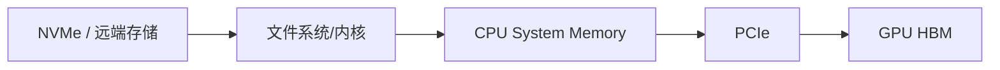
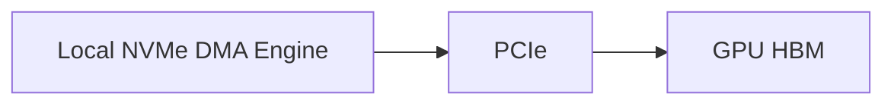
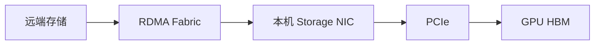

# GPUDirect Storage 原理与实践：存储如何直接进入 GPU 显存

传统模型加载通常需要两段数据搬运：

```text
存储 → CPU 系统内存
CPU 系统内存 → GPU HBM
```

GPUDirect Storage（GDS）的目标是建立更直接的数据路径：

```text
本地 NVMe 或远端存储 NIC
→ DMA/RDMA
→ GPU HBM
```

它可以减少 CPU bounce buffer、降低 CPU 负担，并在合适工作负载和拓扑上改善带宽或延迟。

← [AI 工作负载的存储 IO 模型](./36b-AI工作负载的存储IO模型.md)

## 1. 学习目标

完成本文后，你应该能够：

- 画出传统 POSIX IO 与 GDS 路径
- 区分 Control Path 与 Data Path
- 理解 `cuFile`、`O_DIRECT` 和 `nvidia-fs`
- 说明本地 NVMe 和远端存储使用的 DMA Agent
- 判断 Compatibility Mode 为什么不等于直接路径
- 检查 GDS 软件栈和文件系统支持
- 使用 `gdscheck`、`gdsio` 建立基线
- 解释为什么 GDS 不一定让所有模型加载变快
- 理解 Kubernetes 容器中的 Host 依赖

## 2. 传统 POSIX IO

应用使用：

```c
read(fd, host_buffer, size);
cudaMemcpy(gpu_buffer, host_buffer, size, cudaMemcpyHostToDevice);
```

简化数据路径：



需要两段搬运：

1. Storage → Host Memory
2. Host Memory → GPU Memory

CPU 还可能参与：

- Page Cache
- Buffer 管理
- 文件系统
- 数据预处理
- H2D 提交

## 3. GDS 数据路径

GDS 使用 `cuFile` API，让应用把 GPU Buffer 地址直接交给存储 IO 栈。

本地 NVMe：



远端存储：



数据不必在 CPU System Memory 中进行 bounce。

## 4. Control Path 与 Data Path

### Control Path

CPU 和软件负责：

- `open`
- 文件系统 Metadata
- 权限检查
- Buffer 注册
- 地址转换
- IO 提交
- 完成通知

### Data Path

DMA Engine 负责实际数据：

```text
Storage/NIC DMA Engine
→ PCIe
→ GPU Memory
```

所以“GDS 绕过 CPU”是指避免 CPU Memory 数据 staging，不是 CPU 完全不参与。

## 5. `cuFile` API

传统 POSIX：

```c
int fd = open(path, O_RDONLY);
void *host_buffer = malloc(size);
void *gpu_buffer;
cudaMalloc(&gpu_buffer, size);

pread(fd, host_buffer, size, offset);
cudaMemcpy(gpu_buffer, host_buffer, size, cudaMemcpyHostToDevice);
```

GDS 简化示意：

```c
int fd = open(path, O_RDONLY | O_DIRECT);

CUfileDescr_t desc = {};
desc.handle.fd = fd;
desc.type = CU_FILE_HANDLE_TYPE_OPAQUE_FD;

CUfileHandle_t handle;
cuFileHandleRegister(&handle, &desc);

void *gpu_buffer;
cudaMalloc(&gpu_buffer, size);

cuFileRead(handle, gpu_buffer, size, offset, 0);
```

这不是可直接复制的完整程序，错误处理、对齐、初始化、注销和资源释放都必须补齐。

常见 API：

- `cuFileDriverOpen`
- `cuFileHandleRegister`
- `cuFileBufRegister`
- `cuFileRead`
- `cuFileWrite`
- Batch IO
- Stream/Async IO

具体能力随 CUDA/GDS 版本演进。

## 6. `O_DIRECT`

GDS 直接路径通常需要符合 Direct IO 条件，使数据不通过普通 Page Cache。

典型要求涉及：

- 文件 Offset 对齐
- IO Size 对齐
- GPU Buffer 地址对齐
- 文件系统支持
- Storage Driver 支持

不对齐时，cuFile 可能：

- 使用内部 bounce buffer
- 拆分请求
- 进入 Compatibility Mode
- 返回错误

具体行为取决于 GDS 版本、配置和文件系统。

## 7. `libcufile`

`libcufile.so` 位于用户空间：

- 接收 cuFile API
- 识别文件所属 Mount 和文件系统
- 选择适合的数据路径
- 管理注册、批处理和兼容回退

查看安装包和动态库：

```bash
ldconfig -p | grep libcufile
find /usr -name 'libcufile.so*' 2>/dev/null
```

容器中可以包含用户空间库，但内核和设备驱动仍由 Host 提供。

## 8. `nvidia-fs`

在需要的文件系统和版本组合中，`nvidia-fs.ko` 提供 GPU 虚拟地址转换和 DMA 回调。

检查：

```bash
lsmod | grep nvidia_fs
modinfo nvidia-fs
```

注意：

- 较新 CUDA 对部分本地 NVMe 路径可能不再要求 `nvidia-fs`
- 远端和第三方文件系统仍可能依赖它
- 是否需要必须查目标 CUDA/GDS Release Notes 和存储厂商支持矩阵

不要把某一版本的部署步骤套用到所有平台。

## 9. 本地 NVMe 的 GDS

本地路径中，NVMe Controller 的 DMA Engine 可以向 GPU Memory 搬运数据。

影响因素：

- NVMe 与 GPU PCIe 距离
- PCIe Generation/Width
- IOMMU/ACS
- 文件系统
- Direct IO
- GPU BAR 映射
- IO Size 和 Queue Depth

理想拓扑：

```text
NVMe
→ PCIe Switch
→ GPU
```

较远拓扑可能经过 CPU Root，仍可能避免 CPU Memory bounce，但带宽受 PCIe 路径限制。

## 10. 远端存储的 GDS

远端路径通常依赖：

- Client Storage NIC
- GPUDirect RDMA
- RDMA Fabric
- Server 端存储和网络支持
- GDS Enabled File System

```text
远端存储介质
→ 存储服务器
→ RDMA
→ Client NIC
→ GPU HBM
```

如果远端文件系统只支持普通 Socket：

```text
NIC → Kernel Socket Buffer → CPU Memory
```

就不满足真正直接路径。

GDS 不能单方面把一个不支持 RDMA/GDS 的存储系统变成直接 GPU 存储。

## 11. Compatibility Mode

当直接路径不可用时，cuFile 可以在某些条件下回退到兼容路径：

```text
Storage
→ CPU Bounce Buffer
→ GPU HBM
```

这保证应用功能可能继续工作，但不具有完整 GDS 数据路径收益。

常见触发条件：

- 文件系统不支持
- `nvidia-fs` 不可用
- 对齐不满足
- Direct IO 不可用
- Buffer/IO Size 特殊
- 配置显式允许回退

因此：

> cuFile API 调用成功，不等于数据一定走了直接路径。

必须结合统计、日志和性能验证。

## 12. 哪些应用适合 GDS

更适合：

- 数据直接由 GPU 处理
- IO 位于关键路径
- 大量数据持续进入/离开 GPU
- CPU 不需要先解析全部数据
- 应用能使用明确的 IO API
- 硬件和文件系统支持

收益可能有限：

- 模型只在启动时读取一次
- 数据会在 CPU 做复杂解码
- IO 已完全被计算隐藏
- 文件很小且 Metadata 占主导
- 数据已经在 Page Cache
- 存储本身很慢
- GPU 计算远慢于 IO

## 13. 为什么模型加载不一定更快

模型加载时间可能由多段组成：

```text
文件读取
+ 反序列化
+ 解压
+ 权重格式转换
+ Tensor 创建
+ GPU 内存分配
+ Rank 同步
+ CUDA Graph 初始化
```

GDS 只优化其中符合条件的数据传输部分。

如果 CPU 反序列化占 80%，即使 IO 变快，端到端收益仍可能很小。

## 14. 安装前检查

记录版本：

```bash
uname -r
nvidia-smi
nvcc --version
```

检查：

- GPU 型号
- Driver
- CUDA/GDS
- Kernel
- 文件系统
- 存储客户端
- NIC/HCA
- OFED/Inbox RDMA
- PCIe 拓扑

查目标版本：

- GDS Release Notes
- GDS Support Matrix
- 存储厂商文档
- 容器平台文档

## 15. `gdscheck`

安装 GDS 工具后，常见检查入口：

```bash
gdscheck -p
```

输出可能包含：

- Driver
- `nvidia-fs`
- Filesystem
- NVMe
- RDMA
- Platform 支持
- 配置

命令和字段随版本变化，先查看：

```bash
gdscheck --help
```

不要只看最后一行“Supported”。还要确认目标 Mount 的实际路径。

## 16. `cufile.json`

配置文件可控制：

- Compatibility Mode
- Logging
- Poll Mode
- IO Size
- Dynamic Routing
- Device/Filesystem 行为

路径和字段以当前 GDS 文档为准。

修改前：

1. 保存默认配置
2. 记录当前基线
3. 一次只改一个变量
4. 使用独立测试 Mount
5. 验证直接路径和回退行为

不要复制旧版本的 `cufile.json` 覆盖新版本默认值。

## 17. `gdsio` 基线

`gdsio` 可测试不同 IO 路径。

先查看：

```bash
gdsio --help
```

测试维度：

- POSIX
- Direct IO
- cuFile
- IO Size
- Queue Depth
- GPU Index
- Read/Write
- 顺序/随机
- 本地/远端 Mount

不要对生产文件执行写测试。使用专用测试目录，并明确清理。

记录：

| 项目 | 值 |
| --- | --- |
| GPU/NVMe/NIC |  |
| PCIe 拓扑 |  |
| 文件系统/Mount |  |
| CUDA/GDS |  |
| IO Mode |  |
| IO Size |  |
| Queue Depth |  |
| Bandwidth |  |
| Latency |  |
| CPU Utilization |  |

## 18. 正确对比

至少比较：

```text
POSIX Buffered
POSIX O_DIRECT
cuFile Compatibility
cuFile Direct
```

同时观察：

- Storage Device 吞吐
- PCIe 吞吐
- CPU 利用率
- GPU Copy 活跃
- 端到端应用时间

只比较两个工具打印的 GB/s，可能因为缓存、对齐和测量口径不同得到错误结论。

## 19. Dynamic Routing 与拓扑

复杂服务器中，存储 NIC/NVMe 与目标 GPU 可能不在同一 PCIe 子树。

cuFile 可能根据拓扑选择：

- 直接 PCIe 路径
- 经过 CPU Root
- 使用某块 GPU 作为 Staging
- 使用 Pinned System Memory

因此需要同时保存：

```bash
nvidia-smi topo -m
lspci -tv
ibdev2netdev
lsblk
```

GDS 不是“拓扑无关”，而是可以在支持范围内进行拓扑感知路径选择。

## 20. 容器与 Kubernetes

容器只带用户空间库仍不够。Host 必须提供：

- NVIDIA Driver
- 必要内核模块
- RDMA/NVMe 驱动
- 支持的文件系统客户端
- 设备节点
- Mount

Pod 可能还需要：

- GPU Resource
- PVC 或 Local PV
- RDMA Device
- 合适权限
- Mount Propagation
- 节点标签
- GPU/NIC/NVMe 拓扑亲和

### 调度问题

一个支持 GDS 的 Pod 不应该只选择“有 GPU 的节点”，还要选择：

- 有目标本地 NVMe 的节点
- 有支持 GDS 文件系统 Mount 的节点
- GPU 与存储 NIC 距离合理的节点
- 驱动和内核版本正确的节点

可通过：

- Node Feature Discovery
- GPU Feature Discovery
- 标签和 Affinity
- 独立节点池
- DRA
- Admission/Operator

表达。

## 21. 常见故障

### `gdscheck` 显示不支持

检查：

- CUDA/GDS 安装
- Driver
- Kernel
- `nvidia-fs`
- 文件系统支持
- Mount Option
- 存储厂商插件

### cuFile 工作但性能与 POSIX 相同

可能处于 Compatibility Mode。检查：

- 日志
- 统计
- `cufile.json`
- 对齐
- Mount

### 本地 NVMe 快，远端存储慢

检查：

- 远端文件系统是否支持 RDMA/GDS
- Storage NIC
- Server 端吞吐
- Fabric
- GPU/NIC 亲和

### 小 IO 性能不稳定

检查：

- 对齐
- Batch/Async
- Poll Mode
- Metadata
- Compatibility fallback

### 容器内找不到 `libcufile`

检查：

- 镜像用户空间包
- `LD_LIBRARY_PATH`
- Host Driver 注入
- Container Toolkit

### 容器功能正常但不是直接路径

兼容回退可能让功能测试通过。需要单独验证数据路径和性能。

## 22. 分层验证

```text
GPU 正常
→ NVMe/NIC 正常
→ PCIe 拓扑正常
→ 文件系统 O_DIRECT 正常
→ GDS 软件栈正常
→ gdsio 直接路径正常
→ 容器路径正常
→ 真实模型/数据应用获益
```

每层都要有失败停止条件，不要在不明确数据路径时直接改生产 Mount 或内核模块。

## 23. 安全与数据正确性

- 使用专用测试文件
- Write 测试前核对路径
- 不对生产块设备直接压测
- 校验读写数据
- 测试后清理
- 驱动/模块变更先 Drain 节点
- Secure Boot 环境核对模块签名
- 保留回退到普通 IO 的方案

性能优化不能以数据正确性为代价。

## 24. 它与其他模块的关系

### 上游

- 对象存储、CephFS、NFS、并行文件系统或本地 NVMe 提供数据
- 应用决定使用 POSIX 还是 cuFile

### 本层

- cuFile 建立 Control Path
- NVMe DMA 或 NIC RDMA 搬运数据
- GPU HBM 接收数据

### 下游

- CUDA Kernel 处理数据
- 多 GPU 继续通过 NVLink/NCCL 通信
- 调度器选择具备正确存储和拓扑的节点

## 25. 常见误区

### GDS 完全不使用 CPU

CPU 仍参与控制面，只是避免 CPU Memory bounce。

### 安装 `nvidia-fs` 就完成 GDS

还需要应用、文件系统、存储、驱动和拓扑支持。

### cuFile 成功就代表 Direct Path

可能处于 Compatibility Mode。

### GDS 能自动加速所有模型

端到端瓶颈可能在反序列化、CPU、NCCL 或计算。

### GDS 可以替代存储容量和可靠性设计

它优化数据路径，不负责副本、备份和生命周期。

## 26. 本篇总结

```text
传统路径：
Storage → CPU Memory → GPU HBM

GDS 路径：
Storage DMA/NIC RDMA → GPU HBM

是否获益取决于：
应用 + IO 模型 + 文件系统 + 驱动 + 拓扑 + 存储性能
```

完成具体存储技术和 GDS 后，回到 Kubernetes 存储方案进行综合选型，再学习模型冷启动。

→ [大模型文件在 Kubernetes 中的存储方案](./36-大模型文件在%20Kubernetes%20中的存储方案.md)

## 27. 课后练习

1. GDS 的 Control Path 与 Data Path 分别由谁负责？
2. Compatibility Mode 为什么不等于直接路径？
3. 本地 NVMe 和远端存储的 DMA Agent 分别是什么？
4. `O_DIRECT` 和 IO 对齐为什么重要？
5. 设计 POSIX、O_DIRECT、cuFile Compatibility 和 Direct 四组对比实验。
6. 画出服务器 GPU、NVMe、NIC 和 PCIe Root 拓扑。
7. 选择一个模型，拆分文件读取、反序列化、H2D/GDS 和初始化时间。

## 参考与致谢

- [GPUDirect Storage Documentation](https://docs.nvidia.com/gpudirect-storage/)
- [GPUDirect Storage Overview Guide](https://docs.nvidia.com/gpudirect-storage/overview-guide/)
- [GDS O_DIRECT Requirements Guide](https://docs.nvidia.com/gpudirect-storage/o-direct-guide/)
- [GDS Benchmarking and Configuration Guide](https://docs.nvidia.com/gpudirect-storage/configuration-guide/)
- [GDS Installation and Troubleshooting Guide](https://docs.nvidia.com/gpudirect-storage/troubleshooting-guide/)
