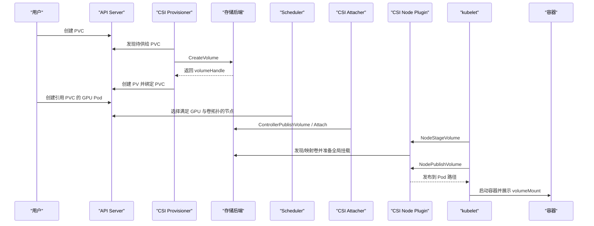

# Kubernetes CSI 挂载链路与故障排查：从 PVC 到容器目录

业务 YAML 中只有一个 PVC：

```yaml
volumes:
  - name: models
    persistentVolumeClaim:
      claimName: model-pvc
```

但在容器看到 `/models` 之前，控制器、调度器、CSI Controller、CSI Node Plugin、kubelet 和存储后端已经协作了很多步。

本篇把这条链路完整拆开。理解它之后，`PVC Pending`、`FailedAttachVolume`、`FailedMount` 和 `ContainerCreating` 就不再是一类模糊的“存储问题”。

---

## 1. 学习目标

完成本文后，你应该能够：

- 解释 PV、PVC、StorageClass、CSIDriver、CSINode 和 VolumeAttachment。
- 区分 CSI Controller Plugin 与 Node Plugin。
- 追踪动态供给、调度、Attach、Stage、Publish 的完整过程。
- 理解 `Immediate` 与 `WaitForFirstConsumer` 的差异。
- 判断故障发生在供给、调度、Attach、Mount 还是应用访问阶段。
- 分析存储拓扑与 GPU 拓扑之间的约束冲突。

---

## 2. CSI 解决什么问题

CSI（Container Storage Interface）定义了容器编排系统与存储驱动之间的标准接口。

没有 CSI 时，每种存储都需要把插件代码放进 Kubernetes 核心；有了 CSI，存储驱动可以在集群外独立开发和发布。

CSI 不等于某种存储：

```text
CSI 是接口标准
Ceph RBD、CephFS、NFS、云盘、本地存储是后端或驱动实现
```

CSI 也不会自动让后端拥有高可用、快照或扩容能力；驱动只能暴露后端实际支持的功能。

---

## 3. 先认识 Kubernetes 对象

### 3.1 StorageClass

管理员提供的一类存储服务，常包含：

- `provisioner`：使用哪个 CSI 驱动。
- `parameters`：Pool、文件系统、类型、加密等驱动参数。
- `reclaimPolicy`：删除 PVC/PV 后如何处理后端数据。
- `volumeBindingMode`：何时供给和绑定。
- `allowVolumeExpansion`：是否允许扩容。
- `mountOptions`：挂载参数。

### 3.2 PersistentVolumeClaim

用户对存储的请求：

```text
容量 + AccessMode + VolumeMode + StorageClass
```

PVC 是命名空间级对象。

### 3.3 PersistentVolume

集群中的卷资源，记录：

- 后端卷标识 `volumeHandle`。
- CSI 驱动名称。
- 容量、访问模式和回收策略。
- 节点/区域拓扑。
- 与哪个 PVC 绑定。

PV 是集群级对象。

### 3.4 CSIDriver

描述已安装 CSI 驱动的能力，例如是否需要 Attach、Pod 信息、`fsGroup` 策略和存储容量跟踪。

### 3.5 CSINode

记录每个节点有哪些 CSI 驱动，以及驱动报告的节点 ID、拓扑 Key、可挂卷数量等信息。

### 3.6 VolumeAttachment

对于需要 Attach 的存储，控制平面用它表示“某个卷应连接到某个节点”。

不是所有驱动都需要 Attach。例如某些共享文件系统只需要在目标节点挂载。

---

## 4. CSI 驱动的两部分

### 4.1 Controller Plugin

通常运行在少量 Deployment/StatefulSet Pod 中，处理集群级动作：

- 创建/删除卷。
- Attach/Detach。
- 扩容。
- 快照。

常见 sidecar：

| Sidecar | 作用 |
|---------|------|
| external-provisioner | 监听 PVC/PV，调用 `CreateVolume` / `DeleteVolume` |
| external-attacher | 管理 VolumeAttachment，调用 ControllerPublish/Unpublish |
| external-resizer | 处理卷扩容 |
| external-snapshotter | 处理快照请求 |

sidecar 监听 Kubernetes API，再通过 Unix Socket 调用同 Pod 中的 CSI Driver。

### 4.2 Node Plugin

通常以 DaemonSet 运行在每个可使用存储的节点：

- 向 kubelet 注册驱动。
- 在节点准备卷。
- 格式化或检查文件系统。
- 把卷挂载到 Pod 目录。
- Pod 删除时解除挂载。

典型容器：

- CSI Driver。
- `node-driver-registrar`。
- 可能还有健康检查或厂商组件。

如果某台 GPU 节点没有正常运行 Node Plugin，其他节点正常也不能帮助它完成挂载。

---

## 5. 动态供给完整链路

以需要 Attach 的块存储为例：



具体驱动可以省略某些阶段，但排障时可用这张图确认当前卡在哪一段。

---

## 6. 五个关键 CSI 调用

### 6.1 CreateVolume

Controller 在后端创建卷，并获得唯一 `volumeHandle`。

失败表现：

- PVC 长期 Pending。
- external-provisioner 日志报容量、认证、Pool 或参数错误。

### 6.2 ControllerPublishVolume

把卷连接到目标节点，常称 Attach。

失败表现：

- `FailedAttachVolume`。
- VolumeAttachment 未就绪。
- 云盘区域、RBD 映射权限或多 Attach 冲突。

### 6.3 NodeStageVolume

在节点级暂存路径准备卷。块卷可能在这里映射设备、检查/创建文件系统并完成全局挂载。

### 6.4 NodePublishVolume

把已准备的卷发布到具体 Pod 目录，通常表现为 bind mount。

失败表现：

- `FailedMount`。
- Pod 长期 `ContainerCreating`。
- 路径、权限、文件系统或 Node Plugin 错误。

### 6.5 NodeUnpublish / NodeUnstage

Pod 删除后解除 Pod 路径和节点全局挂载。如果进程仍占用文件、节点异常或 kubelet 中断，可能残留挂载并影响后续使用。

---

## 7. Immediate 与 WaitForFirstConsumer

### 7.1 Immediate

PVC 创建后立即供给和绑定。

```text
PVC → 先创建卷 → 后创建/调度 Pod
```

适合所有节点都能访问、无需等待 Pod 拓扑的共享存储。

风险：对于有区域、节点或本地拓扑的存储，卷可能先创建在不适合 GPU Pod 的位置。

### 7.2 WaitForFirstConsumer

等消费 PVC 的 Pod 出现后再结合调度选择供给位置。

```text
PVC
  → Pod 请求 GPU + PVC
  → Scheduler 选择候选节点/拓扑
  → CSI 在对应拓扑供给卷
  → 完成绑定和调度
```

适合：

- Local PV。
- 分区/可用区受限的块存储。
- 需要 CSIStorageCapacity 参与的拓扑存储。

不要给使用 `WaitForFirstConsumer` 的 PVC 手工设置无消费者 Pod 的 `nodeName` 来绕过调度器，这会破坏正常的绑定决策。

---

## 8. GPU 与存储为什么会发生拓扑冲突

一个 GPU Pod 的可行节点集合可能是：

```text
有目标 GPU 型号
∩ 有足够 GPU 数量
∩ 满足 NVLink/NVSwitch 拓扑
∩ 靠近目标 RDMA 网卡
∩ 可访问目标存储卷
∩ 满足存储容量/区域
∩ 满足污点、配额和队列
```

例子：

- 模型 Local PV 在节点 A，空闲 GPU 在节点 B。
- 云盘在可用区 1，GPU 节点只在可用区 2。
- CSI Node Plugin 没部署到带污点的 GPU 节点。
- GPU 节点缺少 Ceph 内核模块或 NFS 客户端工具。

因此“有空闲 GPU”不等于任务可调度。

---

## 9. 一个完整的 PVC 示例

```yaml
apiVersion: v1
kind: PersistentVolumeClaim
metadata:
  name: model-pvc
  namespace: ai
spec:
  accessModes:
    - ReadOnlyMany
  volumeMode: Filesystem
  storageClassName: shared-model-storage
  resources:
    requests:
      storage: 500Gi
---
apiVersion: v1
kind: Pod
metadata:
  name: gpu-model-reader
  namespace: ai
spec:
  restartPolicy: Never
  containers:
    - name: app
      image: ubuntu:24.04
      command: ["bash", "-lc", "df -hT /models; ls -lah /models; sleep 3600"]
      resources:
        limits:
          nvidia.com/gpu: 1
      volumeMounts:
        - name: model
          mountPath: /models
          readOnly: true
  volumes:
    - name: model
      persistentVolumeClaim:
        claimName: model-pvc
        readOnly: true
```

`ReadOnlyMany` 是否被支持由驱动和后端决定。不要只修改 AccessMode 字段就假设存储获得了相应能力。

---

## 10. AccessMode 与 VolumeMode

### AccessMode

| 模式 | 含义 |
|------|------|
| RWO | 可由一个节点读写挂载；同节点可能仍有多个 Pod |
| ROX | 可由多个节点只读挂载 |
| RWX | 可由多个节点读写挂载 |
| RWOP | 只允许一个 Pod 读写，且需要 CSI 支持 |

AccessMode 主要用于供给、绑定和挂载能力匹配，不代替 Unix 权限与应用锁。

### VolumeMode

`Filesystem`：

```text
后端卷 → 文件系统 → volumeMounts → 容器目录
```

`Block`：

```text
后端卷 → 原始块设备 → volumeDevices → 容器设备路径
```

使用原始块设备时，应用必须理解块设备；它不会自动出现 `/models` 目录。

---

## 11. ReclaimPolicy 与数据安全

`Delete`：

```text
删除 PVC → 回收 PV → CSI 删除后端卷
```

`Retain`：

```text
删除 PVC → PV Released → 后端数据保留 → 管理员处理
```

模型缓存可以按自动重建能力选择；训练 Checkpoint 和关键数据通常需要更谨慎的 Retain、快照和备份策略。

重要数据不能只依赖 `Retain`。它不是备份，也不能防止后端故障、管理员误操作或应用写坏数据。

---

## 12. 扩容和快照

扩容通常分两步：

```text
ControllerExpandVolume：扩大后端卷
NodeExpandVolume：扩大节点上的文件系统
```

前提：

- StorageClass 允许扩容。
- CSI 驱动和后端支持。
- 文件系统支持在线或离线扩容。

VolumeSnapshot 使用额外 CRD、Snapshot Controller 和 CSI Snapshotter。驱动未实现快照时，创建 `VolumeSnapshot` 也不会凭空获得能力。

Checkpoint 快照还要考虑应用一致性：存储层时间点快照不自动保证正在写入的训练状态是可恢复的。

---

## 13. 从现象判断故障阶段

| 现象 | 优先阶段 |
|------|----------|
| PVC Pending，没有 PV | StorageClass / Provisioning |
| PVC Bound，Pod Pending | Scheduler / Volume Topology / GPU |
| FailedAttachVolume | ControllerPublish / VolumeAttachment |
| FailedMount | NodeStage / NodePublish / kubelet |
| ContainerCreating | Attach/Mount/镜像等，先看 Events |
| Pod Running，目录 Permission denied | UID/GID、挂载权限、应用 |
| Pod Running，读取很慢 | 后端、网络、客户端、缓存、应用 IO |
| 删除 Pod 后新 Pod 无法挂载 | Detach/Unpublish 残留或多 Attach |

---

## 14. 标准排障流程

### 第一步：确认 PVC

```bash
kubectl -n ai get pvc model-pvc -o wide
kubectl -n ai describe pvc model-pvc
```

关注：

- Status。
- StorageClass。
- Volume。
- AccessMode。
- Events。

### 第二步：确认 PV

```bash
kubectl get pv <pv-name> -o yaml
```

关注：

- `spec.csi.driver`。
- `volumeHandle`。
- `nodeAffinity`。
- ClaimRef。
- ReclaimPolicy。

不要在工单或公开日志中泄露 Secret 内容。

### 第三步：确认 Pod 与调度事件

```bash
kubectl -n ai get pod <pod> -o wide
kubectl -n ai describe pod <pod>
```

先看 Events，再决定查调度器还是 CSI。

### 第四步：检查 CSI 对象

```bash
kubectl get csidriver
kubectl get csinode <node> -o yaml
kubectl get volumeattachment
```

检查目标节点是否注册对应驱动，VolumeAttachment 是否有错误。

### 第五步：检查 CSI Controller

```bash
kubectl -n <csi-namespace> get pods -o wide
kubectl -n <csi-namespace> logs <controller-pod> -c <provisioner-container> --since=30m
kubectl -n <csi-namespace> logs <controller-pod> -c <driver-container> --since=30m
```

容器名因驱动不同而不同，先用 `kubectl get pod -o yaml` 查看。

### 第六步：检查目标节点 Node Plugin

```bash
kubectl -n <csi-namespace> get pods -o wide
kubectl -n <csi-namespace> logs <node-pod> -c <driver-container> --since=30m
```

确认 Node Plugin 正好运行在目标 GPU 节点，而不是只看 DaemonSet 总体 Ready 数。

### 第七步：检查 kubelet 和节点

```bash
journalctl -u kubelet --since "30 min ago"
findmnt
lsblk
dmesg -T | tail -n 100
```

根据后端继续检查 NFS 2049、Ceph 网络、设备映射和文件系统错误。

---

## 15. 常见故障案例

### 15.1 no volume plugin matched

可能原因：

- StorageClass provisioner 名称错误。
- CSI 驱动没有安装。
- 驱动注册失败。

### 15.2 topology conflict

可能原因：

- PV 节点亲和与 Pod 约束冲突。
- 卷和 GPU 位于不同区域。
- 使用 `Immediate` 过早供给。

### 15.3 Multi-Attach error

一个只允许单节点附加的卷仍连接在旧节点。

检查：

- 旧 Pod 是否真正结束。
- VolumeAttachment。
- 节点是否失联。
- 后端是否仍记录旧连接。

不要在未确认旧节点写入已停止时强制解除连接，否则可能造成文件系统损坏或双写。

### 15.4 MountVolume.SetUp failed

可能原因：

- Node Plugin 不健康。
- 客户端工具/内核模块缺失。
- Secret 错误。
- 服务端不可达。
- 文件系统损坏。
- 目录权限或 SELinux。

### 15.5 fsGroup 导致启动很慢

对包含大量文件的卷，kubelet 或驱动递归修改所有权可能耗时很久。

检查：

- Pod `securityContext.fsGroup`。
- CSIDriver `fsGroupPolicy`。
- 文件数量。
- 是否能在镜像/存储侧预设正确权限。

不要在不知道安全影响时简单删除 `fsGroup`。

---

## 16. 可观测性

控制面：

- PVC 供给耗时。
- Attach/Detach 耗时和错误率。
- CSI sidecar work queue。
- API Server 请求错误。

节点：

- Stage/Publish 调用耗时。
- kubelet volume operation 错误。
- 挂载点数量。
- 后端客户端指标。

业务：

- Scheduled 到 volume mounted。
- volume mounted 到应用开始加载。
- 模型读取、H2D、预热和 Ready 时间。

最有价值的是把事件和应用时间线放在一起，而不是只保存一段 CSI 日志。

---

## 17. 生产检查清单

### 驱动

- 版本与 Kubernetes 兼容。
- Controller 多副本和 Leader Election 正常。
- Node Plugin 覆盖所有 GPU 节点及其污点。
- Sidecar 版本符合驱动发布说明。
- RBAC 最小化。

### StorageClass

- provisioner 和参数正确。
- BindingMode 符合拓扑。
- ReclaimPolicy 符合数据级别。
- 扩容、快照能力经过测试。
- mountOptions 有压测与故障验证依据。

### 工作负载

- AccessMode 与真实访问方式匹配。
- 模型只读。
- Checkpoint 写入有原子性与恢复验证。
- Pod 停止和卷卸载有足够宽限期。
- GPU、网络和卷拓扑共同参与调度设计。

### 故障演练

- Controller 重启。
- Node Plugin 重启。
- 存储网络短暂中断。
- GPU 节点失联。
- PVC 扩容。
- 卷满。
- 恢复 Checkpoint。

---

## 18. CSI 在完整 GPU 链路中的位置

```text
提交 GPU Pod + PVC
  → 调度器同时评估 GPU 与卷拓扑
  → CSI 创建/连接/挂载卷
  → 容器读取模型
  → CPU 内存或 GDS 数据路径
  → HBM
  → GPU 计算
  → NVLink / RDMA 通信
  → Checkpoint 经挂载卷写回存储
```

CSI 决定数据路径能否在 Pod 启动时建立；它不负责 CUDA、NCCL 或应用内部 IO，但这些层最终共享节点 PCIe、网卡和存储资源。

---

## 19. 本篇总结

排查 CSI 时不要只说“挂载失败”，要明确阶段：

```text
PVC 请求
→ CreateVolume
→ PV 绑定
→ GPU + 存储拓扑调度
→ Attach
→ NodeStage
→ NodePublish
→ 容器访问
→ 应用 IO 性能
```

上一篇：[对象存储与模型仓库设计](./36g-对象存储与模型仓库设计.md)。下一篇：[GPUDirect Storage 原理与实践](./36c-GPUDirect-Storage原理与实践.md)，理解兼容存储怎样进一步缩短到 GPU 显存的数据路径。

---

## 20. 课后练习

1. CSI Controller 与 Node Plugin 分别运行在哪里、负责什么？
2. `CreateVolume`、`NodeStageVolume` 和 `NodePublishVolume` 有什么区别？
3. 为什么 GPU 空闲但卷拓扑不匹配时 Pod 仍会 Pending？
4. 创建一个 PVC 和 Pod，记录从 PVC Pending 到 Pod Running 的所有对象变化。
5. 暂停目标节点的 CSI Node Plugin，观察事件并判断失败阶段。
6. 分别制造 StorageClass 名称错误和挂载权限错误，比较事件差异。
7. 画出你所在集群从 PVC 到后端存储的真实调用链。

---

## 参考与致谢

- [Kubernetes Persistent Volumes](https://kubernetes.io/docs/concepts/storage/persistent-volumes/)
- [Kubernetes Storage Classes](https://kubernetes.io/docs/concepts/storage/storage-classes/)
- [Kubernetes Volumes — CSI](https://kubernetes.io/docs/concepts/storage/volumes/#csi)
- [Deploying a CSI Driver on Kubernetes](https://kubernetes-csi.github.io/docs/deploying.html)
- [Kubernetes Storage Capacity](https://kubernetes.io/docs/concepts/storage/storage-capacity/)
- [Kubernetes Volume Snapshots](https://kubernetes.io/docs/concepts/storage/volume-snapshots/)

本文根据 Kubernetes 与 Kubernetes CSI 官方文档整理。不同驱动会省略或扩展部分调用，排障时以实际驱动文档和日志为准。
