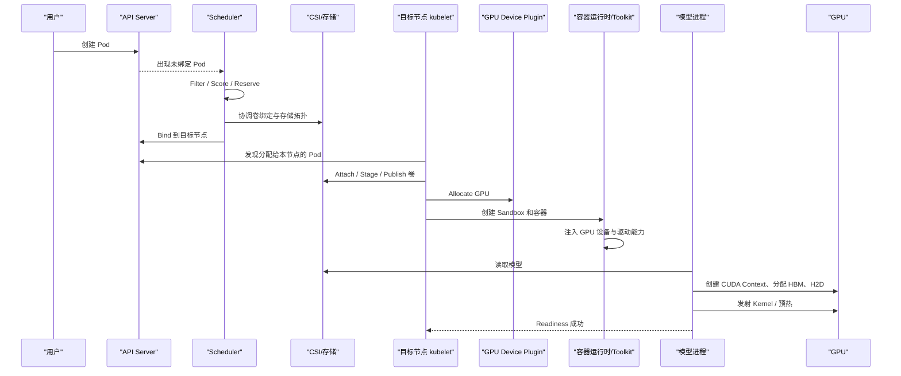

# 一个 GPU Pod 从提交到开始计算经历了什么

用户执行 `kubectl apply` 后，GPU 不会立刻开始计算。中间至少要经过 API 校验、调度、卷挂载、设备分配、容器创建、模型加载、CUDA 初始化和应用预热。

本篇用一个 GPU 推理 Pod，把此前分散的 Kubernetes、存储、显存和 GPU 文章串成一条真实生命周期。

---

## 1. 学习目标

完成本文后，你应该能够：

- 画出 GPU Pod 从 YAML 到 CUDA Kernel 的完整路径。
- 解释 Scheduler、kubelet、CSI、Device Plugin 和 Container Toolkit 的边界。
- 区分“Pod 已调度”“容器已运行”“GPU 已开始计算”和“服务 Ready”。
- 根据 Pod 阶段快速选择日志、事件和指标。
- 建立端到端启动时间线。

---

## 2. 运行前集群已经做了什么

GPU Pod 能被调度之前，节点通常已经具备：

```text
GPU 硬件
→ NVIDIA Driver
→ CUDA Driver API / NVML
→ Container Runtime
→ NVIDIA Container Toolkit
→ NVIDIA Device Plugin
→ GPU Feature Discovery / 节点标签
→ DCGM Exporter
```

Device Plugin 向 kubelet 注册 GPU，kubelet再把 `nvidia.com/gpu` 作为扩展资源上报到 Node：

```bash
kubectl get node <gpu-node> \
  -o jsonpath='{.status.allocatable.nvidia\\.com/gpu}'
```

如果这一步是空值，后续 Scheduler 根本不知道该节点有 GPU。

---

## 3. 示例 Pod

```yaml
apiVersion: v1
kind: Pod
metadata:
  name: gpu-model-server
  namespace: ai
  labels:
    app: gpu-model-server
spec:
  restartPolicy: Never
  containers:
    - name: server
      image: registry.example.com/model-server:20260806
      args:
        - --model=/models/model-a
      resources:
        requests:
          cpu: "8"
          memory: 64Gi
          nvidia.com/gpu: 1
        limits:
          cpu: "8"
          memory: 64Gi
          nvidia.com/gpu: 1
      volumeMounts:
        - name: models
          mountPath: /models
          readOnly: true
      readinessProbe:
        httpGet:
          path: /ready
          port: 8000
        periodSeconds: 5
  volumes:
    - name: models
      persistentVolumeClaim:
        claimName: model-pvc
```

这里同时请求了：

- CPU 和内存。
- 一个 GPU 扩展资源。
- 一个 PVC。
- 镜像。
- 就绪探针。

Scheduler 必须找到同时满足这些条件的节点。

---

## 4. 总体时序



镜像拉取、卷准备等部分动作可能并行发生，不应把图理解成每个实现都严格串行。

---

## 5. 阶段一：API Server 接收 Pod

`kubectl` 把对象提交给 API Server：

```bash
kubectl -n ai apply -f gpu-pod.yaml
```

API Server 会进行：

- 身份认证与权限检查。
- Admission Webhook。
- 默认字段填充。
- ResourceQuota / LimitRange 等策略检查。
- 把 Pod 保存到 etcd。

此时 Pod 通常还是：

```text
phase=Pending
spec.nodeName=""
```

`Pending` 只表示 Pod 尚未进入运行状态，既可能在等调度，也可能已调度但在拉镜像或挂卷。必须结合 `spec.nodeName`、Condition 和 Events 判断。

---

## 6. 阶段二：Scheduler 选择节点

Scheduler 从待调度队列取出 Pod，核心过程可以简化为：

```text
PreFilter
→ Filter：排除不可行节点
→ Score：给可行节点打分
→ Reserve
→ Permit（如 Gang/扩展调度）
→ PreBind（含卷绑定）
→ Bind
```

### 6.1 Filter 会检查什么

- `nvidia.com/gpu` 是否足够。
- CPU、内存和 Pod 数量。
- NodeSelector / NodeAffinity。
- Taint / Toleration。
- PodAffinity / PodAntiAffinity。
- PVC 是否能在节点绑定或挂载。
- 拓扑分布约束。

### 6.2 GPU 数量不等于 GPU 拓扑

默认扩展资源调度主要知道“还有几张 GPU”，通常不知道请求的多张卡是否通过 NVLink 相连，也不知道哪张 GPU 靠近 RDMA 网卡。

更精细的放置需要：

- 节点池和拓扑标签。
- MIG、DRA 或厂商调度扩展。
- 调度器插件。
- Gang Scheduling。
- 管理员预先设计的同构节点。

### 6.3 VolumeBinding

使用 `WaitForFirstConsumer` 的卷会在这里结合 Pod 候选节点进行绑定或动态供给。

因此调度决策不是：

```text
先找 GPU，之后再随便找存储
```

而是：

```text
在一次可行性判断中同时满足 GPU 与卷拓扑
```

---

## 7. 阶段三：Pod 绑定到节点

Scheduler 写入节点绑定结果后：

```bash
kubectl -n ai get pod gpu-model-server -o wide
```

可以看到 `NODE`，但这只表示调度完成，不表示：

- GPU 已注入容器。
- PVC 已挂载。
- 镜像已拉完。
- 模型已进入显存。

这是排障中最常见的时间线混淆。

---

## 8. 阶段四：kubelet 准备运行环境

目标节点 kubelet 发现 Pod 后开始协调：

- 创建 Pod Sandbox。
- 配置网络。
- 拉取镜像。
- 准备 Secret/ConfigMap。
- 通过 CSI 准备卷。
- 调用设备管理器分配 GPU。
- 请求容器运行时创建容器。

Pod 长期处于 `ContainerCreating` 时，应先查看：

```bash
kubectl -n ai describe pod gpu-model-server
```

不要直接进入 CUDA 层排障。

---

## 9. 阶段五：CSI 把模型卷挂进节点

根据存储类型，可能经历：

```text
CreateVolume
→ ControllerPublish / Attach
→ NodeStage
→ NodePublish
→ 容器 /models
```

NFS/CephFS 等共享文件系统可能不需要块设备 Attach；RBD、云盘等通常有映射或 Attach 阶段。

验证：

```bash
kubectl -n ai get pvc model-pvc
kubectl get pv <pv-name>
kubectl get volumeattachment
kubectl get csinode <node>
```

如果事件是 `FailedMount`，先查 CSI Node Plugin、kubelet、权限和存储网络，不要先查 Device Plugin。

---

## 10. 阶段六：Device Plugin 分配 GPU

节点上的 NVIDIA Device Plugin 已经向 kubelet报告可用设备。kubelet 在准备容器时为请求的扩展资源选择具体设备，并调用 Device Plugin 的 `Allocate`。

Allocate 响应可以通过实现约定提供：

- 设备节点。
- 环境变量。
- 挂载。
- CDI 设备引用。
- 其他运行时所需信息。

此时才从抽象请求：

```yaml
nvidia.com/gpu: 1
```

落实到具体物理 GPU 或切分实例。

Scheduler 通常只预留资源数量，具体设备选择主要发生在目标节点。

---

## 11. 阶段七：Container Toolkit 注入 GPU 能力

容器镜像一般不携带宿主机内核驱动。NVIDIA Container Toolkit 与容器运行时协作，把必要能力暴露给容器，例如：

- GPU 设备节点。
- 与宿主驱动匹配的用户态驱动库。
- 设备可见性配置。

容器内验证：

```bash
nvidia-smi
ls -l /dev/nvidia*
python -c "import torch; print(torch.cuda.is_available(), torch.cuda.device_count())"
```

三个结果含义不同：

- `nvidia-smi` 成功：NVML/驱动基础路径可用。
- `torch.cuda.is_available()` 为真：框架可以初始化 CUDA。
- 业务 Kernel 正常执行：应用、模型和显存路径进一步通过。

---

## 12. 阶段八：进程初始化 CUDA

主进程启动后可能执行：

```text
加载 CUDA Runtime / Driver API
→ 枚举可见设备
→ 创建 CUDA Context
→ 创建 Stream、事件和库句柄
→ 加载或 JIT 编译 Kernel
→ 建立内存分配器
```

首次 CUDA 操作往往比后续操作慢。容器处于 Running 不代表 CUDA 初始化已经完成。

可以使用：

```python
import time
import torch

t0 = time.perf_counter()
assert torch.cuda.is_available()
torch.cuda.init()
torch.cuda.synchronize()
print("cuda_init_s", time.perf_counter() - t0)
```

---

## 13. 阶段九：模型从存储进入 HBM

简化路径：

```text
PVC /models
→ 文件系统读取
→ Linux Page Cache / 用户缓冲区
→ 模型反序列化
→ CPU Tensor
→ pinned memory（可选）
→ PCIe H2D
→ GPU HBM
```

使用受支持的 GDS 路径时，部分数据传输可以减少 CPU 主存 staging，但模型格式解析、对象创建和框架初始化仍可能使用 CPU。

显存里不仅有权重，还可能包括：

- KV Cache。
- 激活。
- CUDA Context。
- 通信 Buffer。
- 临时 Workspace。
- CUDA Graph。

---

## 14. 阶段十：多卡进程建立 NCCL

如果 Pod 使用多张 GPU，应用还可能：

```text
初始化 rank/world size
→ 创建 NCCL Communicator
→ 探测 PCIe/NVLink/NVSwitch 拓扑
→ 选择 Channel、Ring/Tree 和 Transport
→ 执行首次 Collective
```

多节点时继续选择 Socket、InfiniBand/RoCE 和 GPUDirect RDMA 路径。

所以模型已经加载完成，任务仍可能卡在 NCCL 初始化或 Rendezvous。

---

## 15. 阶段十一：预热并 Ready

推理服务常需执行一次或多次预热请求：

- 分配运行时缓存。
- 编译 Kernel。
- 捕获 CUDA Graph。
- 建立 NCCL 通信。
- 填充应用缓存。

正确的 readiness 应表示“能正常处理目标请求”，而不是“进程端口已经监听”。

```text
Started ≠ CUDA Ready ≠ Model Ready ≠ Traffic Ready
```

---

## 16. 建立启动时间线

建议应用和运维共同记录：

| 时间点 | 事件 |
|--------|------|
| T0 | Pod Created |
| T1 | Scheduler Bound |
| T2 | Volume Mounted |
| T3 | Image Pulled |
| T4 | Container Started |
| T5 | CUDA Initialized |
| T6 | Model Read Complete |
| T7 | H2D Complete |
| T8 | NCCL Initialized |
| T9 | Warmup Complete |
| T10 | Readiness Success |

关键耗时：

```text
调度 = T1 - T0
节点准备 = T4 - T1
模型与 GPU 初始化 = T9 - T4
端到端冷启动 = T10 - T0
```

---

## 17. 按阶段排障

| 停在哪里 | 首要检查 |
|----------|----------|
| Pod 未创建 | API、RBAC、Admission、Quota |
| Pod Pending，NODE 为空 | Scheduler Events、GPU/CPU/卷拓扑 |
| 已有 NODE，ContainerCreating | CSI、CNI、镜像、Device Plugin |
| Running，但 nvidia-smi 失败 | Runtime、Toolkit、设备注入 |
| CUDA 初始化失败 | 驱动兼容、框架、设备健康 |
| 模型加载慢 | 存储、网络、缓存、CPU、H2D |
| NCCL 初始化卡住 | rank、网络接口、NVLink/RDMA |
| Running 但 NotReady | 预热、显存、业务探针 |

标准证据：

```bash
kubectl -n ai get pod gpu-model-server -o wide
kubectl -n ai describe pod gpu-model-server
kubectl -n ai logs gpu-model-server --timestamps
kubectl get events -A --sort-by=.lastTimestamp
```

---

## 18. 本篇总结

一个 GPU Pod 的真实链路是：

```text
API 接收
→ 调度 GPU 与存储
→ kubelet 协调节点资源
→ CSI 挂卷
→ Device Plugin 分配 GPU
→ Container Toolkit 注入设备
→ CUDA 初始化
→ 模型进入 HBM
→ NCCL 建链
→ Kernel 预热
→ Readiness 成功
```

上一篇：[生产级 Kubernetes GPU 集群架构设计](./57-生产级%20Kubernetes%20GPU%20集群架构设计.md)。下一篇：[模型文件从存储加载到 GPU 显存的完整路径](./57c-模型文件从存储加载到GPU显存的完整路径.md)。

---

## 19. 课后练习

1. Pod 已经绑定节点，为什么仍可能长时间 Pending？
2. Scheduler 和 Device Plugin 在 GPU 分配中分别负责什么？
3. CSI Node Plugin 失败会表现在哪个阶段？
4. 为一个实际 GPU Pod 记录 T0～T10 时间线。
5. 分别制造 GPU 不足、PVC 错误和模型路径错误，比较事件。
6. 为什么 readiness 不能只检查端口？
7. 画出所在集群 GPU Pod 的真实组件和日志位置。

---

## 参考与致谢

- [Kubernetes Scheduling Framework](https://kubernetes.io/docs/concepts/scheduling-eviction/scheduling-framework/)
- [Kubernetes Device Plugins](https://kubernetes.io/docs/concepts/extend-kubernetes/compute-storage-net/device-plugins/)
- [Kubernetes Volumes](https://kubernetes.io/docs/concepts/storage/volumes/)
- [NVIDIA GPU Operator](https://docs.nvidia.com/datacenter/cloud-native/gpu-operator/latest/)
- [NVIDIA Container Toolkit](https://docs.nvidia.com/datacenter/cloud-native/container-toolkit/latest/)

本文把 Kubernetes 与 NVIDIA 官方组件链路整理为一个端到端学习模型。具体运行时、驱动和 CSI 实现可能并行或省略部分步骤。
