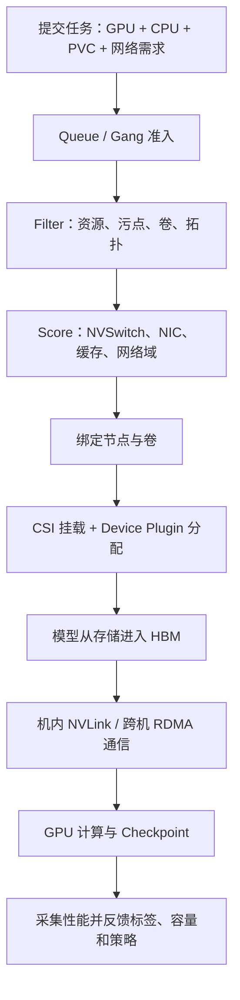

# GPU、网卡、存储联合拓扑调度：把任务放到真正合适的节点

调度不是数据流的最后一步，而是运行前的放置决策。选错节点之后，即使 CUDA、NCCL 和存储都能工作，也可能只能走慢路径。

本篇把 GPU、HBM、NVLink、RDMA 网卡、本地缓存、共享存储和 Gang Scheduling 放进同一个调度模型。

---

## 1. 学习目标

完成本文后，你应该能够：

- 解释为什么 GPU 数量调度不足以保证通信性能。
- 把 GPU、网卡、存储需求分成硬约束与软偏好。
- 理解 VolumeBinding 怎样参与 Scheduler 阶段。
- 设计可维护的节点拓扑标签。
- 分析 Gang Scheduling 与拓扑放置的不同职责。
- 根据训练/推理模式建立联合调度决策树。

---

## 2. 调度真正决定什么

一个 Pod 或训练作业最终被放到哪里，会决定：

- 使用哪种 GPU 和多少 HBM。
- 多张 GPU 是否有 NVLink/NVSwitch。
- GPU 与 CPU/内存是否跨 NUMA。
- GPU 到 RDMA HCA 是否跨 PCIe Root。
- 本地 NVMe 是否已有目标模型。
- PVC 是否能在该节点/区域挂载。
- 多个 Worker 是否位于同一高速网络域。

所以调度决策会预先塑造运行时数据路径：

```text
调度选节点
→ 确定 GPU/NUMA/NVLink
→ 确定 NIC 与 PCIe 距离
→ 确定存储和缓存位置
→ 决定 CUDA/NCCL/IO 能使用的路径
```

---

## 3. 默认 Scheduler 知道什么

对于传统 Device Plugin 扩展资源，Scheduler 通常能看到：

```text
node.status.allocatable["nvidia.com/gpu"] = 8
```

它可以判断：

- 节点是否有 8 个可分配 GPU。
- CPU、内存是否足够。
- 标签和污点是否匹配。
- 卷是否可绑定。

它通常不知道：

- GPU0 与 GPU1 是否通过 NVLink。
- 8 张 GPU 是否位于同一 NVSwitch Fabric。
- 哪张 GPU 靠近哪张 HCA。
- 某个 Local NVMe 中缓存了哪个模型 revision。
- 某张 GPU 的实际 HBM 带宽是否异常。

这些信息需要通过同构节点设计、标签、调度扩展、DRA 或厂商方案补充。

---

## 4. 资源视图分为四层

### 4.1 节点级资源

- CPU、内存。
- GPU 数量。
- 临时存储。
- Pod 数量。

### 4.2 节点标签

- GPU 型号与产品。
- HBM 容量档位。
- NVLink/NVSwitch 能力。
- RDMA 网络域。
- 本地 NVMe/cache 状态。
- 机架、区域、故障域。

### 4.3 可调度扩展资源

- `nvidia.com/gpu`。
- MIG 资源。
- RDMA HCA/VF 等设备资源。
- 其他 Device Plugin 或 DRA 资源。

### 4.4 存储对象

- StorageClass。
- PVC/PV。
- PV NodeAffinity/Zone。
- CSIStorageCapacity。
- `WaitForFirstConsumer`。

联合调度需要同时使用四层，而不是把所有信息都塞进标签。

---

## 5. 硬约束与软偏好

### 硬约束

不满足就不能运行或结果错误：

- GPU 型号/显存容量不足。
- GPU 数量不足。
- PVC 无法挂载。
- 缺少所需 RDMA 设备。
- 节点驱动/架构不兼容。
- 多机任务无法满足最小成员数。

### 软偏好

不满足仍可运行，但性能可能较差：

- 优先模型缓存已命中节点。
- 优先 NVSwitch 节点。
- 优先 GPU 与 HCA 同 NUMA。
- 优先同一机架或低跳数网络域。
- 优先空闲更集中的节点。

把性能偏好全部写成硬约束会造成大量 Pending；把必要条件写成软偏好又会让任务落到不能工作的节点。

---

## 6. 可行节点集合

一个 8 卡训练 Worker 的候选节点可表示为：

```text
FeasibleNodes
= GPU 型号符合
∩ 可分配 GPU ≥ 8
∩ CPU/内存足够
∩ NVSwitch 能力符合
∩ RDMA 设备可用
∩ PVC 可挂载
∩ 污点可容忍
∩ 安全/租户策略允许
```

在可行节点中再打分：

```text
Score
= 模型缓存命中
+ GPU/NIC 亲和
+ 网络域接近
+ 资源碎片更少
+ 与其他 Worker 放置更合理
```

---

## 7. 节点标签设计

示例仅表达设计思想：

```text
accelerator.example.com/gpu-family=h100
accelerator.example.com/gpu-count=8
accelerator.example.com/fabric=nvswitch
network.example.com/rdma=true
network.example.com/rail-count=2
network.example.com/fabric-zone=ib-leaf-07
storage.example.com/local-nvme=true
topology.kubernetes.io/zone=dc-a
```

标签原则：

- 名称稳定，不把临时指标做成静态标签。
- 值来源可审计。
- 自动发现与人工规划边界清楚。
- 变更后有控制器校验。
- 用户不能随意修改可信硬件标签。

不要给每个模型 revision 永久添加无限数量的节点标签。大规模缓存目录更适合专用 CRD/缓存调度器；标签适合少量关键状态。

---

## 8. 一个联合约束 Pod

```yaml
apiVersion: v1
kind: Pod
metadata:
  name: tp8-worker
  namespace: ai
spec:
  nodeSelector:
    accelerator.example.com/gpu-family: h100
    accelerator.example.com/fabric: nvswitch
    network.example.com/rdma: "true"
  affinity:
    nodeAffinity:
      preferredDuringSchedulingIgnoredDuringExecution:
        - weight: 80
          preference:
            matchExpressions:
              - key: storage.example.com/model-a-cached
                operator: In
                values: ["true"]
  tolerations:
    - key: nvidia.com/gpu
      operator: Exists
      effect: NoSchedule
  containers:
    - name: trainer
      image: registry.example.com/trainer:20260806
      resources:
        requests:
          cpu: "64"
          memory: 512Gi
          nvidia.com/gpu: 8
        limits:
          cpu: "64"
          memory: 512Gi
          nvidia.com/gpu: 8
      volumeMounts:
        - name: dataset
          mountPath: /dataset
          readOnly: true
  volumes:
    - name: dataset
      persistentVolumeClaim:
        claimName: training-dataset
```

如果集群通过 Device Plugin 暴露 RDMA 设备，还应按该实现请求相应扩展资源。资源名称和数量不能跨厂商照抄。

---

## 9. 为什么模型缓存通常是软偏好

模型缓存未命中时，可以从权威存储下载，只是启动更慢：

```text
缓存命中 → 30 秒 Ready
缓存未命中 → 下载 10 分钟后 Ready
```

如果写成硬约束：

```text
没有缓存节点 → Pod 永久 Pending
```

常见策略：

- 在线低延迟扩容：缓存命中作为强偏好，必要时保留热节点。
- 批处理训练：允许未命中，提前执行预取阶段。
- 超大模型且无法在启动预算内下载：把缓存变为硬条件，但配套缓存供给控制器。

标签只能表示状态；必须保证写标签前已经校验 revision 完整性。

---

## 10. VolumeBinding 参与放置

### 共享存储

CephFS/NFS 通常可被多节点访问，StorageClass 可能使用 `Immediate`。

### 拓扑受限块存储

卷位于特定可用区时，Scheduler 要过滤无法访问的节点。

### Local PV

PV 带节点亲和，必须使用 `WaitForFirstConsumer` 协调 Pod 和卷位置。

```text
GPU 节点候选
∩ PV/CSI 拓扑候选
= 最终候选
```

PVC Pending 和 Pod Pending 可能是同一个联合调度问题的两种表现。

---

## 11. CSIStorageCapacity 的作用

支持容量跟踪的 CSI 驱动可以发布：

```text
某 StorageClass 在某拓扑段还有多少可供给容量
```

Scheduler 在 `WaitForFirstConsumer` 场景中可据此减少“先选节点、后发现无容量”的失败。

但容量信息可能滞后，不能保证每次第一次供给都成功。还需要驱动重试、告警和容量水位治理。

---

## 12. NVLink/NVSwitch 怎样参与

### 最简单可靠的方法

把物理拓扑一致的服务器划入独立节点池：

```text
gpu-h100-sxm-nvswitch
gpu-h100-pcie
gpu-l40s-pcie
```

Pod 通过节点池/产品标签选择。

### 更细粒度问题

如果一台服务器内部存在多个 GPU Clique，Pod 请求 4 GPU 时，传统数量调度无法确保拿到同一 Clique 中的设备。

解决方向：

- Device Plugin 的设备选择策略。
- 拓扑管理器和 NUMA 策略。
- DRA 结构化设备声明。
- 厂商或自定义调度扩展。
- 将复杂服务器划成可预测资源池。

调度器“选节点”和 kubelet“选具体设备”是两个层次。

---

## 13. GPU 与 NIC 亲和

双 Socket、双 HCA 服务器可能是：

```text
NUMA0: GPU0-3 + HCA0
NUMA1: GPU4-7 + HCA1
```

理想多 Rail：

```text
GPU0-3 → HCA0
GPU4-7 → HCA1
```

错误路径：

```text
GPU0 → 跨 CPU Socket → HCA1
```

节点级标签只能表达“有两张 HCA”，不能总能保证每个 GPU 使用最近 HCA。还需要 NCCL 拓扑识别、容器可见的 `/sys`、正确接口选择和设备分配。

调度解决“去哪台服务器”，NCCL/运行时继续解决“服务器内部走哪条链路”。

---

## 14. Gang Scheduling 解决什么

一个 4 节点训练任务每节点需要 8 GPU：

```text
MinMember = 4
总需求 = 32 GPU
```

Gang Scheduling 避免只有 3 个 Worker 启动并长期占用 24 GPU 等待第 4 个。

它主要解决：

- 整组准入。
- 队列资源。
- 作业级等待与释放。

它不天然保证：

- 4 个节点位于同一 IB Leaf。
- 每个节点都是 NVSwitch。
- 模型缓存全部命中。
- HCA 性能健康。

这些仍需拓扑约束和打分。

---

## 15. 多机放置策略

### 策略 A：同一网络域优先

用机架/交换域标签与 PodAffinity，让 Worker 优先位于同一低跳数 Fabric 区域。

风险：集中放置会降低故障隔离。

### 策略 B：跨故障域

适合长期服务高可用，但多机同步训练跨域可能增加延迟。

### 策略 C：训练与推理解耦

- 训练优先通信拓扑和大规模 Gang。
- 推理优先模型缓存、容量和服务副本分散。

同一个调度策略不应机械套用所有 AI 工作负载。

---

## 16. 三类任务的决策树

### 单卡推理

```text
HBM 足够？
→ 模型缓存是否命中？
→ PVC/对象存储可访问？
→ 选择负载较低节点
```

### 单机多卡 TP

```text
请求卡数
→ NVLink/NVSwitch 能否覆盖整个 TP 组？
→ HBM 是否足够？
→ 本地缓存/共享存储能否按启动预算供给？
```

### 多机 DDP/TP

```text
Gang 资源是否齐备？
→ 节点 GPU 拓扑是否同构？
→ RDMA 网卡与 Fabric 区域是否合适？
→ 训练存储是否可达且带宽充足？
→ Checkpoint 是否会与通信争用？
```

---

## 17. 调度失败分析

### 现象：有 16 张空闲 GPU，8 卡 Pod Pending

可能是 GPU 分散在多台节点，每台不足 8 张。扩展资源不可跨节点拼成一个 Pod。

### 现象：GPU 足够，提示 volume node affinity conflict

Local PV 或区域卷位置与 GPU 候选节点冲突。

### 现象：两个 Worker 已运行，第三个 Pending

检查 Gang/PodGroup、队列配额、单节点 GPU 数、网络资源、PVC 和污点。

### 现象：任务能运行但 NCCL 很慢

调度可能选到了：

- PCIe 节点而非 NVSwitch 节点。
- 跨网络域节点。
- GPU/HCA 远端 NUMA。
- 与存储流量竞争的节点。

这属于“放置可行但评分不好”，不一定有 FailedScheduling 事件。

### 现象：缓存标签存在但文件缺失

说明标签状态与真实缓存脱节。撤销错误标签、停止新调度，并让缓存控制器重新校验 manifest。

---

## 18. 调度结果验收

调度后不要只看 Pod Running。

### 放置

```bash
kubectl -n ai get pod -o wide
kubectl get nodes --show-labels
kubectl -n ai describe pod <pod>
```

### GPU 拓扑

```bash
nvidia-smi topo -m
nvidia-smi topo -p2p p
nvidia-smi topo -p2p n
```

### 网卡

```bash
rdma link
ibdev2netdev
ip route
```

### 存储

```bash
findmnt
df -hT
```

### 应用

- NCCL 实际 Transport。
- 模型缓存 revision。
- H2D 时间。
- step time 与吞吐。

调度标签表达的是意图，运行时测量才是事实。

---

## 19. 可观测性

调度层：

- Pending 时间。
- FailedScheduling 原因。
- Queue 等待。
- Gang 准入等待。
- 因 GPU、卷、网卡资源不足被过滤的节点数。

放置质量：

- NVSwitch 节点命中率。
- 模型缓存命中率。
- 同网络域放置率。
- 跨 NUMA/GPU-NIC 慢路径比例。

业务结果：

- 冷启动。
- NCCL busbw。
- step time。
- GPU 利用率。
- Checkpoint 时间。

最终应验证“好的调度得分是否真的带来业务收益”。

---

## 20. 渐进式建设路线

### 第一阶段：节点池

- 按 GPU 型号、拓扑和用途划分。
- 使用 NodeSelector、Taint/Toleration。

### 第二阶段：存储协调

- Local PV 使用 `WaitForFirstConsumer`。
- 建立共享存储和本地缓存分层。

### 第三阶段：分布式准入

- 引入队列和 Gang Scheduling。
- 管理多租户配额与优先级。

### 第四阶段：网络拓扑

- 把 RDMA Fabric 区域、HCA 能力纳入标签/资源。
- 对比不同放置的 NCCL 基线。

### 第五阶段：设备级调度

- 评估 DRA、厂商扩展或自定义插件。
- 解决 GPU Clique、GPU-NIC 精细亲和等问题。

不要在基础节点信息都不准确时直接开发复杂调度器。

---

## 21. 完整闭环



这才是完整的：

```text
计算 ↔ 显存 ↔ NVLink ↔ 网卡 ↔ 存储 ↔ 调度
```

它不是单向直线，而是由调度预先选择路径、运行时产生数据流、监控结果再反馈规划的闭环。

---

## 22. 本篇总结

联合拓扑调度的核心原则：

1. 先区分硬约束和软偏好。
2. 节点级选择与节点内设备选择是两个层次。
3. VolumeBinding 让存储位置参与调度。
4. Gang 保证整组资源，不保证通信拓扑最优。
5. 标签表达意图，NCCL、IO 和业务指标验证实际路径。

上一篇：[多机训练的完整路径](./57e-多机训练的完整路径.md)。下一篇回到毕业项目实践：[GPU 集群完整部署实录](./58-GPU%20集群完整部署实录.md)。

---

## 23. 课后练习

1. 为什么调度是完整数据路径的前置步骤？
2. GPU 数量足够为什么不代表 NVLink 拓扑合适？
3. 模型缓存应该是硬约束还是软偏好？
4. Gang Scheduling 与拓扑调度分别解决什么？
5. 为单卡推理、8 卡 TP 和 4 节点 DDP 分别列出约束。
6. 制造 Local PV 与 GPU 节点冲突，记录调度事件。
7. 对两种节点放置运行 nccl-tests，验证调度偏好是否有效。

---

## 参考与致谢

- [Kubernetes Scheduler Configuration](https://kubernetes.io/docs/reference/scheduling/config/)
- [Kubernetes Scheduling Framework](https://kubernetes.io/docs/concepts/scheduling-eviction/scheduling-framework/)
- [Kubernetes Device Plugins](https://kubernetes.io/docs/concepts/extend-kubernetes/compute-storage-net/device-plugins/)
- [Kubernetes Storage Capacity](https://kubernetes.io/docs/concepts/storage/storage-capacity/)
- [NVIDIA GPU Feature Discovery](https://docs.nvidia.com/datacenter/cloud-native/gpu-operator/latest/gpu-feature-discovery.html)
- [NCCL GPU Troubleshooting](https://docs.nvidia.com/deeplearning/nccl/user-guide/docs/troubleshooting/gpu_troubleshooting.html)

本文把 Kubernetes 调度、CSI 和 NVIDIA 设备/通信拓扑放在同一决策模型中。不同 Kubernetes 版本、DRA 能力和厂商实现需以各自兼容矩阵为准。
