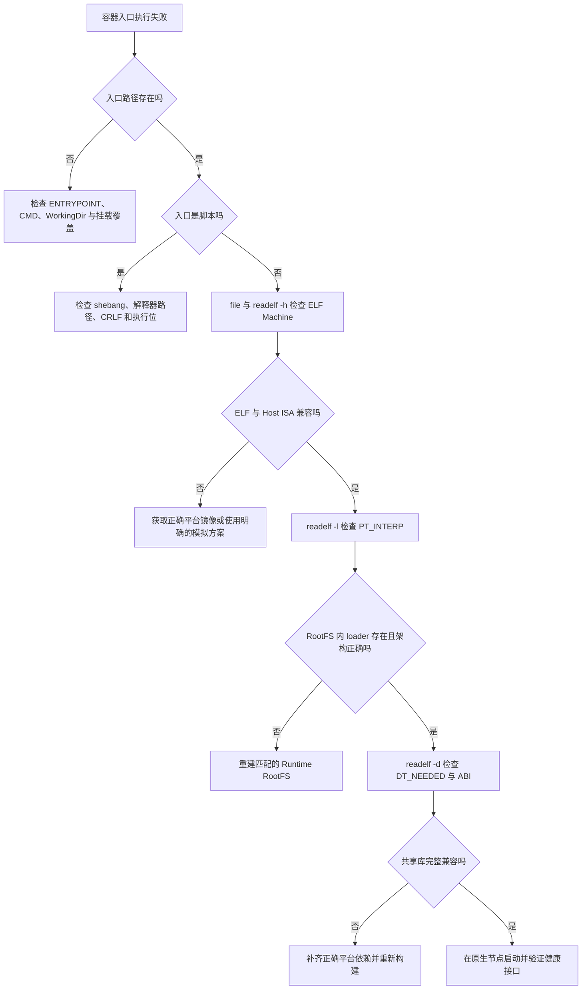

# ARM64 容器启动报 ENOENT：从 ELF 程序解释器到混合架构镜像排障

容器启动时出现下面的错误，第一反应通常是检查入口文件是否存在：

```text
standard_init_linux.go:211: exec user process caused "no such file or directory"
```

然而目标文件明明存在、权限也正常，容器仍然反复退出。这个现象可能不是入口文件缺失，而是 Linux 在执行入口文件时找不到下一阶段所需的解释器或动态加载器。

本文以 ARM64 服务器上的离线镜像为例，从 Docker 报错一直追踪到 `execve()`、ELF `PT_INTERP` 和 RootFS，建立一套可以迁移到其他容器启动问题的排查方法。

## 1. 故障现象与环境

某 ARM64 环境需要离线部署 Explorer Backend，关键环境如下：

```text
Host OS       Kylin Linux Advanced Server V10
Host ISA      AArch64 / ARM64
Kernel        4.19
Docker        19.03.13
cgroup        v1
Application   Explorer Backend
Listen Port   9997
```

离线包名称包含 `arm`，导入的业务镜像为：

```text
chainmakerofficial/explorer-backend:v2.3.0
```

启动后可以观察到：

```text
容器进程退出
ExitCode = 1
RestartCount 持续增加
9997 端口未监听
运行时返回 no such file or directory
```

本案例中的产品名、版本和输出用于说明证据链。处理真实生产故障时，应保存原始命令输出、镜像 Digest、采集时间和节点信息，不能用本文示例替代现场证据。

## 2. 结论先行

最终证据表明，镜像内部出现了混合架构：

```text
ARM64 Host
  └─ Image Config: linux/amd64
      └─ RootFS 用户空间: 主要为 x86-64
          └─ Explorer ELF: AArch64
              └─ PT_INTERP: /lib/ld-linux-aarch64.so.1
                  └─ RootFS 中缺少匹配的 ARM64 loader 和运行库
                      └─ execve() 返回 ENOENT
```

这不是简单的“ARM 镜像跑不起来”，而是四层信息互相矛盾：

| 层次 | 现场结果 | 判断 |
| --- | --- | --- |
| 宿主机 Kernel | AArch64 | 能执行 ARM64 指令 |
| OCI Image Config | `amd64` | 声明与目标平台不匹配 |
| RootFS 用户空间 | `/bin/sh`、glibc、loader 主要为 x86-64 | 不能为 ARM64 动态程序提供运行时 |
| 业务 ELF | AArch64，动态链接 | 程序本身属于 ARM64 |
| ELF Interpreter | `/lib/ld-linux-aarch64.so.1` | RootFS 必须提供该路径及兼容库 |

只看其中任何一项都不足以完成归因。真正有效的是把 Host、Image Config、RootFS、ELF、Loader 和 Library 连成一条证据链。

## 3. 先建立正确的容器模型

### 3.1 容器不是虚拟机

Linux 容器没有自己的 Kernel。它把宿主机 Kernel 与镜像提供的用户空间组合起来：

```text
Container
├─ Host Linux Kernel
├─ Image RootFS
│  ├─ /bin
│  ├─ /lib
│  ├─ /usr
│  └─ Application
├─ Namespace
├─ cgroup
└─ OCI Process Configuration
```

因此，没有模拟器时，容器里的可执行代码必须与宿主机 CPU ISA 兼容。Docker 官方的多平台说明也强调：容器共享宿主机 Kernel，运行代码必须匹配宿主机架构；Multi-Platform Image 的作用是让运行时选择正确的平台变体，而不是把 amd64 指令自动转换为 arm64。

### 3.2 OCI 镜像有三类需要分别验证的信息

OCI 镜像可以抽象为：

```text
Image Index（可选，多平台入口）
  ├─ linux/amd64 Manifest
  │    ├─ Config
  │    └─ Layers → amd64 RootFS + amd64 Application
  └─ linux/arm64 Manifest
       ├─ Config
       └─ Layers → arm64 RootFS + arm64 Application
```

单个平台 Manifest 引用一份 Config 和一组 Layers；多平台 Image Index 则引用多组平台 Manifest。OCI Image Config 中的 `architecture` 表示镜像内二进制面向的 CPU 架构，但它仍然是构建工具写入的声明。

镜像层可以包含任意普通文件，构建器不会逐个检查 `COPY` 进入的 ELF 是否与 Config 一致。因此完全可能构建出格式合法、内容错误的镜像：

```dockerfile
FROM amd64-base-image
COPY arm64/app /opt/app
ENTRYPOINT ["/opt/app"]
```

`docker build` 成功只说明镜像构建流程完成，不证明入口文件能在目标平台执行。

### 3.3 Tag、文件名和 Architecture 都不是单独的最终证据

`explorer-arm.tar`、`:arm64` 或 `Architecture=arm64` 都是重要线索，但名称和元数据可以被错误制作。反过来，镜像里存在一个 x86-64 文件也不能单独证明整个 RootFS 是 x86-64，因为合法的多架构工具镜像可能有意携带多种二进制。

应至少交叉检查：

```text
Host Architecture
Image/Manifest Platform
RootFS 关键程序架构
Entrypoint ELF 或脚本
PT_INTERP
共享库 ABI
```

## 4. 为什么文件存在仍然返回 ENOENT

### 4.1 动态 ELF 的真实启动链路

执行动态链接的 ARM64 程序时，大致会经历：

```text
Shell / runc
  → execve("/opt/explorer/bin/explorer", argv, envp)
  → Kernel 读取 ELF Header
  → 校验 Machine = AArch64
  → 读取 Program Header 中的 PT_INTERP
  → 查找 /lib/ld-linux-aarch64.so.1
  → 动态加载器装载 libc、libpthread 等共享库
  → 完成符号解析与 relocation
  → 跳转到程序入口
```

`PT_INTERP` 指定动态 ELF 的程序解释器。ARM64 glibc 环境常见：

```text
/lib/ld-linux-aarch64.so.1
```

x86-64 glibc 环境常见：

```text
/lib64/ld-linux-x86-64.so.2
```

如果业务 ELF 本身存在且架构可识别，但 `PT_INTERP` 指定的路径不存在，Kernel 在下一步查找 loader 时得到 `ENOENT`，运行时向上报告的仍可能是 `no such file or directory`。

所以报错里的“文件”可能是入口文件，也可能是入口文件依赖的解释器。

### 4.2 Shell 脚本也有相同机制

下面的脚本即使存在，也依赖 shebang 指定的解释器：

```bash
#!/bin/bash
exec /opt/explorer/bin/explorer
```

如果精简镜像中只有 `/bin/sh` 而没有 `/bin/bash`，`execve()` 同样可能返回 `ENOENT`。如果脚本使用 Windows CRLF，内核看到的解释器可能近似 `/bin/bash\r`，也会出现看似文件存在却无法执行的现象。

### 4.3 相似报错不能混为同一个根因

| 表现 | 常见内核错误 | 优先检查 |
| --- | --- | --- |
| `no such file or directory` | `ENOENT` | 入口路径、shebang、CRLF、ELF `PT_INTERP` |
| `exec format error` | `ENOEXEC` | ELF CPU 架构、脚本格式、binfmt/QEMU |
| `permission denied` | `EACCES` | 执行位、目录权限、`noexec`、SELinux/AppArmor |
| `error while loading shared libraries` | loader 已启动 | `DT_NEEDED`、库路径、ABI 和符号版本 |
| 容器立即退出且 ExitCode 0 | 主进程正常结束 | ENTRYPOINT/CMD、前台进程和守护化行为 |

`standard_init_linux.go:211` 只是特定版本 runc 源码中的报错位置；版本变化后行号会不同，不应把它当成根因标识。

## 5. 现场保护与排查原则

开始修改前先保存：

```bash
date -Is
uname -a
docker version
docker info
docker image inspect chainmakerofficial/explorer-backend:v2.3.0
docker inspect cm-explorer-backend
docker logs --timestamps cm-explorer-backend
```

还应记录：

- 镜像 ID、RepoDigest 和离线 tar 的 SHA-256
- Compose 文件、环境变量、volume 和 ENTRYPOINT 覆盖
- 宿主机架构、Kernel、Docker/runc 版本
- 容器最后状态、退出码和重启次数
- 原始安装包来源与交付清单

不要先反复重启、覆盖同名 Tag 或删除旧镜像。错误镜像本身就是重要证据，后续还要用它验证 RootFS 和入口文件。

## 6. 从外到内建立证据链

### 6.1 确认宿主机架构

```bash
uname -m
lscpu | sed -n '1,12p'
```

代表性输出：

```text
$ uname -m
aarch64

$ lscpu | sed -n '1,4p'
Architecture:        aarch64
Byte Order:          Little Endian
CPU(s):              128
```

`aarch64` 是 Linux 工具常用名称，OCI/Go 平台字符串通常写作 `arm64`，两者在这里指向同一 64 位 ARM 架构族。

### 6.2 检查镜像声明和启动配置

```bash
image='chainmakerofficial/explorer-backend:v2.3.0'

docker image inspect "$image" --format \
  'OS={{.Os}} ARCH={{.Architecture}} ENTRYPOINT={{json .Config.Entrypoint}} CMD={{json .Config.Cmd}} WORKDIR={{.Config.WorkingDir}}'
```

代表性输出：

```text
OS=linux ARCH=amd64 ENTRYPOINT=["./chainmaker-explorer.bin","-config"] CMD=["../configs"] WORKDIR=/chainmaker-explorer-backend/bin
```

这里已经出现平台矛盾，但还不能只凭 `ARCH=amd64` 宣判 RootFS。下一步必须检查实际文件。

### 6.3 不启动容器也可以取出 RootFS 文件

`docker create` 只创建容器元数据和可写层，不执行 ENTRYPOINT，因此适合从故障镜像中取证：

```bash
image='chainmakerofficial/explorer-backend:v2.3.0'
cid="$(docker create "$image")"

docker cp "$cid":/chainmaker-explorer-backend/bin/chainmaker-explorer.bin /tmp/explorer.bin
docker cp "$cid":/bin/sh /tmp/rootfs-sh
docker export "$cid" -o /tmp/explorer-rootfs.tar

docker rm "$cid"
```

若镜像没有 `/bin/sh`，`docker cp` 失败不等于 RootFS 损坏；Distroless 或 Scratch 镜像本来就可能没有 Shell。此时以 ENTRYPOINT、loader 和应用依赖为检查对象。

需要系统查看 RootFS 时使用独立临时目录：

```bash
rootfs_dir="$(mktemp -d /tmp/explorer-rootfs.XXXXXX)"
tar -xf /tmp/explorer-rootfs.tar -C "$rootfs_dir"
find "$rootfs_dir" -type f \( -name 'ld-linux*' -o -name 'libc.so.6' \) -print
```

取证完成后再清理明确的临时目录；不要对变量为空或未经确认的路径执行递归删除。

### 6.4 检查业务 ELF，而不是相信文件名

```bash
file /tmp/explorer.bin
readelf -hW /tmp/explorer.bin
readelf -lW /tmp/explorer.bin
```

代表性结果：

```text
ELF 64-bit LSB executable, ARM aarch64, dynamically linked,
interpreter /lib/ld-linux-aarch64.so.1

Class:                             ELF64
Machine:                           AArch64

[Requesting program interpreter: /lib/ld-linux-aarch64.so.1]
```

这一步证明：

1. 入口文件确实是 ELF，而不是损坏的压缩包或文本。
2. ELF 指令集为 AArch64。
3. 它不是完全静态链接的程序。
4. Kernel 接下来必须从容器 RootFS 找到指定 loader。

### 6.5 检查 RootFS 的真实用户空间架构

对 RootFS 中多个关键文件取样，而不是只检查一个 loader：

```bash
file -L /tmp/rootfs-sh
file -L "$rootfs_dir"/bin/sh
file -L "$rootfs_dir"/usr/bin/env 2>/dev/null
file "$rootfs_dir"/lib64/ld-linux-x86-64.so.2 2>/dev/null
file "$rootfs_dir"/lib/ld-linux-aarch64.so.1 2>/dev/null
```

案例中得到的证据组合为：

```text
/bin/sh                         ELF x86-64
/lib64/ld-linux-x86-64.so.2     ELF x86-64
/lib/ld-linux-aarch64.so.1      不存在
/opt/.../explorer.bin           ELF AArch64
```

多个基础程序和运行库共同指向 x86-64，业务入口则是 AArch64，才足以把“混合架构 RootFS”从猜测提升为根因证据。

### 6.6 检查 `PT_INTERP` 和共享库

先使用不会执行目标程序的静态检查：

```bash
readelf -lW /tmp/explorer.bin | grep -F 'Requesting program interpreter'
readelf -dW /tmp/explorer.bin | grep -F '(NEEDED)'
readelf --version-info /tmp/explorer.bin | grep -E 'GLIBC_|GLIBCXX_'
```

`DT_NEEDED` 会列出程序声明的共享库名称，版本信息可帮助判断 glibc、libstdc++ 等 ABI 下限。

不要在不可信文件或不兼容架构上直接运行宿主机 `ldd`。`ldd` 的实现和行为依系统而异，跨架构时也可能给出误导结果。优先使用 `readelf`/`objdump` 做静态检查；只有在可信、隔离且架构兼容的测试容器内，才执行：

```bash
ldd /chainmaker-explorer-backend/bin/chainmaker-explorer.bin
```

正常结果不能包含 `not found`，并且 loader 与所有共享库都必须是 ARM64 且 ABI 兼容。

### 6.7 如果入口是脚本，检查 shebang 与换行

```bash
file /tmp/entrypoint.sh
sed -n '1p' /tmp/entrypoint.sh
sed -n '1p' /tmp/entrypoint.sh | od -An -tx1c
```

重点确认：

- shebang 中的解释器在 RootFS 内真实存在；
- 首行没有 `0d 0a` 形式的 CRLF；
- 脚本具有执行位；
- ENTRYPOINT 使用的相对路径与 WorkingDir 一致。

如果入口是 `#!/usr/bin/env bash`，还必须同时存在 `/usr/bin/env` 和可由 `PATH` 找到的 `bash`。

## 7. 根因如何从相关性上升为因果证据

仅凭“补了某个文件后能启动”还不够严谨。这个案例的强因果证据来自控制变量：

```text
保持不变：
  Explorer 业务 ELF
  业务配置
  启动参数
  宿主机 Kernel

唯一关键变化：
  x86-64 RootFS → ARM64 glibc RootFS

结果：
  ENOENT → 正常启动并监听 9997
```

业务二进制没有重新编译，替换为匹配的 ARM64 用户空间后立即恢复，且 `readelf`、loader、共享库检查全部闭环，说明主要根因不是应用逻辑、端口或数据库，而是镜像用户空间与 ELF 架构不一致。

同时还应保留边界：如果新 RootFS 还顺带改变了环境变量、证书、时区或依赖库版本，就不能声称只有架构一个变量。生产复盘应记录新旧镜像的完整差异。

## 8. 修复方案与选择顺序

### 8.1 获取经过验证的官方 ARM64 镜像

这是优先级最高的方案。正确的平台变体应同时满足：

```text
Image Config = linux/arm64
RootFS       = ARM64 用户空间
Application  = AArch64 ELF 或脚本/字节码
Loader       = ARM64 且路径匹配 PT_INTERP
Libraries    = ARM64 且 ABI 兼容
```

要求交付方提供镜像 Digest、构建来源、平台清单、依赖说明和离线文件校验值，而不是只提供一个带 `arm` 字样的 tar 文件。

### 8.2 从源码重新构建

拥有源码和依赖锁定信息时，应在原生 ARM64 Builder 或经过验证的交叉编译流水线中重新构建。动态链接程序还必须控制：

- glibc 与 libstdc++ ABI；
- CGO 或其他本地扩展；
- 目标 CPU 指令集和最低硬件基线；
- Build Stage 与 Runtime Stage 的平台；
- 最终镜像中的 CA、时区和必要共享库。

编译阶段成功不代表运行阶段完整，必须在 ARM64 Runner 上执行镜像启动和健康检查。

### 8.3 用健康 ARM64 RootFS 重新封装

没有源码、但业务 ELF 已确认是 ARM64 时，可以将它放入匹配的 ARM64 Runtime Image。关键是选择与程序 ABI 相容的 RootFS，而不是随便找一个标记为 ARM64 的镜像。

例如，依赖 glibc 的程序不能因为 CPU 架构一致，就直接放入默认使用 musl 的 Alpine RootFS。CPU ISA、动态 loader、C Library 和共享库 ABI 必须同时匹配。

本案例临时借用了同一交付包中已经验证为 ARM64 的 VM Engine RootFS。该方案可以恢复业务，但只应视为应急手段，因为业务基础镜像可能引入：

- 多余程序和更大攻击面；
- 未知环境变量、用户和默认配置；
- 不必要的许可证与漏洞治理范围；
- 与另一个产品版本的生命周期耦合。

长期方案仍应使用最小、受维护、经过扫描且用途明确的 ARM64 Runtime Base。

### 8.4 QEMU 只能用于有边界的兼容或构建场景

QEMU/binfmt_misc 可以让非本机架构程序通过模拟执行，但它不会把错误 RootFS 变成正确 RootFS。对于计算密集型构建，模拟通常更慢；Docker 官方也建议优先考虑原生多节点 Builder 或交叉编译。

生产修复不能只是给 ARM64 节点注册一个 amd64 模拟器，然后继续运行来源不明的混合架构镜像。这会掩盖制品错误、引入性能差异并扩大排障面。

## 9. 重新封装的参考实现

### 9.1 准备构建上下文

```text
explorer-arm64/
├─ Dockerfile
└─ bin/
   └─ chainmaker-explorer.bin
```

先在构建目录外完成取证和 SHA-256 记录，再复制经过确认的业务 ELF。不要把生产私钥、证书或业务配置放入构建上下文。

### 9.2 使用明确的 ARM64 Runtime Base

下面使用企业内部已验证的 ARM64 Debian Runtime 作为示例；实际使用时应固定到平台 Manifest Digest：

```dockerfile
FROM registry.example.com/base/debian:12-arm64

RUN groupadd --gid 10001 explorer \
    && useradd --uid 10001 --gid 10001 --no-create-home --home-dir /nonexistent explorer \
    && mkdir -p /opt/explorer/bin /opt/explorer/configs \
    && chown -R 10001:10001 /opt/explorer

COPY --chown=10001:10001 bin/chainmaker-explorer.bin /opt/explorer/bin/chainmaker-explorer.bin

RUN chmod 0755 /opt/explorer/bin/chainmaker-explorer.bin

USER 10001:10001
WORKDIR /opt/explorer
EXPOSE 9997

ENTRYPOINT ["/opt/explorer/bin/chainmaker-explorer.bin", "-config"]
CMD ["/opt/explorer/configs"]
```

如果程序运行必须写入特定目录，应显式创建和授权该目录，不应为了省事使用 root 用户或给整个 RootFS 赋予宽松权限。

构建前先检查 Base：

```bash
base='registry.example.com/base/debian:12-arm64'
docker image inspect "$base" --format 'OS={{.Os}} ARCH={{.Architecture}} ID={{.Id}}'
```

构建新镜像：

```bash
docker build --pull=false \
  -t chainmakerofficial/explorer-backend:v2.3.0-arm64-fixed \
  ./explorer-arm64
```

`--pull=false` 适合明确的离线演练，但生产流水线应以受控 Registry、固定 Digest 和依赖更新策略为准。

### 9.3 配置和密钥使用只读挂载

配置目录不进入 Image Layer：

```yaml
services:
  explorer:
    image: chainmakerofficial/explorer-backend:v2.3.0-arm64-fixed
    restart: unless-stopped
    ports:
      - "9997:9997"
    volumes:
      - ./configs:/opt/explorer/configs:ro
```

本文统一使用 Compose V2 的 `docker compose` 写法；Docker 19.03 环境常见独立的 Compose V1，应将命令写成 `docker-compose`，或使用交付包中经过验证的 Compose 可执行文件。

`:ro` 只能限制容器通过该挂载点修改宿主机配置，不能替代宿主机文件权限、Secret 管理、镜像扫描和最小权限用户。私钥一旦被 `COPY` 进入某个镜像层，后续层中执行 `rm` 也不能从旧层历史中可靠移除。

## 10. 修复后的分层验收

### 10.1 镜像静态验收

```bash
fixed='chainmakerofficial/explorer-backend:v2.3.0-arm64-fixed'

docker image inspect "$fixed" --format \
  'OS={{.Os}} ARCH={{.Architecture}} ENTRYPOINT={{json .Config.Entrypoint}} CMD={{json .Config.Cmd}}'
```

预期至少包含：

```text
OS=linux
ARCH=arm64
ENTRYPOINT 指向绝对路径
CMD 指向容器内配置目录
```

再次从最终镜像提取入口文件进行独立验证：

```bash
cid="$(docker create "$fixed")"
docker cp "$cid":/opt/explorer/bin/chainmaker-explorer.bin /tmp/fixed-explorer.bin
docker rm "$cid"

file /tmp/fixed-explorer.bin
readelf -hW /tmp/fixed-explorer.bin | grep -F 'Machine:'
readelf -lW /tmp/fixed-explorer.bin | grep -F 'Requesting program interpreter'
```

### 10.2 Loader 与 Library 验收

对可信的最终镜像，在原生 ARM64 测试节点中执行：

```bash
docker run --rm --entrypoint /bin/sh "$fixed" -c '
  set -eu
  test -e /lib/ld-linux-aarch64.so.1
  ldd /opt/explorer/bin/chainmaker-explorer.bin
'
```

验收点：

- loader 路径真实存在；
- `ldd` 没有 `not found`；
- 共享库来自预期目录；
- 没有因为临时设置 `LD_LIBRARY_PATH` 而意外加载未知库。

### 10.3 运行状态验收

```bash
docker compose up -d --force-recreate explorer
docker compose ps explorer
container_id="$(docker compose ps -q explorer)"
docker inspect "$container_id" --format \
  'status={{.State.Status}} running={{.State.Running}} exit={{.State.ExitCode}} restarts={{.RestartCount}}'
docker logs --timestamps --tail 200 "$container_id"
ss -lntp | grep ':9997'
```

代表性健康结果：

```text
status=running running=true exit=0 restarts=0
LISTEN 0 4096 *:9997 *:*
```

端口监听只证明进程绑定了 Socket，还应继续验证：

- 健康检查接口返回预期状态；
- 数据库初始化与版本正确；
- 证书、私钥和配置读取成功；
- 业务请求可以完成；
- 重启后状态仍然稳定。

### 10.4 用反事实验证根因

高质量复盘应回答：

1. 旧 ELF 放入正确 ARM64 RootFS 后是否恢复？
2. 新镜像是否没有修改业务代码和配置？
3. 旧 RootFS 的 `/bin/sh`、loader 与 libc 是否确为 x86-64？
4. 新镜像是否同时满足 Config、RootFS、ELF、Loader、Library 五层一致？
5. 是否还有独立问题被 RootFS 替换顺带修复？

只有这些问题都有证据，才能把“怀疑镜像架构”提升为可信根因。

## 11. 正确构建 Multi-Platform Image

如果产品同时支持 amd64 和 arm64，推荐使用一个 Image Index 指向两个各自完整的平台镜像：

```text
explorer-backend:v2.3.0
└─ OCI Image Index
   ├─ linux/amd64 Manifest
   │  └─ amd64 RootFS + amd64 ELF
   └─ linux/arm64 Manifest
      └─ arm64 RootFS + arm64 ELF
```

运行时拉取 Tag 时，会根据宿主机平台选择对应 Manifest。正确的多架构镜像不是“一个 RootFS 里混放两种架构然后执行同一个入口”。

如果已经分别准备两个平台的业务文件，可以按目标平台复制：

```dockerfile
# syntax=docker/dockerfile:1
FROM debian:12-slim

ARG TARGETARCH
RUN groupadd --gid 10001 app \
    && useradd --uid 10001 --gid 10001 --no-create-home app

COPY --chown=10001:10001 bin/${TARGETARCH}/explorer /opt/explorer/bin/explorer
RUN chmod 0755 /opt/explorer/bin/explorer

USER 10001:10001
ENTRYPOINT ["/opt/explorer/bin/explorer"]
```

构建并推送多平台镜像：

```bash
docker buildx build \
  --platform linux/amd64,linux/arm64 \
  -t registry.example.com/explorer-backend:v2.3.0 \
  --push \
  .
```

检查 Registry 中的 Image Index：

```bash
docker buildx imagetools inspect \
  registry.example.com/explorer-backend:v2.3.0
```

应该能看到独立的 `linux/amd64` 和 `linux/arm64` Manifest。Docker 官方列出的多平台构建策略包括 QEMU 模拟、多原生节点 Builder 和交叉编译；计算量较大的编译更适合原生 Builder 或可靠的交叉编译流程。

本案例运行节点使用较旧的 Docker 19.03。运行环境不必承担多架构构建职责：可以在受控的新版本构建平台完成 Buildx、扫描和签名，再向旧环境交付经过验证的单平台 ARM64 离线制品。

## 12. 离线交付为什么更容易出现架构错包

在线 Registry 的多平台 Tag 可以让客户端选择正确 Manifest；离线 tar 往往只包含制作者本地已有的某个平台镜像。经典镜像存储和旧工具链中，不能假设一次 `docker save` 会完整保留所有平台变体。

推荐为每个平台独立交付：

```text
release/
├─ explorer-backend-v2.3.0-linux-amd64.tar
├─ explorer-backend-v2.3.0-linux-arm64.tar
├─ SHA256SUMS
└─ release-manifest.yaml
```

`release-manifest.yaml` 至少记录：

```yaml
product: explorer-backend
version: v2.3.0
artifacts:
  - file: explorer-backend-v2.3.0-linux-arm64.tar
    platform: linux/arm64
    image_digest: sha256:REPLACE_WITH_REAL_DIGEST
    file_sha256: REPLACE_WITH_REAL_SHA256
  - file: explorer-backend-v2.3.0-linux-amd64.tar
    platform: linux/amd64
    image_digest: sha256:REPLACE_WITH_REAL_DIGEST
    file_sha256: REPLACE_WITH_REAL_SHA256
```

接收方不根据文件名信任平台，而是在 `docker load` 后重新执行：

```bash
sha256sum -c SHA256SUMS
docker load -i explorer-backend-v2.3.0-linux-arm64.tar
docker image inspect IMAGE --format 'OS={{.Os}} ARCH={{.Architecture}} ID={{.Id}}'
```

然后继续检查实际 ELF、loader 和依赖。这样即使制品名称正确但内容装错，也能在上线前阻断。

## 13. 将检查固化到 CI/CD

### 13.1 构建门禁

每个平台都要验证：

- Base Image Manifest 的平台；
- 最终 Image Config 的 `os/architecture`；
- ENTRYPOINT 文件存在且可执行；
- ELF `Machine`、`PT_INTERP` 与目标平台一致；
- `DT_NEEDED` 对应库完整；
- 镜像中不存在意外的构建工具和密钥；
- SBOM、漏洞扫描和制品签名通过。

### 13.2 原生节点 Smoke Test

静态检查不能替代启动测试。arm64 镜像至少在原生 ARM64 Runner 上完成：

```text
创建容器
→ 入口进程成功 exec
→ 健康接口 Ready
→ 依赖服务连接成功
→ 正常处理最小请求
→ 重启后再次 Ready
```

如果只能使用 QEMU 做早期测试，发布前仍应保留原生硬件验收，因为模拟环境可能隐藏性能、内核特性和本地扩展问题。

### 13.3 不可变制品

测试、离线导出和生产部署应引用同一个 Digest。不要在故障后覆盖原 Tag 再声称“还是同一个镜像”，否则无法证明修复前后究竟改变了什么。

## 14. 常见错误处理及其风险

### 14.1 只执行 `chmod +x`

执行位缺失会导致 `EACCES`，但不能补出缺失的 loader，也不能改变 ELF 架构。权限检查是必要步骤，不是所有启动错误的通用修复。

### 14.2 给 loader 路径创建软链接

把 `/lib/ld-linux-aarch64.so.1` 链接到 x86-64 loader 不会发生架构转换，只会把问题变成 `exec format error` 或更后面的 ABI 错误。即使复制了 ARM64 loader，缺少匹配的 libc 和其他依赖仍然无法运行。

### 14.3 只修改 Image Architecture 元数据

OCI Config 的 `architecture` 应当描述镜像内容，但改字段不会转换 Layers 中的 `/bin/sh`、glibc 和业务 ELF。修复必须改变实际 RootFS 和程序组合，并生成新的不可变镜像。

### 14.4 在 ARM Host 上直接对跨架构 ELF 运行 `ldd`

这既可能失败或误判，也不适合检查不可信二进制。先用 `readelf`、`objdump` 和离线 RootFS 检查；需要 `ldd` 时放到受控、同架构的测试容器中。

### 14.5 长期复用另一个业务镜像作为 Base

它能证明“正确 ARM64 Runtime 可以启动这个 ELF”，但不自动成为可维护的生产方案。应尽快重建用途明确的最小 Runtime Image。

### 14.6 把 QEMU 当成生产修复

`--platform linux/amd64` 只表达目标平台选择，不会自动修正混合架构 RootFS。即使安装 QEMU 后能够执行 amd64 程序，也应把它视为经过评估的兼容方案，而不是掩盖错误制品的默认做法。

## 15. 一张排障决策树



决策树中的每个结论都应保留对应输出。不要从“文件存在”直接跳到“Docker 有 Bug”，也不要从“Tag 带 arm”直接跳到“架构一定正确”。

## 16. 故障验收清单

| 检查对象 | 命令或证据 | 正常要求 |
| --- | --- | --- |
| Host ISA | `uname -m` | 与目标平台兼容 |
| Image Config | `docker image inspect` | `linux/arm64` |
| Entrypoint | Image Config + RootFS | 路径存在、WorkingDir 正确、具有执行权限 |
| RootFS | `file /bin/sh`、loader、libc | ARM64 或与应用所需平台一致 |
| ELF Header | `file`、`readelf -hW` | `AArch64` |
| Interpreter | `readelf -lW` | 路径在 RootFS 中存在 |
| Dependencies | `readelf -dW`、隔离环境 `ldd` | 无缺失且 ABI 兼容 |
| Config/Secret | Compose 与挂载 | 不进入镜像层，按需只读 |
| Container State | `docker inspect` | Running、ExitCode 0、无重启增长 |
| Service | 端口、健康接口、最小请求 | 从进程到业务均正常 |
| Artifact | Digest、SHA-256、Manifest | 可追溯且平台标识与实物一致 |

## 17. 课后练习

1. 为什么 ARM64 ELF 明明存在，`execve()` 仍可能返回 `ENOENT`？
2. 为什么 `docker image inspect` 显示 `arm64` 仍不足以证明镜像正确？
3. `exec format error` 与缺失 `PT_INTERP` 的排查入口有什么不同？
4. 为什么不能把 x86-64 loader 软链接成 ARM64 loader 的名字？
5. 动态链接的 ARM64 ELF 放入 ARM64 Alpine 后为什么仍可能失败？
6. 多平台 Image Index 与在一个 RootFS 中混放两种架构二进制有什么区别？
7. 离线交付如何防止 `arm64.tar` 实际装入 amd64 镜像？

### 17.1 参考答案

1. 动态 ELF 的入口文件只是第一阶段。Kernel 还会读取 `PT_INTERP` 并打开指定动态加载器；loader 路径不存在时，失败对象是解释器，向调用方返回的仍可能是 `ENOENT`。
2. `architecture` 是 OCI Config 中的声明。错误构建或重新封装可以让声明与 Layers 内的 `/bin/sh`、loader、libc 和业务 ELF 不一致，因此必须检查实际文件并做原生启动测试。
3. `exec format error` 优先检查 ELF Machine、脚本格式和 binfmt；入口 ELF 可识别但返回 `ENOENT` 时，应继续检查路径、shebang、CRLF 和 `PT_INTERP`。
4. 软链接只改变路径解析，不会改变 loader 的机器指令。ARM64 Kernel 不能把 x86-64 loader 当成 ARM64 程序执行，后续共享库 ABI 也仍不匹配。
5. ARM64 只解决 CPU ISA 一致性。Alpine 通常使用 musl，而目标程序可能按 glibc 的 loader 路径和 ABI 构建，所以仍会缺少解释器或库。
6. Image Index 为每个平台引用独立 Manifest、Config 和 Layers，运行时选择完整的平台变体；混合 RootFS 只是把不同架构文件放在一起，不能保证入口、loader 和依赖形成一致运行时。
7. 为每个平台独立命名制品，同时提供文件 SHA-256、镜像 Digest 和平台 Manifest；加载后重新检查 Image Config、实际 ELF、loader 和共享库，并在原生 ARM64 节点完成 Smoke Test。

## 18. 总结

这类故障表面是一个模糊的 `no such file or directory`，实际可能跨越：

```text
Docker/runc
→ OCI Config 与 Layers
→ RootFS
→ execve()
→ ELF Header
→ PT_INTERP
→ Dynamic Loader
→ Shared Library ABI
```

稳定的排查方法不是反复重启，而是按执行顺序验证每一层：

```text
Host
→ Image/Manifest
→ RootFS
→ Entrypoint
→ ELF
→ Loader
→ Libraries
→ Process
→ Port
→ Business Health
```

本案例中，ARM64 业务 ELF 与 x86-64 RootFS 的组合导致 ARM64 loader 缺失；换用经过验证、ABI 匹配的 ARM64 Runtime RootFS 后恢复。真正应该固化的不是临时换 Base 的动作，而是多平台构建、离线制品校验、原生架构 Smoke Test 和不可变 Digest 交付。

## 19. 参考资料

- [Docker：Multi-platform builds](https://docs.docker.com/build/building/multi-platform/)
- [Docker：docker image inspect](https://docs.docker.com/reference/cli/docker/image/inspect/)
- [Docker：docker buildx imagetools inspect](https://docs.docker.com/reference/cli/docker/buildx/imagetools/inspect/)
- [OCI Image Manifest Specification](https://github.com/opencontainers/image-spec/blob/main/manifest.md)
- [OCI Image Configuration Specification](https://github.com/opencontainers/image-spec/blob/main/config.md)
- [GNU Binary Utilities：readelf](https://sourceware.org/binutils/docs/binutils/readelf.html)
