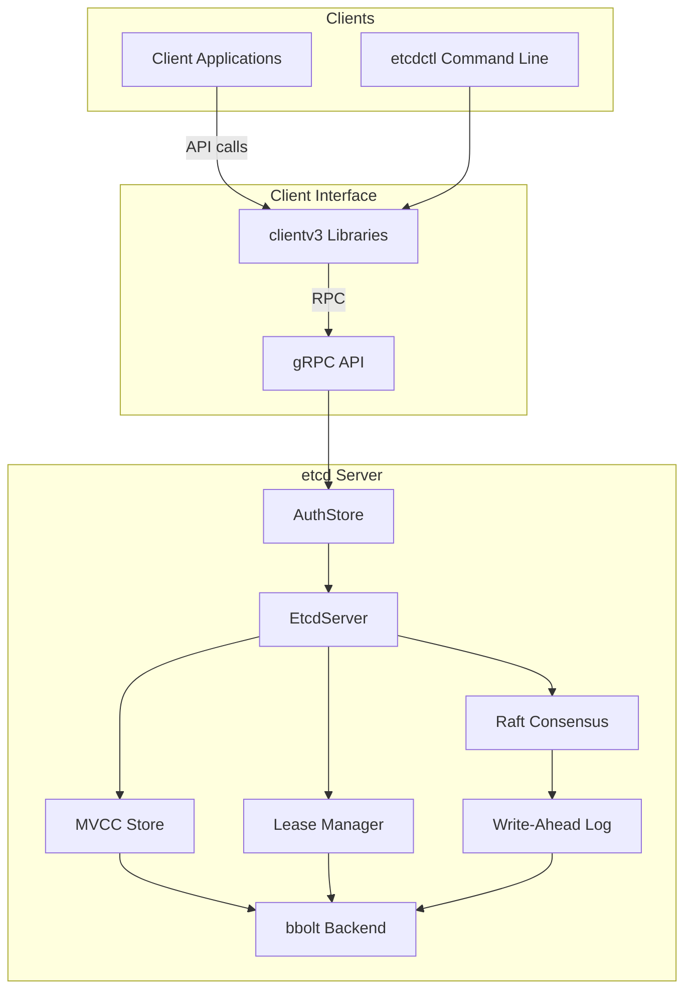
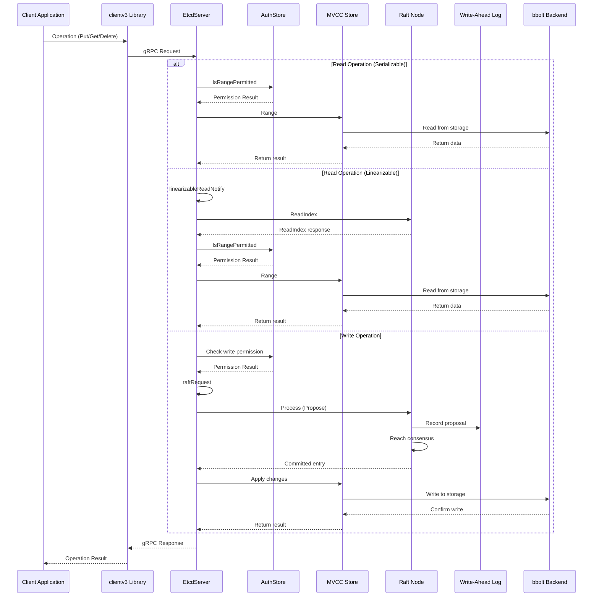
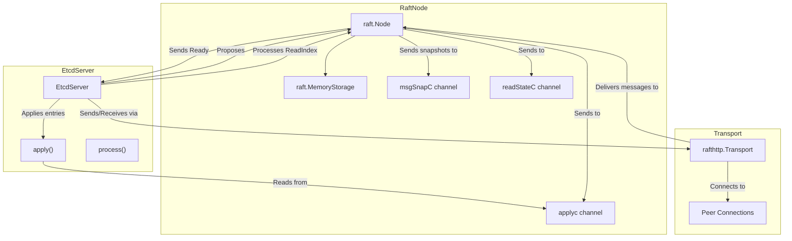
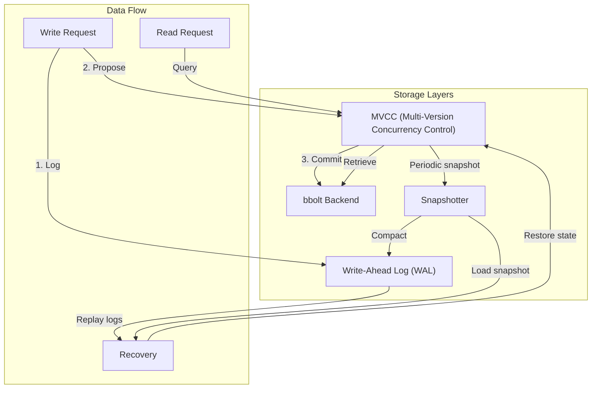
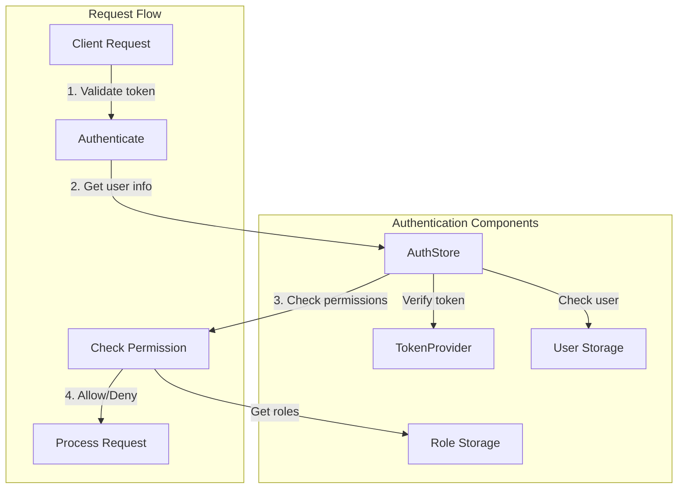
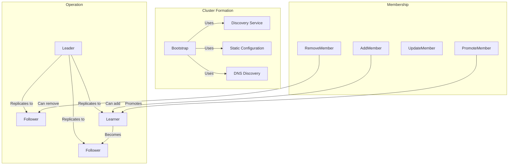
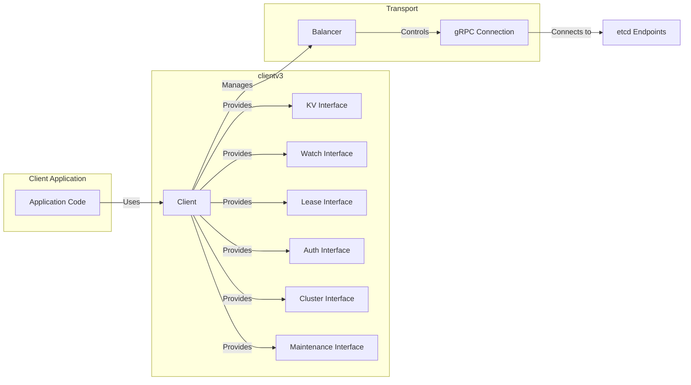

# Etcd 解析

> Etcd 作为 Kubernetes 的“中枢神经”，以强一致性和高可用性保障集群数据安全，是云原生架构不可或缺的基石。

本文以 **etcd 3.6** 为主线。阅读时先建立五层路径：`kube-apiserver/client → gRPC/Auth → Raft → MVCC/Lease/Watch → WAL/Snapshot/bbolt`。写成功、Raft Commit、状态机 Apply、Backend 持久化和所有 Follower 追平不是同一个时间点；故障分析必须说明观察的是哪一层。

:::warning 版本与安全边界
etcd 支持 Client/Peer TLS 和 RBAC，但不会因为启动了三节点就自动启用完整认证。生产必须显式配置双向 TLS、网络隔离、最小 Key Prefix 权限、快照恢复与逐成员维护。Kubernetes 键空间只能通过 API Server 管理。
:::

## 1. Etcd 简介 {/* #etcd-简介 */}

etcd 是 Kubernetes 控制面的核心状态存储，持久保存经过 API Server 认证、授权、准入和版本转换后的 API 对象。本文沿请求、共识、MVCC 与持久化路径分析它的作用、原理和使用边界。

## 2. Etcd 的核心职责与特性 {/* #etcd-的核心职责与特性 */}

Etcd 作为高可用的分布式键值存储系统，采用 Raft 共识算法保证数据一致性。在 Kubernetes 生态系统中，etcd 主要承担以下职责：

- API 对象状态存储：保存 Kubernetes 对象的期望状态、观测状态和元数据
- 并发控制：提供 Revision、事务和 Compare-And-Swap，供 API Server 实现资源版本语义
- 事件分发基础：通过 Watch 向 API Server 提供变化流，再由 API Server 服务 Kubernetes 客户端
- 租约与协调基础：保存 Lease 等对象；控制器通过 Kubernetes API 而不是绕过 API Server 直接协调

### 2.1 核心特性 {/* #核心特性 */}

- 简单性：定义良好的用户 API (gRPC)
- 安全性：支持客户端与 Peer TLS、客户端证书认证和 RBAC，需显式启用
- 性能：吞吐和尾延迟由请求大小、磁盘 fsync、多数派网络、Watcher 与历史窗口共同决定，必须实测
- 可靠性：使用 Raft 共识算法正确分布
- 一致性：写入经 Raft 多数派提交；线性化读可保证不落后于已经确认的写，串行化读可能陈旧
- 高可用性：容忍机器故障，包括 leader 故障

Etcd 在生产环境中广泛使用，特别是作为 [Kubernetes](http://kubernetes.io/) 的主要数据存储和其他需要可靠协调服务的分布式系统。

## 3. 架构与组件解析 {/* #架构与组件解析 */}

Etcd 遵循客户端 - 服务器架构，其中多个 etcd 服务器实例形成集群。客户端使用 etcd 客户端库或 etcdctl 命令行工具与集群通信。

### 3.1 系统架构概览 {/* #系统架构概览 */}

下图展示了 etcd 的主要架构组件及其交互关系。




Etcd 架构由以下关键组件组成：

- 客户端接口：为应用程序提供 gRPC API 和客户端库以与 etcd 交互
- 服务器核心 (EtcdServer)：处理客户端请求，协调集群操作
- 认证系统：管理认证和基于角色的访问控制
- MVCC 存储：多版本并发控制存储，维护版本化的键值数据
- 租约系统：管理键 TTL 和过期
- Raft 共识：实现 Raft 算法进行分布式共识
- 存储：包括预写日志 (WAL) 和 bbolt 数据库后端

### 3.2 请求处理流程 {/* #请求处理流程 */}

下图说明了不同类型的请求如何通过 etcd 系统处理：




读取操作可分为串行化读取（可由本地已应用状态返回，可能陈旧）和线性化读取（通过 Leader/ReadIndex 等路径确认读取屏障）；写请求先通过认证授权，再进入 Raft Proposal、Commit 和 Apply。权限检查不能放在共识提交之后。

## 4. 核心原理与组件 {/* #核心原理与组件 */}

Etcd 采用 [Raft 共识算法](http://thesecretlivesofdata.com/raft/) 实现分布式一致性，确保即使在部分节点故障的情况下，集群仍能正常工作并保持数据一致性。

### 4.1 Raft 共识算法与架构特点 {/* #raft-共识算法与架构特点 */}

- 提交安全性：Raft 保证已经提交的日志不会被后续合法 Leader 覆盖；Follower 可以暂时落后，不能把“已提交”理解为“所有节点已同时 Apply”
- 高可用性：支持集群部署，容忍少数节点故障
- 可靠性：提供数据持久化和自动故障恢复
- 性能优化：支持批量操作和 watch 机制

详细的架构分析请参考：[Etcd 架构与实现解析](http://jolestar.com/etcd-architecture/)

### 4.2 主要组件解析 {/* #主要组件解析 */}

#### 4.2.1 EtcdServer {/* #etcdserver */}

`EtcdServer` 是中央协调组件，处理客户端请求、管理 Raft 共识协议，并集成所有其他 etcd 子系统。它在 [server/etcdserver/server.go](https://github.com/etcd-io/etcd/blob/eac44d59/server/etcdserver/server.go) 中定义，并实现了多个接口，包括 `Server`、`RaftStatusGetter` 和 `Authenticator`。

主要职责：

- 将客户端请求应用到状态机
- 协调集群成员变更
- 管理租约和监听
- 编排快照和压缩

#### 4.2.2 Raft 共识 {/* #raft-共识 */}

etcd 使用 Raft 共识算法维护集群一致性。[server/etcdserver/raft.go](https://github.com/etcd-io/etcd/blob/eac44d59/server/etcdserver/raft.go) 中的 `raftNode` 结构封装了 Raft 协议实现：




Raft 实现的关键方面：

- leader 选举用于协调写入
- 日志复制以维护一致性
- 安全特性以防止脑裂场景
- 成员变更（添加/删除节点）

#### 4.2.3 存储系统 {/* #存储系统 */}

etcd 的存储系统由多个层组成：




各层功能说明：

- MVCC：维护版本化的键值对，支持并发读取和历史查询
- bbolt 后端：持久的 B+tree 键值数据库，提供事务和持久性
- WAL：应用前记录所有变更，用于崩溃恢复
- 快照器：创建数据库状态镜像，用于恢复和成员添加

#### 4.2.4 认证与授权 {/* #认证与授权 */}

etcd 提供全面的安全模型，具有认证和基于角色的访问控制 (RBAC)：




关键安全特性：

- 用户认证（用户名/密码、JWT 令牌）
- 基于角色的访问控制
- TLS 加密客户端与服务器通信

## 5. Kubernetes 与 Etcd 的集成 {/* #kubernetes-与-etcd-的集成 */}

Kubernetes 使用 etcd v3 API。etcd 3.6 配套的 `etcdctl` 默认使用 v3 API，通常不需要再设置 `ETCDCTL_API=3`；这个环境变量主要用于兼容曾同时支持 v2/v3 的旧版 CLI。执行任何命令前先核对 `etcdctl version` 与集群版本。

```bash
etcdctl version
```

> 下文部分命令保留 `ETCDCTL_API=3`，是为了让旧环境中的复制执行语义明确；在 etcd 3.6 工具中它不是必需参数。

### 5.1 数据存储结构 {/* #数据存储结构 */}

Kubernetes 将所有资源对象存储在 etcd 的 `/registry` 路径下，结构如下：

```text
/registry/
├── pods/
├── services/
├── deployments/
├── configmaps/
├── secrets/
├── namespaces/
├── nodes/
├── persistentvolumes/
├── persistentvolumeclaims/
├── storageclasses/
├── customresourcedefinitions/
└── ...
```

### 5.2 使用 etcdctl 访问 Kubernetes 数据 {/* #使用-etcdctl-访问-kubernetes-数据 */}

建议仅用于调试、排查或只读场景，**切勿直接修改 etcd 中的 Kubernetes 资源数据**，否则可能导致集群状态不一致或不可预期的故障。所有生产环境下的资源管理应通过 Kubernetes API Server 进行。

#### 5.2.1 基本访问方法 {/* #基本访问方法 */}

访问 Kubernetes 数据时，需指定 etcd v3 API：

```bash
export ETCDCTL_API=3
```

或在命令前添加环境变量：

```bash
ETCDCTL_API=3 etcdctl get /registry/namespaces/default -w=json | jq .
```

#### 5.2.2 TLS 认证访问 {/* #tls-认证访问 */}

对于使用 kubeadm 创建的集群，etcd 默认启用 TLS 认证。需使用相应证书文件：

```bash
ETCDCTL_API=3 etcdctl \
    --cacert=/etc/kubernetes/pki/etcd/ca.crt \
    --cert=/etc/kubernetes/pki/etcd/healthcheck-client.crt \
    --key=/etc/kubernetes/pki/etcd/healthcheck-client.key \
    get /registry/namespaces/default -w=json | jq .
```

参数说明：

- `--cacert`: CA 证书文件路径
- `--cert`: 客户端证书文件路径
- `--key`: 客户端私钥文件路径
- `-w`: 指定输出格式（json、table 等）

#### 5.2.3 常用查询命令 {/* #常用查询命令 */}

查看 default 命名空间的详细信息：

```bash
ETCDCTL_API=3 etcdctl get /registry/namespaces/default -w=json | jq .
```

输出示例：

```json
{
        "count": 1,
        "header": {
                "cluster_id": 12091028579527406772,
                "member_id": 16557816780141026208,
                "raft_term": 36,
                "revision": 29253467
        },
        "kvs": [
                {
                        "create_revision": 5,
                        "key": "L3JlZ2lzdHJ5L25hbWVzcGFjZXMvZGVmYXVsdA==",
                        "mod_revision": 5,
                        "value": "azhzAAoPCgJ2MRIJTmFtZXNwYWNlEmIKSAoHZGVmYXVsdBIAGgAiACokZTU2YzMzMDgtMWVhOC0xMWU3LThjZDctZjRlOWQ0OWY4ZWQwMgA4AEILCIn4sscFEKOg9xd6ABIMCgprdWJlcm5ldGVzGggKBkFjdGl2ZRoAIgA=",
                        "version": 1
                }
        ]
}
```

查看多个对象：

```bash
ETCDCTL_API=3 etcdctl get /registry/namespaces --prefix -w=json | jq .
```

列出所有键：

```bash
ETCDCTL_API=3 etcdctl get /registry/ --prefix --keys-only --limit=100
```

查看集群节点信息：

```bash
ETCDCTL_API=3 etcdctl get /registry/minions --prefix
ETCDCTL_API=3 etcdctl get /registry/minions/node-name
```

监控资源变化：

```bash
ETCDCTL_API=3 etcdctl watch /registry/pods --prefix
ETCDCTL_API=3 etcdctl watch /registry/services/default/my-service
```

#### 5.2.4 JSON 输出中的字节字段 {/* #json-输出中的字节字段 */}

etcd 底层保存的是任意字节序列，不会自动把所有 Key/Value 转成 Base64。`etcdctl -w json` 为了在 JSON 文本中表示字节字段，会把响应中的 `key` 和 `value` 编码为 Base64；需要解码的是这种 JSON 表示。

```bash
echo "L3JlZ2lzdHJ5L25hbWVzcGFjZXMvZGVmYXVsdA==" | base64 -d
# 输出：/registry/namespaces/default
```

批量解码脚本：

```bash
#!/bin/bash
export ETCDCTL_API=3
keys=$(etcdctl get /registry --prefix -w json | jq -r '.kvs[].key')
for key in $keys; do
    echo $key | base64 -d
done | sort
```

#### 5.2.5 Kubernetes 数据结构 {/* #kubernetes-数据结构 */}

Kubernetes 在 etcd 中的数据遵循以下层次结构：

```text
/registry/
├── <资源类型复数形式>/
│   ├── <命名空间>/
│   │   └── <对象名称>
│   └── <集群级别对象名称>
```

主要资源类型包括：

- namespaces
- pods
- services
- configmaps
- secrets
- persistentvolumes
- persistentvolumeclaims
- deployments
- replicasets
- daemonsets
- statefulsets
- jobs
- storageclasses
- limitranges
- resourcequotas
- roles
- rolebindings
- clusterroles
- clusterrolebindings
- serviceaccounts
- apiextensions.k8s.io
- apiregistration.k8s.io

#### 5.2.6 受控抽样脚本 {/* #受控抽样脚本 */}

只在隔离实验环境抽样 Kubernetes 对象 Key；生产问题优先通过 API Server 查询，不能无界扫描整个 `/registry`：

```bash
#!/bin/bash
export ETCDCTL_ENDPOINTS='https://127.0.0.1:2379'
export ETCDCTL_CACERT='/etc/kubernetes/pki/etcd/ca.crt'
export ETCDCTL_CERT='/etc/kubernetes/pki/etcd/healthcheck-client.crt'
export ETCDCTL_KEY='/etc/kubernetes/pki/etcd/healthcheck-client.key'

etcdctl get /registry/ --prefix --keys-only --limit=1000 -w json |
  jq -r '.kvs[].key | @base64d' |
  sort
```

按抽样结果统计资源类型：

```bash
#!/bin/bash

etcdctl get /registry/ --prefix --keys-only --limit=1000 -w json |
  jq -r '.kvs[].key | @base64d' |
  cut -d'/' -f3 |
  sort |
  uniq -c |
  sort -nr
```

`--limit=1000` 只提供样本，不能据此得出全量对象数。需要精确数量时，应按受控前缀使用 `--count-only`，并评估请求对控制面的影响。

#### 5.2.7 注意事项 {/* #注意事项 */}

- 生产环境谨慎操作：直接操作 etcd 数据可能会破坏集群状态，建议仅用于调试和学习。
- 权限要求：访问 etcd 需要适当的权限，通常需要在 master 节点上执行。
- 数据一致性：etcd 中的数据反映的是 Kubernetes API Server 的内部状态，可能与 kubectl 输出略有差异。
- 版本兼容性：不同 Kubernetes 版本在 etcd 中的数据结构可能有所不同。

通过 etcdctl 访问 Kubernetes 数据有助于深入理解集群的内部工作机制，对于故障排查和性能优化具有重要意义。

## 6. 集群与复制机制 {/* #集群与复制机制 */}

etcd 使用 Raft 共识维护集群一致性，允许容忍机器故障，包括 leader 故障，同时维护数据完整性。

### 6.1 集群形成与成员管理 {/* #集群形成与成员管理 */}

集群可以通过以下方式形成：

- 使用显式对等 URL 的静态配置
- 使用发现服务的动态发现
- 基于 DNS 的发现

成员可动态添加、删除或更新。新节点可作为 "learner" 添加，然后提升为完整投票成员。




### 6.2 Leader 选举与日志复制 {/* #leader-选举与日志复制 */}

在 Raft 系统中：

- 一个节点被选举为 leader
- 所有写入操作都通过 leader
- leader 将日志条目复制到 follower
- 大多数节点必须确认每个条目
- 一旦提交，条目就会应用到状态机

Raft 保证同一 Term 内最多有一个通过多数派选举产生的合法 Leader。网络分区后，旧 Leader 可能暂时仍认为自己是 Leader，但没有多数派便不能安全提交新日志；因此不能把它简化成“物理世界任何时刻只有一个自认为是 Leader 的进程”。

## 7. 客户端交互方式 {/* #客户端交互方式 */}

客户端通过 etcdctl 命令行工具或客户端库与 etcd 交互。主要通信协议是 gRPC，具有用于 RESTful 访问的 HTTP/JSON 网关。

### 7.1 客户端库 {/* #客户端库 */}

主要的客户端库是 `clientv3`，为 etcd 提供 Go API，包括：

- KV 操作（Get、Put、Delete）
- 监控变更的 watch 功能
- 键 TTL 的租约管理
- 分布式并发原语（锁、选举）
- 集群管理操作




### 7.2 etcdctl 命令行界面 {/* #etcdctl-命令行界面 */}

`etcdctl` CLI 提供了从命令行与 etcd 交互的用户友好方式，支持所有核心操作。

示例操作：

- 键值操作：`put`、`get`、`del`
- 监听操作：`watch`
- 租约操作：`lease grant`、`lease revoke`
- 认证：`user add`、`role grant`
- 集群管理：`member add`、`endpoint health`

## 8. 网络插件与 etcd 的边界 {/* #网络插件与-etcd-的边界 */}

在 Kubernetes 模式下，现代 Calico、Flannel、Cilium 通常通过 Kubernetes API/CRD 获取和保存控制状态，并不意味着插件进程直接访问 Kubernetes 的 etcd。部分插件、历史部署或非 Kubernetes 数据存储模式可能使用独立 etcd，必须先确认实际 datastore 类型、Endpoint 和所有者。

```bash
# 只有明确采用 Calico etcd datastore 时才查询该独立前缀
ETCDCTL_API=3 etcdctl get /calico --prefix

# 只有历史 Flannel etcd 模式才可能使用该前缀
ETCDCTL_API=3 etcdctl get /coreos.com/network --prefix
```

## 9. 数据备份与恢复实践 {/* #数据备份与恢复实践 */}

定期创建快照以防止数据丢失，恢复时需严格按照官方流程操作，避免数据一致性问题。

### 9.1 创建快照 {/* #创建快照 */}

```bash
SNAPSHOT="/backup/etcd-snapshot-$(date +%Y%m%d-%H%M%S).db"

# 在线获取一致快照
etcdctl snapshot save "$SNAPSHOT"

# 现代离线工具负责快照状态检查
etcdutl snapshot status "$SNAPSHOT" -w table
sha256sum "$SNAPSHOT"
```

### 9.2 恢复数据 {/* #恢复数据 */}

恢复操作会将 etcd 数据目录重建为快照中的状态，建议先在隔离环境中验证快照完整性。

现代恢复使用 `etcdutl snapshot restore`，并为新逻辑集群中的每个成员分别生成数据目录：

```bash
etcdutl snapshot restore /backup/etcd-snapshot.db \
    --name=cp-1 \
    --data-dir=/var/lib/etcd-restored \
    --initial-cluster='cp-1=https://10.0.0.11:2380,cp-2=https://10.0.0.12:2380,cp-3=https://10.0.0.13:2380' \
    --initial-advertise-peer-urls='https://10.0.0.11:2380' \
    --initial-cluster-token=etcd-cluster-restore
```

示例地址不能直接照抄。恢复前要隔离旧写入，恢复后验证 Member、Endpoint、Hash、Revision 和 Kubernetes Informer 行为；Revision 回退场景按官方 Revision Bump 流程处理。

## 10. 性能优化与监控建议 {/* #性能优化与监控建议 */}

### 10.1 关键指标监控 {/* #关键指标监控 */}

- 延迟：监控读写操作延迟
- 吞吐量：跟踪每秒操作数
- 存储空间：监控数据库大小和碎片
- 集群健康：检查节点状态和网络连接

### 10.2 优化建议 {/* #优化建议 */}

- 硬件配置：使用 SSD 存储，确保足够的 IOPS
- 网络优化：低延迟网络连接，避免跨地域部署
- 定期维护：执行数据压缩和碎片整理
- 监控告警：设置关键指标的告警阈值

### 10.3 监控和维护 {/* #监控和维护 */}

etcd 提供 Prometheus 指标和内置健康检查。

- HTTP 端点用于健康检查：`/health`、`/livez`、`/readyz`
- 性能和资源使用指标
- 告警机制

维护操作包括：

- 压缩：删除旧修订以释放空间
- 碎片整理：回收磁盘空间
- 快照：创建备份
- 升级：版本升级流程

## 11. 安全最佳实践 {/* #安全最佳实践 */}

### 11.1 TLS 加密 {/* #tls-加密 */}

建议所有 etcd 节点间通信和客户端访问均启用 TLS。

```bash
# 使用 TLS 证书访问 etcd
ETCDCTL_API=3 etcdctl \
    --cacert=/etc/kubernetes/pki/etcd/ca.crt \
    --cert=/etc/kubernetes/pki/etcd/healthcheck-client.crt \
    --key=/etc/kubernetes/pki/etcd/healthcheck-client.key \
    get /registry/pods --prefix
```

不要把 Peer 或 Server 私钥当作日常客户端凭据。Kubeadm 环境通常提供用途受限的 healthcheck-client 证书；其他平台应使用专门签发、最小权限的客户端身份。

### 11.2 访问控制 {/* #访问控制 */}

- 启用 RBAC 认证
- 限制网络访问
- 定期轮换证书
- 监控访问日志

## 12. 故障排查与调试 {/* #故障排查与调试 */}

### 12.1 常见问题 {/* #常见问题 */}

- 集群分裂：检查网络连接和节点状态
- 性能下降：分析慢查询和资源使用
- 数据不一致：验证 Raft 日志和选举状态
- 存储空间不足：清理历史数据和执行压缩

### 12.2 调试命令 {/* #调试命令 */}

```bash
# 检查集群健康状态
ETCDCTL_API=3 etcdctl endpoint health

# 查看成员列表
ETCDCTL_API=3 etcdctl member list

# 检查集群状态
ETCDCTL_API=3 etcdctl endpoint status --cluster -w table
```

## 13. 总结 {/* #总结 */}

Etcd 为分布式系统提供可靠的分布式键值存储，具有强一致性保证，是存储关键配置数据的理想选择。其简单性、安全性、性能、可靠性和一致性的组合，使其成为现代云原生架构的基础，尤其在 Kubernetes 体系中发挥着不可替代的作用。

## 14. 参考资料 {/* #参考文献 */}

1. [etcd 官方文档 - etcd.io](https://etcd.io/)
2. [Kubernetes etcd 管理指南 - kubernetes.io](https://kubernetes.io/docs/tasks/administer-cluster/configure-upgrade-etcd/)
3. [etcd 性能调优指南 - etcd.io](https://etcd.io/docs/v3.5/tuning/)
4. [Etcd 架构与实现解析 - jolestar.com](http://jolestar.com/etcd-architecture/)
5. [Raft 共识算法论文 - raft.github.io](https://raft.github.io/)
