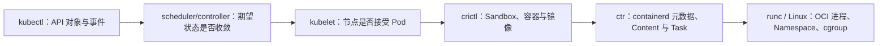

# Kubernetes 与容器命令参考库：从 API 对象到 OCI 进程

这套参考库沿着真实控制链路组织命令，而不是按工具名称背速查表：用户通过 `kubectl` 访问 API Server，控制器把期望状态变成 Pod，scheduler 选择节点，kubelet 通过 CRI 调用 containerd/CRI-O，运行时再通过 OCI Runtime 创建 Linux 进程。Helm/Kustomize负责交付对象，kubeadm/etcdctl负责控制面生命周期与状态。

## 1. 版本基线

文章以 Kubernetes **v1.36**、Helm **v4**、CRI v1 和 containerd 2.x 文档为基线。生产集群可能使用更早版本，必须先确认：

```bash
kubectl version
helm version
kubeadm version -o short
etcdctl version
crictl version
containerd --version
ctr version
nerdctl version
docker version
podman version
runc --version
```

`kubectl` 只保证位于 kube-apiserver 前后一个次版本的受支持偏差范围，且不应比 API Server 新超过一个次版本；`crictl` 推荐与 Kubernetes 使用相同次版本。具体参数始终以目标环境 `--help` 和对应版本官方文档为准。

## 2. 安全等级

| 等级 | 含义 | 例子 |
|---|---|---|
| `[R]` | 只读查询，但仍可能读取 Secret、日志或用户数据 | `get`、`describe`、`logs`、`inspect` |
| `[A]` | 主动连接、拉镜像、执行程序或产生负载 | `exec`、`debug`、`pull`、`top` |
| `[W]` | 修改声明、配置、镜像或节点状态 | `apply`、`upgrade`、`cordon`、`build` |
| `[D]` | 删除、驱逐、重置或直接修改关键状态 | `delete`、`drain`、`kubeadm reset`、etcd 写入 |

只读不等于无敏感性：`kubectl get secret -o yaml`、容器环境变量和进程参数都可能泄密。命令风险由具体参数和作用域决定。

## 3. 十六篇学习顺序

### 3.1 Kubernetes API 与日常运维 {/* #kubernetes-api-与日常运维 */}

1. [`kubectl config/api-resources/explain`](./01-kubectl配置发现与字段解释.md)：先确认对哪个集群、以什么身份、操作哪些 API。
2. [`kubectl get/describe/events`](./02-kubectl资源查询与事件诊断.md)：建立对象、状态、条件和事件证据。
3. [`kubectl diff/apply/patch/edit/delete`](./03-kubectl声明式变更与安全删除.md)：掌握声明式所有权、冲突和可回滚变更。
4. [`kubectl logs/exec/debug/cp/port-forward`](./04-kubectl-Pod调试与现场取证.md)：从容器日志进入 Namespace 和节点现场。
5. [`kubectl rollout/scale/autoscale/cordon/drain`](./05-kubectl工作负载发布与节点维护.md)：完成发布、扩缩容和节点维护。
6. [`kubectl auth/top/wait/api-raw`](./06-kubectl权限指标等待与原始API.md)：验证权限、资源使用、状态收敛和 API 原始响应。

### 3.2 应用交付与控制面 {/* #应用交付与控制面 */}

7. [`helm`](./07-helm命令详解.md)：Chart、Release、Values、升级、测试与回滚。
8. [`kubectl kustomize`](./08-kustomize命令详解.md)：Base/Overlay、Patch、Generator 与渲染验证。
9. [`kubeadm`](./09-kubeadm命令详解.md)：集群初始化、加入、升级、证书与重置。
10. [`etcdctl`](./10-etcdctl命令详解.md)：Endpoint 健康、快照、恢复与键空间审计。

### 3.3 节点、镜像与 OCI {/* #节点镜像与-oci */}

11. [`crictl`](./11-crictl命令详解.md)：从 kubelet 同一 CRI 视角排查 Pod Sandbox、容器和镜像。
12. [`ctr`](./12-ctr命令详解.md)：containerd 内部 Namespace、Content、Image、Container 与 Task。
13. [`nerdctl`](./13-nerdctl命令详解.md)：面向 containerd 的 Docker 风格开发与排障体验。
14. [`docker`](./14-docker命令详解.md)：镜像、容器、网络、卷、Build 与 Context。
15. [`podman`](./15-podman命令详解.md)：Daemonless、Rootless、Pod、镜像与 systemd 集成。
16. [`runc`](./16-runc命令详解.md)：OCI Bundle、Container Lifecycle、Namespace 与低层证据。

## 4. 固定排障路径



Docker/nerdctl/Podman适合各自管理的容器，但不能替代 Kubernetes 节点的 CRI 视角。Kubernetes 节点故障优先 `kubectl → kubelet journal → crictl`；只有确认 containerd 内部异常后才使用 `ctr`，更低层才检查 shim、runc、Namespace 和 cgroup。

## 5. 统一操作纪律

1. 每条命令显式确认 context、namespace、资源名和 UID；
2. 查询用 label/field selector 缩小对象，变更前保存 `get -o yaml` 和审计时间；
3. `diff`/客户端 dry-run/服务端 dry-run 各回答不同问题，不能互相替代；
4. 不直接编辑 etcd，不用 `ctr` 删除 kubelet 管理的对象，不用 `docker` 判断 containerd 节点；
5. 所有删除、驱逐、升级和恢复操作先写影响范围、备份、回滚与验收；
6. 自动化使用结构化输出和退出码，避免解析默认表格。

## 6. 最终验收

学完后应能把 Pod Pending/启动失败/CrashLoop/网络或存储挂载问题定位到 API、调度、kubelet、CRI、镜像、OCI 或 Linux 层；能安全发布和回滚工作负载；能维护节点和控制面；能解释 Image、Container、Task、Pod Sandbox、OCI Bundle 不是同一个对象。

## 7. 官方入口 {/* #官方入口 */}

- [Kubernetes kubectl Reference](https://kubernetes.io/docs/reference/kubectl/)
- [Helm Commands](https://helm.sh/docs/helm/)
- [CRI Tools](https://github.com/kubernetes-sigs/cri-tools)
- [containerd Documentation](https://github.com/containerd/containerd/tree/main/docs)
- [OCI Runtime Specification](https://github.com/opencontainers/runtime-spec)
