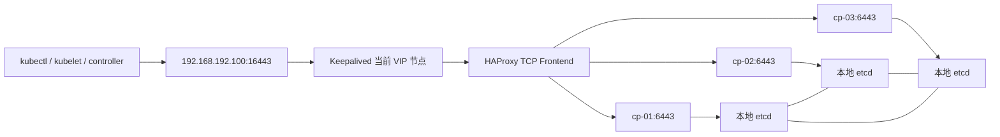

# Rocky Linux 使用 kubeadm 部署高可用 Kubernetes 集群实战

本文从五台全新Rocky Linux服务器开始，部署一个由三个控制面节点和两个工作节点组成的Kubernetes集群：

```text
稳定 API 入口
+ HAProxy 后端健康检查
+ Keepalived VIP 漂移
+ 三控制面与堆叠 etcd
+ containerd CRI
+ kubeadm 引导
+ Calico VXLAN Pod 网络
+ DNS、Service、NodePort 与故障切换验收
```

这不是一份“复制完命令，看到Pod为Running就算成功”的安装清单。每一步都会说明：

- 为什么需要这个组件；
- 改动了主机的什么状态；
- 怎样验证改动真正生效；
- 失败以后先收集什么证据；
- 哪些配置只能用于实验环境；
- 哪些数据必须在生产上线前备份和演练。

本文使用Kubernetes `v1.34.x` 和Calico `v3.32.x` 作为示例兼容组合。软件包补丁版本、镜像Digest和
Linux内核会继续变化，实际执行时必须根据兼容矩阵锁定精确版本，不能把 `latest` 当成版本策略。

## 1. 部署边界

### 1.1 本文包含什么

- Rocky Linux节点初始化；
- containerd安装和CRI验收；
- kubeadm、kubelet和kubectl安装；
- HAProxy与Keepalived提供API Server高可用入口；
- kubeadm堆叠控制面初始化；
- Calico Operator和VXLAN网络；
- 控制面与工作节点加入；
- DNS、Service、跨节点网络和API故障切换验收；
- 常见安装失败的证据采集与恢复边界。

### 1.2 本文不包含什么

- 公有云负载均衡器的具体创建方式；
- 外部etcd拓扑；
- CSI存储、Ingress、日志和完整Prometheus监控；
- GPU/NPU驱动和设备插件；
- 生产证书自动轮换、完整安全加固和多集群管理平台。

高可用控制面只是生产集群的一部分。没有etcd恢复演练、监控、存储、升级策略和业务容量设计，不能仅凭
三个Master节点就宣布“已经达到生产级”。

## 2. 目标架构与请求路径

### 2.1 节点规划

| 主机名 | 地址 | 角色 | 最低实验配置 | 生产建议 |
| --- | --- | --- | --- | --- |
| `k8s-cp-01` | `192.168.192.101` | Control Plane + etcd + HAProxy + Keepalived | 2C/4G/40G | 独立资源评估，系统盘与etcd盘分离 |
| `k8s-cp-02` | `192.168.192.102` | Control Plane + etcd + HAProxy + Keepalived | 2C/4G/40G | 与其他控制面分散故障域 |
| `k8s-cp-03` | `192.168.192.103` | Control Plane + etcd + HAProxy + Keepalived | 2C/4G/40G | 与其他控制面分散故障域 |
| `k8s-worker-01` | `192.168.192.104` | Worker | 2C/4G/40G | 根据工作负载计算 |
| `k8s-worker-02` | `192.168.192.105` | Worker | 2C/4G/40G | 根据工作负载计算 |
| API VIP | `192.168.192.100` | 浮动地址，不占用独立机器 | 不适用 | 与控制节点位于同一二层或使用等价路由方案 |

网段规划：

| 网络 | CIDR或地址 | 用途 |
| --- | --- | --- |
| 节点网络 | `192.168.192.0/24` | SSH、API Server、etcd和节点通信 |
| Pod网络 | `172.16.0.0/16` | Calico为Pod分配地址 |
| Service网络 | `10.96.0.0/12` | ClusterIP虚拟地址 |
| DNS域 | `cluster.local` | 集群内服务发现 |

三个网段不能相互重叠，也不能与机房路由、VPN、容器桥接网段和未来需要访问的业务网段重叠。

### 2.2 API访问路径



组件职责必须分开理解：

- Keepalived解决“哪个控制节点持有VIP”；
- HAProxy解决“一个入口怎样选择健康API Server”；
- kube-apiserver负责Kubernetes API，不负责VIP漂移；
- etcd通过Raft保存集群状态，三个成员可以容忍一个成员故障；
- kubeadm生成证书、kubeconfig和控制面Static Pod，但不安装CNI、CSI和监控。

HAProxy监听 `16443`，API Server监听 `6443`。不能让两者在控制节点上同时绑定 `0.0.0.0:6443`。

## 3. 版本、变量和变更记录

### 3.1 锁定版本

在正式执行前建立版本表：

| 组件 | 本文示例 | 执行前必须确认 |
| --- | --- | --- |
| Rocky Linux | 9.x | 内核、安全更新、网卡驱动 |
| Kubernetes | 1.34.x | 精确Patch、版本偏差策略 |
| kubeadm Config API | `kubeadm.k8s.io/v1beta4` | 与目标kubeadm版本兼容 |
| containerd | 经过验证的1.7.x或2.x | 配置Schema、runc、CNI兼容性 |
| runc | 随受控仓库安装 | containerd兼容性和安全修复 |
| Calico | 3.32.x | Kubernetes和内核支持矩阵 |

不要直接执行：

```text
dnf install containerd latest
dnf install kubelet-1.34*
```

通配符可能在不同节点选出不同Patch。正确流程是先列出候选版本，再把最终选中的完整版本记录到资产清单：

```bash
dnf list containerd.io --showduplicates
dnf list kubeadm kubelet kubectl --showduplicates --disableexcludes=kubernetes
```

### 3.2 本文使用的部署变量

以下变量是示例，先在变更单中替换，再生成配置文件：

```bash
export K8S_MINOR='v1.34'
export K8S_VERSION='v1.34.6'
export CALICO_VERSION='v3.32.0'
export POD_CIDR='172.16.0.0/16'
export SERVICE_CIDR='10.96.0.0/12'
export API_VIP='192.168.192.100'
export API_LB_PORT='16443'
export NODE_IFACE='ens160'
```

变量只对当前Shell生效。生产自动化应使用Ansible Inventory、版本化配置文件和Secret管理系统，而不是依赖
某个人终端里的临时环境变量。

## 4. 部署前检查

### 4.1 网络与身份

所有节点执行：

```bash
hostnamectl
ip -br address
ip route
getent hosts k8s-cp-01 k8s-cp-02 k8s-cp-03
ping -c 3 192.168.192.101
```

确认每台机器的主机名、MAC地址和Product UUID唯一：

```bash
ip link
sudo cat /sys/class/dmi/id/product_uuid
```

克隆虚拟机模板后，重复的Product UUID或MAC地址会造成节点身份和网络异常。

### 4.2 端口与协议

至少确认以下路径允许通信：

| 来源 | 目标 | 端口/协议 | 用途 |
| --- | --- | --- | --- |
| 管理端、所有节点 | VIP | TCP 16443 | 稳定API入口 |
| HAProxy控制节点 | 所有控制节点 | TCP 6443 | kube-apiserver |
| 控制节点 | 控制节点 | TCP 2379-2380 | etcd Client与Peer |
| 控制面 | 所有节点 | TCP 10250 | kubelet API |
| 控制节点 | 控制节点 | TCP 10257、10259 | controller-manager、scheduler健康端口 |
| 节点 | 节点 | UDP 4789 | 本文选择的Calico VXLAN |
| Keepalived节点 | Keepalived节点 | IP Protocol 112 | VRRP |
| 客户端 | Worker | TCP 30000-32767 | 仅在需要NodePort时开放 |

端口表不是替代品。还应使用 `nc`、抓包和真实API请求验证双向路径。

### 4.3 软件源、DNS、代理和镜像仓库

```bash
getent hosts registry.k8s.io
curl -I --connect-timeout 5 https://pkgs.k8s.io/
curl -I --connect-timeout 5 https://registry.k8s.io/
```

受限网络环境应提前同步以下内容到内部仓库：

- Kubernetes RPM及其签名；
- kubeadm列出的控制面镜像；
- Calico Operator和工作负载镜像；
- CoreDNS、pause镜像；
- 测试工作负载镜像。

镜像仓库地址、CA和代理应在所有节点统一。只在一个Master上提前拉镜像不能解决其他节点拉取失败。

## 5. 所有节点的系统初始化

本节除主机名外，应在五台节点执行。

### 5.1 设置主机名和名称解析

每台机器设置自己的主机名：

```bash
sudo hostnamectl set-hostname <CURRENT_NODE_NAME>
```

在没有内部DNS的实验环境，可以统一维护 `/etc/hosts`：

```text
192.168.192.101 k8s-cp-01
192.168.192.102 k8s-cp-02
192.168.192.103 k8s-cp-03
192.168.192.104 k8s-worker-01
192.168.192.105 k8s-worker-02
192.168.192.100 k8s-api.example.com
```

生产应使用受控DNS。`/etc/hosts` 分散在每台机器上，修改容易不一致，也缺少审计和TTL机制。

### 5.2 时间同步

```bash
sudo dnf install -y chrony
sudo systemctl enable --now chronyd
chronyc tracking
chronyc sources -v
timedatectl status
```

证书校验、etcd选举、日志时间线和Token TTL都依赖正确时间。不能只确认时区相同，还要检查偏移量和
上游时间源。

### 5.3 Swap策略

本文采用最容易验证的方案：关闭Swap。

```bash
sudo swapoff -a
swapon --show
```

还应根据系统实际配置，从 `/etc/fstab`、systemd swap unit或云初始化配置中永久禁用对应Swap，而不是用
一条正则表达式盲目修改所有挂载项。

现代Kubernetes也支持受控使用Swap，但需要明确配置kubelet的 `failSwapOn` 和 `memorySwap.swapBehavior`。
不要一边保留Swap，一边依赖默认配置碰运气。

### 5.4 SELinux和Firewalld边界

Kubernetes RPM安装指引在通用RHEL路径上通常使用SELinux Permissive；本文保持 `permissive`，不写成
永久 `disabled`：

```bash
sudo setenforce 0
sudo sed -ri 's/^SELINUX=enforcing$/SELINUX=permissive/' /etc/selinux/config
getenforce
```

本文选择Calico VXLAN。Calico官方要求避免Firewalld等iptables管理器与其数据面规则相互干扰，因此在
这套特定方案中关闭Firewalld：

```bash
sudo systemctl disable --now firewalld
systemctl is-enabled firewalld
systemctl is-active firewalld
```

这不代表生产服务器可以没有网络边界。应在上游防火墙、安全组、路由ACL以及Calico HostEndpoint和
GlobalNetworkPolicy中实现经过评审的控制。若组织要求主机Firewalld保持启用，应先完成与目标Calico
版本的兼容验证，不能直接照搬本文。

### 5.5 加载最小内核模块

```bash
sudo tee /etc/modules-load.d/kubernetes.conf >/dev/null <<'EOF'
overlay
br_netfilter
nf_conntrack
EOF

sudo modprobe overlay
sudo modprobe br_netfilter
sudo modprobe nf_conntrack

lsmod | grep -E 'overlay|br_netfilter|nf_conntrack'
```

不要为了“看起来完整”一次加载所有IPVS调度模块。本文不强制选择IPVS；当前集群可能使用iptables、
nftables或由eBPF数据面替代kube-proxy。

### 5.6 配置最小网络sysctl

```bash
sudo tee /etc/sysctl.d/99-kubernetes.conf >/dev/null <<'EOF'
net.ipv4.ip_forward = 1
net.bridge.bridge-nf-call-iptables = 1
net.bridge.bridge-nf-call-ip6tables = 1
EOF

sudo sysctl --system
sysctl net.ipv4.ip_forward
sysctl net.bridge.bridge-nf-call-iptables
```

没有容量计算时，不在基础安装阶段复制几十个TCP、文件描述符和conntrack参数。特别是
`nf_conntrack_max`、TCP超时和监听队列，必须根据节点连接速率、条目寿命、内存与业务长连接进行规划。

### 5.7 NetworkManager不要接管Calico接口

在安装Calico之前创建：

```bash
sudo tee /etc/NetworkManager/conf.d/calico.conf >/dev/null <<'EOF'
[keyfile]
unmanaged-devices=interface-name:cali*;interface-name:tunl*;interface-name:vxlan.calico;interface-name:vxlan-v6.calico;interface-name:wireguard.cali;interface-name:wg-v6.cali
EOF
```

在新节点维护窗口内重载或重启NetworkManager，并确认管理网地址和默认路由没有变化：

```bash
sudo systemctl reload NetworkManager
ip -br address
ip route
```

如果必须重启NetworkManager，先确保带外控制台可用，避免远程SSH因为连接重置而失联。

## 6. 安装并配置containerd

### 6.1 安装受控版本

以下使用Docker官方CentOS兼容仓库提供的 `containerd.io`。生产环境可以换成组织内部镜像仓库：

```bash
sudo dnf install -y dnf-plugins-core
sudo dnf config-manager --add-repo https://download.docker.com/linux/centos/docker-ce.repo
sudo dnf list containerd.io --showduplicates
sudo dnf install -y containerd.io-<PINNED_VERSION_RELEASE>
```

这里只安装containerd，不需要为了获得containerd同时安装和启动Docker Engine。Docker Engine本身不实现
CRI；Kubernetes若要使用Docker还需要额外的 `cri-dockerd`。

### 6.2 生成并审查配置

```bash
sudo install -d -m 0755 /etc/containerd
containerd config default | sudo tee /etc/containerd/config.toml >/dev/null
sudo cp -a /etc/containerd/config.toml /etc/containerd/config.toml.before-kubernetes
```

把runc运行时的cgroup驱动改为systemd：

```bash
sudo sed -ri 's/(SystemdCgroup = )false/\1true/' /etc/containerd/config.toml
grep -n 'SystemdCgroup' /etc/containerd/config.toml
```

containerd 1.x和2.x的插件配置路径不同，不要从其他版本复制整份 `config.toml`。应以当前二进制生成的
默认配置为基线，只修改已经理解的字段。

确认没有禁用CRI插件：

```bash
grep -n '^disabled_plugins' /etc/containerd/config.toml
```

若结果包含 `cri`，应从禁用列表中移除并重新验证配置。私有仓库、代理、证书和Sandbox镜像应根据目标
containerd版本使用 `certs.d/hosts.toml` 等受支持方式配置，不能只替换字符串后假设生效。

### 6.3 启动与CRI验收

```bash
sudo systemctl enable --now containerd
sudo systemctl status containerd --no-pager
sudo ctr plugins ls
```

配置crictl：

```bash
sudo tee /etc/crictl.yaml >/dev/null <<'EOF'
runtime-endpoint: unix:///run/containerd/containerd.sock
image-endpoint: unix:///run/containerd/containerd.sock
timeout: 10
debug: false
EOF
```

`crictl` 二进制由下一节安装的 `cri-tools` 软件包提供。完成下一节后再执行 `crictl info` 和
`crictl version`。

验收条件：

- containerd服务为Active；
- CRI插件状态为 `ok`；
- `crictl info` 能返回Runtime和Cgroup信息；
- `SystemdCgroup` 与后续kubelet配置一致；
- 内部镜像仓库和CA在所有节点都已验证。

## 7. 安装kubeadm、kubelet和kubectl

### 7.1 配置Kubernetes官方RPM仓库

所有节点执行，仓库Minor版本与目标集群一致：

```bash
sudo tee /etc/yum.repos.d/kubernetes.repo >/dev/null <<EOF
[kubernetes]
name=Kubernetes
baseurl=https://pkgs.k8s.io/core:/stable:/${K8S_MINOR}/rpm/
enabled=1
gpgcheck=1
gpgkey=https://pkgs.k8s.io/core:/stable:/${K8S_MINOR}/rpm/repodata/repomd.xml.key
exclude=kubelet kubeadm kubectl cri-tools kubernetes-cni
EOF

sudo dnf makecache
sudo dnf list kubeadm kubelet kubectl --showduplicates --disableexcludes=kubernetes
```

根据查询结果锁定精确RPM版本：

```bash
sudo dnf install -y \
  kubeadm-<PINNED_RPM_VERSION> \
  kubelet-<PINNED_RPM_VERSION> \
  kubectl-<PINNED_RPM_VERSION> \
  cri-tools-<PINNED_CRI_TOOLS_RPM_VERSION> \
  --disableexcludes=kubernetes

sudo systemctl enable --now kubelet
```

初始化前kubelet反复重启并等待 `/var/lib/kubelet/config.yaml`，通常是预期状态：

```bash
systemctl status kubelet --no-pager
journalctl -u kubelet -n 30 --no-pager
```

它只能说明kubelet还没被kubeadm引导，不能把所有kubelet错误都忽略。

### 7.2 验证版本一致性

```bash
kubeadm version -o short
kubelet --version
kubectl version --client
containerd --version
runc --version
sudo crictl version
sudo crictl info
```

保存五台节点的输出并比较。不要让kubelet版本高于API Server，也不要让软件包管理器在普通系统升级中
自动跨Kubernetes Minor版本。

## 8. 在控制节点部署HAProxy

以下步骤只在三个控制节点执行。

### 8.1 安装并创建配置

```bash
sudo dnf install -y haproxy keepalived socat
sudo cp -a /etc/haproxy/haproxy.cfg /etc/haproxy/haproxy.cfg.original
```

写入 `/etc/haproxy/haproxy.cfg`：

```haproxy
global
    log /dev/log local0
    user haproxy
    group haproxy
    daemon
    maxconn 20000
    stats socket /run/haproxy/admin.sock mode 660 level admin

defaults
    log global
    mode tcp
    option tcplog
    timeout connect 5s
    timeout client 60s
    timeout server 60s
    timeout check 5s

frontend kubernetes_api
    bind *:16443
    default_backend kubernetes_api_backend

backend kubernetes_api_backend
    balance roundrobin
    option tcp-check
    default-server inter 2s fastinter 1s downinter 5s fall 3 rise 2
    server k8s-cp-01 192.168.192.101:6443 check
    server k8s-cp-02 192.168.192.102:6443 check
    server k8s-cp-03 192.168.192.103:6443 check
```

HAProxy使用TCP模式透传TLS。证书校验仍由客户端和kube-apiserver完成。

### 8.2 校验后再启动

```bash
sudo haproxy -c -f /etc/haproxy/haproxy.cfg
sudo systemctl enable --now haproxy
sudo systemctl status haproxy --no-pager
sudo ss -lntp | grep ':16443'
```

此时API Server还没有启动，因此HAProxy后端显示DOWN是预期现象；但HAProxy进程和16443监听必须正常。

## 9. 在控制节点部署Keepalived

### 9.1 健康检查脚本

Keepalived需要判断本机HAProxy是否真的能够接受连接，而不只是检查PID文件是否存在。

创建 `/etc/keepalived/check_haproxy.sh`：

```bash
#!/usr/bin/env bash
set -euo pipefail

systemctl is-active --quiet haproxy
ss -H -lnt | awk '$4 ~ /:16443$/ { found=1 } END { exit !found }'
```

```bash
sudo chmod 0755 /etc/keepalived/check_haproxy.sh
sudo /etc/keepalived/check_haproxy.sh
```

该脚本检查本机负载均衡入口；后端API Server健康由HAProxy逐个检查。若所有API后端都不可用，把VIP漂移到
另一台运行相同后端列表的HAProxy也不能恢复服务，因此不要把“VIP存在”当作“控制面健康”。

### 9.2 使用单播VRRP

企业网络和虚拟化环境经常限制组播，本文使用单播VRRP。每个控制节点的 `unicast_src_ip`、Peer列表和
Priority不同。

`k8s-cp-01` 的 `/etc/keepalived/keepalived.conf`：

```keepalived
global_defs {
    router_id K8S_CP_01
    script_user root
    enable_script_security
}

vrrp_script chk_haproxy {
    script "/etc/keepalived/check_haproxy.sh"
    interval 2
    timeout 2
    fall 3
    rise 2
    weight -50
}

vrrp_instance VI_K8S_API {
    state BACKUP
    interface ens160
    virtual_router_id 51
    priority 120
    advert_int 1

    unicast_src_ip 192.168.192.101
    unicast_peer {
        192.168.192.102
        192.168.192.103
    }

    authentication {
        auth_type PASS
        auth_pass K8SAPI01
    }

    virtual_ipaddress {
        192.168.192.100/24 dev ens160
    }

    track_script {
        chk_haproxy
    }
}
```

另外两台的差异：

| 节点 | `router_id` | `unicast_src_ip` | Peer | `priority` |
| --- | --- | --- | --- | --- |
| cp-01 | `K8S_CP_01` | `.101` | `.102`、`.103` | 120 |
| cp-02 | `K8S_CP_02` | `.102` | `.101`、`.103` | 110 |
| cp-03 | `K8S_CP_03` | `.103` | `.101`、`.102` | 100 |

同一二层网络中的 `virtual_router_id` 必须避免与其他VRRP实例冲突。PASS认证不能替代网络隔离。

### 9.3 启动和验证VIP

```bash
sudo keepalived --config-test -f /etc/keepalived/keepalived.conf
sudo systemctl enable --now keepalived
sudo systemctl status keepalived --no-pager
```

三台执行：

```bash
ip -br address show dev ens160
sudo journalctl -u keepalived -n 100 --no-pager
```

预期只有一台持有 `192.168.192.100/24`。从所有节点测试：

```bash
ping -c 3 192.168.192.100
nc -vz -w 2 192.168.192.100 16443
```

API初始化前，TCP连接可能被HAProxy接受后立即关闭，或者因为后端全DOWN而失败。这里主要验证VIP没有超时、
ARP/路由正确并且前端端口能够到达。初始化后再使用真实Kubernetes API完成验收。

如果云平台不支持二层VIP、VRRP或Gratuitous ARP，应使用云TCP负载均衡器，并把其DNS或地址配置为
`controlPlaneEndpoint`，不要强行部署Keepalived。

## 10. 初始化第一个控制面

以下仅在 `k8s-cp-01` 执行。

### 10.1 创建kubeadm v1beta4配置

创建 `/root/kubeadm-init.yaml`：

```yaml
apiVersion: kubeadm.k8s.io/v1beta4
kind: InitConfiguration
localAPIEndpoint:
  advertiseAddress: 192.168.192.101
  bindPort: 6443
nodeRegistration:
  criSocket: unix:///run/containerd/containerd.sock
  name: k8s-cp-01
---
apiVersion: kubeadm.k8s.io/v1beta4
kind: ClusterConfiguration
clusterName: kubernetes
kubernetesVersion: v1.34.6
controlPlaneEndpoint: 192.168.192.100:16443
certificatesDir: /etc/kubernetes/pki
imageRepository: registry.k8s.io
networking:
  dnsDomain: cluster.local
  podSubnet: 172.16.0.0/16
  serviceSubnet: 10.96.0.0/12
apiServer:
  certSANs:
    - 192.168.192.100
    - k8s-api.example.com
etcd:
  local:
    dataDir: /var/lib/etcd
---
apiVersion: kubelet.config.k8s.io/v1beta1
kind: KubeletConfiguration
cgroupDriver: systemd
serverTLSBootstrap: true
```

说明：

- `advertiseAddress` 是当前API Server实例地址；
- `controlPlaneEndpoint` 是所有客户端长期使用的稳定入口；
- VIP必须出现在API Server证书SAN中；
- Pod CIDR必须与Calico Installation一致；
- 不在配置中硬编码Bootstrap Token和Certificate Key；
- `serverTLSBootstrap` 让kubelet申请Serving证书，后续需要验证并审批CSR。

### 10.2 校验配置与镜像

```bash
sudo kubeadm config validate --config /root/kubeadm-init.yaml
sudo kubeadm config images list --config /root/kubeadm-init.yaml
sudo kubeadm config images pull --config /root/kubeadm-init.yaml
sudo crictl images
```

如果使用内部镜像仓库，应在配置中写内部 `imageRepository`，并确认所有控制节点都已经同步相同Digest。

### 10.3 初始化

```bash
sudo kubeadm init \
  --config /root/kubeadm-init.yaml \
  --upload-certs
```

保存命令输出，但不要把完整Token、CA Hash、Certificate Key发送到博客、普通工单或公开代码仓库。
Certificate Key默认存在短时有效期，Bootstrap Token也应采用短TTL并在节点加入后撤销。

### 10.4 配置kubectl

```bash
mkdir -p "$HOME/.kube"
sudo cp -i /etc/kubernetes/admin.conf "$HOME/.kube/config"
sudo chown "$(id -u):$(id -g)" "$HOME/.kube/config"

kubectl get nodes -o wide
kubectl get pods -n kube-system -o wide
kubectl get --raw='/readyz?verbose'
```

`admin.conf` 是高权限凭据。生产人员应创建独立身份并通过RBAC授权，不应多人共享该文件。

## 11. 安装Calico VXLAN网络

### 11.1 安装Operator

仍在 `k8s-cp-01` 执行：

```bash
curl -fL \
  "https://raw.githubusercontent.com/projectcalico/calico/v3.32.0/manifests/tigera-operator.yaml" \
  -o /root/tigera-operator-v3.32.0.yaml

kubectl apply -f /root/tigera-operator-v3.32.0.yaml
kubectl wait --for=condition=Established \
  crd/installations.operator.tigera.io --timeout=180s
```

生产环境应把清单和镜像同步到内部仓库、校验Hash并纳入Git评审，不要让集群安装依赖临时公网文件。

### 11.2 创建Installation

创建 `/root/calico-installation.yaml`：

```yaml
apiVersion: operator.tigera.io/v1
kind: Installation
metadata:
  name: default
spec:
  calicoNetwork:
    bgp: Disabled
    ipPools:
      - name: default-ipv4-ippool
        blockSize: 26
        cidr: 172.16.0.0/16
        encapsulation: VXLAN
        natOutgoing: Enabled
        nodeSelector: all()
```

```bash
kubectl apply -f /root/calico-installation.yaml
kubectl get tigerastatus
kubectl get pods -n tigera-operator -o wide
kubectl get pods -n calico-system -o wide
```

本文明确选择VXLAN并关闭Calico BGP，因此节点间需要允许UDP 4789。若选择无封装+BGP、IPIP或
CrossSubnet，端口、路由、MTU和故障模型都会变化，不能只改一个字段就上线。

### 11.3 CNI验收

```bash
kubectl wait --for=condition=Ready node/k8s-cp-01 --timeout=10m
kubectl get nodes -o wide
kubectl get pods -A -o wide
ip link show vxlan.calico
```

Node变为Ready、CoreDNS变为Running只是第一层验收。后面还要通过跨节点Pod、ClusterIP、DNS和大报文
验证数据面。

## 12. 加入其余控制面节点

### 12.1 重新生成短期Join凭据

在 `k8s-cp-01` 执行：

```bash
kubeadm token create --ttl 30m --print-join-command
sudo kubeadm init phase upload-certs --upload-certs
```

把输出中的Join基础参数和新的Certificate Key通过安全渠道传递给目标节点。

### 12.2 一次加入一个控制节点

先在 `k8s-cp-02` 执行实际生成的命令，其结构如下：

```bash
sudo kubeadm join 192.168.192.100:16443 \
  --token <SHORT_LIVED_TOKEN> \
  --discovery-token-ca-cert-hash sha256:<CA_HASH> \
  --control-plane \
  --certificate-key <SHORT_LIVED_CERTIFICATE_KEY> \
  --cri-socket unix:///run/containerd/containerd.sock
```

加入后先验收：

```bash
kubectl get nodes -o wide
kubectl get pods -n kube-system -o wide
kubectl get --raw='/readyz?verbose'
```

确认cp-02正常后，再用同样方法加入cp-03。不要三个节点同时执行、出错后一起重置，否则会失去清晰的
时间线和故障边界。

### 12.3 验证etcd成员

```bash
kubectl -n kube-system exec etcd-k8s-cp-01 -- sh -c '
ETCDCTL_API=3 etcdctl \
  --endpoints=https://127.0.0.1:2379 \
  --cacert=/etc/kubernetes/pki/etcd/ca.crt \
  --cert=/etc/kubernetes/pki/etcd/server.crt \
  --key=/etc/kubernetes/pki/etcd/server.key \
  endpoint status --cluster -w table'
```

需要看到三个不同成员，并确认Leader、Raft Index和数据库大小合理。Pod为Running不能代替etcd Quorum验收。

## 13. 加入工作节点

在cp-01生成短期命令：

```bash
kubeadm token create --ttl 30m --print-join-command
```

在每个Worker执行输出的命令，并显式指定CRI Socket：

```bash
sudo kubeadm join 192.168.192.100:16443 \
  --token <SHORT_LIVED_TOKEN> \
  --discovery-token-ca-cert-hash sha256:<CA_HASH> \
  --cri-socket unix:///run/containerd/containerd.sock
```

在管理端观察：

```bash
kubectl get nodes -o wide -w
kubectl get pods -n calico-system -o wide
kubectl get pods -n kube-system -o wide
```

新节点必须完成以下过程：

```text
TLS Bootstrap
→ Node对象注册
→ kube-proxy与calico-node调度
→ CNI创建数据面
→ Node Ready
→ Core系统DaemonSet完成
```

### 13.1 审批kubelet Serving证书

因为初始化配置启用了 `serverTLSBootstrap`，节点可能生成待审批CSR：

```bash
kubectl get csr
kubectl describe csr <CSR_NAME>
```

审批前必须核对：

- Signer为 `kubernetes.io/kubelet-serving`；
- Username属于对应的 `system:node:<node-name>`；
- DNS和IP SAN属于该节点；
- 请求时间与节点加入变更一致。

确认无误后逐个审批：

```bash
kubectl certificate approve <CSR_NAME>
```

生产环境应建立受控自动审批器或证书生命周期方案，不能允许任意Serving CSR自动通过。

## 14. 集群基础验收

### 14.1 控制面和节点

```bash
kubectl get nodes -o wide
kubectl get pods -A -o wide
kubectl get componentstatuses
kubectl get --raw='/readyz?verbose'
kubectl cluster-info
```

`componentstatuses` 在新版本中信息有限，核心验收以 `/readyz?verbose`、控制面Pod、etcd状态和实际API调用
为主。

### 14.2 API VIP

```bash
kubectl config view --minify \
  -o jsonpath='{.clusters[0].cluster.server}{"\n"}'

curl -k --connect-timeout 3 \
  https://192.168.192.100:16443/livez
```

kubeconfig中的Server应指向VIP或稳定DNS，而不是cp-01的单机地址。

### 14.3 CoreDNS和Service发现

创建临时测试Pod：

```bash
kubectl run dns-test \
  --image=registry.k8s.io/e2e-test-images/agnhost:<PINNED_TAG> \
  --restart=Never \
  --command -- sleep 3600

kubectl wait --for=condition=Ready pod/dns-test --timeout=180s
kubectl exec dns-test -- nslookup kubernetes.default.svc.cluster.local
kubectl delete pod dns-test --wait=true
```

测试镜像也必须锁定已验证Tag或Digest，并提前同步到内部仓库。

## 15. 部署Nginx验证Pod、Service和NodePort

创建 `/root/nginx-smoke-test.yaml`：

```yaml
apiVersion: apps/v1
kind: Deployment
metadata:
  name: nginx-smoke-test
  namespace: default
spec:
  replicas: 2
  selector:
    matchLabels:
      app: nginx-smoke-test
  template:
    metadata:
      labels:
        app: nginx-smoke-test
    spec:
      affinity:
        podAntiAffinity:
          preferredDuringSchedulingIgnoredDuringExecution:
            - weight: 100
              podAffinityTerm:
                topologyKey: kubernetes.io/hostname
                labelSelector:
                  matchLabels:
                    app: nginx-smoke-test
      containers:
        - name: nginx
          image: nginx:<PINNED_TAG_OR_DIGEST>
          ports:
            - name: http
              containerPort: 80
          readinessProbe:
            httpGet:
              path: /
              port: http
            periodSeconds: 5
---
apiVersion: v1
kind: Service
metadata:
  name: nginx-smoke-test
  namespace: default
spec:
  type: NodePort
  selector:
    app: nginx-smoke-test
  ports:
    - name: http
      protocol: TCP
      port: 80
      targetPort: http
```

部署和检查：

```bash
kubectl apply -f /root/nginx-smoke-test.yaml
kubectl rollout status deployment/nginx-smoke-test --timeout=5m
kubectl get pods -l app=nginx-smoke-test -o wide
kubectl get service nginx-smoke-test -o wide
kubectl get endpointslice \
  -l kubernetes.io/service-name=nginx-smoke-test -o wide
```

从集群内分别测试ClusterIP和两个Endpoint，从集群外测试NodePort。不要只打开一次网页：

```bash
for sample_id in $(seq 1 20); do
  curl -sS -o /dev/null --connect-timeout 2 --max-time 5 \
    -w 'code=%{http_code} connect=%{time_connect} total=%{time_total}\n' \
    http://<CLUSTER_IP>:80/
done
```

验收后删除测试资源：

```bash
kubectl delete -f /root/nginx-smoke-test.yaml --wait=true
```

## 16. 可选：安全部署Metrics Server

Metrics Server主要为Resource Metrics API、`kubectl top` 和HPA提供CPU、内存指标，不是完整的磁盘、
网络、日志和长期时序监控系统。

使用Helm前先选择与目标Kubernetes兼容的Chart版本：

```bash
helm repo add metrics-server https://kubernetes-sigs.github.io/metrics-server/
helm repo update
helm search repo metrics-server/metrics-server --versions
```

创建 `metrics-server-values.yaml`：

```yaml
args:
  - --cert-dir=/tmp
  - --secure-port=10250
  - --kubelet-preferred-address-types=InternalIP,Hostname
  - --kubelet-use-node-status-port
  - --metric-resolution=15s
  - --kubelet-certificate-authority=/var/run/kubernetes/ca.crt

extraVolumes:
  - name: kubelet-ca
    configMap:
      name: kube-root-ca.crt

extraVolumeMounts:
  - name: kubelet-ca
    mountPath: /var/run/kubernetes
    readOnly: true
```

在已经完成kubelet Serving CSR审批的前提下安装：

```bash
helm upgrade --install metrics-server metrics-server/metrics-server \
  --namespace kube-system \
  --version <PINNED_CHART_VERSION> \
  -f metrics-server-values.yaml

kubectl rollout status deployment/metrics-server -n kube-system --timeout=5m
kubectl get apiservice v1beta1.metrics.k8s.io
kubectl top nodes
kubectl top pods -A
```

`--kubelet-insecure-tls` 会跳过kubelet Serving证书校验，只能用于短期实验定位，不能作为生产安装默认参数。
如果出现x509错误，应修复Serving证书签发和SAN，而不是永久关闭校验。

## 17. 高可用故障演练

没有做过故障切换的高可用只是配置假设。演练前确认业务窗口、etcd快照、带外入口和回滚责任人。

### 17.1 HAProxy后端切换

先确认三个API后端健康：

```bash
echo 'show stat' | sudo socat stdio /run/haproxy/admin.sock
```

在维护窗口停止一个非VIP持有节点的kubelet，使该节点上的控制面Static Pod退出：

```bash
sudo systemctl stop kubelet
```

持续从外部执行只读API请求：

```bash
while true; do
  date '+%F %T'
  kubectl get --raw='/readyz' --request-timeout=3s
  sleep 1
done
```

确认HAProxy摘除故障后端、API保持可用、etcd仍有Quorum，然后恢复：

```bash
sudo systemctl start kubelet
```

等该控制节点及etcd成员完全恢复后，才能进入下一个实验。

### 17.2 VIP漂移

找出当前VIP持有者：

```bash
ip -br address show dev ens160 | grep '192.168.192.100'
```

在维护窗口停止该节点HAProxy，使Keepalived健康检查失败：

```bash
sudo systemctl stop haproxy
```

观察：

- VIP是否在预期时间内出现在下一优先级节点；
- ARP邻居是否更新；
- API失败持续时间；
- Keepalived状态变化日志；
- 客户端长连接和新连接表现。

恢复HAProxy后，确认配置的抢占策略是否符合预期：

```bash
sudo systemctl start haproxy
```

### 17.3 演练验收标准

- 任意一个HAProxy实例故障，API入口能够恢复；
- 任意一个API Server故障，HAProxy自动摘除；
- 任意一个堆叠控制面节点故障，etcd仍有多数派；
- kubelet和kubectl始终使用稳定Endpoint；
- 故障期间已经运行的业务Pod不因控制面短时异常全部退出；
- 告警能够指出VIP、代理、API Server或etcd中的具体层次。

## 18. 常见故障排查

### 18.1 VIP无法访问

```bash
systemctl status keepalived haproxy --no-pager
ip -br address show dev ens160
ss -lntp | grep ':16443'
journalctl -u keepalived -u haproxy -n 200 --no-pager
sudo tcpdump -ni ens160 proto 112
sudo arping -I ens160 192.168.192.100
```

检查：网卡名、掩码、VRRP Peer、Protocol 112、重复VIP、重复Virtual Router ID、云平台反欺骗和ARP限制。

### 18.2 kubeadm init在等待控制面时超时

```bash
systemctl status kubelet containerd --no-pager
journalctl -u kubelet -u containerd -n 300 --no-pager
sudo crictl pods
sudo crictl ps -a
sudo crictl logs <CONTAINER_ID>
sudo ss -lntp | grep -E ':6443|:2379|:2380'
```

重点核对：镜像是否存在、Sandbox镜像、cgroup驱动、证书SAN、VIP、API端口、CRI Socket和Static Pod
Manifest。不要看到超时就直接 `kubeadm reset`，先保留日志和失败容器。

### 18.3 控制面Join失败

```bash
kubeadm token list
nc -vz -w 2 192.168.192.100 16443
timedatectl status
journalctl -u kubelet -n 200 --no-pager
```

常见原因：Token过期、Certificate Key过期、CA Hash错误、VIP不可达、时钟偏差、节点残留状态或Hostname
重复。

### 18.4 Node一直NotReady

```bash
kubectl describe node <NODE_NAME>
kubectl get pods -n calico-system -o wide
kubectl get events -A --sort-by=.lastTimestamp
journalctl -u kubelet -u containerd -n 300 --no-pager
sudo crictl ps -a
ip link show vxlan.calico
```

尚未安装CNI时NotReady可能是预期阶段；Calico已经部署后仍NotReady，则必须检查CNI配置、UDP 4789、
NetworkManager、MTU、镜像和Pod Sandbox事件。

### 18.5 CoreDNS Pending或不健康

```bash
kubectl get pods -n kube-system -l k8s-app=kube-dns -o wide
kubectl describe pod -n kube-system <COREDNS_POD>
kubectl logs -n kube-system <COREDNS_POD>
kubectl get nodes -o custom-columns='NAME:.metadata.name,TAINTS:.spec.taints'
```

检查是否只有带NoSchedule污点的控制节点、Worker是否Ready、CNI是否可用、镜像是否能拉取以及资源是否
足够。

### 18.6 kubeadm reset的边界

`kubeadm reset` 是破坏性节点重置，不是通用重试按钮。它不会完整清理：

- CNI配置和网络接口；
- iptables、nftables或IPVS状态；
- 用户kubeconfig；
- 外部etcd数据；
- 持久卷和业务数据；
- HAProxy与Keepalived配置。

控制节点重置前必须检查etcd Quorum。不要把 `kubeadm reset`、清空IPVS、删除kubeconfig和删除CNI目录
串成一条无条件命令。

## 19. etcd备份与恢复门槛

集群上线前至少完成：

```text
定期Snapshot
→ 校验Snapshot状态
→ 加密并异机保存
→ 在隔离环境执行Restore
→ 启动恢复后的控制面
→ 验证关键对象和业务数据
→ 记录RTO与RPO
```

只看到备份文件存在，不等于灾难时能够恢复。还应监控etcd数据库大小、Quota、磁盘延迟、Leader变更、
Proposal失败和成员健康。

详细方法参见：[Kubernetes etcd备份、控制面故障与恢复边界](../../../etcd/11-Kubernetes-etcd备份控制面故障与恢复边界.md)。

## 20. 生产上线检查清单

### 20.1 版本与资产

- [ ] Kubernetes、containerd、runc、Calico和内核版本已锁定；
- [ ] 所有RPM、清单和镜像Digest已归档；
- [ ] 组件兼容矩阵已经验证；
- [ ] 禁止普通系统更新自动升级Kubernetes包；
- [ ] 离线仓库和CA在每台节点验证通过。

### 20.2 控制面高可用

- [ ] kubeconfig使用VIP或稳定DNS；
- [ ] 三个API Server后端均健康；
- [ ] 三个etcd成员健康并且分散故障域；
- [ ] VIP漂移和API后端摘除完成演练；
- [ ] 证书SAN包含所有长期入口；
- [ ] 控制面节点不承载普通业务。

### 20.3 节点与网络

- [ ] Host、Pod和Service网段不重叠；
- [ ] containerd与kubelet使用一致的systemd cgroup；
- [ ] Swap、SELinux和主机防火墙策略明确；
- [ ] Calico接口未被NetworkManager接管；
- [ ] VXLAN端口和MTU完成跨节点实测；
- [ ] DNS、ClusterIP、NodePort和跨节点Pod通信通过。

### 20.4 安全与恢复

- [ ] 没有公开Token、Certificate Key和admin.conf；
- [ ] 普通用户通过独立身份和RBAC访问；
- [ ] kubelet Serving证书完成可信签发；
- [ ] etcd快照已经做过恢复演练；
- [ ] API审计、系统日志和时间同步已配置；
- [ ] 节点重建、证书轮换和版本升级有Runbook。

### 20.5 可观测性

- [ ] API Server、etcd、kubelet和containerd有监控；
- [ ] Node Ready、Lease、CNI、CoreDNS和证书到期有告警；
- [ ] API VIP和每个后端有独立探测；
- [ ] Pod、Service、DNS和大报文路径有黑盒探测；
- [ ] 日志能够按节点和时间关联。

## 21. 最终应掌握的请求与故障模型

完成部署以后，不应只记住命令，而要能解释下面的链路：

```text
kubectl读取kubeconfig
→ 访问VIP:16443
→ Keepalived决定VIP所在节点
→ HAProxy选择健康的kube-apiserver:6443
→ API Server认证、鉴权和准入
→ 读写etcd多数派
→ Scheduler选择Node
→ kubelet通过CRI调用containerd
→ containerd创建Pod Sandbox
→ Calico分配IP并编程路由/VXLAN
→ kube-proxy或替代数据面实现Service
→ CoreDNS提供服务发现
```

也要能根据症状定位层次：

| 现象 | 优先检查 |
| --- | --- |
| VIP超时 | Keepalived、VRRP、ARP、云网络限制 |
| VIP可达但API失败 | HAProxy监听、后端健康、API Server、证书 |
| API正常但Node不加入 | Token、CA Hash、CRI、kubelet、时间 |
| Node注册但NotReady | CNI、Sandbox、路由、MTU、节点压力 |
| Pod IP正常但Service失败 | EndpointSlice、服务数据面、conntrack |
| 控制面Pod正常但写入失败 | etcd Quorum、磁盘、Quota、延迟 |

## 22. 总结

一套真正可维护的kubeadm高可用集群，部署顺序应该是：

```text
版本与网段规划
→ 节点系统基线
→ containerd CRI验收
→ Kubernetes组件版本锁定
→ HAProxy与Keepalived稳定API入口
→ kubeadm初始化第一个控制面
→ Calico网络
→ 逐个加入其余控制面
→ 加入Worker
→ API、etcd、DNS、Pod和Service分层验收
→ 故障切换与etcd恢复演练
```

其中最重要的不是某条安装命令，而是每一步都有版本、输入、输出、证据、停止条件和回滚边界。只有完成
故障切换、备份恢复和业务路径验收，三个控制节点才真正形成可运维的高可用集群。

## 23. 相关内容

- [集群生命周期管理](./03-集群生命周期管理.md)
- [版本发布管理](./04-版本发布管理.md)
- [多环境集群新增节点纳管与验收](./05-多环境集群新增节点纳管与验收.md)
- [kubeadm命令详解](../../commands/09-kubeadm命令详解.md)
- [crictl命令详解](../../commands/11-crictl命令详解.md)
- [Calico网络原理](../../../../networking/kubernetes/cni/03-Calico.md)
- [Kubernetes Service原理](../../../../networking/kubernetes/service-routing/02-Service.md)
- [conntrack命令详解](../../../../networking/commands/19-conntrack命令详解.md)

## 24. 参考资料

- [Kubernetes：Installing kubeadm](https://kubernetes.io/docs/setup/production-environment/tools/kubeadm/install-kubeadm/)
- [Kubernetes：Creating Highly Available Clusters with kubeadm](https://kubernetes.io/docs/setup/production-environment/tools/kubeadm/high-availability/)
- [Kubernetes：kubeadm Configuration v1beta4](https://kubernetes.io/docs/reference/config-api/kubeadm-config.v1beta4/)
- [Kubernetes：Container Runtimes](https://kubernetes.io/docs/setup/production-environment/container-runtimes/)
- [Kubernetes：Ports and Protocols](https://kubernetes.io/docs/reference/networking/ports-and-protocols/)
- [Kubernetes：Virtual IPs and Service Proxies](https://kubernetes.io/docs/reference/networking/virtual-ips/)
- [Calico：System Requirements](https://docs.tigera.io/calico/latest/getting-started/kubernetes/requirements)
- [Calico：Install Calico using the Operator](https://docs.tigera.io/calico/latest/getting-started/kubernetes/quickstart)
- [Metrics Server](https://github.com/kubernetes-sigs/metrics-server)
