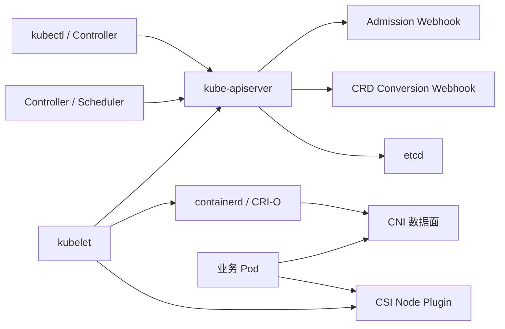
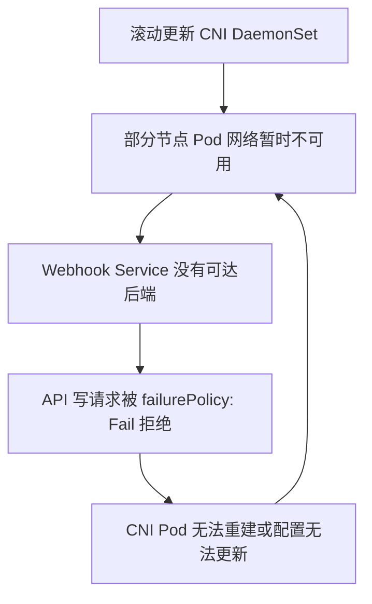
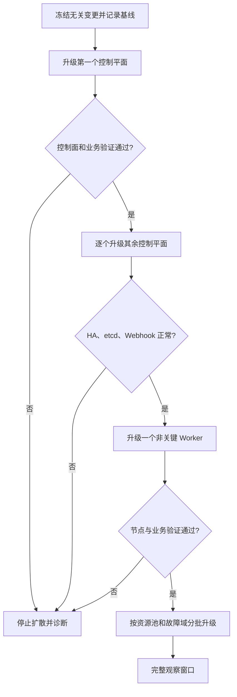
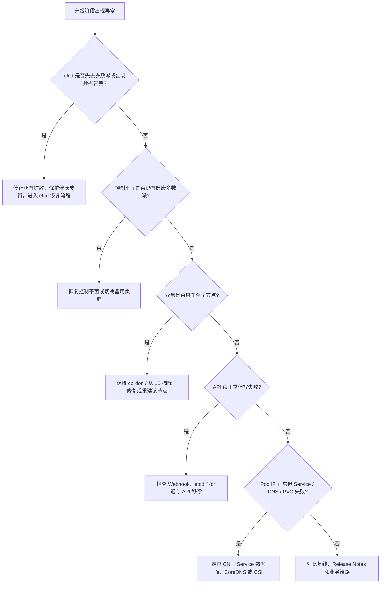

# Kubernetes 生产集群升级：预检、灰度、回退与故障排查

Kubernetes 升级不是把 `kube-apiserver`、`kubelet` 和 `kubectl` 换成新版本。它会同时改变 API 服务范围、对象转换、控制器行为、节点组件、网络与存储插件的运行条件，以及各类扩展组件与 API Server 之间的契约。

一次可靠的生产升级应满足四个条件：

1. 升级前能够证明目标版本与现有组件兼容；
2. 升级过程中每次只改变一个可控故障域；
3. 每个阶段都有可观测的通过条件和停止条件；
4. 失败后知道应该继续前滚、恢复单个节点、恢复 etcd，还是切回旧集群。

本文以 kubeadm 管理的高可用集群为主。托管 Kubernetes、RKE2、K3s、OpenShift 等发行版的具体命令不同，但风险模型、验证方法和恢复边界相同。

> 本文中的版本号和输出均为示例。实际升级必须以目标 Kubernetes 版本、集群发行版及插件厂商的官方兼容矩阵为准，不能把示例版本直接用于生产。

## 1. 一次升级实际改变了什么

升级的影响可以分为七层：

| 层次 | 可能发生的变化 | 典型故障 |
| --- | --- | --- |
| API 契约 | API 版本移除、默认值和校验规则变化 | YAML 无法创建、控制器持续报错 |
| 控制平面 | API Server、Scheduler、Controller Manager、etcd 行为变化 | API 超时、选主失败、控制循环停滞 |
| 节点与运行时 | kubelet、CRI、cgroup、内核接口变化 | Node `NotReady`、Pod Sandbox 创建失败 |
| 网络 | CNI、kube-proxy、eBPF、MTU 和 NetworkPolicy 兼容性 | Pod 跨节点不通、Service 超时、DNS 失败 |
| 存储 | CSI Sidecar、驱动、快照 CRD 和挂载路径变化 | PVC Pending、VolumeAttach 或 Mount 失败 |
| 扩展与准入 | Webhook、CRD、Operator、聚合 API 兼容性 | API 写请求被阻塞、CRD 对象无法转换 |
| 业务工作负载 | 驱逐、重建、拓扑和容量变化 | PDB 阻塞、容量不足、长任务中断 |

它们之间还存在依赖关系：



这解释了为什么“核心组件升级成功”不等于“集群升级成功”。例如 API Server 已经启动，但 Webhook 因 CNI 故障不可达，所有匹配的写请求仍可能被 `failurePolicy: Fail` 拒绝。

## 2. 先确定升级路径，而不是先执行命令

### 2.1 采集真实版本

不要只看运维文档中的登记版本，应直接从集群和节点采集事实：

```bash
kubectl version
kubectl get nodes -o wide
kubectl get nodes \
  -o custom-columns='NAME:.metadata.name,KUBELET:.status.nodeInfo.kubeletVersion,CRI:.status.nodeInfo.containerRuntimeVersion,KERNEL:.status.nodeInfo.kernelVersion,OS:.status.nodeInfo.osImage'
kubectl get pods -n kube-system -o wide
kubectl get daemonsets -A
```

示例输出：

```text
NAME       KUBELET    CRI                   KERNEL               OS
master-01  v1.31.12   containerd://1.7.27   5.15.0-139-generic   Ubuntu 22.04.5 LTS
master-02  v1.31.12   containerd://1.7.27   5.15.0-139-generic   Ubuntu 22.04.5 LTS
worker-01  v1.31.11   containerd://1.7.24   5.15.0-139-generic   Ubuntu 22.04.5 LTS
```

如果集群由 kubeadm 创建，还应检查 kubeadm 保存的配置和控制面镜像：

```bash
kubectl -n kube-system get configmap kubeadm-config -o yaml
kubectl -n kube-system get pods \
  -l component=kube-apiserver \
  -o custom-columns='POD:.metadata.name,IMAGE:.spec.containers[0].image'
```

### 2.2 理解版本偏差规则

设当前控制平面为 `N`，目标版本为 `N+1`。升级时需要遵守这些核心约束：

- API Server 不能跳过次版本，必须按 `N → N+1 → N+2` 逐级升级；
- 高可用集群中新旧 API Server 的最大偏差为一个次版本；
- kubelet 不能比它连接的 API Server 更新；
- 新版 Kubernetes 通常允许 kubelet 比 API Server 最多旧三个次版本，但旧版本规则可能不同；
- kubectl 通常支持与 API Server 相差一个次版本；
- kubeadm 还会施加自己的升级约束，应让 kubeadm 与目标控制平面版本匹配。

因此，`1.31 → 1.33` 不能通过一次 `kubeadm upgrade apply` 完成，正确路径是：

```text
1.31.x 更新到当前次版本的最新补丁
    ↓
1.32.x 的目标补丁版本
    ↓ 完整验收与观察
1.33.x 的目标补丁版本
```

逐级升级不是形式要求。次版本移除 API、迁移存储版本和调整默认行为时，跳过中间版本会失去官方支持的转换与验证路径。

### 2.3 明确升级对象

变更单中至少要写清：

- 当前版本、目标补丁版本和每个中间版本；
- stacked etcd 还是 external etcd；
- 控制平面、工作节点和故障域数量；
- CNI、CSI、CRI、CoreDNS、Ingress、Service Mesh、GPU/NPU 插件版本；
- 哪些组件随 kubeadm 升级，哪些必须单独升级；
- 业务允许的最大不可用节点数、RTO 和 RPO；
- 观察窗口、停止条件和恢复负责人。

## 3. 建立兼容矩阵

Kubernetes 不会替你验证所有第三方插件。生产升级前应维护一张“已验证矩阵”，而不是只写“插件版本较新”。

| 组件 | 当前版本 | 目标版本 | 目标 Kubernetes 支持范围 | 证据 | 验证状态 |
| --- | --- | --- | --- | --- | --- |
| Kubernetes | `v1.31.x` | `v1.32.x` | 不跳次版本 | 官方升级文档 | 待验证 |
| containerd | `1.7.x` | 保持或升级 | CRI 与目标 OS 支持 | Kubernetes 与 containerd 文档 | 待验证 |
| CNI | 实际版本 | 实际目标 | 厂商矩阵、内核与 eBPF 要求 | 官方 Release Notes | 待验证 |
| CSI Driver | 实际版本 | 实际目标 | Kubernetes 和 CSI Sidecar 要求 | 驱动官方矩阵 | 待验证 |
| CoreDNS | 实际版本 | kubeadm 目标 | kubeadm upgrade plan | Kubernetes 文档 | 待验证 |
| Ingress / Gateway | 实际版本 | 实际目标 | API 与目标 Kubernetes | 项目官方矩阵 | 待验证 |
| GPU/NPU 插件 | 实际版本 | 实际目标 | kubelet、驱动和 Operator 支持 | 厂商矩阵 | 待验证 |
| 备份组件 | 实际版本 | 实际目标 | API、CRD、快照接口支持 | 项目官方矩阵 | 待验证 |

兼容矩阵不能只记录“能安装”，还应覆盖：

1. 控制器能否识别目标 API；
2. DaemonSet 能否在新 kubelet 和内核上运行；
3. CRD 的存储版本和转换 Webhook 是否正常；
4. Sidecar 与主驱动是否是支持的组合；
5. 滚动期间新旧版本能否短暂共存；
6. 失败时是否支持降级，降级前是否需要数据迁移。

### 3.1 为什么不能维护一张永久版本表

“某 CSI 版本最低支持某 Kubernetes 版本”只有在明确驱动名称、发行版、Sidecar 版本和发布日期时才有意义。Kubernetes 官方也明确要求查询具体 CSI 驱动的部署文档和兼容矩阵。

文章里的静态版本表会过期，生产矩阵应链接到厂商原始资料，并记录核验日期和实际验证结果。

## 4. 废弃 API：要同时检查代码、请求和存储

升级前只对 Git 仓库执行一次字符串搜索是不够的。废弃 API 可能来自三个位置：

```text
声明源：Git、Helm Chart、Operator 模板
    ↓ apply / controller request
运行请求：旧 kubectl、旧控制器、外部自动化仍在调用旧 API
    ↓ persistence
存储对象：etcd 中仍以旧 storageVersion 保存的对象
```

### 4.1 检查目标版本移除了哪些 API

先阅读“当前版本到目标版本”之间所有版本的 Deprecated API Migration Guide。例如 Kubernetes 1.32 停止提供 `flowcontrol.apiserver.k8s.io/v1beta3`，对象需要迁移到仍被提供的版本。

检查集群当前支持的资源版本：

```bash
kubectl api-resources --verbs=list --namespaced=true
kubectl api-versions | sort
```

这只能回答“当前 API Server 提供什么”，不能证明客户端没有调用即将移除的版本。

### 4.2 从 API Server 指标发现旧客户端

有相应权限时，可查询：

```bash
kubectl get --raw /metrics \
  | grep '^apiserver_requested_deprecated_apis' \
  | grep ' 1$'
```

示例：

```text
apiserver_requested_deprecated_apis{group="flowcontrol.apiserver.k8s.io",removed_release="1.32",resource="flowschemas",subresource="",version="v1beta3"} 1
```

这个 Gauge 表示 API Server 观察到过该废弃 API 请求，但不能直接告诉你是哪一个客户端。继续使用审计日志中的 `userAgent`、用户、源地址、URI 和对象定位调用方：

```text
requestURI=/apis/flowcontrol.apiserver.k8s.io/v1beta3/flowschemas
userAgent=old-controller/v0.x
username=system:serviceaccount:platform:old-controller
```

如果没有启用审计日志，应在升级前补齐审计或通过 API 网关、控制器日志和客户端清单交叉定位。

### 4.3 扫描声明文件只是第一步

在代码仓库中搜索旧 API：

```bash
rg -n 'apiVersion:.*v1beta|apiVersion:.*v1alpha' manifests charts operators
helm template <RELEASE_NAME> <CHART_PATH> > rendered.yaml
```

不能把所有 `v1beta` 和 `v1alpha` 一律判为错误。CRD 自定义 API 可以合法使用这些版本；是否可用取决于 CRD 的 `spec.versions`。扫描结果必须与目标集群的 API 列表和迁移指南核对。

### 4.4 检查 CRD 的 served、storage 和转换链路

```bash
kubectl get crd \
  -o custom-columns='NAME:.metadata.name,STORED:.status.storedVersions[*],CONVERSION:.spec.conversion.strategy'
```

示例：

```text
NAME                    STORED          CONVERSION
widgets.example.com     v1beta1,v1      Webhook
policies.example.com    v1              None
```

`storedVersions` 中仍出现旧版本，表示 etcd 中可能还有以该版本存储的对象。删除 CRD 版本前，应先完成存储版本迁移，并验证 Conversion Webhook 在新旧 API Server 并存期间都能工作。

### 4.5 废弃 API 的通过条件

- 目标版本将移除的 API 不再出现在持续请求指标中；
- 审计日志中没有旧控制器或脚本继续调用；
- Git、渲染后的 Helm YAML 和外部自动化已经迁移；
- CRD 的 served/storage 设计明确，转换 Webhook 已验证；
- 在测试集群禁用待移除 API 后，核心业务和控制器仍能运行。

## 5. etcd：升级前要验证的是“能恢复”，不是“有文件”

### 5.1 先区分四个容易混淆的概念

| 操作 | 作用 | 不会做什么 |
| --- | --- | --- |
| Compact | 删除指定 revision 之前的 MVCC 历史可见性 | 不保证数据库文件立即变小 |
| Defragment | 重写某成员后端，回收碎片空间 | 不代替 Compact，不应同时对所有成员执行 |
| Snapshot | 保存某个时点的 etcd 状态 | 不证明快照一定能恢复 |
| Restore | 用快照创建新的 etcd 数据目录和集群身份 | 不是在线“覆盖一下文件” |

当后端存储超过 quota 时，etcd 通常触发 `NOSPACE` 告警并进入受限维护状态，写请求会受影响。不能简单推导成“各成员必然 revision 不一致，所以永远选不出 Leader”。是否丢失 quorum、成员是否一致以及能否恢复，必须根据 endpoint 状态、告警、日志和数据校验判断。

### 5.2 检查成员、健康、Leader 和后端大小

以下以 kubeadm stacked etcd 为例，在控制平面节点准备证书变量：

```bash
export ETCDCTL_API=3
export ETCDCTL_CACERT=/etc/kubernetes/pki/etcd/ca.crt
export ETCDCTL_CERT=/etc/kubernetes/pki/etcd/healthcheck-client.crt
export ETCDCTL_KEY=/etc/kubernetes/pki/etcd/healthcheck-client.key
export ETCD_ENDPOINTS=https://10.0.0.11:2379,https://10.0.0.12:2379,https://10.0.0.13:2379

etcdctl --endpoints="$ETCD_ENDPOINTS" endpoint status -w table
etcdctl --endpoints="$ETCD_ENDPOINTS" endpoint health -w table
etcdctl --endpoints="$ETCD_ENDPOINTS" alarm list
etcdctl --endpoints="$ETCD_ENDPOINTS" endpoint hashkv -w table
```

健康集群的示例输出：

```text
+------------------------+------------------+---------+---------+-----------+------------+
|        ENDPOINT        |        ID        | VERSION | DB SIZE | IS LEADER | RAFT INDEX |
+------------------------+------------------+---------+---------+-----------+------------+
| https://10.0.0.11:2379 | 91bc3c398fb3c146 |  3.5.18 |   86 MB |      true |   48213742 |
| https://10.0.0.12:2379 | fd422379fda50e48 |  3.5.18 |   85 MB |     false |   48213742 |
| https://10.0.0.13:2379 | 8e9e05c52164694d |  3.5.18 |   86 MB |     false |   48213742 |
+------------------------+------------------+---------+---------+-----------+------------+
```

判断时不要只看 `health=true`：

- 三个成员是否都返回；
- 是否只有一个 Leader；
- Raft Index / Applied Index 是否持续接近；
- DB Size 与 In Use Size 是否异常增长；
- HashKV 是否在同一 revision 上一致；
- 是否存在 `NOSPACE` 或 `CORRUPT` 告警；
- Leader 变更、Proposal Failed、WAL fsync 和 Backend Commit 延迟是否异常。

### 5.3 创建并验证快照

从一个健康 endpoint 创建快照：

```bash
snapshot_file="/var/backups/etcd/pre-upgrade-$(date +%F-%H%M%S).db"

etcdctl \
  --endpoints=https://10.0.0.11:2379 \
  snapshot save "$snapshot_file"

etcdutl snapshot status "$snapshot_file" -w table
sha256sum "$snapshot_file"
```

示例：

```text
+----------+----------+------------+------------+
|   HASH   | REVISION | TOTAL KEYS | TOTAL SIZE |
+----------+----------+------------+------------+
| 7ef846e  | 48526102 |      42617 |      86 MB |
+----------+----------+------------+------------+
```

快照包含 Secret、凭据和整个集群状态，应加密、异机保存并限制访问。仅复制正在使用的 `member/snap/db` 可能遗漏仍在 WAL 中、尚未写入后端的数据，优先使用在线 `snapshot save`。

### 5.4 恢复演练的最低标准

在与生产隔离的环境中完成：

```text
校验快照哈希
→ etcdutl snapshot restore 到新目录
→ 使用新的集群 Token 和成员配置启动 etcd
→ 启动隔离的 API Server
→ 检查 Namespace、Deployment、Secret、CRD 和关键对象数量
→ 执行读写验证
→ 记录实际 RTO 与快照对应的 RPO
```

恢复 etcd 时必须停止所有会连接该 etcd 的 API Server，再恢复整个 etcd 集群。不能让旧 API Server 一边写入，一边替换底层数据库。

### 5.5 升级前 etcd 的停止条件

出现以下任一情况，不应开始 Kubernetes 升级：

- 成员不全、Leader 频繁变化或没有 quorum；
- `alarm list` 非空；
- 后端接近 quota，且 Compact / Defragment 维护尚未安全完成；
- 磁盘 fsync 或 Backend Commit 延迟持续异常；
- 快照状态无法读取、离线恢复演练失败；
- 备份文件只存在于原控制平面节点；
- external etcd 的升级责任和 Kubernetes 变更窗口没有明确分离。

## 6. Admission Webhook：最容易把“组件故障”放大为“集群不可写”

Admission Webhook 位于 API 写请求进入 etcd 之前：

```text
认证 → 鉴权 → Mutating Webhook → 对象校验 → Validating Webhook → 写入 etcd
```

如果 Webhook 使用 `failurePolicy: Fail`，服务不可达、TLS 失败、响应超时或返回格式错误，都可能让匹配的 API 请求失败。

### 6.1 盘点所有 Webhook

```bash
kubectl get mutatingwebhookconfigurations,validatingwebhookconfigurations
kubectl get mutatingwebhookconfigurations -o yaml > mutating-webhooks.before.yaml
kubectl get validatingwebhookconfigurations -o yaml > validating-webhooks.before.yaml
```

逐项确认：

- `clientConfig.service` 指向的 Service 和 EndpointSlice 是否存在；
- CA Bundle 和服务证书是否有效；
- `admissionReviewVersions` 是否包含目标 API Server 支持的版本；
- `matchPolicy` 是否适合 API 版本转换，通常优先 `Equivalent`；
- `failurePolicy` 是 `Fail` 还是 `Ignore`，理由是什么；
- `timeoutSeconds` 是否过长，超时是否会放大 API 延迟；
- 是否错误地匹配 `kube-system`、CNI、Webhook 自身或恢复操作；
- Webhook Pod 是否跨节点、跨故障域部署并受 PDB 保护。

### 6.2 不要只用 curl 检查

Webhook 端口返回 200 只能证明进程能够响应，不能证明 AdmissionReview、TLS、规则匹配和业务逻辑正确。应通过 API Server 发起服务端 Dry Run：

```bash
kubectl create namespace upgrade-probe --dry-run=server -o yaml
kubectl apply --server-side --dry-run=server -f admission-probe.yaml
```

并观察 API Server 和 Webhook 指标：

```text
apiserver_admission_webhook_rejection_count
apiserver_admission_webhook_admission_duration_seconds
```

### 6.3 CNI 与 Webhook 的依赖环

典型死锁如下：



避免依赖环的方法包括：

- Webhook 至少保留多个跨故障域副本；
- 设置合理的 PDB、反亲和与拓扑分布；
- 确保 CNI 变更时仍有可达的 Webhook 后端；
- 为系统命名空间和恢复身份设计经过评审的豁免条件；
- 在演练环境验证 `failurePolicy`、超时和故障注入行为；
- 将 CNI、Webhook 与控制平面升级拆成不同变更阶段。

不要把“删除整个 ValidatingWebhookConfiguration”当作标准恢复步骤。紧急调整前应导出配置、确认影响范围、使用预先设计的 Break-glass 路径，并在恢复后验证策略重新生效。

## 7. CNI、CSI、CRI 与系统插件的专项预检

### 7.1 CNI

```bash
kubectl get daemonsets -A
kubectl get pods -A -o wide | grep -Ei 'calico|cilium|flannel|weave'
kubectl get networkpolicies -A
kubectl get nodes -o wide
```

升级前至少验证：

- CNI 版本支持目标 Kubernetes、内核和 CPU 架构；
- Overlay / Underlay 模式、MTU、IPAM、路由与 BGP 状态正常；
- 每个节点 CNI Agent Ready，控制器无持续重启；
- Pod 同节点、跨节点、跨网段、Service、DNS 和 NetworkPolicy 路径通过；
- eBPF 数据面使用的内核能力和 kube-proxy 替代模式兼容；
- CNI DaemonSet 滚动策略不会同时破坏一个故障域。

### 7.2 CSI

```bash
kubectl get csidrivers
kubectl get storageclasses
kubectl get volumesnapshotclasses.snapshot.storage.k8s.io 2>/dev/null || true
kubectl get pods -A -o wide | grep -Ei 'csi|provisioner|attacher|snapshotter|resizer'
kubectl get volumeattachments.storage.k8s.io
```

CSI 验证不能止于“Controller Pod Running”，至少应覆盖：

1. 动态创建 PVC；
2. Pod 挂载并写入校验数据；
3. 重建 Pod 后重新挂载并校验数据；
4. 驱动支持时执行扩容和快照；
5. 跨节点迁移，验证 Detach / Attach；
6. 节点排空后验证有状态业务恢复。

CSI 主驱动与 `external-provisioner`、`external-attacher`、`external-resizer`、`external-snapshotter` 等 Sidecar 需要作为一个组合验证，不能各自选择“最新版本”后直接拼装。

### 7.3 CRI 与 kubelet

```bash
crictl info
crictl version
systemctl status containerd kubelet --no-pager
journalctl -u containerd -u kubelet -n 100 --no-pager
```

检查：

- CRI Socket、Sandbox Image 和私有仓库配置；
- kubelet 与运行时的 cgroup driver；
- containerd / CRI-O 与目标 Kubernetes、runc、CNI Plugin 版本；
- 镜像仓库、CA、认证和目标控制面镜像是否已预拉取；
- GPU/NPU RuntimeClass 和 CDI 配置是否仍能注入设备。

### 7.4 系统插件

还应逐一记录并验证：

- CoreDNS：解析 ClusterIP、Headless Service、外部域名和负缓存；
- kube-proxy 或替代数据面：Service、NodePort、会话保持和 conntrack；
- Ingress / Gateway：证书、长连接、WebSocket、HTTP/2 和真实源地址；
- Metrics Server：APIService 可用性和节点指标；
- 日志与监控 Agent：新节点和新组件版本可见；
- GPU/NPU Device Plugin：资源上报、分配、重启恢复和健康状态；
- Service Mesh：Sidecar 注入、mTLS、控制面兼容性和升级顺序；
- 备份与策略控制器：CRD、Webhook 和目标 API 兼容性。

## 8. 业务容量与驱逐风险

### 8.1 计算排空后的剩余容量

升级工作节点前，应按资源池和故障域计算：

```text
可用余量 = 当前可调度容量 - 当前业务请求 - 本批次排空节点容量 - 安全缓冲
```

不能只看平均 CPU 使用率。GPU/NPU 型号、NUMA 拓扑、本地盘、RDMA 网络、Zone、Taint、Node Affinity 和拓扑约束都可能使“全局还有容量”变成“该业务没有可用容量”。

### 8.2 盘点 PDB、不可驱逐 Pod 和本地数据

```bash
kubectl get pdb -A
kubectl get pods -A \
  -o custom-columns='NS:.metadata.namespace,NAME:.metadata.name,NODE:.spec.nodeName,OWNER:.metadata.ownerReferences[0].kind,LOCAL:.spec.volumes[*].emptyDir'
kubectl get pods -A --field-selector=status.phase!=Running
```

重点确认：

- PDB 的 `ALLOWED DISRUPTIONS` 是否大于零；
- 单副本控制器是否允许中断；
- 使用 `emptyDir` 或 HostPath 的数据是否可以丢失；
- DaemonSet 是否由 drain 自动忽略；
- 静态 Pod 不会被 API 驱逐；
- GPU 训练、批处理和流式任务是否支持 Checkpoint；
- 有状态服务的主从、quorum 和故障域是否允许当前批次排空。

示例：

```text
NAMESPACE   NAME              MIN AVAILABLE   ALLOWED DISRUPTIONS   AGE
payment     payment-api-pdb   3               0                     90d
```

`ALLOWED DISRUPTIONS=0` 时，不应使用 `--disable-eviction` 绕过 PDB。先解决副本、容量、NotReady Pod 或 PDB 设计问题。

## 9. 用基线证明升级前后没有退化

升级前保存至少一个完整业务周期的基线。小型集群也应覆盖：

| 层次 | 关键指标 |
| --- | --- |
| API Server | 请求成功率、429、5xx、P50/P99、inflight、Webhook 延迟 |
| etcd | Leader 变化、Proposal Failed、WAL fsync、Backend Commit、DB Size、quota |
| Scheduler | 调度延迟、Pending Pod、unschedulable 原因 |
| Controller | Workqueue 深度、重试、Leader Election |
| Node | Ready、Lease、kubelet PLEG、运行时错误、磁盘和 PID 压力 |
| 网络 | DNS、Service、跨节点丢包、conntrack、CNI 错误 |
| 存储 | Provision、Attach、Mount、IO 延迟、CSI 错误 |
| 业务 | 成功率、P95/P99、吞吐、队列深度和业务错误码 |

建立合成探针，持续执行而不是升级结束后才手工测试：

```text
创建 Deployment
→ Service ClusterIP 请求
→ CoreDNS 解析
→ 跨节点 Pod 请求
→ PVC 创建、挂载、写入和读取
→ Ingress / Gateway 请求
→ 删除并重建资源
```

这些操作分别覆盖 API 写入、调度、Webhook、CNI、kube-proxy、CoreDNS 和 CSI，比“所有 Pod 都是 Running”更有证明力。

## 10. 预演与升级计划

### 10.1 预演环境应复刻哪些内容

预演环境不必与生产规模相同，但必须包含相同的：

- 当前和目标 Kubernetes 版本；
- kubeadm 配置和控制面拓扑；
- CNI、CSI、CRI、CoreDNS、Ingress 和关键 Operator；
- Webhook、CRD 和 API 使用方式；
- 典型有状态、无状态和 GPU/NPU 工作负载；
- 网络模式、MTU、存储类型和证书链。

从生产快照恢复到预演环境前要做安全隔离，防止恢复出的 Controller、Job、告警、邮件和外部系统凭据对生产发起操作。

### 10.2 kubeadm 升级计划和差异

在第一个控制平面节点安装目标版本 kubeadm 后执行：

```bash
sudo kubeadm upgrade plan <TARGET_PATCH_VERSION>
sudo kubeadm upgrade diff <TARGET_PATCH_VERSION>
```

示例摘要：

```text
Components that must be upgraded manually after you have upgraded the control plane with 'kubeadm upgrade apply':
COMPONENT   CURRENT       TARGET
kubelet     3 x v1.31.12  v1.32.8

Upgrade to the latest stable version:
COMPONENT                 NODE       CURRENT    TARGET
kube-apiserver            master-01  v1.31.12   v1.32.8
kube-controller-manager   master-01  v1.31.12   v1.32.8
kube-scheduler            master-01  v1.31.12   v1.32.8
kube-proxy                            v1.31.12   v1.32.8
CoreDNS                               v1.11.x    v1.11.y
```

`plan` 通过只说明 kubeadm 的预检通过，不替代废弃 API、Webhook、CNI、CSI 和业务验证。

### 10.3 在窗口前准备好依赖

- 将目标二进制、系统包和镜像固定到明确版本或 Digest；
- 在所有控制平面预拉取目标镜像；
- 验证离线仓库、代理、DNS、CA 和认证；
- 保存静态 Pod Manifest、kubeadm 配置和 `/etc/kubernetes`；
- 创建并异机保存 etcd 快照；
- 验证监控、日志和合成探针能在变更期间持续工作；
- 明确负载均衡摘除、节点排空、停止和恢复指令。

## 11. 高可用 kubeadm 集群的执行顺序

### 11.1 总体顺序



### 11.2 第一个控制平面

先让负载均衡器确认其他 API Server 健康，再排空该控制平面上的可驱逐工作负载：

```bash
kubectl drain <CONTROL_PLANE_NODE> \
  --ignore-daemonsets \
  --delete-emptydir-data \
  --grace-period=60 \
  --timeout=15m
```

`--delete-emptydir-data` 会删除本地临时数据，只有在已经确认其影响后才能使用。

安装目标 kubeadm 后执行：

```bash
sudo kubeadm upgrade plan <TARGET_PATCH_VERSION>
sudo kubeadm upgrade apply <TARGET_PATCH_VERSION>
```

再升级 kubelet 和 kubectl，重启 kubelet：

```bash
sudo systemctl daemon-reload
sudo systemctl restart kubelet
sudo systemctl status kubelet --no-pager
```

解除节点封锁前验证：

```bash
kubectl get --raw='/readyz?verbose'
kubectl get pods -n kube-system -o wide
kubectl get nodes
kubectl uncordon <CONTROL_PLANE_NODE>
```

### 11.3 其余控制平面

必须逐个执行，不能同时重启多个 etcd 和 API Server 成员：

```bash
sudo kubeadm upgrade node
sudo systemctl daemon-reload
sudo systemctl restart kubelet
```

每完成一个成员都重新检查：

- 负载均衡后端健康；
- `/readyz?verbose`；
- etcd endpoint health、Leader、告警和延迟；
- Controller Manager 与 Scheduler Leader；
- Webhook Dry Run 和合成探针；
- 新旧 API Server 共存期间的错误率。

### 11.4 Worker 金丝雀与分批升级

先选择一个非关键、硬件和插件具有代表性的节点：

```bash
kubectl cordon <CANARY_NODE>
kubectl drain <CANARY_NODE> \
  --ignore-daemonsets \
  --delete-emptydir-data \
  --grace-period=60 \
  --timeout=30m
```

安装目标 kubeadm 和 kubelet 后：

```bash
sudo kubeadm upgrade node
sudo systemctl daemon-reload
sudo systemctl restart kubelet
kubectl uncordon <CANARY_NODE>
```

金丝雀通过后，按“节点池 × 可用区 × 硬件类型”分批，每批都要小于业务可承受的最大不可用容量。例如不要一次排空同一机架、同一 Zone 或同一 GPU 型号的所有节点。

## 12. 每个阶段的通过条件与停止条件

### 12.1 通过条件

- 当前批次节点全部恢复 `Ready`，Lease 持续更新；
- 控制面、etcd 和系统插件达到期望副本数；
- API 读写、Webhook Dry Run、DNS、Service、跨节点网络和 PVC 探针通过；
- API、etcd、网络、存储和业务指标未超出预定误差范围；
- 日志没有持续新增的未知错误；
- 经过预定观察窗口，而不是刚变绿就继续下一批。

### 12.2 必须停止扩散的信号

下面任一情况出现时，应暂停后续节点：

- etcd 成员不健康、出现告警、Leader 抖动或延迟持续恶化；
- API Server `/readyz` 失败，5xx、429 或 P99 超过阈值；
- Admission Webhook 错误或超时持续增长；
- 金丝雀节点长期 `NotReady`，CNI/CSI/Device Plugin 未恢复；
- CoreDNS、Service、跨节点网络或 PVC 合成探针失败；
- PDB 阻塞，或排空后剩余容量低于安全线；
- 业务错误率、尾延迟、队列积压超过约定阈值；
- 出现目标版本 Release Notes 中未覆盖的新错误。

“暂停”不等于立刻降级。先保持故障范围不扩大，再根据当前阶段决定修复路径。

## 13. 回退不是一个命令

### 13.1 四种恢复层次

| 失败范围 | 优先策略 | 说明 |
| --- | --- | --- |
| 单个 Worker 升级失败 | 保持 cordon，移出业务池，修复或重建节点 | 其他节点不受影响时风险最低 |
| 单个控制平面失败 | 从 LB 摘除，保持多数派，修复该成员 | 不要同时操作其他健康成员 |
| kubeadm 阶段中断 | 修复原因后重跑幂等的 upgrade 命令 | kubeadm 可重新执行，但仍需核对实际状态 |
| etcd 或整个控制面不可恢复 | 按已演练流程恢复快照或切换备用集群 | 属于灾难恢复，不是普通软件降级 |

### 13.2 为什么不能把“降包”当作回滚

新版本 API Server 可能已经：

- 将对象写成新的存储版本；
- 修改 kubeadm ConfigMap 和 kubelet 配置；
- 更新 CoreDNS、kube-proxy 和 RBAC；
- 触发新控制器写入字段；
- 更新 etcd 数据或静态 Pod Manifest。

直接将 RPM / DEB 和镜像降回旧版本，不一定能理解已经写入的新状态。生产升级优先采用：

1. 在支持范围内修复问题并前滚；
2. 隔离失败节点并保持健康多数派；
3. 使用 kubeadm 自动备份的 Manifest / local etcd 数据处理明确的单节点升级失败；
4. 整体灾难时按演练流程恢复 etcd 快照；
5. 对极高等级集群使用蓝绿集群和流量切回。

### 13.3 kubeadm 自动备份的边界

升级过程中 kubeadm 会在 `/etc/kubernetes/tmp` 下保留类似目录：

```text
kubeadm-backup-etcd-<date>-<time>
kubeadm-backup-manifests-<date>-<time>
```

它们用于处理该控制平面节点的升级失败，不等价于经过验证、异机保存的集群级灾备快照。external etcd 场景下本地 etcd 备份目录可能为空。

## 14. 常见故障的定位路径

### 14.1 kubeadm upgrade plan 发现不支持的版本偏差

现象：

```text
[upgrade/versions] FATAL: unsupported version skew
```

检查：

```bash
kubeadm version
kubectl version
kubectl get nodes
```

处理：确认是否跳过次版本、kubeadm 是否与目标版本匹配、集群中是否还有更旧的 API Server 或 kubelet。不要使用 `--force` 掩盖版本路径错误。

### 14.2 API Server 启动，但写操作超时

```bash
kubectl get --raw='/readyz?verbose'
kubectl get validatingwebhookconfigurations,mutatingwebhookconfigurations
kubectl get endpointslices -A | grep -i webhook
kubectl get events -A --sort-by=.lastTimestamp | tail -n 100
```

如果 GET 正常而 CREATE / UPDATE 超时，优先检查 Admission Webhook 和 etcd 写入延迟。错误中出现 `failed calling webhook`、`context deadline exceeded`、`x509` 时，不要先重启 kube-proxy，应沿 Webhook Service、Endpoint、TLS 和 Pod 网络逐层定位。

### 14.3 升级后的节点持续 NotReady

```bash
kubectl describe node <NODE_NAME>
kubectl get pods -A -o wide --field-selector=spec.nodeName=<NODE_NAME>
journalctl -u kubelet -u containerd -n 300 --no-pager
crictl ps -a
crictl pods
```

根据事件区分：

- `NetworkPluginNotReady`：检查 CNI 配置、Agent、IPAM、MTU 和内核；
- `ContainerRuntimeNotReady`：检查 CRI Socket、containerd、cgroup 和 Sandbox Image；
- `DiskPressure` / `PIDPressure`：先处理节点资源，不要继续升级；
- `x509`：检查时间、证书、kubeconfig 和 API Server 地址。

### 14.4 Pod Running，但 Service 或 DNS 失败

```bash
kubectl get svc,endpointslices -A
kubectl get pods -n kube-system -l k8s-app=kube-dns -o wide
kubectl logs -n kube-system -l k8s-app=kube-dns --tail=100
kubectl get daemonsets -n kube-system
conntrack -S
```

执行四组对比：

```text
Pod IP 直连
Service ClusterIP
Service DNS 名称
跨节点 Pod IP
```

这样可以把问题收敛到应用、Service 数据面、DNS 或跨节点网络，而不是统称为“网络故障”。

### 14.5 PVC 创建或挂载失败

```bash
kubectl describe pvc -n <NAMESPACE> <PVC_NAME>
kubectl describe pod -n <NAMESPACE> <POD_NAME>
kubectl get volumeattachments.storage.k8s.io
kubectl get pods -A -o wide | grep -i csi
kubectl get events -A --sort-by=.lastTimestamp | tail -n 100
```

根据事件区分 Provision、Attach、Mount、权限、拓扑和后端存储故障。不要只重启 CSI Controller；Mount 通常由目标节点的 CSI Node Plugin 和 kubelet 执行。

### 14.6 etcd 延迟或告警

```bash
etcdctl --endpoints="$ETCD_ENDPOINTS" endpoint status -w table
etcdctl --endpoints="$ETCD_ENDPOINTS" endpoint health -w table
etcdctl --endpoints="$ETCD_ENDPOINTS" alarm list
journalctl -u kubelet --since '-30 min' | grep -i etcd
```

先判断是磁盘延迟、quota、成员通信、证书、Leader 抖动还是数据一致性问题。不要在原因不明时同时重启全部 etcd 成员，也不要把 Compact、Defragment、扩容磁盘和版本升级塞进同一个未经演练的动作。

## 15. 一份可执行的升级检查清单

### 15.1 升级前

- [ ] 当前版本、目标版本和所有中间次版本明确；
- [ ] 当前次版本已更新到计划的稳定补丁；
- [ ] Kubernetes Release Notes 和 API 移除清单已审阅；
- [ ] CNI、CSI、CRI、CoreDNS、Ingress、Webhook、Operator 和设备插件兼容矩阵完成；
- [ ] 目标移除 API 的声明、请求和存储版本均完成迁移；
- [ ] etcd 成员健康、无告警、容量和延迟正常；
- [ ] etcd 快照已经校验、异机保存并完成恢复演练；
- [ ] Webhook 的副本、PDB、TLS、超时、failurePolicy 和 Break-glass 已验证；
- [ ] PDB、本地数据、长任务和可用容量已检查；
- [ ] 目标包与镜像已固定版本并预拉取；
- [ ] 合成探针、监控、日志和停止阈值已生效；
- [ ] 在预演环境走完升级和故障恢复流程。

### 15.2 每个控制平面节点后

- [ ] API `/readyz?verbose` 全部通过；
- [ ] LB 后端和证书正常；
- [ ] etcd endpoint、Leader、告警和延迟正常；
- [ ] Scheduler / Controller Manager 正常选主；
- [ ] Webhook Dry Run 通过；
- [ ] DNS、Service、网络、存储和业务探针通过；
- [ ] 完成观察窗口后再升级下一节点。

### 15.3 每批 Worker 后

- [ ] 节点恢复 Ready，kubelet 和 CRI 无持续错误；
- [ ] CNI、CSI、监控和设备插件在节点上 Ready；
- [ ] Pod 可调度，Service、DNS、PVC 和设备分配正常；
- [ ] PDB、剩余容量和业务 SLI 未越线；
- [ ] 当前批次问题全部关闭或有明确处置结论。

## 16. 故障决策树



## 17. 课后练习

### 17.1 题目

1. 为什么 Kubernetes 次版本升级不能从 `1.31` 直接跳到 `1.33`？
2. Git 仓库中已经没有 `v1beta1`，为什么升级后仍可能遇到废弃 API 问题？
3. etcd Compact 与 Defragment 有什么区别？
4. 为什么“etcd 快照文件存在且大小正常”仍不能证明可以恢复？
5. API GET 正常，但所有 Deployment 更新都超时，应优先检查什么？
6. 为什么 CSI Controller Pod Running 不能证明存储升级安全？
7. 金丝雀 Worker 升级后 Node Ready，但不能立即开始全量升级的原因是什么？
8. 为什么不建议通过降级 RPM / DEB 直接回退整个控制平面？
9. PDB 的 `ALLOWED DISRUPTIONS=0` 时，能否使用 `kubectl drain --disable-eviction` 强行继续？
10. 哪些情况下应该进入 etcd 灾难恢复，而不是继续重跑 kubeadm？

### 17.2 参考答案

1. API Server 的官方升级路径不支持跳过次版本；中间版本还承担 API 迁移、默认值演进和兼容验证。必须逐个次版本升级并完成验收。
2. 旧请求可能来自运行中的控制器、旧客户端或外部自动化，etcd 中也可能仍存储旧版本对象。应同时检查声明文件、API 请求指标与审计日志、CRD `storedVersions`。
3. Compact 删除旧 MVCC revision 的历史可访问性；Defragment 重写单个成员的后端文件以回收碎片空间。Compact 后文件不一定立即变小，Defragment 也不能代替 Compact。
4. 文件可能损坏、权限不完整、RPO 不满足，恢复参数和证书也可能错误。只有在隔离环境完成 Restore、启动 API Server 并校验关键对象，才能证明恢复链路可用。
5. 优先检查 Admission Webhook、etcd 写入延迟和目标 API 是否仍被提供。GET 可能不经过匹配写操作的 Webhook，所以读正常不能证明写链路正常。
6. 完整存储路径还包括 Sidecar、CSI Node Plugin、StorageClass、后端存储、Attach、Mount、扩容和快照。必须用 PVC 创建、写入、重挂载和跨节点迁移验证。
7. Ready 只证明 kubelet基础状态正常，还需验证 CNI、CSI、DNS、Service、设备插件、业务指标和观察窗口内的稳定性。
8. 新控制面可能已写入新的对象存储版本、配置、字段和 RBAC，旧二进制未必能解释这些状态。应优先前滚、隔离失败成员或使用已经演练的快照/备用集群恢复方案。
9. 通常不能。`--disable-eviction` 会绕过 PDB，可能直接突破业务可用性约束。应先恢复副本、释放容量或修正 PDB；只有明确评估并获得业务授权的灾难处置才考虑强制动作。
10. etcd 失去多数派且成员无法安全恢复、出现无法处置的数据损坏，或整个控制平面状态不可重建时，才进入已演练的快照恢复或备用集群切换。单节点失败和可修复的 kubeadm 中断不应直接做集群级 Restore。

## 18. 总结

生产集群升级应按下面的证据链推进：

```text
版本路径合法
→ API 与插件兼容
→ etcd 可恢复
→ Webhook 与 CRD 可演进
→ 容量允许排空
→ 预演通过
→ 控制平面逐节点升级
→ Worker 金丝雀与分批升级
→ 每批完成全链路验收
→ 观察期结束后关闭变更
```

真正的安全来自缩小每一步的故障半径，并在继续之前证明系统仍然满足预期。命令只是执行手段，兼容矩阵、恢复演练、合成探针、停止条件和分层排障才是生产升级的核心。

## 19. 相关内容

- [集群生命周期管理](./03-集群生命周期管理.md)
- [Kubernetes 版本发布管理](./04-版本发布管理.md)
- [多环境集群新增节点纳管与验收](./05-多环境集群新增节点纳管与验收.md)
- [kubeadm 高可用集群部署实战](./06-kubeadm高可用集群部署实战.md)
- [kubeadm 命令详解](../../commands/09-kubeadm命令详解.md)
- [Kubernetes etcd 备份、控制面故障与恢复边界](../../../etcd/11-Kubernetes-etcd备份控制面故障与恢复边界.md)
- [Calico 网络原理](../../../../networking/kubernetes/cni/03-Calico.md)
- [Kubernetes Service 原理](../../../../networking/kubernetes/service-routing/02-Service.md)

## 20. 参考资料

- [Kubernetes：Upgrading kubeadm clusters](https://kubernetes.io/docs/tasks/administer-cluster/kubeadm/kubeadm-upgrade/)
- [Kubernetes：Version Skew Policy](https://kubernetes.io/releases/version-skew-policy/)
- [Kubernetes：Deprecated API Migration Guide](https://kubernetes.io/docs/reference/using-api/deprecation-guide/)
- [Kubernetes：Dynamic Admission Control](https://kubernetes.io/docs/reference/access-authn-authz/extensible-admission-controllers/)
- [Kubernetes：Operating etcd clusters for Kubernetes](https://kubernetes.io/docs/tasks/administer-cluster/configure-upgrade-etcd/)
- [Kubernetes：Volumes and CSI](https://kubernetes.io/docs/concepts/storage/volumes/)
- [etcd：Maintenance](https://etcd.io/docs/v3.5/op-guide/maintenance/)
- [etcd：Disaster recovery](https://etcd.io/docs/v3.5/op-guide/recovery/)
