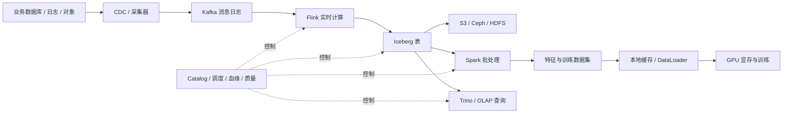

# 大数据技术学习地图：从一条数据到生产级平台

学习大数据最容易掉进两个坑：一是把 Kafka、Spark、Flink、Iceberg 背成互不相干的产品；二是一开始就抄部署命令，集群能启动却解释不了数据为何重复、任务为何变慢、节点故障后为何恢复失败。

这套文章不按“产品百科”学习，而是始终追踪一条数据：它从业务系统产生，经过采集和消息队列，被批流计算引擎处理，落入数据湖或数仓，最终服务报表、在线查询和 GPU 训练。每一个技术栈都要回答同一组问题：

1. 数据实际经过哪些进程、网络和磁盘？
2. 元数据、调度和故障恢复由谁负责？
3. 并行度、吞吐、延迟和成本如何计算？
4. 节点宕机、网络抖动和任务重试时，数据会不会丢失或重复？
5. 出问题时先看什么指标、日志和状态？

## 1. 先看完整数据链路

这张图同时包含两条路径：

- **数据面**传输真实字节，例如 Kafka record、Parquet 文件、网络报文和 GPU tensor。
- **控制面**保存“数据在哪里、该运行什么、失败后从哪里继续”等信息，例如 Kafka 元数据、Flink checkpoint、Iceberg snapshot、Catalog 和调度 DAG。

很多生产事故都是数据面与控制面不一致：文件已经写入但表快照没有提交；offset 已提交但下游事务失败；调度器认为任务成功而质量规则没有通过。后续每篇文章都会明确这两个平面。

## 2. 九个学习阶段

### 阶段 0：分布式数据基础

先掌握所有引擎共用的语言：分区、并行度、Shuffle、状态、一致性、列式存储和压缩。完成本批文章后，应能画出一条数据的完整路径，并理解为什么要选择某种架构。

### 阶段 1：Hadoop、HDFS、YARN 与 Hive

这一阶段不是为了停留在旧技术，而是理解分布式存储、数据本地性、资源调度、批处理和元数据系统的源头。理解 HDFS 后，再看对象存储和存算分离会清楚很多。

### 阶段 2：Kafka 数据传输

学习分区日志、生产者、消费者组、复制、ISR、事务与容量规划。目标不是“会创建 topic”，而是能解释重平衡、消息积压、顺序边界、重复消息和数据丢失条件。

### 阶段 3：Spark 批处理

从 DataFrame 追到逻辑计划、物理计划、DAG、Stage、Task、Shuffle、内存与 spill。最后要能根据 Spark UI 定位数据倾斜、并行度不合理和执行计划问题。

### 阶段 4：Flink 流处理

学习事件时间、watermark、window、state、checkpoint、barrier、反压与 savepoint。目标是能判断端到端 Exactly-Once 是否真的成立，并安全升级一个有状态作业。

### 阶段 5：数据湖与湖仓

理解数据文件与表格式的区别，读懂 Iceberg metadata、manifest、snapshot、schema evolution 和 partition evolution，解决小文件、并发提交和快照清理问题。

### 阶段 6：交互查询与 OLAP

学习 Trino 的 MPP 查询路径，并比较 ClickHouse、Doris 等 OLAP 系统的存储和执行模型。重点是从 workload 出发选型，而不是争论哪个数据库“最快”。

### 阶段 7：数据工程与治理

补齐 CDC、任务编排、数据质量、数据契约、血缘、安全、多租户、可观测性和成本治理。平台能长期稳定运行，靠的主要是这一层工程能力。

### 阶段 8：端到端项目

最后把技术栈串起来：离线数仓、实时湖仓、性能优化和 AI 训练数据生产。项目验收以“能测量、能注入故障、能解释恢复过程”为准。

## 3. 完整文章清单与批次

整套大数据路线共 **63 篇，现已全部完成**。其中 53 篇建立原理、架构、生产实践与综合项目，新增 10 篇命令与实验手册用于把知识落实到查询、变更、验证和故障排查。命令手册不是替代原理文章，而是每完成一个模块后用于动手验收。

| 批次 | 模块 | 文章数 | 需要解决的问题 | 状态 |
|---|---:|---:|---|---|
| 第一批 | 学习地图、通用基础、端到端链路 | 7 | 先建立共同语言和全局视角 | 已完成 |
| 第二批 | Hadoop / HDFS / YARN / Hive | 7 | 分布式文件、批处理、资源调度和元数据 | 已完成 |
| 第三批 | Kafka | 7 | 分区日志、复制、消费、事务与积压治理 | 已完成 |
| 第四批 | Spark | 7 | DAG、SQL、Shuffle、内存、流批和调优 | 已完成 |
| 第五批 | Flink | 7 | 时间、状态、checkpoint、反压和升级恢复 | 已完成 |
| 第六批 | 数据湖与 Iceberg | 5 | 表格式、快照、演进、小文件和多引擎 | 已完成 |
| 第七批 | Trino 与 OLAP | 4 | MPP 查询、存储模型、选型和性能 | 已完成 |
| 第八批 | 数据工程与治理 | 5 | CDC、编排、质量、治理和 SRE | 已完成 |
| 第九批 | 综合项目 | 4 | 离线、实时、性能与 AI 数据生产 | 已完成 |
| 第十批 | 命令与实验手册 | 10 | CLI、SQL、系统表、状态判断与安全操作 | 已完成 |
| **合计** |  | **63** |  | **63/63** |

第一批之外的 46 篇如下，现均已写入对应模块。

**Hadoop 与 Hive（7 篇）**

1. HDFS 架构、block 与读写路径
2. NameNode 元数据、checkpoint、HA 与 Federation
3. DataNode 复制、机架感知、再平衡与纠删码
4. HDFS 容量规划、性能指标与故障排查
5. YARN ResourceManager、NodeManager、Container 与资源模型
6. MapReduce 从 Map 到 Shuffle、Sort 和 Reduce
7. Hive 表、分区、Metastore、执行引擎与小文件治理

**Kafka（7 篇）**

1. Kafka 架构、分区日志、segment 与索引
2. Producer batching、acks、重试与幂等生产
3. Consumer group、offset、rebalance 与顺序边界
4. 副本、ISR、leader 选举与 KRaft 控制面
5. Kafka 事务和端到端 Exactly-Once 边界
6. Topic、partition、磁盘、网络与容量规划
7. 消息积压、故障排查、滚动升级与 Kubernetes 部署

**Spark（7 篇）**

1. Spark 架构、RDD、DataFrame 与 Driver/Executor
2. DAG、Job、Stage、Task 与调度过程
3. Spark SQL、Catalyst、物理计划与代码生成
4. Shuffle、内存管理、缓存、spill 与序列化
5. Join、数据倾斜、AQE 与性能调优
6. Structured Streaming、状态、watermark 与 checkpoint
7. Spark on Kubernetes 部署、监控与故障排查

**Flink（7 篇）**

1. Flink 架构、JobManager、TaskManager 与 slot
2. DataStream、operator chain、分区与并行度
3. Event Time、watermark、window 与迟到数据
4. Keyed State、Operator State 与 State Backend
5. Checkpoint、barrier、savepoint 与 Exactly-Once
6. 反压、数据倾斜、状态膨胀与性能调优
7. Flink Kubernetes Operator、升级、恢复与生产运维

**数据湖与 Iceberg（5 篇）**

1. 数据湖、表格式、Catalog 与存算分离
2. Iceberg metadata、manifest、snapshot 与读写路径
3. Schema Evolution、Partition Evolution 与 Time Travel
4. 并发提交、小文件、compaction 与快照生命周期
5. Iceberg 对接 Spark、Flink、Trino 的生产实践

**查询与 OLAP（4 篇）**

1. Trino Coordinator、Worker、Stage、Split 与谓词下推
2. ClickHouse MergeTree、分区、排序键与后台合并
3. Doris MPP、tablet、物化视图与查询加速
4. 湖仓查询和 OLAP 选型、基准测试与故障排查

**数据工程与治理（5 篇）**

1. Debezium CDC、binlog、快照与 schema change
2. Airflow DAG、依赖、补数、重试与幂等调度
3. 数据质量、数据契约、元数据与血缘
4. 数据安全、权限、脱敏、多租户与生命周期治理
5. 大数据可观测性、容量规划、成本与事故复盘

**综合项目（4 篇）**

1. 从业务库到分层数仓的离线项目
2. Kafka、Flink、Iceberg 实时湖仓项目
3. Spark ETL 数据倾斜与性能优化项目
4. 面向 GPU 训练的数据集生产、版本化和吞吐优化项目

**命令与实验手册（10 篇）**

1. [Hadoop HDFS、YARN 与 MapReduce 命令手册](./commands/01-Hadoop-HDFS-YARN-MapReduce命令手册.md)
2. [Hive Beeline 与 Metastore 命令手册](./commands/02-Hive-Beeline与Metastore命令手册.md)
3. [Kafka Topic、Producer、Consumer 与 Group 命令手册](./commands/03-Kafka-Topic-Producer-Consumer与Group命令手册.md)
4. [Spark Submit、SQL、History Server 与排障命令手册](./commands/04-Spark-Submit-SQL-History与排障命令手册.md)
5. [Flink CLI、REST、Checkpoint 与 Savepoint 命令手册](./commands/05-Flink-CLI-REST-Checkpoint与Savepoint命令手册.md)
6. [Iceberg Spark SQL 快照、时间旅行与维护命令手册](./commands/06-Iceberg-Spark-SQL快照与维护命令手册.md)
7. [Trino CLI、EXPLAIN、System 表与查询排障](./commands/07-Trino-CLI-EXPLAIN-System表与查询排障.md)
8. [ClickHouse Client、System 表与运维命令手册](./commands/08-ClickHouse-Client-System表与运维命令手册.md)
9. [Doris SQL、Load、Tablet 与诊断命令手册](./commands/09-Doris-SQL-Load-Tablet与诊断命令手册.md)
10. [Airflow DAG、Task、Backfill 与恢复命令手册](./commands/10-Airflow-DAG-Task-Backfill与恢复命令手册.md)

## 4. 每篇文章应该怎么学

不要把“看过”当成“掌握”。建议每篇都执行五步闭环：

1. **画图**：不看文章，画出组件、数据面和控制面。
2. **估算**：根据记录大小、吞吐和保留时间估算网络、磁盘、内存与并行度。
3. **实验**：搭建最小环境，记录正常基线，而不是只确认进程存活。
4. **破坏**：停止进程、制造慢盘或网络延迟，观察恢复和数据正确性。
5. **复盘**：用指标和日志证明根因，写清故障边界、修复和预防措施。

每个实验至少保留这些证据：配置版本、输入规模、开始结束时间、吞吐与延迟、关键指标截图或文本、故障时间线、结果校验方法。否则一次“跑通”很难复现，也无法比较优化前后差异。

## 5. 学习优先级

- **P0：必须掌握。** 数据路径、分区与 Shuffle、一致性、Kafka、Spark、Flink、Iceberg、Linux/网络/存储基础，以及基本故障排查。
- **P1：生产必需。** 容量规划、Kubernetes 部署、可观测性、数据质量、升级恢复、安全和成本治理。
- **P2：按岗位深入。** 引擎源码、复杂 OLAP 内核、超大规模多租户治理、跨地域容灾和深度定制。

先完成 P0 闭环，再按工作场景选择 P1/P2。初学者不需要同时部署所有组件，但必须知道它们分别承担什么职责、彼此如何交接状态。

## 6. 第一批阅读顺序

1. [大数据系统到底解决什么问题](./foundations/01-大数据系统到底解决什么问题.md)
2. [批处理、流处理、数据湖、数仓与湖仓](./foundations/02-批处理流处理数据湖数仓与湖仓.md)
3. [分区、并行度、Shuffle 与数据倾斜](./foundations/03-分区并行度Shuffle与数据倾斜.md)
4. [数据一致性、幂等、At-Least-Once 与 Exactly-Once](./foundations/04-数据一致性幂等与Exactly-Once.md)
5. [Parquet、ORC、Avro 与压缩编码](./foundations/05-Parquet-ORC-Avro与压缩编码.md)
6. [从 Kafka 到 Flink、Iceberg、Spark 再到 GPU](./projects/01-从Kafka到Flink-Iceberg-Spark再到GPU.md)

完成第一批后，按“模块原理文章 → 对应命令手册 → 故障实验”的顺序学习。例如学完 Kafka 的 7 篇原理文章，再学习 Kafka 命令手册，并完成生产、消费、Lag、Offset 重置预演和副本健康实验。这样既不会把命令背成碎片，也能验证自己是否真的理解状态变化。

## 7. 整条路线的最终验收

完成全部路线后，应当可以独立完成以下任务：

- 根据数据规模、时效、查询与正确性要求设计批流架构，而不是先选产品。
- 估算 Kafka partition、Flink/Spark 并行度、存储容量、网络带宽和成本。
- 解释一次 record 从源端到数据湖快照，再到 GPU batch 的完整生命周期。
- 用 offset、checkpoint、snapshot 和数据集版本证明数据可重放、可追踪。
- 根据指标区分源端变慢、网络拥塞、Shuffle 倾斜、慢盘、状态膨胀和下游反压。
- 设计故障演练、恢复流程、数据校验、SLO 和事故复盘模板。

## 官方参考入口

- [Apache Hadoop 文档](https://hadoop.apache.org/docs/current/)
- [Apache Kafka 文档](https://kafka.apache.org/documentation/)
- [Apache Spark 文档](https://spark.apache.org/docs/latest/)
- [Apache Flink 文档](https://nightlies.apache.org/flink/flink-docs-stable/)
- [Apache Iceberg 文档](https://iceberg.apache.org/docs/latest/)
- [Trino 文档](https://trino.io/docs/current/)

官方文档用于核对具体版本的参数和行为；本系列负责建立跨组件的原理、数据路径、工程决策和排障方法。
