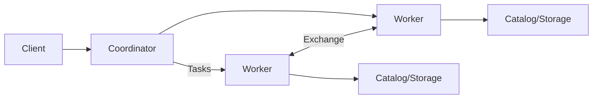

# Trino Coordinator、Worker、Stage、Split 与谓词下推

Trino 是分布式 SQL 查询引擎，不是通用 OLTP 数据库，也不默认保存业务表数据。Connector 连接 Iceberg、Hive、关系库等数据源；Coordinator 规划，Worker 并行读取和计算。

## 1. 架构

Coordinator 解析 SQL、访问 metadata/statistics、优化计划、切 Stage 并调度；Worker 执行 operators、读取 splits、通过 exchange交换中间页。Coordinator 是控制面瓶颈，Worker/存储是数据面。

## 2. Stage、Task、Split

Exchange 把 plan 切成 stages；每个 stage 在多个 Worker 上有 task；scan task 消费 connector 产生的 split。一个 split 可对应文件范围、分片或外部数据源工作单元。

Split 太少并行不足，太多会增加 planning/scheduling 和对象请求。Iceberg 小文件首先表现为 split 和 metadata 膨胀。

## 3. Pushdown

Connector 能力决定 predicate、projection、aggregation、join、limit 等是否下推。下推可减少远端读取/传输，但并非所有表达式和数据源都支持。使用 `EXPLAIN`、scan input bytes/rows 和远端 SQL/指标证明。

对 Iceberg/Parquet，partition/file/row-group统计裁剪与 Trino filter 是多个层次；查询写了 WHERE 不代表每层都生效。

## 4. Join 与 Exchange

Broadcast/replicated Join 复制小侧到各 Worker；partitioned Join 让两侧按 key 重分布。错误统计可能广播过大或选择低效顺序。动态过滤可用 build side 值减少 probe scan，效果取决于生成时机和 connector支持。

## 5. 内存与 Spill

Hash Join、aggregation、sort消耗 query memory。资源组限制并发与队列；内存超限应先看 operator和数据倾斜。Spill 将部分中间数据写磁盘以缓解内存，但增加 I/O，支持范围随版本确认。

## 6. Coordinator 规划慢

症状是查询久处于 planning/queued、Worker CPU低。检查 Catalog latency、manifest/file/split 数、统计、Coordinator heap/GC、并发和 metadata cache。增加 Worker 无法解决 Coordinator 单点规划瓶颈。

## 7. 可观测性

- queued/planning/execution time；
- Stage/Task scheduled/running/blocked；
- input rows/bytes、physical input、output；
- exchange bytes、network、blocked reason；
- operator CPU/wall、memory、spill；
- split count、skew 和 failed task；
- Coordinator/Worker heap、GC、HTTP/request。

## 8. 实验

对同一 Iceberg 表执行全扫、列裁剪、分区过滤、高选择性过滤和 Join。保存 EXPLAIN、files/splits、physical input和时间。制造小文件后再 compaction，对比 planning 与执行。

## 9. 掌握验收

- 画出 Coordinator、Worker、Connector 与存储；
- 区分 Stage、Task、Split；
- 用实际 input 证明 pushdown/c裁剪；
- 判断 planning 慢还是 execution 慢；
- 从物理计划选择 broadcast/partitioned Join。

下一篇：[ClickHouse MergeTree、分区、排序键与合并](./02-ClickHouse-MergeTree分区排序键与后台合并.md)

## 参考资料

- [Trino Documentation](https://trino.io/docs/current/)
- [Trino Query Optimizer](https://trino.io/docs/current/optimizer.html)
