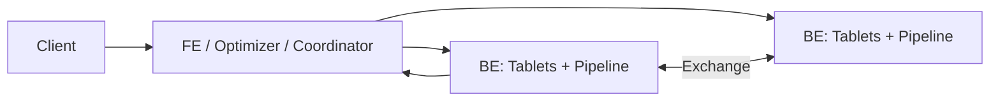

# Doris MPP、Tablet、物化视图与查询加速

Apache Doris 是面向分析的 MPP 数据库。FE 负责元数据、SQL 解析和规划，BE 保存 tablet 并执行 pipeline fragments。一个查询被切成 PlanFragments，在多个 BE 并行扫描、Shuffle、Join 和聚合。

## 1. MPP 路径

FE 是控制面并维护 Catalog/调度；BE 是存储和执行数据面。FE 高可用和 BE 副本是不同机制。

## 2. Partition、Bucket 与 Tablet

表先按 partition 管生命周期/裁剪，再按 bucket/distribution拆成 tablets。Tablet 是数据分片与副本/调度单位。Bucket 太少限制并行，太多增加 tablet 元数据、compaction 和小分片。

Hash distribution key 应分布均匀并匹配 Join/聚合；随机分布写入均衡但可能增加 Join Shuffle。通过 tablet 行数/大小和 BE 分布证明。

## 3. 数据模型

Duplicate、Aggregate、Unique 等模型决定相同 key 数据怎样保留/聚合/更新。选错模型会改变业务语义，不是性能参数。主键/部分更新、merge-on-write 等具体支持随版本验证。

## 4. 导入

Stream/Broker/Routine Load 等导入方式具有不同批量、事务和重试语义。Routine Load 对接 Kafka 时需要管理 partition/offset、并发、错误行和可见版本。Load job成功还需业务 count/主键/金额校验。

大量微小 transaction会产生版本/compaction压力；批量和时效需平衡。

## 5. 物化视图

- 同步物化视图随基表写入维护，适合单表聚合/排序等低延迟场景，增加写成本；
- 异步物化视图按策略/分区刷新，可支持更复杂 SQL和透明改写，但有新鲜度与刷新资源成本。

优化器是否命中视图需 `EXPLAIN`/profile证明；基表/schema变化、分区映射和过期 partition会影响改写。

## 6. Join 与执行

FE 将计划在 exchange边界切 fragments，选择 broadcast、shuffle、bucket shuffle、colocate 等策略。Colocate 依赖表分桶/副本布局一致，减少网络但增加布局约束。统计信息不准会导致错误 Join。

## 7. 运维指标

- FE leader、Catalog/plan latency、query/load queue；
- BE tablet/replica health、磁盘、compaction score；
- query profile：scan rows/bytes、exchange、operator CPU/memory；
- load rows/error/latency、Kafka lag；
- materialized view refresh/命中/新鲜度；
- tablet大小/行数/副本在 BE 间分布。

## 8. 实验

创建相同表分别使用均匀/倾斜 distribution，观察 tablet 与 query profile。建立聚合物化视图并验证 plan命中；暂停刷新观察新鲜度。注入 BE 故障，验证副本调度与查询/导入影响。

## 9. 掌握验收

- 画出 FE、BE、Fragment、Exchange；
- 区分 partition、bucket、tablet 和 replica；
- 根据业务选择 Duplicate/Aggregate/Unique 模型；
- 比较同步/异步物化视图；
- 从 profile 定位扫描、Shuffle、内存或 compaction。

上一篇：[ClickHouse MergeTree](./02-ClickHouse-MergeTree分区排序键与后台合并.md)　下一篇：[湖仓查询与 OLAP 选型、基准和故障排查](./04-湖仓查询与OLAP选型基准测试和故障排查.md)

## 参考资料

- [Apache Doris MPP Architecture](https://doris.apache.org/docs/dev/key-features/mpp/)
- [Apache Doris Materialized View](https://doris.apache.org/docs/dev/query-acceleration/materialized-view/overview/)
