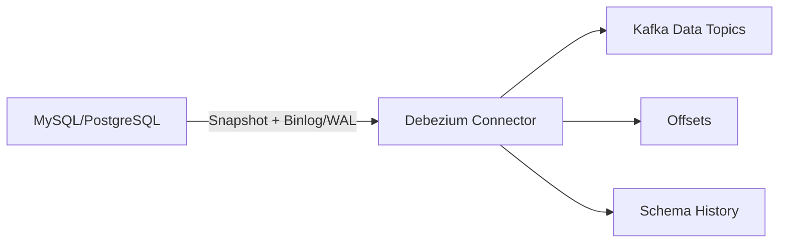

# Debezium CDC、Binlog、快照与 Schema Change

CDC 把数据库已提交变化转换为可重放事件。难点不是“读 binlog”，而是全量快照与增量日志无缺口衔接、source position持久化、DDL/schema history、事务顺序和下游幂等。

## 1. 数据路径

Connector 读取一致快照建立基线，同时确定日志位置，再持续读取 change log。不同数据库的锁、复制槽、权限和快照协议不同，以对应 connector 文档为准。

## 2. Event Envelope

常见事件包含 before、after、op、source metadata、transaction、事件/处理时间。Delete 可能产生删除事件和 tombstone（取决于配置），下游要明确是保留变更日志还是构建最新状态。

稳定事件 ID可由 source server/database/table + transaction/日志位置等确定生成，不能每次重试随机 UUID。

## 3. Snapshot 与增量

初始快照期间数据库仍有写入。Connector 协议保证快照对应某日志边界并在之后继续消费。大型表快照会占数据库 I/O、锁/版本空间和 Kafka 带宽，应限速、分批、监控，并确认 binlog/WAL 不在追赶前被清理。

增量 snapshot 可减少全表影响，但 chunk key、并发更新和信号机制需要按实现验证。

## 4. Offset 与恢复

Offset 保存已安全处理到的 source position。Offset 丢失/更换 connector identity 可能重做快照或重复事件；提交得过早可能漏。生产对 offset/status/config 做备份，变更 topic/name 前制定迁移。

CDC 通常至少一次，下游按 source position/event ID 幂等。Kafka offset 只是 CDC 输出位置，不能替代数据库 source position。

## 5. Schema History

Connector 需要历史 DDL 来正确解释不同日志时点的二进制行。History topic/存储丢失会导致恢复失败或误解字段。保护其副本、保留、权限和备份，不要按普通短保留 topic 管理。

DDL 上线前测试新增/删除/重命名、decimal/timestamp、默认值和 table rename。先升级下游兼容 reader，再发布 writer schema。

## 6. 事务与多表

单表 key 在 partition 内可有序，但数据库一个事务涉及多表时，事件可能分散 topic/partition。若下游需要事务一致视图，要利用 transaction metadata、缓冲或落入支持 snapshot 的表后再发布；不要假定 Kafka 多 topic天然原子。

## 7. 监控与故障

- source commit 到 CDC/Kafka 的 lag；
- snapshot table/rows/bytes和耗时；
- binlog/WAL/replication slot 保留空间；
- connector/task状态、restart、error/DLQ；
- schema history读写；
- records/bytes、超大记录和序列化；
- 重复、主键版本倒退和业务对账。

典型故障：权限/日志配置、复制槽膨胀、history缺失、DDL不兼容、源日志被清理、毒数据无限重试。

## 8. 实验

对测试表做初始快照，同时并发 insert/update/delete；记录 source position并与最终数据库状态对账。快照后重启 connector验证续传；执行兼容/不兼容 DDL，观察 history和下游。禁止在生产直接测试破坏性 DDL。

## 9. 掌握验收

- 画出 snapshot、source log、offset、history和 data topic；
- 解释快照与增量如何避免缺口；
- 区分 source position 与 Kafka offset；
- 为 schema change 建立兼容发布；
- 用主键最终状态和事件序列完成对账。

下一篇：[Airflow DAG、补数、重试与幂等调度](./02-Airflow-DAG依赖补数重试与幂等调度.md)

## 参考资料

- [Debezium Documentation](https://debezium.io/documentation/reference/stable/)
