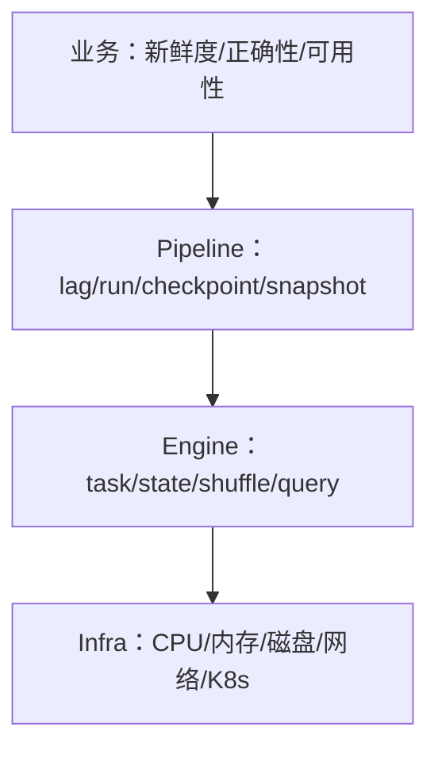

# 大数据可观测性、容量规划、成本与事故复盘

平台 SRE 的目标不是所有组件永远绿色，而是数据按时、正确、可用且成本可控。组件 CPU 是原因线索，业务真正关心新鲜度、正确性、查询延迟和训练数据 deadline。

## 1. 四层 SLI



告警从业务 SLO触发，Dashboard能下钻到具体 pipeline、operator/partition/file/node。只监控存活会漏掉“作业运行但 watermark不动”。

## 2. 关键 SLO

- 数据新鲜度：source commit到可查询 snapshot P99；
- 批作业：deadline success和重跑完成时间；
- 流作业：event-time lag、checkpoint age；
- 查询：成功率、P95/P99、排队；
- 正确性：契约/质量通过、重复/缺失率；
- 恢复：RPO/RTO、backlog catch-up；
- 训练数据：dataset发布和 samples/s。

## 3. 高基数控制

Metrics label 不放 event ID、完整 SQL、用户输入和文件路径。高基数用日志/trace/metadata system，指标保留聚合维度。日志关联 run/application/job/checkpoint/snapshot ID并脱敏。

## 4. 容量规划

按业务增长、季节峰值、失败恢复和维护放大分别规划 Kafka、计算 slot、checkpoint、对象/HDFS、Catalog和网络。使用预计耗尽时间：

```text
days_to_full = free_capacity / recent_daily_growth
```

季度模型必须用月度实际校正。过度依赖平均值会漏掉 P99 record、热 partition和 compaction峰值。

## 5. 成本归因

按 tenant/team/dataset/job分摊 compute time、memory、storage bytes、requests、network egress和许可/运维。单位成本可用：每 TB摄取、每百万事件、每查询、每训练数据版本。

成本优化顺序：删除无 owner/无消费数据 → 生命周期/压缩 → 减少重复计算/扫描 → 治理小文件和资源 request → 架构调整。不能通过缩短 checkpoint/副本到不满足 RPO 来“节省”。

## 6. 告警设计

症状告警（新鲜度/查询失败）分页；原因告警（磁盘增长/compaction backlog）工单或预警。设置持续窗口和 burn rate，避免瞬时抖动；告警带 owner、影响、runbook、Dashboard和最近变更。

## 7. 事故响应

1. 确认业务影响与数据正确性；
2. 冻结高风险变更，保存证据；
3. 可逆缓解：限流、切读旧 snapshot、暂停补数；
4. 逐层定位 source→queue→compute→table→query；
5. 恢复后补数据并质量校验；
6. 持续观察一个完整业务周期。

不要为恢复可用性隐瞒数据缺口；宁可标记结果 stale/incomplete。

## 8. 复盘

时间线、影响/SLO、检测、技术根因、促成条件、为何防线未阻止、有效/无效操作、数据修复、行动项 owner/deadline/验证。避免只写“加强监控”“提高意识”，行动项应可测试，例如“部署前自动验证 last successful checkpoint age”。

## 9. 综合演练

模拟 Iceberg sink变慢：Flink反压→Kafka lag→新鲜度违约。按层定位，限速补数/扩 sink，恢复后追平；校验 event ID与金额；计算事故增加的计算/网络成本并完成复盘。

## 10. 掌握验收

- 从业务 SLO 下钻到基础设施；
- 控制指标高基数并保留关联 ID；
- 将恢复/维护峰值纳入容量；
- 用单位成本而非总账优化；
- 写出有验证标准的复盘行动项。

上一篇：[数据安全与生命周期](./04-数据安全权限脱敏多租户与生命周期.md)　下一模块：[离线数仓综合项目](../projects/02-从业务库到分层数仓的离线项目.md)

## 参考资料

- [Google SRE Workbook: Monitoring](https://sre.google/workbook/monitoring/)
- [OpenTelemetry Documentation](https://opentelemetry.io/docs/)
