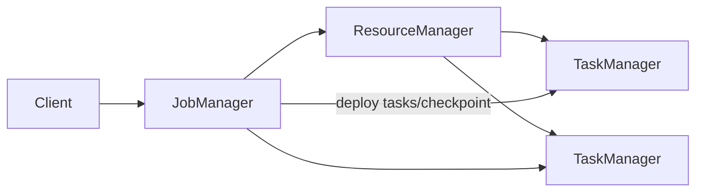

# Flink 架构、JobManager、TaskManager 与 Slot

Flink 面向有状态流处理，也支持批执行。JobManager 协调作业、调度和 checkpoint，TaskManager 在 slot 中运行并行 subtask。Slot 是资源共享/调度单位，不等于固定 CPU core。

## 1. 组件

JobManager 内部包含调度、作业协调、checkpoint coordinator 等职责；ResourceManager 管理 slot/worker；TaskManager 执行 task、网络交换与状态访问。生产需为 JM 配置 HA，并把 checkpoint/savepoint 放到持久存储。

## 2. 计划转换

DataStream/SQL 先生成逻辑拓扑，再经优化、operator chain 和并行度形成 JobGraph/ExecutionGraph，最终每个并行实例成为 subtask。一次代码里的多个算子可能 chain 在同一 task 线程，也可能因 repartition、并行度或显式禁用 chain 分开。

## 3. Slot 与 Slot Sharing

一个 TaskManager 有若干 slot，表示把受管理资源分成若干份。同一作业不同 operator 的 subtask 可通过 slot sharing 放进同一 slot，提高流水线资源利用。Slot 数过多会让每份内存变小，过少限制并行部署。

CPU request/limit、TaskManager 内存、slot 数和每算子并行度要一起规划。`parallelism=100` 不代表需要 100 台机器。

## 4. 部署模式

- Session cluster：多个作业共享长期集群，启动快但故障/资源隔离较弱；
- Application cluster：每个应用独立集群与 JM，隔离和生命周期清晰；
- Per-job 等术语/支持随资源平台与版本变化，应参考当前文档。

生产通常按故障域、团队与作业重要度决定，而不是统一一种。

## 5. 网络与反压

Chain 内记录通过函数调用传递；跨 task 通过网络 buffer/channel。下游处理不及，buffer 填满后反压向上游传播，最终 source 降速、Kafka lag 上升。反压是流量控制，不一定是故障，长期高反压才表示容量或逻辑瓶颈。

## 6. 故障恢复

Task 失败由 failover strategy 决定重启范围，从最近成功 checkpoint 恢复 state 和 source position。JM 失败需 HA 元数据选主并重新协调；TM 失败会丢在其内存/本地状态副本，但持久 checkpoint用于恢复。

Restart strategy 只控制重试节奏，无法修复确定性坏数据、schema 不兼容和永久权限错误。

## 7. 指标与实验

提交 source→map→keyBy→window→sink 作业，在 Web UI 对应 JobGraph、operators、subtasks 和 slots。改变并行度/slot，记录分配与吞吐。停止 TM，观察重启范围、checkpoint 恢复和业务校验。

观察 JM heap/GC、checkpoint、restart；TM CPU/memory/network buffer/GC；operator records in/out、busy/idle/backpressured；slot available/allocated。

## 8. 掌握验收

- 画出 Client、JM、RM、TM 和 slot；
- 从代码算子映射到 chained task/subtask；
- 解释 slot、parallelism 与机器数的区别；
- 比较 Session 与 Application 隔离；
- 注入 TM 故障并用 checkpoint 和结果证明恢复。

下一篇：[DataStream、Operator Chain、分区与并行度](./02-DataStream-Operator-Chain分区与并行度.md)

## 参考资料

- [Flink Concepts](https://nightlies.apache.org/flink/flink-docs-stable/docs/concepts/flink-architecture/)
