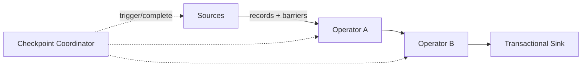

# Flink Checkpoint、Barrier、Savepoint 与 Exactly-Once

Checkpoint 是 Flink 的主要故障恢复机制：协调 source position、operator state 和参与协议的 sink。Savepoint 是用户主动管理、用于升级/迁移的快照。两者底层相关，但所有权、保留和操作目的不同。

## 1. Barrier 流程

Coordinator 触发 checkpoint，source 在流中插入 barrier并记录位置。多输入算子需形成一致切面：对齐式等待其他输入 barrier，并暂缓已到 barrier 的 channel；state 异步写到持久存储，完成后向 coordinator ACK。

## 2. 对齐与非对齐

反压下 barrier 传播和 alignment 可能很慢。Unaligned checkpoint把部分 in-flight buffer 一并快照，降低等待，但增加快照字节和恢复复杂度。它不是解决 sink 永久慢的办法；若 checkpoint I/O 本身已饱和，更多 channel state 可能更糟。

依据 alignment/start delay、checkpoint bytes、持久存储吞吐和恢复时间决定，不盲开。

## 3. Checkpoint 配置取舍

- Interval 太短：持续快照占 CPU/网络/存储和 sink commit；
- 太长：故障回退更多，恢复后追赶时间增加；
- Timeout/最小间隔/并发数：控制慢快照和资源重叠；
- Externalized retention：决定作业取消后是否保留；
- Incremental：减少变化状态上传，但依赖共享文件生命周期。

最终用实际状态、反压和恢复演练选择。

## 4. Exactly-Once 边界

Source 必须可回退到 checkpoint 位置；算子 state 回到同一快照；sink 需要事务、两阶段提交或幂等协议。若 process function 调用无幂等 HTTP，checkpoint 回滚会再次调用。

Iceberg/Kafka connector 的具体语义和配置随版本核对。业务用 event ID、金额守恒和 snapshot/transaction ID 做验证。

## 5. Savepoint 与升级

Savepoint 用于有计划停止、升级、迁移、rescale 和回滚。可靠流程：固定旧代码/配置 → 触发并记录路径 → 校验完成 → 部署新版本恢复 → 验证 state/offset/输出 → 保留回滚窗口 → 再清理。

稳定 operator UID、兼容 serializer 和合理 max parallelism 是恢复前提。Savepoint 也需纳入权限、备份和生命周期，不能让路径被对象存储规则提前删除。

## 6. 监控

- completed/failed checkpoint、end-to-end duration；
- start delay/alignment duration；
- sync/async duration；
- state/channel bytes、upload throughput；
- 各 subtask P95/max；
- last successful checkpoint age；
- sink transaction/commit latency；
- restore duration、replayed records/lag。

## 7. 故障实验

在正常处理、barrier 对齐、sink pre-commit 后分别杀 TM。恢复后验证 Kafka offset、状态聚合和 sink snapshot。制造下游限速，对比 aligned/unaligned 的 checkpoint 与恢复，不只比较创建时间。

## 8. 掌握验收

- 画出 barrier 与多输入对齐；
- 区分 checkpoint 与 savepoint 所有权；
- 说明非对齐快照包含什么和代价；
- 明确 source/state/sink 的 EOS 条件；
- 完成可回滚的有状态升级演练。

上一篇：[Flink State](./04-Keyed-State-Operator-State与State-Backend.md)　下一篇：[反压、倾斜、状态膨胀与性能调优](./06-反压数据倾斜状态膨胀与性能调优.md)

## 9. 参考资料 {/* #参考资料 */}

- [Flink Checkpointing](https://nightlies.apache.org/flink/flink-docs-stable/docs/ops/state/checkpointing/)
- [Checkpointing under Backpressure](https://nightlies.apache.org/flink/flink-docs-stable/docs/ops/state/checkpointing_under_backpressure/)
