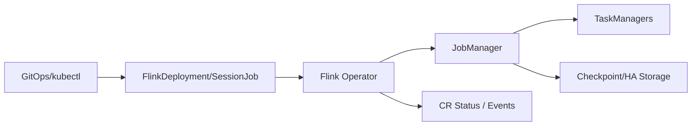

# Flink Kubernetes Operator、升级、恢复与生产运维

Flink Kubernetes Operator 通过 CR 描述期望状态并持续 reconcile Flink 集群/作业。Operator 管生命周期，Flink checkpoint/savepoint 管业务状态，Kubernetes API/CR status 管调谐状态；三者不能混为一个备份。

## 1. 控制路径

Operator Pod 可重启并从 Kubernetes API 中资源/status 重建调谐视图；但删除 CR 可能连同受管资源/status 生命周期变化。业务恢复仍需外部 checkpoint/savepoint、HA metadata 和明确路径。

## 2. 部署选择

Application mode 每应用独立 JM/资源，隔离和升级边界清楚；Session cluster 共享资源，适合大量小作业但影响域更大。选择要考虑团队边界、状态大小、升级频率和 SLO。

## 3. 生产 CR

版本化镜像、Flink 配置、资源、slot、service account、pod template、checkpoint/savepoint URI、HA、restart strategy 和 operator UID。Secret 不进 Git 明文；RBAC 最小化；Pod affinity/topology 和持久存储可用区一致。

## 4. 有状态升级模式

常见思路：

- Stateless：空状态重启，只适合可接受丢状态/重放的场景；
- Last-state：依赖最新 checkpoint/HA 状态，速度快但要确认健康和兼容；
- Savepoint：升级前主动快照，回滚点清晰，要求作业能成功生成。

具体字段和行为随 Operator/Flink 版本核对。任何模式都先在生产数据副本验证 serializer、UID、max parallelism、connector 与 state schema。

## 5. 安全发布

1. 检查 lag、checkpoint age、state、存储空间和当前 CR stable；
2. 生成/记录恢复点并验证可读；
3. 变更一项版本化 spec；
4. 观察 reconcile、JM/TM、作业 running 及 checkpoint继续推进；
5. 业务 count/金额/事件版本校验；
6. 失败则按旧 spec + 明确 snapshot 回滚；
7. 超过观察窗口再清理旧快照。

Pod Running 不是发布成功；没有新 checkpoint、watermark 不动或 sink 无输出都应判失败。

## 6. 删除与 GitOps 风险

GitOps prune、重命名 CR、修改 ownerReference 可能触发删除。上线前验证删除传播和 snapshot 保留策略。Checkpoint/savepoint 路径不可依赖临时 Pod 文件系统；对象存储生命周期不得早于回滚窗口。

## 7. 观测

- Operator reconcile error/duration、resource lifecycle/status/event；
- JM leader/HA、REST、restart；
- TM slot、CPU/memory/network；
- job checkpoint、watermark、lag、backpressure；
- K8s Pending/OOM/eviction/PVC/network；
- 业务新鲜度和重复/缺失校验。

## 8. 演练

依次删除 Operator Pod、TM Pod、JM Pod，确认各自恢复边界；执行兼容升级、故意不兼容状态升级和回滚；模拟 checkpoint storage 短时不可用。保留 CR status/events、Flink metrics、日志和数据校验时间线。

## 9. 掌握验收

- 区分 Operator 状态、Flink HA 和业务 checkpoint；
- 为 Application/Session 选择故障边界；
- 写出 savepoint/last-state 升级与回滚；
- 解释 GitOps 删除和临时存储风险；
- 用 checkpoint推进与业务校验定义发布成功。

上一篇：[反压与性能调优](./06-反压数据倾斜状态膨胀与性能调优.md)　下一模块：[数据湖、表格式与 Catalog](../lakehouse/01-数据湖表格式Catalog与存算分离.md)

## 10. 参考资料 {/* #参考资料 */}

- [Flink Kubernetes Operator](https://nightlies.apache.org/flink/flink-kubernetes-operator-docs-release-1.13/)
- [Flink Production Readiness](https://nightlies.apache.org/flink/flink-docs-stable/docs/ops/production_ready/)
