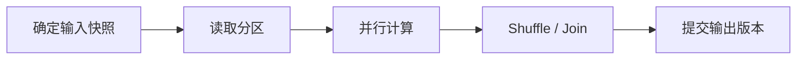
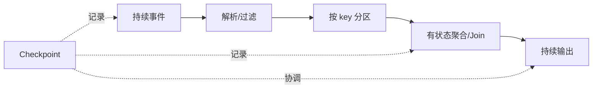
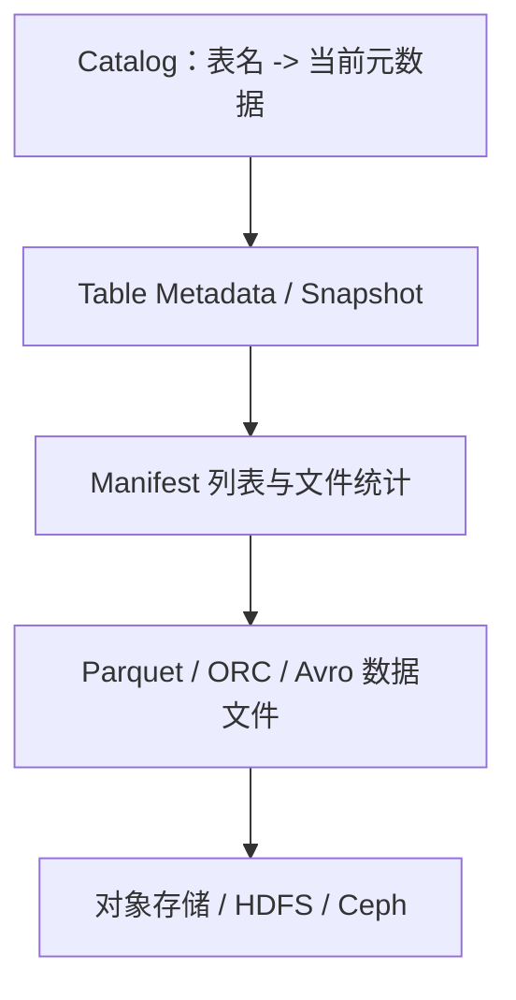

# 批处理、流处理、数据湖、数仓与湖仓：从需求选择数据架构

批处理、流处理、数据湖、数据仓库和湖仓不是同一维度的概念：批和流描述**数据及计算方式**，湖和仓描述**数据组织、治理和服务方式**。一个系统完全可以用 Flink 实时处理数据，同时把结果写入 Iceberg 湖仓，再由 Spark 批量修正历史数据。

如果只背产品归类，很容易得到“有 Flink 就不需要 Spark”“有数据湖就不需要数仓”之类的错误结论。这一篇从业务需求推导架构。

## 1. 先区分有界数据与无界数据

- **有界数据（bounded data）**有明确的开始和结束。例如 2026-08-09 全天的订单文件、一次历史全量快照。
- **无界数据（unbounded data）**持续产生，处理时看不到终点。例如订单变更流、传感器事件和服务日志。

批处理天然适合在一个有限集合上计算；流处理把无界数据视为持续到达的事件。无界数据也可以被人为切成 1 分钟、1 小时或一天的有限窗口，但切分并没有消除迟到、乱序和状态管理问题。

## 2. 批处理到底是什么

批处理通常在“输入集合已经确定”后启动作业，读取大量数据，经过多个 stage 计算，再一次或分区提交结果。



典型场景：

- 每日财务结算和 T+1 报表；
- 历史数据回填与重新计算；
- 大规模 Join、特征生成和模型训练数据构建；
- 数据湖小文件合并与快照维护。

批处理的优势是输入边界清楚、容易重跑、适合全局排序和大范围 Join，单位数据处理成本通常较低。代价是结果有分钟到小时级延迟，并且批次越大，失败后重算范围可能越大。

### 2.1 批处理的正确性边界

不要用“读取某目录下所有文件”来定义输入，因为作业运行过程中目录可能继续新增文件。更可靠的边界是：

- 数据库快照或 binlog position；
- Iceberg snapshot ID；
- Kafka 起止 offset；
- 明确关闭写入的分区版本。

输出也要先写临时位置，校验完成后再原子发布，避免消费者读到半成品。

## 3. 流处理到底是什么

流作业长时间运行，每条或每小批事件到达后更新结果。它通常包含 source 位置、算子状态、时间语义和 sink 提交四个核心部分。



典型场景：

- 秒级风控和异常检测；
- 实时指标、监控告警和推荐特征；
- CDC 同步与实时明细层；
- 设备遥测和网络事件处理。

流处理的难点不只是低延迟，而是如何在乱序、迟到、重复、故障恢复和状态不断增长的情况下保持结果正确。

### 3.1 Processing Time 与 Event Time

- **处理时间（Processing Time）**是事件到达计算节点的本地时间。延迟低，实现简单，但结果会受积压、重启和机器时钟影响。
- **事件时间（Event Time）**是业务事件发生的时间。它更接近业务语义，但必须处理乱序和迟到。

例如订单 10:00:05 产生，因为网络故障 10:03 才到达。按处理时间它属于 10:03 的窗口，按事件时间它属于 10:00 的窗口。

Watermark 是系统对“事件时间大致推进到哪里”的判断。它不是保证此后绝无更早事件，而是决定何时触发窗口计算、多久保留状态以及如何处理更晚的数据。

### 3.2 流不等于逐条同步调用

实际系统常用 batching 提高吞吐：Kafka producer 聚合记录，Flink 算子和网络 buffer 批量传输，sink 批量提交文件。流处理强调的是持续输入和增量计算，不意味着每条事件都单独做一次磁盘事务。

## 4. 微批处理处在什么位置

微批把连续事件按很短的时间或数量切成小批次。它可以复用批执行模型，吞吐高、实现相对简单，但延迟下限受批次间隔和调度开销影响。

不要用产品名字武断区分“真流”和“假流”。应比较：

- 数据在引擎内部是逐事件还是按 epoch 推进；
- 状态和时间语义如何表达；
- checkpoint/commit 如何对齐；
- 业务要求的 P99 延迟能否达到；
- 故障后的重算范围与恢复时间。

## 5. 数据仓库解决什么问题

数据仓库将多个业务系统的数据按统一口径组织成可分析的主题模型，并提供权限、质量和稳定查询性能。传统分层常见如下：

| 分层 | 作用 | 示例 |
|---|---|---|
| ODS | 尽量保留源数据结构和变化 | 订单 CDC 明细 |
| DWD | 清洗、去重、统一编码后的事实明细 | 一行一笔有效订单 |
| DWS | 按主题聚合和公共指标沉淀 | 用户日消费汇总 |
| ADS | 面向具体应用或报表 | 运营日报、风控特征 |

这些名称不是强制标准。重要的是每层有清晰契约，避免所有任务都直接读源表、重复实现口径和随意覆盖结果。

仓库的核心不是“把数据放进数据库”，而是：

- 定义事实、维度、粒度和业务口径；
- 保证 schema、权限和质量；
- 对常用查询提供可预测性能；
- 管理数据生命周期与审计。

## 6. 数据湖解决什么问题

数据湖通常在 HDFS 或对象存储上保存结构化、半结构化和非结构化数据，计算资源可按需接入。它适合保留原始数据、支持多种引擎和大规模低成本存储。

仅仅把 JSON、CSV、Parquet 文件堆进对象存储，不会自动得到“湖”。如果缺少 catalog、schema、权限、版本和质量，最终会变成难以发现、无法信任的“数据沼泽”。

一个可用的数据湖至少需要：

- 稳定的目录或表标识；
- schema 和格式约束；
- 数据所有者、权限和敏感级别；
- 分区、文件大小和生命周期策略；
- 可追踪的写入批次与质量结果。

## 7. 湖仓为什么出现

对象存储提供 PUT/GET/LIST/DELETE 等对象操作，却通常不直接提供数据仓库需要的表事务、schema 演进和一致快照。Iceberg、Delta Lake、Hudi 等表格式在数据文件之上增加元数据层：



因此多个引擎可以基于同一个一致快照读表，并获得：

- 原子提交和 snapshot；
- time travel 与回滚；
- schema evolution；
- partition evolution 和 hidden partitioning；
- 基于文件统计的裁剪；
- 并发写入冲突检测。

湖仓不是“把湖和仓的所有优点免费叠加”。元数据、compaction、catalog 高可用、小文件、权限和多引擎兼容仍需运维。

## 8. 存算一体与存算分离

### 8.1 存算一体

数据和执行节点紧密绑定，读取可利用本地性，延迟稳定。缺点是计算和容量必须一起扩展，节点维护和数据重分布更复杂。

### 8.2 存算分离

数据放在独立的 HDFS/对象存储/Ceph 中，Spark、Flink、Trino 等计算集群按需扩缩。优势是资源独立扩展、数据共享和计算弹性；代价是更依赖网络吞吐、对象请求性能、缓存和一致的 catalog。

存算分离不是“存储性能不重要”。它把本地磁盘瓶颈变成网络、对象存储、元数据和缓存共同决定的端到端瓶颈。

## 9. Lambda、Kappa 与现代批流一体

### 9.1 Lambda 架构 {/* #lambda-架构 */}

同一份数据走批处理和流处理两条链路：流层快速给出近似或增量结果，批层稍后计算权威结果。优点是历史重算清晰，缺点是两套逻辑容易口径漂移，开发和运维成本高。

### 9.2 Kappa 架构 {/* #kappa-架构 */}

将变化记录保存在可重放日志中，尽量由流处理完成实时与历史重放。它减少两套代码，但大规模历史重放可能影响在线作业，复杂全量计算也未必适合持续流模型。

### 9.3 批流一体 {/* #批流一体 */}

现代引擎和表格式让同一套 API 或表同时支持流式增量与批量修正。但底层执行、时间语义和成本仍不同，“统一 API”不等于所有 workload 使用同一个引擎最合适。

架构模式是分析工具，不是必须遵守的教条。

## 10. 用需求选择批、流和存储形态

| 需求 | 更合适的起点 | 主要理由 |
|---|---|---|
| 次日财务结算，可重跑 | 批处理 + 版本化表 | 边界清楚，便于审计和校正 |
| 2 秒内风控 | Kafka + 流处理 + 低延迟 sink | 必须持续增量处理 |
| PB 级原始日志长期保存 | 对象存储/HDFS 数据湖 | 容量成本和多引擎访问 |
| 高并发固定报表 | 数仓或 OLAP 服务 | 索引、预聚合和稳定延迟 |
| 批流共享明细，多引擎查询 | 湖仓表 | snapshot、演进和统一元数据 |
| GPU 训练数据生成 | 湖仓 + 批处理 + 专用数据集格式 | 版本可追踪并优化大规模顺序读取 |

选择时按顺序问：

1. 业务真正需要的 P99 延迟是多少？分钟级需求不必强行做毫秒系统。
2. 结果能否修正？需要增量更新还是定期重算？
3. 需要保存多少历史、以何种频率重放？
4. 查询模式是大扫描、点查、高并发聚合，还是训练顺序读取？
5. 数据是否跨多个引擎和团队共享？
6. 团队能否运维状态、checkpoint、compaction 和 catalog？

## 11. 一个订单指标的三种实现

需求：统计每个省份每 5 分钟支付成功金额。

### 11.1 纯批

每 5 分钟读取新增文件或 offset 区间，聚合后覆盖/追加结果。实现简单，但延迟至少为调度周期加执行时间；迟到订单需要重跑相关分区。

### 11.2 纯流

按省份 keyBy，使用事件时间窗口聚合，通过 watermark 决定首次输出，迟到数据执行更新或侧输出。延迟低，但要管理状态、checkpoint、重复事件和 sink 幂等。

### 11.3 流式明细 + 批量校正

Flink 实时写入明细和近实时聚合；每日 Spark 基于已封闭的 Iceberg snapshot 重算权威结果。它保留了实时性与审计性，但需要定义实时值何时被批结果替代，避免消费者同时看到两个口径。

## 12. 时间、版本和口径必须同时定义

一份“昨日订单”至少可能有四种含义：

- 事件发生时间在昨日；
- 数据库提交时间在昨日；
- CDC 到达平台时间在昨日；
- 计算作业处理时间在昨日。

此外还要定义取消、退款和迟到订单是否回写昨日结果。可靠数据产品应明确：

```text
事件时间字段 + 时区 + 窗口范围 + 允许迟到时间 + 更新策略 + 数据版本
```

不定义这些语义，即使 SQL 完全正确，不同团队也会算出不同答案。

## 13. 可观测性与 SLO

### 13.1 批作业 {/* #批作业 */}

- 调度等待时间、开始/结束时间和 deadline miss；
- 输入快照、读取字节、输出文件数；
- 各 stage/task 时长与失败重试；
- Shuffle、spill、GC 和最大分区；
- 数据质量校验和发布版本。

### 13.2 流作业 {/* #流作业 */}

- source lag、每秒输入/输出记录；
- event-time lag、watermark 推进；
- backpressure、busy/idle 时间；
- checkpoint 时长、对齐时间、失败次数和状态大小；
- sink commit 延迟、失败和重复校验。

### 13.3 湖仓 {/* #湖仓 */}

- snapshot 提交频率和冲突；
- data/delete file 数量与大小分布；
- manifest 数量、查询规划时间；
- compaction backlog；
- orphan file、快照保留和对象请求成本。

## 14. 最小设计实验

选择同一个“5 分钟订单金额”需求，分别写出批和流方案，不必立即安装所有组件。设计文档必须包含：

1. 输入边界：文件版本或 Kafka offset；
2. 时间语义：事件时间、时区、watermark 和允许迟到；
3. 状态：按什么 key 保存多久；
4. 输出：追加、更新还是覆盖，如何幂等；
5. 故障：source、计算、sink 任一失败后从哪里恢复；
6. 校验：总记录数、唯一订单数和支付金额如何核对；
7. SLO：P99 新鲜度和每日可用时间。

然后注入三个场景：同一订单重复两次、事件迟到 20 分钟、作业在输出中途失败。若方案无法明确给出结果，就说明数据语义还没有设计完整。

## 15. 常见误区

- **流处理一定比批处理先进。** 流系统在不需要低延迟时会增加状态和运维成本。
- **实时就是没有延迟。** 真实延迟包含采集、排队、计算、提交、查询缓存和展示。
- **对象存储目录就是数据湖。** 没有元数据、契约、质量和生命周期只是一堆文件。
- **用了 Iceberg 就不需要数仓建模。** 表格式提供表能力，不替代指标口径和主题建模。
- **批流一体意味着一套物理执行。** API 可以统一，运行方式、资源模型和故障边界仍可能不同。
- **分层越多越专业。** 每层都增加延迟、存储和依赖，只有明确复用和治理价值才应保留。

## 16. 掌握验收

- 区分有界/无界数据、批/流计算、湖/仓存储组织这三个维度；
- 解释事件时间、处理时间、watermark 和迟到数据的关系；
- 为一个需求选择批、流或混合方案，并说明延迟、成本与正确性取舍；
- 解释数据湖为何需要表格式和 catalog 才能稳定支持多引擎；
- 说明存算分离为什么提高弹性，同时加重网络、缓存和元数据压力；
- 为批任务定义输入 snapshot，为流任务定义 offset、state 和 checkpoint；
- 用数据版本、时间口径和质量规则描述一份可审计结果。

上一篇：[大数据系统到底解决什么问题](./01-大数据系统到底解决什么问题.md)

下一篇：[分区、并行度、Shuffle 与数据倾斜](./03-分区并行度Shuffle与数据倾斜.md)

## 17. 参考资料 {/* #参考资料 */}

- [Apache Spark 文档](https://spark.apache.org/docs/latest/)
- [Apache Flink：概念与架构](https://nightlies.apache.org/flink/flink-docs-stable/docs/concepts/overview/)
- [Apache Iceberg 文档](https://iceberg.apache.org/docs/latest/)
- [Apache Iceberg：Partitioning](https://iceberg.apache.org/docs/latest/partitioning/)
